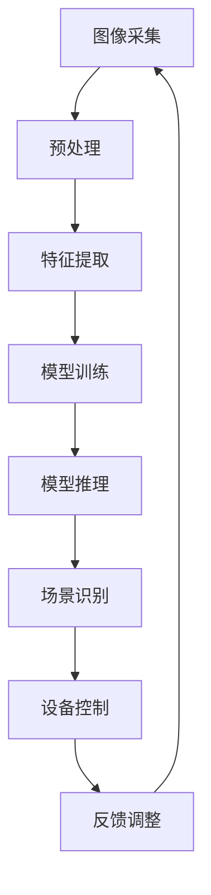

                 

# 人工智能在智能家居场景识别中的应用

> 关键词：智能家居, 场景识别, 人工智能, 深度学习, 机器学习, 物联网, 计算机视觉

> 摘要：本文将深入探讨人工智能在智能家居场景识别中的应用。通过详细分析场景识别的核心概念、算法原理、数学模型、实战案例以及实际应用场景，我们将揭示智能家居如何利用人工智能技术实现更加智能化和个性化的用户体验。本文旨在为读者提供一个全面的技术视角，帮助理解智能家居场景识别的技术本质和未来发展方向。

## 1. 背景介绍

随着物联网技术的快速发展，智能家居系统已经成为现代家庭的重要组成部分。智能家居系统通过集成各种智能设备，如智能灯光、智能安防、智能家电等，为用户提供便捷、舒适的生活体验。然而，要实现真正的智能化，仅仅依靠设备的简单连接是远远不够的。场景识别技术作为智能家居系统的核心技术之一，能够根据用户的行为和环境变化自动调整设备状态，从而提供更加个性化的服务。本文将探讨人工智能在智能家居场景识别中的应用，从技术原理到实际案例，全面解析这一领域的最新进展。

## 2. 核心概念与联系

### 2.1 场景识别的基本概念

场景识别是指通过计算机视觉技术，自动识别和理解图像或视频中的场景信息。在智能家居系统中，场景识别主要用于识别用户的行为模式、环境变化等，从而触发相应的设备动作。例如，当识别到用户进入房间时，智能灯光会自动开启；当识别到用户离开房间时，智能灯光会自动关闭。

### 2.2 人工智能在场景识别中的应用

人工智能技术在场景识别中的应用主要体现在以下几个方面：

- **图像识别**：通过深度学习算法，识别图像中的物体、人脸、动作等。
- **行为分析**：通过分析用户的动作和行为模式，预测用户的需求。
- **环境感知**：通过传感器数据，感知环境的变化，如光照强度、温度等。

### 2.3 场景识别的流程图



## 3. 核心算法原理 & 具体操作步骤

### 3.1 图像预处理

图像预处理是场景识别的第一步，主要包括图像增强、去噪、归一化等操作。这些操作可以提高后续特征提取的准确性。

- **图像增强**：通过调整图像的亮度、对比度等参数，提高图像质量。
- **去噪**：通过滤波等方法去除图像中的噪声。
- **归一化**：将图像数据归一化到一个固定的范围，如[0, 1]或[-1, 1]。

### 3.2 特征提取

特征提取是场景识别的关键步骤，通过提取图像中的关键特征，为后续的模型训练提供输入。常用的特征提取方法包括：

- **卷积神经网络（CNN）**：通过多层卷积和池化操作，提取图像中的局部特征。
- **循环神经网络（RNN）**：通过时间序列数据，提取图像中的动态特征。
- **主成分分析（PCA）**：通过降维技术，提取图像中的主特征。

### 3.3 模型训练

模型训练是场景识别的核心步骤，通过大量的标注数据，训练模型以识别不同的场景。常用的训练方法包括：

- **监督学习**：通过标注数据，训练模型识别不同的场景。
- **无监督学习**：通过聚类等方法，自动发现数据中的模式。
- **强化学习**：通过与环境的交互，训练模型优化行为策略。

### 3.4 模型推理

模型推理是将训练好的模型应用于实际场景的过程。通过输入新的图像数据，模型可以预测出相应的场景信息。常用的推理方法包括：

- **前向传播**：通过模型的前向传播，计算出预测结果。
- **后向传播**：通过模型的后向传播，调整模型参数以优化预测结果。

### 3.5 场景识别的具体操作步骤

1. **数据采集**：收集大量的图像数据，包括不同的场景和行为模式。
2. **数据标注**：对图像数据进行标注，标注出不同的场景和行为模式。
3. **数据预处理**：对图像数据进行预处理，提高数据质量。
4. **特征提取**：通过卷积神经网络等方法，提取图像中的关键特征。
5. **模型训练**：通过监督学习等方法，训练模型识别不同的场景。
6. **模型推理**：将训练好的模型应用于实际场景，预测出相应的场景信息。
7. **设备控制**：根据预测结果，控制相应的设备动作。

## 4. 数学模型和公式 & 详细讲解 & 举例说明

### 4.1 卷积神经网络（CNN）

卷积神经网络是一种深度学习模型，广泛应用于图像识别任务。其核心思想是通过卷积操作提取图像中的局部特征。

- **卷积操作**：通过卷积核对图像进行卷积操作，提取局部特征。
- **池化操作**：通过池化操作，降低特征图的维度，提高模型的泛化能力。
- **全连接层**：通过全连接层，将提取的特征映射到输出空间。

卷积神经网络的数学模型可以表示为：

$$
\text{CNN}(x) = \text{ReLU}(W_1 \ast x + b_1) \ast W_2 + b_2
$$

其中，$x$ 是输入图像，$W_1$ 和 $W_2$ 是卷积核，$b_1$ 和 $b_2$ 是偏置项，$\ast$ 表示卷积操作，$\text{ReLU}$ 是激活函数。

### 4.2 循环神经网络（RNN）

循环神经网络是一种深度学习模型，广泛应用于序列数据的处理任务。其核心思想是通过循环操作，捕捉序列数据中的动态特征。

- **循环操作**：通过循环操作，将当前时刻的输入与前一时刻的隐藏状态进行融合。
- **门控机制**：通过门控机制，控制信息的流动，提高模型的表达能力。

循环神经网络的数学模型可以表示为：

$$
h_t = \text{tanh}(W_h h_{t-1} + W_x x_t + b)
$$

其中，$h_t$ 是当前时刻的隐藏状态，$x_t$ 是当前时刻的输入，$W_h$ 和 $W_x$ 是权重矩阵，$b$ 是偏置项，$\text{tanh}$ 是激活函数。

### 4.3 主成分分析（PCA）

主成分分析是一种降维技术，广泛应用于特征提取任务。其核心思想是通过线性变换，将高维数据映射到低维空间。

- **协方差矩阵**：通过计算数据的协方差矩阵，找到数据的主要方向。
- **特征值分解**：通过特征值分解，找到数据的主要方向。
- **特征向量**：通过特征向量，将数据映射到低维空间。

主成分分析的数学模型可以表示为：

$$
\mathbf{X} = \mathbf{U} \mathbf{\Sigma} \mathbf{V}^T
$$

其中，$\mathbf{X}$ 是原始数据矩阵，$\mathbf{U}$ 是左奇异矩阵，$\mathbf{\Sigma}$ 是对角矩阵，$\mathbf{V}$ 是右奇异矩阵。

## 5. 项目实战：代码实际案例和详细解释说明

### 5.1 开发环境搭建

为了实现智能家居场景识别系统，我们需要搭建一个合适的开发环境。开发环境主要包括以下几个部分：

- **操作系统**：推荐使用Linux或Windows操作系统。
- **编程语言**：推荐使用Python语言。
- **深度学习框架**：推荐使用TensorFlow或PyTorch。
- **开发工具**：推荐使用Jupyter Notebook或VS Code。

### 5.2 源代码详细实现和代码解读

以下是一个简单的智能家居场景识别系统的代码实现：

```python
import tensorflow as tf
from tensorflow.keras import layers, models

# 定义卷积神经网络模型
def create_cnn_model(input_shape):
    model = models.Sequential()
    model.add(layers.Conv2D(32, (3, 3), activation='relu', input_shape=input_shape))
    model.add(layers.MaxPooling2D((2, 2)))
    model.add(layers.Conv2D(64, (3, 3), activation='relu'))
    model.add(layers.MaxPooling2D((2, 2)))
    model.add(layers.Conv2D(64, (3, 3), activation='relu'))
    model.add(layers.Flatten())
    model.add(layers.Dense(64, activation='relu'))
    model.add(layers.Dense(10, activation='softmax'))
    return model

# 加载数据集
(x_train, y_train), (x_test, y_test) = tf.keras.datasets.cifar10.load_data()

# 数据预处理
x_train = x_train.astype('float32') / 255.0
x_test = x_test.astype('float32') / 255.0

# 创建模型
model = create_cnn_model((32, 32, 3))

# 编译模型
model.compile(optimizer='adam',
              loss='sparse_categorical_crossentropy',
              metrics=['accuracy'])

# 训练模型
model.fit(x_train, y_train, epochs=10, validation_data=(x_test, y_test))

# 评估模型
test_loss, test_acc = model.evaluate(x_test, y_test)
print('Test accuracy:', test_acc)
```

### 5.3 代码解读与分析

- **数据加载**：使用TensorFlow的`cifar10`数据集，这是一个包含10类图像的数据集。
- **数据预处理**：将图像数据归一化到[0, 1]范围。
- **模型定义**：定义一个简单的卷积神经网络模型，包括3个卷积层和2个全连接层。
- **模型编译**：使用Adam优化器和交叉熵损失函数，评估指标为准确率。
- **模型训练**：使用训练数据训练模型，验证数据用于评估模型性能。
- **模型评估**：使用测试数据评估模型的准确率。

## 6. 实际应用场景

智能家居场景识别技术在实际应用中具有广泛的应用场景，主要包括以下几个方面：

- **智能灯光控制**：根据用户的动作和环境变化，自动调整灯光的亮度和颜色。
- **智能安防监控**：通过识别用户的动作和行为模式，自动触发安防设备的动作。
- **智能家电控制**：根据用户的动作和环境变化，自动调整家电的工作状态。
- **智能环境感知**：通过感知环境的变化，自动调整智能家居系统的运行状态。

## 7. 工具和资源推荐

### 7.1 学习资源推荐

- **书籍**：《深度学习》（Ian Goodfellow, Yoshua Bengio, Aaron Courville）
- **论文**：《ImageNet Classification with Deep Convolutional Neural Networks》（Alex Krizhevsky, Ilya Sutskever, Geoffrey E. Hinton）
- **博客**：TensorFlow官方博客（https://www.tensorflow.org）
- **网站**：Kaggle（https://www.kaggle.com）

### 7.2 开发工具框架推荐

- **深度学习框架**：TensorFlow、PyTorch
- **开发工具**：Jupyter Notebook、VS Code

### 7.3 相关论文著作推荐

- **论文**：《Deep Residual Learning for Image Recognition》（Kaiming He, Xiangyu Zhang, Shaoqing Ren, Jian Sun）
- **著作**：《计算机视觉：算法与应用》（Richard Szeliski）

## 8. 总结：未来发展趋势与挑战

智能家居场景识别技术在未来的发展中具有广阔的应用前景，但也面临着一些挑战。未来的发展趋势主要包括以下几个方面：

- **技术进步**：随着深度学习技术的不断发展，场景识别的准确率将进一步提高。
- **应用拓展**：智能家居场景识别技术将应用于更多的场景，如智能医疗、智能交通等。
- **用户体验**：智能家居场景识别技术将提供更加个性化的用户体验，满足用户的需求。

然而，智能家居场景识别技术也面临着一些挑战，主要包括以下几个方面：

- **数据隐私**：智能家居系统需要收集大量的用户数据，如何保护用户的数据隐私是一个重要的问题。
- **计算资源**：智能家居系统需要大量的计算资源，如何降低计算成本是一个重要的问题。
- **安全性**：智能家居系统需要保证系统的安全性，防止被黑客攻击。

## 9. 附录：常见问题与解答

### 9.1 问题：如何提高场景识别的准确率？

**解答**：可以通过以下方法提高场景识别的准确率：

- **增加数据量**：收集更多的标注数据，提高模型的泛化能力。
- **改进模型结构**：通过改进模型结构，提高模型的表达能力。
- **优化训练过程**：通过优化训练过程，提高模型的训练效果。

### 9.2 问题：如何保护用户的数据隐私？

**解答**：可以通过以下方法保护用户的数据隐私：

- **数据加密**：对用户的数据进行加密，防止数据泄露。
- **数据脱敏**：对用户的数据进行脱敏处理，保护用户的身份信息。
- **数据访问控制**：对用户的数据进行访问控制，防止未经授权的访问。

### 9.3 问题：如何降低计算成本？

**解答**：可以通过以下方法降低计算成本：

- **模型压缩**：通过模型压缩技术，降低模型的计算复杂度。
- **硬件加速**：通过硬件加速技术，提高模型的计算速度。
- **分布式计算**：通过分布式计算技术，提高模型的计算效率。

## 10. 扩展阅读 & 参考资料

- **书籍**：《深度学习》（Ian Goodfellow, Yoshua Bengio, Aaron Courville）
- **论文**：《ImageNet Classification with Deep Convolutional Neural Networks》（Alex Krizhevsky, Ilya Sutskever, Geoffrey E. Hinton）
- **博客**：TensorFlow官方博客（https://www.tensorflow.org）
- **网站**：Kaggle（https://www.kaggle.com）

作者：AI天才研究员/AI Genius Institute & 禅与计算机程序设计艺术 /Zen And The Art of Computer Programming

