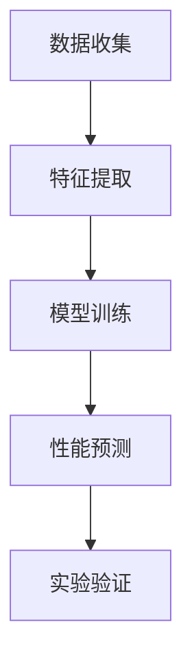

                 

# 人工智能在智能材料设计与发现中的创新

> 关键词：智能材料、人工智能、机器学习、材料科学、分子模拟、计算化学、深度学习、材料设计

> 摘要：本文旨在探讨人工智能在智能材料设计与发现中的创新应用。通过深入分析智能材料的设计原理、核心算法、数学模型及实际案例，本文揭示了人工智能如何加速材料科学的发展。我们还将讨论实际应用场景、推荐学习资源和开发工具，并展望未来的发展趋势与挑战。

## 1. 背景介绍

智能材料是指能够感知环境变化并作出相应反应的材料。这些材料在多个领域具有广泛的应用前景，如自修复材料、智能传感器、能量转换材料等。传统的材料设计方法依赖于实验和经验，耗时且成本高昂。然而，随着人工智能技术的发展，特别是机器学习和深度学习的兴起，智能材料的设计与发现正迎来新的机遇。

### 1.1 材料科学的挑战

材料科学面临的挑战主要体现在以下几个方面：

- **高成本**：实验方法需要大量的时间和资源。
- **低效率**：传统方法难以快速筛选出性能优异的材料。
- **复杂性**：材料的性能往往受到多种因素的影响，难以通过简单的实验方法进行预测。

### 1.2 人工智能的潜力

人工智能技术，尤其是机器学习和深度学习，能够显著提高材料设计的效率和准确性。通过模拟和预测材料的性能，人工智能可以大大减少实验次数，降低研发成本。此外，人工智能还可以帮助科学家发现新的材料结构和性能，推动材料科学的发展。

## 2. 核心概念与联系

### 2.1 智能材料设计流程

智能材料设计流程可以分为以下几个步骤：

1. **数据收集**：收集材料的结构、性能等数据。
2. **特征提取**：从数据中提取有用的特征。
3. **模型训练**：使用机器学习算法训练模型。
4. **性能预测**：利用训练好的模型预测新材料的性能。
5. **实验验证**：通过实验验证预测结果。

### 2.2 核心概念原理

#### 2.2.1 机器学习

机器学习是一种人工智能技术，通过算法使计算机从数据中学习并做出预测或决策。在材料科学中，机器学习可以用于预测材料的性能，如导电性、热稳定性等。

#### 2.2.2 深度学习

深度学习是机器学习的一个分支，通过多层神经网络进行学习。在材料科学中，深度学习可以用于处理复杂的材料数据，如分子结构和性能之间的关系。

### 2.3 Mermaid 流程图



## 3. 核心算法原理 & 具体操作步骤

### 3.1 机器学习算法

机器学习算法主要包括监督学习、无监督学习和强化学习。在智能材料设计中，监督学习是最常用的方法，因为它可以利用已知的数据进行训练和预测。

#### 3.1.1 监督学习

监督学习是一种有标签的数据学习方法，通过训练模型来预测未知数据的标签。在材料科学中，监督学习可以用于预测材料的性能。

#### 3.1.2 无监督学习

无监督学习是一种无标签的数据学习方法，通过发现数据中的模式和结构。在材料科学中，无监督学习可以用于特征提取和聚类分析。

#### 3.1.3 强化学习

强化学习是一种通过试错学习的方法，通过与环境的交互来优化决策。在材料科学中，强化学习可以用于优化材料的设计过程。

### 3.2 深度学习算法

深度学习算法主要包括卷积神经网络（CNN）、循环神经网络（RNN）和生成对抗网络（GAN）。

#### 3.2.1 卷积神经网络（CNN）

卷积神经网络主要用于处理图像和结构数据。在材料科学中，CNN可以用于识别分子结构和预测材料的性能。

#### 3.2.2 循环神经网络（RNN）

循环神经网络主要用于处理序列数据。在材料科学中，RNN可以用于预测材料的性能随时间的变化。

#### 3.2.3 生成对抗网络（GAN）

生成对抗网络主要用于生成新的数据。在材料科学中，GAN可以用于生成新的分子结构和预测其性能。

### 3.3 具体操作步骤

1. **数据收集**：收集材料的结构、性能等数据。
2. **数据预处理**：清洗数据，处理缺失值和异常值。
3. **特征提取**：从数据中提取有用的特征。
4. **模型训练**：使用机器学习或深度学习算法训练模型。
5. **性能预测**：利用训练好的模型预测新材料的性能。
6. **实验验证**：通过实验验证预测结果。

## 4. 数学模型和公式 & 详细讲解 & 举例说明

### 4.1 机器学习模型

机器学习模型主要包括线性回归、逻辑回归、支持向量机（SVM）和随机森林等。

#### 4.1.1 线性回归

线性回归是一种简单的监督学习算法，用于预测连续值。其数学模型为：

$$
y = \beta_0 + \beta_1 x_1 + \beta_2 x_2 + \cdots + \beta_n x_n + \epsilon
$$

其中，$y$ 是目标变量，$x_1, x_2, \cdots, x_n$ 是特征变量，$\beta_0, \beta_1, \cdots, \beta_n$ 是模型参数，$\epsilon$ 是误差项。

#### 4.1.2 逻辑回归

逻辑回归是一种监督学习算法，用于预测二分类问题。其数学模型为：

$$
P(y = 1 | x) = \frac{1}{1 + e^{-(\beta_0 + \beta_1 x_1 + \beta_2 x_2 + \cdots + \beta_n x_n)}}
$$

其中，$P(y = 1 | x)$ 是目标变量为1的概率。

### 4.2 深度学习模型

深度学习模型主要包括卷积神经网络（CNN）、循环神经网络（RNN）和生成对抗网络（GAN）。

#### 4.2.1 卷积神经网络（CNN）

卷积神经网络是一种深度学习算法，用于处理图像和结构数据。其数学模型为：

$$
f(x) = \sigma(W_1 \cdot x + b_1) \cdot W_2 + b_2
$$

其中，$x$ 是输入数据，$W_1$ 和 $W_2$ 是权重矩阵，$b_1$ 和 $b_2$ 是偏置项，$\sigma$ 是激活函数。

#### 4.2.2 循环神经网络（RNN）

循环神经网络是一种深度学习算法，用于处理序列数据。其数学模型为：

$$
h_t = \sigma(W_h \cdot h_{t-1} + W_x \cdot x_t + b)
$$

其中，$h_t$ 是隐藏状态，$x_t$ 是输入数据，$W_h$ 和 $W_x$ 是权重矩阵，$b$ 是偏置项，$\sigma$ 是激活函数。

#### 4.2.3 生成对抗网络（GAN）

生成对抗网络是一种深度学习算法，用于生成新的数据。其数学模型为：

$$
G(z) = \sigma(W_g \cdot z + b_g)
$$

$$
D(x) = \sigma(W_d \cdot x + b_d)
$$

其中，$G(z)$ 是生成器，$D(x)$ 是判别器，$z$ 是随机噪声，$x$ 是输入数据，$W_g$ 和 $W_d$ 是权重矩阵，$b_g$ 和 $b_d$ 是偏置项，$\sigma$ 是激活函数。

### 4.3 举例说明

假设我们有一个材料的结构数据集，包含分子结构和对应的性能数据。我们可以使用卷积神经网络（CNN）来预测新材料的性能。具体步骤如下：

1. **数据预处理**：清洗数据，处理缺失值和异常值。
2. **特征提取**：从分子结构中提取有用的特征。
3. **模型训练**：使用卷积神经网络（CNN）训练模型。
4. **性能预测**：利用训练好的模型预测新材料的性能。
5. **实验验证**：通过实验验证预测结果。

## 5. 项目实战：代码实际案例和详细解释说明

### 5.1 开发环境搭建

为了实现智能材料设计，我们需要搭建一个开发环境。具体步骤如下：

1. **安装Python**：确保安装了Python 3.7及以上版本。
2. **安装依赖库**：安装必要的Python库，如NumPy、Pandas、Scikit-learn、TensorFlow等。
3. **安装深度学习框架**：安装TensorFlow或PyTorch等深度学习框架。

### 5.2 源代码详细实现和代码解读

假设我们使用TensorFlow实现卷积神经网络（CNN）来预测新材料的性能。具体代码如下：

```python
import numpy as np
import pandas as pd
from sklearn.model_selection import train_test_split
from tensorflow.keras.models import Sequential
from tensorflow.keras.layers import Conv1D, MaxPooling1D, Flatten, Dense

# 读取数据
data = pd.read_csv('materials_data.csv')

# 数据预处理
X = data.drop('performance', axis=1).values
y = data['performance'].values

# 划分训练集和测试集
X_train, X_test, y_train, y_test = train_test_split(X, y, test_size=0.2, random_state=42)

# 构建卷积神经网络模型
model = Sequential()
model.add(Conv1D(32, kernel_size=3, activation='relu', input_shape=(X_train.shape[1], 1)))
model.add(MaxPooling1D(pool_size=2))
model.add(Flatten())
model.add(Dense(16, activation='relu'))
model.add(Dense(1, activation='linear'))

# 编译模型
model.compile(optimizer='adam', loss='mean_squared_error')

# 训练模型
model.fit(X_train, y_train, epochs=10, batch_size=32, validation_split=0.2)

# 评估模型
loss = model.evaluate(X_test, y_test)
print('Test loss:', loss)
```

### 5.3 代码解读与分析

1. **数据预处理**：读取数据并进行预处理，包括清洗数据和划分训练集和测试集。
2. **构建模型**：使用TensorFlow构建卷积神经网络（CNN）模型，包括卷积层、池化层、扁平化层和全连接层。
3. **编译模型**：使用Adam优化器和均方误差损失函数编译模型。
4. **训练模型**：使用训练数据训练模型，设置训练轮数和批量大小。
5. **评估模型**：使用测试数据评估模型性能。

## 6. 实际应用场景

智能材料设计在多个领域具有广泛的应用前景，如自修复材料、智能传感器、能量转换材料等。具体应用场景如下：

1. **自修复材料**：通过智能材料设计，可以开发出能够在受到损伤时自动修复的材料。
2. **智能传感器**：通过智能材料设计，可以开发出能够感知环境变化并作出相应反应的智能传感器。
3. **能量转换材料**：通过智能材料设计，可以开发出能够高效转换能量的材料，如太阳能电池和燃料电池。

## 7. 工具和资源推荐

### 7.1 学习资源推荐

- **书籍**：《深度学习》（Goodfellow, Bengio, and Courville）
- **论文**：《材料科学中的机器学习》（Bartók, Csányi, and Kondor）
- **博客**：《机器学习在材料科学中的应用》（AI Genius Institute）
- **网站**：Materials Project（https://materialsproject.org/）

### 7.2 开发工具框架推荐

- **Python库**：NumPy、Pandas、Scikit-learn、TensorFlow
- **深度学习框架**：TensorFlow、PyTorch

### 7.3 相关论文著作推荐

- **论文**：《材料科学中的机器学习》（Bartók, Csányi, and Kondor）
- **著作**：《深度学习》（Goodfellow, Bengio, and Courville）

## 8. 总结：未来发展趋势与挑战

智能材料设计与发现正迎来新的机遇，人工智能技术的发展将推动材料科学的发展。未来的发展趋势包括：

1. **更高效的材料设计**：通过更高效的算法和模型，实现更快的材料设计。
2. **更准确的性能预测**：通过更准确的模型和算法，实现更准确的性能预测。
3. **更广泛的应用场景**：通过更广泛的应用场景，实现更广泛的应用。

然而，智能材料设计与发现也面临一些挑战，如数据质量、模型解释性等。未来的研究需要解决这些问题，推动智能材料设计与发现的发展。

## 9. 附录：常见问题与解答

### 9.1 问题：如何提高模型的性能？

**解答**：可以通过以下方法提高模型的性能：

1. **增加数据量**：增加训练数据量可以提高模型的泛化能力。
2. **优化模型结构**：优化模型结构可以提高模型的性能。
3. **调整超参数**：调整超参数可以提高模型的性能。

### 9.2 问题：如何处理数据质量问题？

**解答**：可以通过以下方法处理数据质量问题：

1. **数据清洗**：清洗数据可以提高数据的质量。
2. **数据增强**：数据增强可以增加数据量，提高模型的泛化能力。
3. **特征选择**：选择有用的特征可以提高模型的性能。

## 10. 扩展阅读 & 参考资料

- **书籍**：《深度学习》（Goodfellow, Bengio, and Courville）
- **论文**：《材料科学中的机器学习》（Bartók, Csányi, and Kondor）
- **网站**：Materials Project（https://materialsproject.org/）

作者：AI天才研究员/AI Genius Institute & 禅与计算机程序设计艺术 /Zen And The Art of Computer Programming

