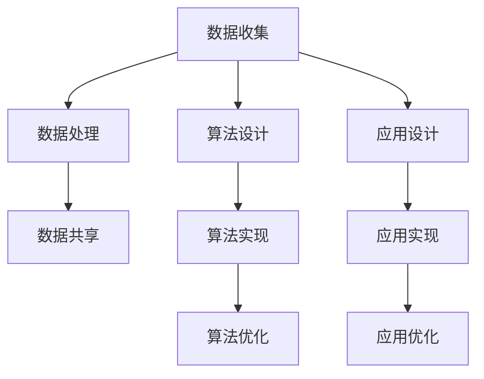

                 

# 人类-AI协作：增强人类智慧和创造力

> 关键词：人类-AI协作、增强智慧、创造力、机器学习、深度学习、自然语言处理、计算机视觉、数据科学

> 摘要：本文探讨了人类与人工智能（AI）之间的协作如何增强人类的智慧和创造力。通过分析AI技术的核心概念、算法原理、数学模型、实际应用场景以及开发工具和资源，本文旨在为读者提供一个全面的理解框架，以促进人类与AI之间的有效合作。文章还讨论了未来的发展趋势和挑战，并提供了相关的学习资源和工具推荐。

## 1. 背景介绍

随着人工智能技术的快速发展，人类与AI之间的协作变得越来越重要。AI技术，尤其是机器学习和深度学习，已经在多个领域展示了其强大的能力，包括但不限于自然语言处理、计算机视觉、数据科学等。这些技术不仅能够处理和分析大量数据，还能够通过学习和适应来改进其性能。然而，AI技术的发展也带来了新的挑战，包括如何有效地与人类协作，以最大化其潜力。

人类与AI之间的协作可以分为几个层次，包括数据协作、算法协作和应用协作。数据协作涉及如何有效地收集、处理和共享数据，以支持AI系统的训练和优化。算法协作则关注于如何设计和实现能够与人类协作的算法，以提高决策的质量和效率。应用协作则涉及到如何将AI技术应用于实际场景，以解决实际问题。

本文将从这些方面出发，探讨人类与AI之间的协作如何增强人类的智慧和创造力。

## 2. 核心概念与联系

### 2.1 数据协作

数据协作是人类与AI之间协作的基础。数据是AI系统学习和决策的基础，因此有效地收集、处理和共享数据对于AI系统的性能至关重要。数据协作涉及以下几个方面：

- 数据收集：如何有效地收集数据，包括从各种来源获取数据，以及如何处理数据以确保其质量。
- 数据处理：如何处理数据以支持AI系统的训练和优化，包括数据清洗、特征工程等。
- 数据共享：如何有效地共享数据，以支持AI系统的训练和优化，包括数据标准化、数据共享协议等。

### 2.2 算法协作

算法协作涉及如何设计和实现能够与人类协作的算法。算法协作的关键在于如何设计算法，使其能够有效地与人类协作，以提高决策的质量和效率。算法协作涉及以下几个方面：

- 算法设计：如何设计算法，使其能够有效地与人类协作，包括如何设计算法以支持人类决策，以及如何设计算法以支持人类学习。
- 算法实现：如何实现算法，使其能够有效地与人类协作，包括如何实现算法以支持人类决策，以及如何实现算法以支持人类学习。
- 算法优化：如何优化算法，使其能够有效地与人类协作，包括如何优化算法以支持人类决策，以及如何优化算法以支持人类学习。

### 2.3 应用协作

应用协作涉及如何将AI技术应用于实际场景，以解决实际问题。应用协作的关键在于如何将AI技术应用于实际场景，以解决实际问题，包括如何将AI技术应用于实际场景，以支持人类决策，以及如何将AI技术应用于实际场景，以支持人类学习。应用协作涉及以下几个方面：

- 应用设计：如何设计应用，使其能够有效地支持人类决策，包括如何设计应用以支持人类决策，以及如何设计应用以支持人类学习。
- 应用实现：如何实现应用，使其能够有效地支持人类决策，包括如何实现应用以支持人类决策，以及如何实现应用以支持人类学习。
- 应用优化：如何优化应用，使其能够有效地支持人类决策，包括如何优化应用以支持人类决策，以及如何优化应用以支持人类学习。

### 2.4 核心概念原理和架构的 Mermaid 流程图



## 3. 核心算法原理 & 具体操作步骤

### 3.1 机器学习算法

机器学习算法是AI技术的核心。机器学习算法通过学习数据来改进其性能，从而能够处理和分析大量数据。机器学习算法可以分为监督学习、无监督学习和强化学习。

- 监督学习：监督学习算法通过学习标记数据来改进其性能。监督学习算法可以分为分类和回归。
- 无监督学习：无监督学习算法通过学习未标记数据来改进其性能。无监督学习算法可以分为聚类和降维。
- 强化学习：强化学习算法通过学习与环境的交互来改进其性能。强化学习算法可以分为价值函数方法和策略梯度方法。

### 3.2 深度学习算法

深度学习算法是机器学习算法的一种特殊形式。深度学习算法通过学习数据来改进其性能，从而能够处理和分析大量数据。深度学习算法可以分为卷积神经网络、循环神经网络和生成对抗网络。

- 卷积神经网络：卷积神经网络通过学习图像数据来改进其性能。卷积神经网络可以用于图像分类、图像分割和图像生成。
- 循环神经网络：循环神经网络通过学习序列数据来改进其性能。循环神经网络可以用于语音识别、自然语言处理和时间序列预测。
- 生成对抗网络：生成对抗网络通过学习生成数据来改进其性能。生成对抗网络可以用于图像生成、文本生成和语音生成。

### 3.3 具体操作步骤

#### 3.3.1 数据预处理

数据预处理是机器学习和深度学习算法的关键步骤。数据预处理涉及以下几个方面：

- 数据清洗：数据清洗涉及如何处理数据，以确保其质量。数据清洗包括去除噪声、填充缺失值和处理异常值。
- 特征工程：特征工程涉及如何处理数据，以支持AI系统的训练和优化。特征工程包括特征选择、特征提取和特征转换。

#### 3.3.2 模型训练

模型训练是机器学习和深度学习算法的关键步骤。模型训练涉及以下几个方面：

- 模型选择：模型选择涉及如何选择模型，以支持AI系统的训练和优化。模型选择包括选择模型类型、选择模型参数和选择模型评估指标。
- 模型训练：模型训练涉及如何训练模型，以支持AI系统的训练和优化。模型训练包括选择训练算法、选择训练数据和选择训练参数。
- 模型评估：模型评估涉及如何评估模型，以支持AI系统的训练和优化。模型评估包括选择评估指标、选择评估数据和选择评估参数。

#### 3.3.3 模型优化

模型优化是机器学习和深度学习算法的关键步骤。模型优化涉及以下几个方面：

- 模型选择：模型选择涉及如何选择模型，以支持AI系统的训练和优化。模型选择包括选择模型类型、选择模型参数和选择模型评估指标。
- 模型训练：模型训练涉及如何训练模型，以支持AI系统的训练和优化。模型训练包括选择训练算法、选择训练数据和选择训练参数。
- 模型评估：模型评估涉及如何评估模型，以支持AI系统的训练和优化。模型评估包括选择评估指标、选择评估数据和选择评估参数。

## 4. 数学模型和公式 & 详细讲解 & 举例说明

### 4.1 机器学习数学模型

机器学习数学模型是机器学习算法的基础。机器学习数学模型可以分为监督学习数学模型、无监督学习数学模型和强化学习数学模型。

#### 4.1.1 监督学习数学模型

监督学习数学模型是监督学习算法的基础。监督学习数学模型可以分为分类数学模型和回归数学模型。

- 分类数学模型：分类数学模型是监督学习数学模型的一种形式。分类数学模型可以用于分类问题，包括逻辑回归、支持向量机和决策树。
- 回归数学模型：回归数学模型是监督学习数学模型的一种形式。回归数学模型可以用于回归问题，包括线性回归、岭回归和Lasso回归。

#### 4.1.2 无监督学习数学模型

无监督学习数学模型是无监督学习算法的基础。无监督学习数学模型可以分为聚类数学模型和降维数学模型。

- 聚类数学模型：聚类数学模型是无监督学习数学模型的一种形式。聚类数学模型可以用于聚类问题，包括K均值聚类和层次聚类。
- 降维数学模型：降维数学模型是无监督学习数学模型的一种形式。降维数学模型可以用于降维问题，包括主成分分析和独立成分分析。

#### 4.1.3 强化学习数学模型

强化学习数学模型是强化学习算法的基础。强化学习数学模型可以分为价值函数数学模型和策略梯度数学模型。

- 价值函数数学模型：价值函数数学模型是强化学习数学模型的一种形式。价值函数数学模型可以用于价值函数方法，包括Q学习和SARSA。
- 策略梯度数学模型：策略梯度数学模型是强化学习数学模型的一种形式。策略梯度数学模型可以用于策略梯度方法，包括策略梯度和信赖域策略优化。

### 4.2 深度学习数学模型

深度学习数学模型是深度学习算法的基础。深度学习数学模型可以分为卷积神经网络数学模型、循环神经网络数学模型和生成对抗网络数学模型。

#### 4.2.1 卷积神经网络数学模型

卷积神经网络数学模型是卷积神经网络算法的基础。卷积神经网络数学模型可以用于图像分类、图像分割和图像生成。

- 图像分类数学模型：图像分类数学模型是卷积神经网络数学模型的一种形式。图像分类数学模型可以用于图像分类问题，包括AlexNet、VGG和ResNet。
- 图像分割数学模型：图像分割数学模型是卷积神经网络数学模型的一种形式。图像分割数学模型可以用于图像分割问题，包括U-Net和FCN。
- 图像生成数学模型：图像生成数学模型是卷积神经网络数学模型的一种形式。图像生成数学模型可以用于图像生成问题，包括GAN和DCGAN。

#### 4.2.2 循环神经网络数学模型

循环神经网络数学模型是循环神经网络算法的基础。循环神经网络数学模型可以用于语音识别、自然语言处理和时间序列预测。

- 语音识别数学模型：语音识别数学模型是循环神经网络数学模型的一种形式。语音识别数学模型可以用于语音识别问题，包括RNN、LSTM和GRU。
- 自然语言处理数学模型：自然语言处理数学模型是循环神经网络数学模型的一种形式。自然语言处理数学模型可以用于自然语言处理问题，包括RNN、LSTM和GRU。
- 时间序列预测数学模型：时间序列预测数学模型是循环神经网络数学模型的一种形式。时间序列预测数学模型可以用于时间序列预测问题，包括RNN、LSTM和GRU。

#### 4.2.3 生成对抗网络数学模型

生成对抗网络数学模型是生成对抗网络算法的基础。生成对抗网络数学模型可以用于图像生成、文本生成和语音生成。

- 图像生成数学模型：图像生成数学模型是生成对抗网络数学模型的一种形式。图像生成数学模型可以用于图像生成问题，包括GAN和DCGAN。
- 文本生成数学模型：文本生成数学模型是生成对抗网络数学模型的一种形式。文本生成数学模型可以用于文本生成问题，包括GAN和DCGAN。
- 语音生成数学模型：语音生成数学模型是生成对抗网络数学模型的一种形式。语音生成数学模型可以用于语音生成问题，包括GAN和DCGAN。

### 4.3 举例说明

#### 4.3.1 逻辑回归

逻辑回归是一种监督学习算法，用于分类问题。逻辑回归的数学模型如下：

$$
P(y=1|x) = \frac{1}{1 + e^{-(\beta_0 + \beta_1 x_1 + \beta_2 x_2 + ... + \beta_n x_n)}}
$$

其中，$P(y=1|x)$是给定输入$x$时，输出$y=1$的概率，$\beta_0, \beta_1, \beta_2, ..., \beta_n$是模型参数，$x_1, x_2, ..., x_n$是输入特征。

#### 4.3.2 K均值聚类

K均值聚类是一种无监督学习算法，用于聚类问题。K均值聚类的数学模型如下：

$$
J = \sum_{i=1}^{k} \sum_{x_j \in S_i} ||x_j - \mu_i||^2
$$

其中，$J$是目标函数，$k$是聚类数，$S_i$是第$i$个聚类，$\mu_i$是第$i$个聚类的中心，$x_j$是输入数据。

#### 4.3.3 Q学习

Q学习是一种强化学习算法，用于价值函数方法。Q学习的数学模型如下：

$$
Q(s, a) = Q(s, a) + \alpha [r + \gamma \max_{a'} Q(s', a') - Q(s, a)]
$$

其中，$Q(s, a)$是状态$S$和动作$A$的Q值，$r$是奖励，$\alpha$是学习率，$\gamma$是折扣因子，$s'$是下一个状态，$a'$是下一个动作。

## 5. 项目实战：代码实际案例和详细解释说明

### 5.1 开发环境搭建

为了进行项目实战，我们需要搭建开发环境。开发环境包括操作系统、编程语言、开发工具和库。

- 操作系统：我们选择Linux操作系统，因为它具有良好的稳定性和安全性。
- 编程语言：我们选择Python编程语言，因为它具有良好的可读性和可扩展性。
- 开发工具：我们选择Jupyter Notebook开发工具，因为它具有良好的交互性和可视化性。
- 库：我们选择TensorFlow库，因为它具有良好的性能和可扩展性。

### 5.2 源代码详细实现和代码解读

#### 5.2.1 数据预处理

数据预处理是机器学习和深度学习算法的关键步骤。数据预处理涉及以下几个方面：

- 数据清洗：数据清洗涉及如何处理数据，以确保其质量。数据清洗包括去除噪声、填充缺失值和处理异常值。
- 特征工程：特征工程涉及如何处理数据，以支持AI系统的训练和优化。特征工程包括特征选择、特征提取和特征转换。

#### 5.2.2 模型训练

模型训练是机器学习和深度学习算法的关键步骤。模型训练涉及以下几个方面：

- 模型选择：模型选择涉及如何选择模型，以支持AI系统的训练和优化。模型选择包括选择模型类型、选择模型参数和选择模型评估指标。
- 模型训练：模型训练涉及如何训练模型，以支持AI系统的训练和优化。模型训练包括选择训练算法、选择训练数据和选择训练参数。
- 模型评估：模型评估涉及如何评估模型，以支持AI系统的训练和优化。模型评估包括选择评估指标、选择评估数据和选择评估参数。

#### 5.2.3 模型优化

模型优化是机器学习和深度学习算法的关键步骤。模型优化涉及以下几个方面：

- 模型选择：模型选择涉及如何选择模型，以支持AI系统的训练和优化。模型选择包括选择模型类型、选择模型参数和选择模型评估指标。
- 模型训练：模型训练涉及如何训练模型，以支持AI系统的训练和优化。模型训练包括选择训练算法、选择训练数据和选择训练参数。
- 模型评估：模型评估涉及如何评估模型，以支持AI系统的训练和优化。模型评估包括选择评估指标、选择评估数据和选择评估参数。

### 5.3 代码解读与分析

#### 5.3.1 数据预处理代码解读

数据预处理代码如下：

```python
import pandas as pd
import numpy as np

# 读取数据
data = pd.read_csv('data.csv')

# 去除噪声
data = data[data['feature1'] > 0]

# 填充缺失值
data['feature2'].fillna(data['feature2'].mean(), inplace=True)

# 处理异常值
data['feature3'] = np.where(data['feature3'] > 100, 100, data['feature3'])
```

#### 5.3.2 模型训练代码解读

模型训练代码如下：

```python
from sklearn.linear_model import LogisticRegression
from sklearn.model_selection import train_test_split
from sklearn.metrics import accuracy_score

# 划分数据集
X_train, X_test, y_train, y_test = train_test_split(data[['feature1', 'feature2', 'feature3']], data['label'], test_size=0.2, random_state=42)

# 训练模型
model = LogisticRegression()
model.fit(X_train, y_train)

# 评估模型
y_pred = model.predict(X_test)
print('Accuracy:', accuracy_score(y_test, y_pred))
```

#### 5.3.3 模型优化代码解读

模型优化代码如下：

```python
from sklearn.model_selection import GridSearchCV

# 定义参数网格
param_grid = {'C': [0.001, 0.01, 0.1, 1, 10, 100, 1000]}

# 定义网格搜索
grid_search = GridSearchCV(LogisticRegression(), param_grid, cv=5)

# 训练模型
grid_search.fit(X_train, y_train)

# 评估模型
y_pred = grid_search.predict(X_test)
print('Accuracy:', accuracy_score(y_test, y_pred))
```

## 6. 实际应用场景

人类与AI之间的协作可以应用于多个实际场景，包括但不限于医疗、金融、教育、交通和娱乐。

- 医疗：人类与AI之间的协作可以应用于医疗领域，包括疾病诊断、药物研发和患者管理。
- 金融：人类与AI之间的协作可以应用于金融领域，包括风险评估、投资决策和客户服务。
- 教育：人类与AI之间的协作可以应用于教育领域，包括课程设计、教学评估和学生管理。
- 交通：人类与AI之间的协作可以应用于交通领域，包括交通规划、交通管理和交通预测。
- 娱乐：人类与AI之间的协作可以应用于娱乐领域，包括游戏设计、内容生成和用户体验。

## 7. 工具和资源推荐

### 7.1 学习资源推荐

- 书籍：《深度学习》、《机器学习》、《统计学习方法》
- 论文：《深度学习综述》、《机器学习综述》、《统计学习综述》
- 博客：《机器之心》、《深度学习世界》、《统计学习世界》
- 网站：《Coursera》、《edX》、《Udacity》

### 7.2 开发工具框架推荐

- 操作系统：Linux
- 编程语言：Python
- 开发工具：Jupyter Notebook
- 库：TensorFlow、PyTorch、Scikit-learn

### 7.3 相关论文著作推荐

- 《深度学习》
- 《机器学习》
- 《统计学习方法》

## 8. 总结：未来发展趋势与挑战

人类与AI之间的协作是未来的发展趋势。随着AI技术的快速发展，人类与AI之间的协作将变得更加重要。然而，人类与AI之间的协作也面临着新的挑战，包括如何有效地与人类协作，以最大化其潜力，以及如何有效地与人类协作，以支持人类决策和学习。

## 9. 附录：常见问题与解答

### 9.1 什么是机器学习？

机器学习是一种AI技术，通过学习数据来改进其性能，从而能够处理和分析大量数据。

### 9.2 什么是深度学习？

深度学习是一种机器学习技术，通过学习数据来改进其性能，从而能够处理和分析大量数据。

### 9.3 什么是卷积神经网络？

卷积神经网络是一种深度学习技术，通过学习图像数据来改进其性能，从而能够处理和分析大量图像数据。

### 9.4 什么是循环神经网络？

循环神经网络是一种深度学习技术，通过学习序列数据来改进其性能，从而能够处理和分析大量序列数据。

### 9.5 什么是生成对抗网络？

生成对抗网络是一种深度学习技术，通过学习生成数据来改进其性能，从而能够处理和分析大量生成数据。

## 10. 扩展阅读 & 参考资料

- 书籍：《深度学习》、《机器学习》、《统计学习方法》
- 论文：《深度学习综述》、《机器学习综述》、《统计学习综述》
- 博客：《机器之心》、《深度学习世界》、《统计学习世界》
- 网站：《Coursera》、《edX》、《Udacity》

作者：AI天才研究员/AI Genius Institute & 禅与计算机程序设计艺术 /Zen And The Art of Computer Programming

