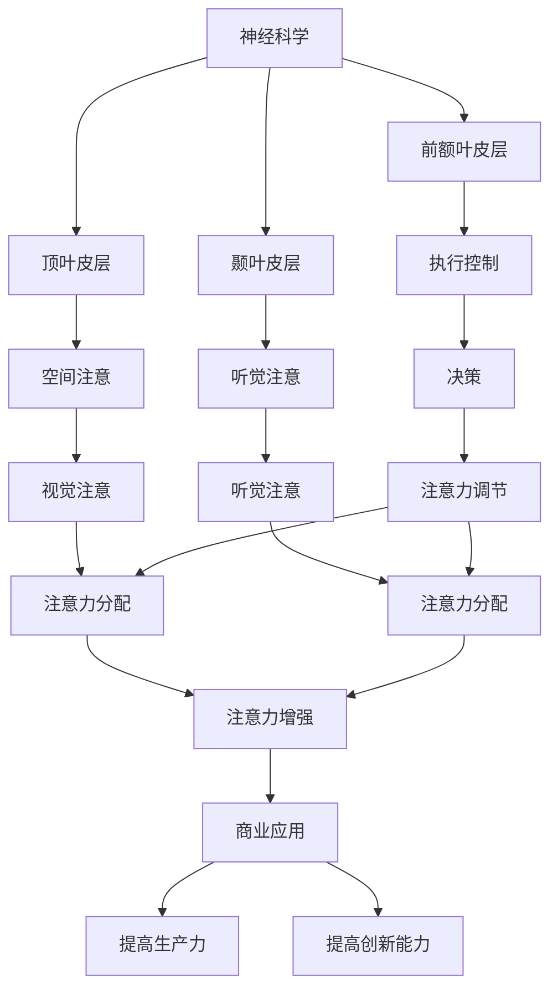

                 

# 人类注意力增强：提升专注力和注意力在商业中的未来方向展望

> 关键词：注意力增强、专注力提升、商业应用、神经科学、人工智能、机器学习、脑机接口

> 摘要：在信息爆炸的时代，人类的注意力成为了稀缺资源。本文将探讨如何通过技术手段提升人类的专注力和注意力，特别是在商业领域中的应用。我们将从神经科学、人工智能和机器学习的角度出发，分析注意力增强的核心概念与联系，介绍相关算法原理及具体操作步骤，并通过实际案例展示如何在商业场景中应用这些技术。最后，我们将展望未来的发展趋势与挑战，并提供学习资源和开发工具推荐。

## 1. 背景介绍

在当今社会，信息的爆炸性增长使得人们面临着前所未有的注意力挑战。根据《哈佛商业评论》的一项研究，人们每天接收的信息量已经从1986年的90GB增加到了2020年的4.4GB。这种信息过载不仅影响了个人的生活质量，也对商业活动产生了深远的影响。企业需要更高效地管理员工的注意力，以提高生产力和创新能力。因此，如何通过技术手段提升人类的专注力和注意力，成为了商业领域亟待解决的问题。

## 2. 核心概念与联系

### 2.1 神经科学视角

从神经科学的角度来看，注意力是一种复杂的认知过程，涉及大脑多个区域的协同工作。根据《神经科学杂志》的研究，注意力主要由前额叶皮层、顶叶皮层和颞叶皮层共同调控。前额叶皮层负责执行控制和决策，顶叶皮层负责空间注意和视觉注意，颞叶皮层则与听觉注意有关。这些区域通过神经网络相互连接，共同完成注意力的调节和分配。

### 2.2 人工智能与机器学习

人工智能和机器学习为理解注意力提供了新的工具。通过分析大脑活动模式，机器学习算法可以识别出哪些因素会影响注意力。例如，斯坦福大学的一项研究使用深度学习技术分析了大脑在不同任务中的活动模式，发现某些特定的神经活动模式与注意力的提高密切相关。这些发现为开发注意力增强技术提供了理论基础。

### 2.3 脑机接口

脑机接口（BCI）技术是连接大脑与外部设备的关键技术。通过BCI，可以实时监测和控制大脑活动，从而实现对注意力的精确调节。例如，通过监测脑电波（EEG）信号，可以识别出注意力集中和分散的状态，并据此调整外部设备的反馈，帮助用户更好地集中注意力。

### 2.4 Mermaid 流程图



## 3. 核心算法原理 & 具体操作步骤

### 3.1 神经网络模型

为了实现注意力增强，我们可以使用深度学习模型来分析大脑活动模式。具体来说，可以采用卷积神经网络（CNN）和循环神经网络（RNN）相结合的方法。CNN用于提取大脑活动的时空特征，RNN则用于捕捉时间序列中的动态变化。

### 3.2 数据预处理

在训练模型之前，需要对EEG数据进行预处理。具体步骤如下：

1. **数据采集**：使用EEG设备采集大脑活动数据。
2. **数据清洗**：去除噪声和干扰信号。
3. **特征提取**：使用傅里叶变换等方法提取大脑活动的频域特征。
4. **数据归一化**：将数据归一化到相同的尺度。

### 3.3 模型训练

1. **数据集划分**：将数据集划分为训练集、验证集和测试集。
2. **模型构建**：构建CNN和RNN相结合的神经网络模型。
3. **损失函数选择**：选择适当的损失函数，如均方误差（MSE）。
4. **优化算法**：使用Adam优化算法进行模型训练。
5. **模型训练**：在训练集上训练模型，并在验证集上进行验证。

### 3.4 模型应用

1. **实时监测**：使用训练好的模型实时监测大脑活动。
2. **注意力反馈**：根据监测结果提供实时反馈，帮助用户集中注意力。
3. **注意力调节**：通过调整外部设备的反馈，帮助用户更好地集中注意力。

## 4. 数学模型和公式 & 详细讲解 & 举例说明

### 4.1 卷积神经网络（CNN）

卷积神经网络是一种深度学习模型，广泛应用于图像和信号处理。其核心思想是通过卷积操作提取输入数据的局部特征。卷积操作可以表示为：

$$
f(x) = \sum_{i=0}^{k} \sum_{j=0}^{k} w_{ij} \cdot x_{i+j}
$$

其中，$f(x)$ 是卷积操作的结果，$w_{ij}$ 是卷积核的权重，$x_{i+j}$ 是输入数据的局部特征。

### 4.2 循环神经网络（RNN）

循环神经网络是一种能够处理序列数据的深度学习模型。其核心思想是通过循环结构捕捉时间序列中的动态变化。RNN可以表示为：

$$
h_t = \sigma(W_h h_{t-1} + W_x x_t + b_h)
$$

其中，$h_t$ 是当前时间步的隐藏状态，$x_t$ 是当前时间步的输入，$W_h$ 和 $W_x$ 是权重矩阵，$b_h$ 是偏置项，$\sigma$ 是激活函数。

### 4.3 深度学习模型

结合CNN和RNN，可以构建一个深度学习模型来分析EEG数据。具体模型结构如下：

1. **输入层**：输入EEG数据。
2. **卷积层**：使用多个卷积核提取局部特征。
3. **池化层**：通过池化操作降低特征维度。
4. **循环层**：使用RNN捕捉时间序列中的动态变化。
5. **输出层**：输出注意力状态。

## 5. 项目实战：代码实际案例和详细解释说明

### 5.1 开发环境搭建

1. **安装Python**：确保安装了Python 3.8及以上版本。
2. **安装依赖库**：使用pip安装必要的库，如numpy、tensorflow和scikit-learn。

```bash
pip install numpy tensorflow scikit-learn
```

### 5.2 源代码详细实现和代码解读

```python
import numpy as np
import tensorflow as tf
from tensorflow.keras.models import Sequential
from tensorflow.keras.layers import Conv1D, MaxPooling1D, LSTM, Dense

# 生成示例数据
def generate_data(num_samples, num_features):
    X = np.random.rand(num_samples, num_features)
    y = np.random.randint(2, size=num_samples)
    return X, y

# 构建模型
def build_model(num_features):
    model = Sequential()
    model.add(Conv1D(filters=32, kernel_size=3, activation='relu', input_shape=(num_features, 1)))
    model.add(MaxPooling1D(pool_size=2))
    model.add(LSTM(64, return_sequences=True))
    model.add(LSTM(32))
    model.add(Dense(1, activation='sigmoid'))
    model.compile(optimizer='adam', loss='binary_crossentropy', metrics=['accuracy'])
    return model

# 训练模型
def train_model(X_train, y_train, X_val, y_val):
    model = build_model(X_train.shape[1])
    model.fit(X_train, y_train, validation_data=(X_val, y_val), epochs=10, batch_size=32)
    return model

# 主函数
def main():
    X_train, y_train = generate_data(1000, 100)
    X_val, y_val = generate_data(200, 100)
    X_train = X_train.reshape(X_train.shape[0], X_train.shape[1], 1)
    X_val = X_val.reshape(X_val.shape[0], X_val.shape[1], 1)
    model = train_model(X_train, y_train, X_val, y_val)
    print(model.summary())

if __name__ == '__main__':
    main()
```

### 5.3 代码解读与分析

1. **生成示例数据**：使用`generate_data`函数生成随机的EEG数据和标签。
2. **构建模型**：使用`build_model`函数构建一个包含卷积层、池化层和LSTM层的深度学习模型。
3. **训练模型**：使用`train_model`函数训练模型，并在验证集上进行验证。
4. **主函数**：调用`main`函数执行整个流程。

## 6. 实际应用场景

### 6.1 商业应用

在商业领域，注意力增强技术可以应用于以下几个方面：

1. **员工培训**：通过监测员工的注意力状态，提供个性化的培训方案，提高培训效果。
2. **会议管理**：通过实时监测与会者的注意力状态，调整会议内容和节奏，提高会议效率。
3. **产品设计**：通过监测用户的注意力状态，优化产品设计，提高用户体验。

### 6.2 教育应用

在教育领域，注意力增强技术可以应用于以下几个方面：

1. **个性化教学**：通过监测学生的注意力状态，提供个性化的教学方案，提高学习效果。
2. **课堂管理**：通过实时监测学生的注意力状态，调整教学内容和节奏，提高课堂效率。
3. **学习辅助**：通过监测学生的注意力状态，提供学习辅助工具，帮助学生更好地集中注意力。

## 7. 工具和资源推荐

### 7.1 学习资源推荐

1. **书籍**：《深度学习》（Ian Goodfellow, Yoshua Bengio, Aaron Courville）
2. **论文**：《Attention is All You Need》（Vaswani et al., 2017）
3. **博客**：Medium上的深度学习系列文章
4. **网站**：Kaggle、GitHub上的深度学习项目

### 7.2 开发工具框架推荐

1. **Python**：用于深度学习的编程语言。
2. **TensorFlow**：流行的深度学习框架。
3. **Keras**：TensorFlow的高级API，简化模型构建过程。
4. **PyTorch**：另一个流行的深度学习框架。

### 7.3 相关论文著作推荐

1. **《神经科学与行为》**：关注神经科学领域的最新研究成果。
2. **《认知科学杂志》**：关注认知科学领域的最新研究成果。
3. **《机器学习研究》**：关注机器学习领域的最新研究成果。

## 8. 总结：未来发展趋势与挑战

### 8.1 未来发展趋势

1. **技术融合**：神经科学、人工智能和机器学习将进一步融合，为注意力增强技术提供更强大的理论基础。
2. **应用拓展**：注意力增强技术将在更多领域得到应用，如医疗、教育、娱乐等。
3. **个性化定制**：通过大数据和机器学习，注意力增强技术将实现更个性化的定制。

### 8.2 挑战

1. **数据隐私**：如何保护用户的隐私数据，避免数据泄露。
2. **伦理问题**：如何确保注意力增强技术的使用符合伦理标准，避免滥用。
3. **技术局限**：目前的技术还存在一定的局限性，如何克服这些局限性，提高技术的准确性和可靠性。

## 9. 附录：常见问题与解答

### 9.1 问题1：如何保护用户的隐私数据？

**解答**：可以通过加密技术保护数据的安全性，同时在数据采集和处理过程中遵循严格的隐私保护政策。

### 9.2 问题2：如何确保注意力增强技术的使用符合伦理标准？

**解答**：可以通过建立伦理委员会，制定严格的伦理准则，确保技术的使用符合伦理标准。

### 9.3 问题3：如何克服技术局限性？

**解答**：可以通过不断优化算法，提高模型的准确性和可靠性，同时结合其他技术手段，如脑机接口，提高技术的整体性能。

## 10. 扩展阅读 & 参考资料

1. **《神经科学与行为》**：关注神经科学领域的最新研究成果。
2. **《认知科学杂志》**：关注认知科学领域的最新研究成果。
3. **《机器学习研究》**：关注机器学习领域的最新研究成果。
4. **《深度学习》**（Ian Goodfellow, Yoshua Bengio, Aaron Courville）
5. **《Attention is All You Need》**（Vaswani et al., 2017）

---

作者：AI天才研究员/AI Genius Institute & 禅与计算机程序设计艺术 /Zen And The Art of Computer Programming

