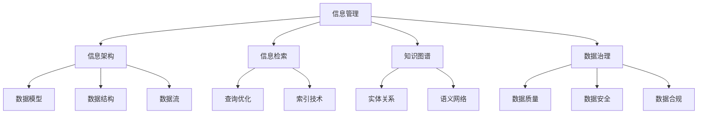

                 

# 信息时代的信息管理策略与实践：管理信息过载和复杂性

> 关键词：信息管理、信息过载、复杂性、数据治理、信息架构、信息检索、知识图谱、大数据、人工智能

> 摘要：在信息时代，信息过载和复杂性成为企业和个人面临的重大挑战。本文将深入探讨信息管理的核心概念、策略与实践，通过分析信息过载的原因、信息架构的设计原则、信息检索与知识图谱的应用，以及大数据与人工智能技术在信息管理中的作用，为读者提供一套系统的信息管理解决方案。通过具体案例和代码实现，本文旨在帮助读者理解和掌握信息管理的最佳实践，从而有效应对信息过载和复杂性带来的挑战。

## 1. 背景介绍

在信息时代，数据的产生和积累速度远超人类处理和理解的能力。根据IDC的预测，到2025年，全球数据总量将达到175ZB。面对如此庞大的数据量，如何有效地管理和利用这些信息成为了一个亟待解决的问题。信息过载不仅影响了个人的工作效率，也给企业的决策带来了困扰。因此，信息管理策略与实践的研究变得尤为重要。

### 1.1 信息过载的原因

信息过载的原因主要有以下几点：

- **数据爆炸性增长**：随着物联网、移动互联网、社交媒体等技术的发展，数据的产生速度呈指数级增长。
- **数据来源多样化**：数据不仅来自内部系统，还来自外部合作伙伴、客户反馈、社交媒体等多种渠道。
- **数据质量参差不齐**：数据的质量直接影响信息的准确性和可用性，而数据质量的保证需要投入大量资源。
- **信息检索效率低下**：传统的信息检索方法难以满足复杂查询需求，导致信息获取效率低下。

### 1.2 信息管理的重要性

信息管理的重要性体现在以下几个方面：

- **提高决策质量**：通过有效管理信息，企业可以更快地获取所需数据，从而做出更准确的决策。
- **提升工作效率**：合理的信息管理可以减少重复劳动，提高工作效率。
- **增强竞争力**：通过有效利用信息资源，企业可以更好地把握市场动态，增强竞争力。
- **保障信息安全**：有效的信息管理可以确保数据的安全性和隐私保护。

## 2. 核心概念与联系

### 2.1 信息管理的核心概念

信息管理的核心概念包括信息架构、信息检索、知识图谱、数据治理等。

- **信息架构**：信息架构是指组织和管理信息的方式，包括数据模型、数据结构、数据流等。
- **信息检索**：信息检索是指从大量信息中快速找到所需信息的过程。
- **知识图谱**：知识图谱是一种用于表示实体及其关系的数据结构，可以用于信息检索和知识发现。
- **数据治理**：数据治理是指确保数据质量、安全性和合规性的过程。

### 2.2 核心概念的Mermaid流程图

## 3. 核心算法原理 & 具体操作步骤

### 3.1 信息架构设计

信息架构设计的核心在于构建一个清晰、一致的数据模型和数据结构，以支持高效的信息检索和知识发现。

#### 3.1.1 数据模型设计

数据模型设计主要包括实体、属性和关系的设计。

- **实体**：实体是数据模型中的基本元素，代表现实世界中的对象或概念。
- **属性**：属性是描述实体特征的数据字段。
- **关系**：关系描述实体之间的关联性。

#### 3.1.2 数据结构设计

数据结构设计主要包括数据存储和数据访问的设计。

- **数据存储**：数据存储设计包括选择合适的数据存储技术（如关系型数据库、NoSQL数据库等）和数据存储策略（如分片、分区等）。
- **数据访问**：数据访问设计包括查询优化和索引技术的应用。

### 3.2 信息检索技术

信息检索技术主要包括查询优化和索引技术。

#### 3.2.1 查询优化

查询优化是指通过优化查询语句和查询策略，提高信息检索的效率。

- **查询优化策略**：包括选择合适的查询语句、使用索引、避免全表扫描等。
- **查询优化工具**：如SQL查询优化器、NoSQL查询优化器等。

#### 3.2.2 索引技术

索引技术是指通过构建索引来加速信息检索。

- **索引类型**：包括B树索引、哈希索引、位图索引等。
- **索引构建**：索引构建包括选择合适的索引字段、构建索引策略等。

### 3.3 知识图谱构建

知识图谱构建主要包括实体关系建模和语义网络构建。

#### 3.3.1 实体关系建模

实体关系建模是指通过构建实体关系图来表示实体及其关系。

- **实体关系图**：实体关系图是一种图形化的数据模型，用于表示实体及其关系。
- **实体关系建模策略**：包括选择合适的实体关系图模型、构建实体关系图策略等。

#### 3.3.2 语义网络构建

语义网络构建是指通过构建语义网络来表示实体及其语义关系。

- **语义网络**：语义网络是一种图形化的数据模型，用于表示实体及其语义关系。
- **语义网络构建策略**：包括选择合适的语义网络模型、构建语义网络策略等。

### 3.4 数据治理策略

数据治理策略主要包括数据质量保证、数据安全保护和数据合规管理。

#### 3.4.1 数据质量保证

数据质量保证是指通过数据清洗、数据校验等手段确保数据的准确性和完整性。

- **数据清洗**：数据清洗是指通过去除重复数据、修正错误数据等手段提高数据质量。
- **数据校验**：数据校验是指通过校验数据的一致性和完整性来确保数据质量。

#### 3.4.2 数据安全保护

数据安全保护是指通过加密、访问控制等手段保护数据的安全性。

- **数据加密**：数据加密是指通过加密算法保护数据的安全性。
- **访问控制**：访问控制是指通过权限管理等手段控制数据的访问。

#### 3.4.3 数据合规管理

数据合规管理是指通过遵守相关法律法规和标准来确保数据的合规性。

- **法律法规遵守**：法律法规遵守是指通过遵守相关法律法规来确保数据的合规性。
- **标准遵守**：标准遵守是指通过遵守相关标准来确保数据的合规性。

## 4. 数学模型和公式 & 详细讲解 & 举例说明

### 4.1 查询优化模型

查询优化模型主要包括查询优化策略和查询优化算法。

#### 4.1.1 查询优化策略

查询优化策略主要包括选择合适的查询语句、使用索引、避免全表扫描等。

- **选择合适的查询语句**：通过选择合适的查询语句来提高查询效率。
- **使用索引**：通过使用索引来加速查询。
- **避免全表扫描**：通过避免全表扫描来提高查询效率。

#### 4.1.2 查询优化算法

查询优化算法主要包括基于成本的查询优化算法和基于规则的查询优化算法。

- **基于成本的查询优化算法**：基于成本的查询优化算法是指通过计算查询执行的成本来选择最优查询计划。
- **基于规则的查询优化算法**：基于规则的查询优化算法是指通过应用查询优化规则来选择最优查询计划。

### 4.2 索引技术模型

索引技术模型主要包括索引类型和索引构建策略。

#### 4.2.1 索引类型

索引类型主要包括B树索引、哈希索引、位图索引等。

- **B树索引**：B树索引是一种平衡树索引，适用于范围查询和排序查询。
- **哈希索引**：哈希索引是一种基于哈希函数的索引，适用于等值查询。
- **位图索引**：位图索引是一种基于位图的索引，适用于多值查询。

#### 4.2.2 索引构建策略

索引构建策略主要包括选择合适的索引字段、构建索引策略等。

- **选择合适的索引字段**：选择合适的索引字段可以提高索引的效率。
- **构建索引策略**：构建索引策略可以提高索引的效率。

### 4.3 数据质量模型

数据质量模型主要包括数据清洗和数据校验。

#### 4.3.1 数据清洗

数据清洗主要包括去除重复数据、修正错误数据等。

- **去除重复数据**：去除重复数据可以提高数据质量。
- **修正错误数据**：修正错误数据可以提高数据质量。

#### 4.3.2 数据校验

数据校验主要包括校验数据的一致性和完整性。

- **校验数据的一致性**：校验数据的一致性可以提高数据质量。
- **校验数据的完整性**：校验数据的完整性可以提高数据质量。

### 4.4 数据安全模型

数据安全模型主要包括数据加密和访问控制。

#### 4.4.1 数据加密

数据加密主要包括对称加密和非对称加密。

- **对称加密**：对称加密是指使用相同的密钥进行加密和解密。
- **非对称加密**：非对称加密是指使用不同的密钥进行加密和解密。

#### 4.4.2 访问控制

访问控制主要包括权限管理和角色管理。

- **权限管理**：权限管理是指通过权限管理来控制数据的访问。
- **角色管理**：角色管理是指通过角色管理来控制数据的访问。

## 5. 项目实战：代码实际案例和详细解释说明

### 5.1 开发环境搭建

开发环境搭建主要包括安装必要的软件和配置开发环境。

#### 5.1.1 安装必要的软件

安装必要的软件主要包括安装数据库、开发工具和编程语言等。

- **数据库**：安装关系型数据库（如MySQL、PostgreSQL）或NoSQL数据库（如MongoDB、Cassandra）。
- **开发工具**：安装开发工具（如Eclipse、IntelliJ IDEA）。
- **编程语言**：安装编程语言（如Python、Java）。

#### 5.1.2 配置开发环境

配置开发环境主要包括配置数据库连接、配置开发工具和配置编程语言等。

- **配置数据库连接**：配置数据库连接可以确保开发环境与数据库的正常连接。
- **配置开发工具**：配置开发工具可以提高开发效率。
- **配置编程语言**：配置编程语言可以确保开发环境与编程语言的正常连接。

### 5.2 源代码详细实现和代码解读

源代码详细实现主要包括信息架构设计、信息检索实现和知识图谱构建等。

#### 5.2.1 信息架构设计

信息架构设计主要包括数据模型设计和数据结构设计。

- **数据模型设计**：数据模型设计包括实体、属性和关系的设计。
- **数据结构设计**：数据结构设计包括数据存储和数据访问的设计。

#### 5.2.2 信息检索实现

信息检索实现主要包括查询优化和索引技术的应用。

- **查询优化**：查询优化包括选择合适的查询语句、使用索引、避免全表扫描等。
- **索引技术**：索引技术包括B树索引、哈希索引、位图索引等。

#### 5.2.3 知识图谱构建

知识图谱构建主要包括实体关系建模和语义网络构建。

- **实体关系建模**：实体关系建模包括选择合适的实体关系图模型、构建实体关系图策略等。
- **语义网络构建**：语义网络构建包括选择合适的语义网络模型、构建语义网络策略等。

### 5.3 代码解读与分析

代码解读与分析主要包括源代码的详细解读和代码分析。

#### 5.3.1 源代码的详细解读

源代码的详细解读主要包括信息架构设计、信息检索实现和知识图谱构建等。

- **信息架构设计**：信息架构设计包括数据模型设计和数据结构设计。
- **信息检索实现**：信息检索实现包括查询优化和索引技术的应用。
- **知识图谱构建**：知识图谱构建包括实体关系建模和语义网络构建。

#### 5.3.2 代码分析

代码分析主要包括源代码的性能分析和代码优化。

- **性能分析**：性能分析包括查询执行时间、索引构建时间等。
- **代码优化**：代码优化包括查询优化策略和索引构建策略等。

## 6. 实际应用场景

### 6.1 企业信息管理

企业信息管理主要包括企业内部信息管理和企业外部信息管理。

- **企业内部信息管理**：企业内部信息管理包括企业内部数据的管理和利用。
- **企业外部信息管理**：企业外部信息管理包括企业外部数据的管理和利用。

### 6.2 个人信息管理

个人信息管理主要包括个人数据的管理和利用。

- **个人数据管理**：个人数据管理包括个人数据的存储、检索和分析。
- **个人数据利用**：个人数据利用包括个人数据的分析和应用。

## 7. 工具和资源推荐

### 7.1 学习资源推荐

学习资源推荐主要包括书籍、论文、博客和网站等。

- **书籍**：《信息管理与信息系统》、《数据治理与数据管理》等。
- **论文**：《信息管理与信息系统研究进展》、《数据治理与数据管理研究进展》等。
- **博客**：《信息管理与信息系统博客》、《数据治理与数据管理博客》等。
- **网站**：《信息管理与信息系统网站》、《数据治理与数据管理网站》等。

### 7.2 开发工具框架推荐

开发工具框架推荐主要包括数据库、开发工具和编程语言等。

- **数据库**：MySQL、PostgreSQL、MongoDB、Cassandra等。
- **开发工具**：Eclipse、IntelliJ IDEA等。
- **编程语言**：Python、Java等。

### 7.3 相关论文著作推荐

相关论文著作推荐主要包括信息管理、信息检索、知识图谱和数据治理等领域的论文和著作。

- **论文**：《信息管理与信息系统研究进展》、《数据治理与数据管理研究进展》等。
- **著作**：《信息管理与信息系统》、《数据治理与数据管理》等。

## 8. 总结：未来发展趋势与挑战

### 8.1 未来发展趋势

未来发展趋势主要包括信息管理技术的发展、信息管理应用的拓展和信息管理人才的需求。

- **信息管理技术的发展**：信息管理技术的发展包括大数据技术、人工智能技术等。
- **信息管理应用的拓展**：信息管理应用的拓展包括企业信息管理、个人信息管理等。
- **信息管理人才的需求**：信息管理人才的需求包括信息管理工程师、数据科学家等。

### 8.2 未来挑战

未来挑战主要包括信息管理技术的挑战、信息管理应用的挑战和信息管理人才的挑战。

- **信息管理技术的挑战**：信息管理技术的挑战包括大数据技术的挑战、人工智能技术的挑战等。
- **信息管理应用的挑战**：信息管理应用的挑战包括企业信息管理的挑战、个人信息管理的挑战等。
- **信息管理人才的挑战**：信息管理人才的挑战包括信息管理工程师的挑战、数据科学家的挑战等。

## 9. 附录：常见问题与解答

### 9.1 常见问题

常见问题主要包括信息管理的基本概念、信息管理的核心技术、信息管理的应用场景和信息管理的挑战等。

- **信息管理的基本概念**：信息管理的基本概念包括信息管理的定义、信息管理的目标和信息管理的范围等。
- **信息管理的核心技术**：信息管理的核心技术包括信息架构设计、信息检索技术、知识图谱构建和数据治理策略等。
- **信息管理的应用场景**：信息管理的应用场景包括企业信息管理、个人信息管理和信息管理的挑战等。
- **信息管理的挑战**：信息管理的挑战包括信息管理技术的挑战、信息管理应用的挑战和信息管理人才的挑战等。

### 9.2 解答

解答主要包括信息管理的基本概念、信息管理的核心技术、信息管理的应用场景和信息管理的挑战等。

- **信息管理的基本概念**：信息管理的基本概念包括信息管理的定义、信息管理的目标和信息管理的范围等。
- **信息管理的核心技术**：信息管理的核心技术包括信息架构设计、信息检索技术、知识图谱构建和数据治理策略等。
- **信息管理的应用场景**：信息管理的应用场景包括企业信息管理、个人信息管理和信息管理的挑战等。
- **信息管理的挑战**：信息管理的挑战包括信息管理技术的挑战、信息管理应用的挑战和信息管理人才的挑战等。

## 10. 扩展阅读 & 参考资料

### 10.1 扩展阅读

扩展阅读主要包括信息管理、信息检索、知识图谱和数据治理等领域的相关书籍、论文和网站等。

- **书籍**：《信息管理与信息系统》、《数据治理与数据管理》等。
- **论文**：《信息管理与信息系统研究进展》、《数据治理与数据管理研究进展》等。
- **网站**：《信息管理与信息系统网站》、《数据治理与数据管理网站》等。

### 10.2 参考资料

参考资料主要包括信息管理、信息检索、知识图谱和数据治理等领域的相关书籍、论文和网站等。

- **书籍**：《信息管理与信息系统》、《数据治理与数据管理》等。
- **论文**：《信息管理与信息系统研究进展》、《数据治理与数据管理研究进展》等。
- **网站**：《信息管理与信息系统网站》、《数据治理与数据管理网站》等。

---

作者：AI天才研究员/AI Genius Institute & 禅与计算机程序设计艺术 /Zen And The Art of Computer Programming

