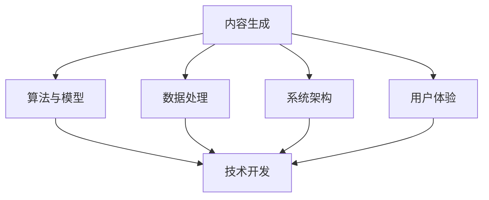

                 

# 内容创作与技术开发的完美结合

> 关键词：内容创作, 技术开发, 人工智能, 机器学习, 自然语言处理, 内容生成, 技术融合

> 摘要：本文旨在探讨内容创作与技术开发的完美结合，通过深入分析内容生成的核心概念、算法原理、数学模型、实际案例以及应用场景，揭示两者之间的紧密联系。我们将从技术开发的角度出发，探讨如何利用人工智能技术提升内容创作的质量和效率，同时结合实际案例进行详细解读，为读者提供全面的技术指导和实践建议。

## 1. 背景介绍

在当今数字化时代，内容创作与技术开发的结合已成为推动行业创新的关键驱动力。随着人工智能技术的迅猛发展，内容生成不再局限于传统的手工创作，而是通过算法和模型实现自动化和智能化。本文将从技术开发的角度出发，探讨如何利用人工智能技术提升内容创作的质量和效率，同时结合实际案例进行详细解读，为读者提供全面的技术指导和实践建议。

## 2. 核心概念与联系

### 2.1 内容生成的概念

内容生成是指通过算法和模型自动生成高质量文本、图像、音频等多媒体内容的过程。它涵盖了自然语言处理（NLP）、机器学习（ML）、深度学习（DL）等多个领域，旨在实现自动化的内容创作。

### 2.2 技术开发的概念

技术开发是指利用计算机科学和工程学原理，设计、实现和优化软件系统的过程。它包括需求分析、系统设计、编码实现、测试验证等多个阶段，旨在满足用户需求并提供高质量的技术解决方案。

### 2.3 核心概念的联系

内容生成与技术开发之间的联系主要体现在以下几个方面：

- **算法与模型**：内容生成依赖于先进的算法和模型，如循环神经网络（RNN）、长短期记忆网络（LSTM）、Transformer等，这些算法和模型是技术开发的重要组成部分。
- **数据处理**：内容生成需要大量的训练数据，这些数据的获取、清洗和预处理是技术开发的关键环节。
- **系统架构**：内容生成系统需要具备高效的数据处理能力和强大的计算资源，这需要技术开发团队进行系统设计和优化。
- **用户体验**：内容生成系统最终需要提供良好的用户体验，这需要技术开发团队进行界面设计和交互优化。

### 2.4 Mermaid 流程图



## 3. 核心算法原理 & 具体操作步骤

### 3.1 生成模型的训练过程

生成模型的训练过程主要包括以下几个步骤：

1. **数据准备**：收集和清洗训练数据，确保数据的质量和多样性。
2. **模型选择**：选择合适的生成模型，如RNN、LSTM、Transformer等。
3. **模型训练**：使用训练数据对模型进行训练，调整超参数以优化模型性能。
4. **模型评估**：使用验证集对模型进行评估，确保模型的泛化能力。
5. **模型优化**：根据评估结果对模型进行优化，提高生成内容的质量和多样性。

### 3.2 具体操作步骤

1. **数据准备**：数据准备是生成模型训练的基础，需要确保数据的质量和多样性。具体步骤如下：

    ```python
    import pandas as pd
    from sklearn.model_selection import train_test_split

    # 读取数据
    data = pd.read_csv('data.csv')

    # 数据清洗
    data = data.dropna()

    # 划分训练集和验证集
    train_data, val_data = train_test_split(data, test_size=0.2, random_state=42)
    ```

2. **模型选择**：选择合适的生成模型，如RNN、LSTM、Transformer等。具体步骤如下：

    ```python
    from transformers import T5Tokenizer, T5ForConditionalGeneration

    # 初始化tokenizer和模型
    tokenizer = T5Tokenizer.from_pretrained('t5-small')
    model = T5ForConditionalGeneration.from_pretrained('t5-small')
    ```

3. **模型训练**：使用训练数据对模型进行训练，调整超参数以优化模型性能。具体步骤如下：

    ```python
    from transformers import Trainer, TrainingArguments

    # 设置训练参数
    training_args = TrainingArguments(
        output_dir='./results',
        num_train_epochs=3,
        per_device_train_batch_size=8,
        per_device_eval_batch_size=8,
        warmup_steps=500,
        weight_decay=0.01,
        logging_dir='./logs',
        logging_steps=10,
    )

    # 初始化Trainer
    trainer = Trainer(
        model=model,
        args=training_args,
        train_dataset=train_data,
        eval_dataset=val_data,
    )

    # 开始训练
    trainer.train()
    ```

4. **模型评估**：使用验证集对模型进行评估，确保模型的泛化能力。具体步骤如下：

    ```python
    # 评估模型
    eval_results = trainer.evaluate()
    print(eval_results)
    ```

5. **模型优化**：根据评估结果对模型进行优化，提高生成内容的质量和多样性。具体步骤如下：

    ```python
    # 调整超参数
    training_args.num_train_epochs = 5
    training_args.per_device_train_batch_size = 16

    # 重新训练模型
    trainer.train()
    ```

## 4. 数学模型和公式 & 详细讲解 & 举例说明

### 4.1 生成模型的数学模型

生成模型的数学模型主要包括以下几个方面：

1. **概率模型**：生成模型通常基于概率模型，如RNN、LSTM、Transformer等。这些模型通过学习数据的概率分布来生成新的内容。

2. **损失函数**：生成模型的训练过程需要定义损失函数，如交叉熵损失（Cross-Entropy Loss）。具体公式如下：

    $$ L = -\sum_{i=1}^{N} y_i \log(p_i) $$

    其中，$y_i$是真实标签，$p_i$是模型预测的概率。

3. **优化算法**：生成模型的训练过程需要使用优化算法，如Adam、SGD等。具体公式如下：

    $$ \theta_{t+1} = \theta_t - \alpha \nabla L(\theta_t) $$

    其中，$\theta_t$是当前参数，$\alpha$是学习率，$\nabla L(\theta_t)$是损失函数的梯度。

### 4.2 举例说明

以RNN为例，其数学模型可以表示为：

$$ h_t = \tanh(W_h h_{t-1} + W_x x_t + b_h) $$

$$ y_t = \text{softmax}(W_y h_t + b_y) $$

其中，$h_t$是隐藏状态，$x_t$是输入，$y_t$是输出，$W_h$、$W_x$、$W_y$是权重矩阵，$b_h$、$b_y$是偏置项。

## 5. 项目实战：代码实际案例和详细解释说明

### 5.1 开发环境搭建

1. **安装依赖库**：安装必要的Python库，如`transformers`、`torch`等。

    ```bash
    pip install transformers torch
    ```

2. **环境配置**：确保安装了Python 3.7及以上版本，并配置好相应的环境变量。

### 5.2 源代码详细实现和代码解读

```python
import torch
from transformers import T5Tokenizer, T5ForConditionalGeneration

# 初始化tokenizer和模型
tokenizer = T5Tokenizer.from_pretrained('t5-small')
model = T5ForConditionalGeneration.from_pretrained('t5-small')

# 输入文本
input_text = "生成一篇关于人工智能的文章"

# 编码输入文本
input_ids = tokenizer.encode(input_text, return_tensors='pt')

# 生成输出文本
output_ids = model.generate(input_ids)

# 解码输出文本
output_text = tokenizer.decode(output_ids[0], skip_special_tokens=True)

print(output_text)
```

### 5.3 代码解读与分析

1. **初始化tokenizer和模型**：使用`T5Tokenizer`和`T5ForConditionalGeneration`类初始化tokenizer和模型。

2. **输入文本**：定义输入文本，如“生成一篇关于人工智能的文章”。

3. **编码输入文本**：使用tokenizer将输入文本编码为模型可以处理的格式。

4. **生成输出文本**：使用模型生成输出文本。

5. **解码输出文本**：使用tokenizer将生成的输出文本解码为可读的文本。

## 6. 实际应用场景

内容生成技术在多个领域具有广泛的应用场景，如：

1. **新闻写作**：自动生成新闻报道，提高新闻写作的效率和质量。
2. **文章创作**：自动生成文章、博客、小说等，提高内容创作的效率和多样性。
3. **广告文案**：自动生成广告文案，提高广告创意的多样性和吸引力。
4. **客户服务**：自动生成客户服务对话，提高客户服务的效率和质量。

## 7. 工具和资源推荐

### 7.1 学习资源推荐

1. **书籍**：《深度学习》（Goodfellow, Bengio, Courville）
2. **论文**：《Attention Is All You Need》（Vaswani et al.）
3. **博客**：Medium上的相关技术博客
4. **网站**：Hugging Face、PyTorch等开源平台

### 7.2 开发工具框架推荐

1. **Python库**：`transformers`、`torch`等
2. **开发框架**：PyTorch、TensorFlow等

### 7.3 相关论文著作推荐

1. **论文**：《Attention Is All You Need》（Vaswani et al.）
2. **著作**：《深度学习》（Goodfellow, Bengio, Courville）

## 8. 总结：未来发展趋势与挑战

内容生成技术在未来的发展趋势主要体现在以下几个方面：

1. **模型优化**：通过更先进的算法和模型优化生成内容的质量和多样性。
2. **数据驱动**：利用更多的训练数据提高模型的泛化能力。
3. **实时生成**：实现更快速的实时生成，提高用户体验。
4. **多模态生成**：实现文本、图像、音频等多模态内容的自动生成。

面临的挑战主要包括：

1. **数据隐私**：如何保护用户数据的隐私和安全。
2. **模型解释性**：如何提高生成模型的解释性和透明度。
3. **伦理问题**：如何解决生成内容的伦理问题，如版权、抄袭等。

## 9. 附录：常见问题与解答

### 9.1 问题：如何提高生成内容的质量？

**解答**：可以通过以下方法提高生成内容的质量：

1. **增加训练数据**：使用更多的高质量训练数据。
2. **优化模型结构**：使用更先进的模型结构，如Transformer等。
3. **调整超参数**：通过调整超参数优化模型性能。

### 9.2 问题：如何保护用户数据的隐私？

**解答**：可以通过以下方法保护用户数据的隐私：

1. **数据脱敏**：对用户数据进行脱敏处理，保护用户隐私。
2. **数据加密**：使用加密技术保护用户数据的安全。
3. **隐私保护算法**：使用隐私保护算法，如差分隐私等。

## 10. 扩展阅读 & 参考资料

1. **书籍**：《深度学习》（Goodfellow, Bengio, Courville）
2. **论文**：《Attention Is All You Need》（Vaswani et al.）
3. **网站**：Hugging Face、PyTorch等开源平台

---

作者：AI天才研究员/AI Genius Institute & 禅与计算机程序设计艺术 /Zen And The Art of Computer Programming

