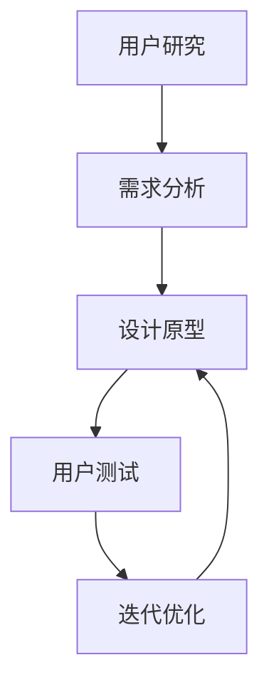

                 

# 创业公司的用户体验设计：打造令人着迷的产品

> 关键词：用户体验设计, 用户心理学, 产品设计, 交互设计, 产品迭代

> 摘要：在创业公司中，用户体验设计是构建令人着迷产品的关键。本文将深入探讨用户体验设计的核心概念、原理和实践方法，通过具体案例分析，帮助创业者和产品团队更好地理解如何设计出用户喜爱的产品。我们将从用户心理学出发，结合实际案例，详细讲解用户体验设计的流程和方法，旨在为创业公司提供实用的指导和建议。

## 1. 背景介绍

在当今竞争激烈的市场环境中，创业公司要想脱颖而出，必须提供令人着迷的产品。用户体验设计（User Experience Design, UX Design）是实现这一目标的关键。用户体验设计不仅关注产品的外观和功能，更注重用户在使用产品过程中的感受和体验。通过深入了解用户需求、行为和心理，设计出符合用户期望的产品，可以显著提升产品的市场竞争力。

### 1.1 为什么用户体验设计如此重要

用户体验设计的重要性体现在以下几个方面：

- **用户满意度**：良好的用户体验可以提高用户满意度，增加用户粘性。
- **用户留存**：通过优化用户体验，可以降低用户流失率，提高用户留存率。
- **用户口碑**：满意的用户更愿意推荐产品，从而带来更多的新用户。
- **市场竞争力**：优秀的用户体验可以提升产品的市场竞争力，帮助创业公司在激烈的市场竞争中脱颖而出。

### 1.2 用户体验设计的核心目标

用户体验设计的核心目标是让用户在使用产品时感到愉悦、方便和高效。具体来说，包括以下几个方面：

- **易用性**：产品应该易于使用，用户能够快速上手。
- **可用性**：产品应该满足用户的需求，提供所需的功能。
- **吸引力**：产品应该具有吸引力，让用户愿意使用。
- **一致性**：产品在不同场景下的表现应该一致，提供一致的用户体验。

## 2. 核心概念与联系

### 2.1 用户心理学

用户心理学是用户体验设计的重要基础。通过了解用户的心理需求和行为模式，可以更好地设计出符合用户期望的产品。用户心理学主要包括以下几个方面：

- **认知心理学**：研究用户如何感知和理解信息。
- **行为心理学**：研究用户的行为模式和决策过程。
- **情感心理学**：研究用户的情感体验和情绪反应。

### 2.2 用户体验设计流程

用户体验设计是一个系统化的过程，主要包括以下几个步骤：

1. **用户研究**：通过调研和分析，了解用户的需求、行为和心理。
2. **需求分析**：明确产品的目标用户和功能需求。
3. **设计原型**：根据需求分析结果，设计出初步的产品原型。
4. **用户测试**：通过用户测试，验证设计的有效性和可用性。
5. **迭代优化**：根据用户反馈，不断优化产品设计。

### 2.3 用户体验设计流程图



## 3. 核心算法原理 & 具体操作步骤

### 3.1 用户研究方法

用户研究是用户体验设计的第一步，主要包括以下几个方面：

- **问卷调查**：通过问卷调查收集用户的基本信息和需求。
- **访谈**：通过一对一访谈深入了解用户的需求和行为模式。
- **观察**：通过观察用户在实际使用中的行为，了解用户的真实需求。
- **用户测试**：通过用户测试验证设计的有效性和可用性。

### 3.2 需求分析方法

需求分析是用户体验设计的关键步骤，主要包括以下几个方面：

- **用户画像**：根据用户研究结果，绘制用户画像，明确目标用户群体。
- **功能需求**：明确产品的功能需求，包括核心功能和辅助功能。
- **用户体验目标**：明确产品的用户体验目标，包括易用性、可用性、吸引力等。

### 3.3 设计原型方法

设计原型是用户体验设计的重要环节，主要包括以下几个方面：

- **草图设计**：通过草图设计初步的产品原型。
- **交互设计**：通过交互设计确定产品的交互流程和界面设计。
- **视觉设计**：通过视觉设计确定产品的视觉风格和元素。

### 3.4 用户测试方法

用户测试是用户体验设计的重要环节，主要包括以下几个方面：

- **用户测试场景**：设计用户测试场景，模拟用户在实际使用中的行为。
- **用户测试工具**：使用用户测试工具，如眼动追踪、点击流分析等，收集用户数据。
- **用户反馈分析**：根据用户反馈，分析设计的有效性和可用性。

## 4. 数学模型和公式 & 详细讲解 & 举例说明

### 4.1 用户满意度模型

用户满意度模型是衡量用户体验的重要指标，主要包括以下几个方面：

- **用户满意度公式**：用户满意度 = 用户期望 / 用户体验
- **用户期望**：用户对产品的期望值。
- **用户体验**：用户在使用产品过程中的实际体验。

### 4.2 用户留存模型

用户留存模型是衡量用户体验的重要指标，主要包括以下几个方面：

- **用户留存公式**：用户留存率 = 当月留存用户数 / 上月活跃用户数
- **用户留存率**：用户在一定时间内的留存率。
- **用户活跃度**：用户在一定时间内的活跃度。

### 4.3 用户口碑模型

用户口碑模型是衡量用户体验的重要指标，主要包括以下几个方面：

- **用户口碑公式**：用户口碑 = 用户推荐率 / 用户满意度
- **用户推荐率**：用户推荐产品的概率。
- **用户满意度**：用户对产品的满意度。

## 5. 项目实战：代码实际案例和详细解释说明

### 5.1 开发环境搭建

为了实现用户体验设计，我们需要搭建一个合适的开发环境。主要包括以下几个方面：

- **开发工具**：选择合适的开发工具，如Visual Studio Code、Sublime Text等。
- **开发框架**：选择合适的开发框架，如React、Vue等。
- **开发语言**：选择合适的开发语言，如JavaScript、Python等。

### 5.2 源代码详细实现和代码解读

以下是一个简单的用户体验设计案例，通过代码实现一个简单的登录界面。

```html
<!DOCTYPE html>
<html lang="en">
<head>
    <meta charset="UTF-8">
    <meta name="viewport" content="width=device-width, initial-scale=1.0">
    <title>Login Page</title>
    <style>
        body {
            font-family: Arial, sans-serif;
            background-color: #f0f0f0;
            display: flex;
            justify-content: center;
            align-items: center;
            height: 100vh;
        }
        .login-container {
            background-color: #fff;
            padding: 20px;
            border-radius: 10px;
            box-shadow: 0 0 10px rgba(0, 0, 0, 0.1);
        }
        .login-container h2 {
            text-align: center;
            margin-bottom: 20px;
        }
        .login-container input {
            width: 100%;
            padding: 10px;
            margin-bottom: 10px;
            border: 1px solid #ccc;
            border-radius: 5px;
        }
        .login-container button {
            width: 100%;
            padding: 10px;
            background-color: #007bff;
            color: #fff;
            border: none;
            border-radius: 5px;
            cursor: pointer;
        }
        .login-container button:hover {
            background-color: #0056b3;
        }
    </style>
</head>
<body>
    <div class="login-container">
        <h2>Login</h2>
        <input type="text" placeholder="Username" required>
        <input type="password" placeholder="Password" required>
        <button type="submit">Login</button>
    </div>
</body>
</html>
```

### 5.3 代码解读与分析

以上代码实现了一个简单的登录界面，主要包括以下几个方面：

- **HTML结构**：通过HTML结构定义登录界面的基本布局。
- **CSS样式**：通过CSS样式定义登录界面的视觉风格，包括背景颜色、字体、边框、阴影等。
- **交互设计**：通过交互设计定义登录界面的交互流程，包括输入框和按钮的样式和行为。

## 6. 实际应用场景

用户体验设计在实际应用场景中具有广泛的应用，主要包括以下几个方面：

- **移动应用**：通过优化移动应用的用户体验，提高用户留存率和满意度。
- **网站设计**：通过优化网站的用户体验，提高用户访问量和转化率。
- **产品设计**：通过优化产品的用户体验，提高产品的市场竞争力。

## 7. 工具和资源推荐

### 7.1 学习资源推荐

- **书籍**：《Don't Make Me Think》、《The Design of Everyday Things》
- **论文**：《User Experience Design: A Comprehensive Guide》
- **博客**：UX Planet、Smashing Magazine
- **网站**：UX Design、A List Apart

### 7.2 开发工具框架推荐

- **开发工具**：Visual Studio Code、Sublime Text
- **开发框架**：React、Vue
- **开发语言**：JavaScript、Python

### 7.3 相关论文著作推荐

- **论文**：《User Experience Design: A Comprehensive Guide》
- **著作**：《Don't Make Me Think》、《The Design of Everyday Things》

## 8. 总结：未来发展趋势与挑战

未来，用户体验设计将面临以下几个发展趋势和挑战：

- **个性化设计**：通过个性化设计，满足不同用户的需求和偏好。
- **智能化设计**：通过智能化设计，提高产品的智能化水平。
- **可持续设计**：通过可持续设计，提高产品的环保性和可持续性。

## 9. 附录：常见问题与解答

### 9.1 问题1：如何进行用户研究？

**解答**：可以通过问卷调查、访谈、观察和用户测试等多种方法进行用户研究。

### 9.2 问题2：如何进行需求分析？

**解答**：可以通过用户画像、功能需求和用户体验目标等多种方法进行需求分析。

### 9.3 问题3：如何进行设计原型？

**解答**：可以通过草图设计、交互设计和视觉设计等多种方法进行设计原型。

### 9.4 问题4：如何进行用户测试？

**解答**：可以通过用户测试场景、用户测试工具和用户反馈分析等多种方法进行用户测试。

## 10. 扩展阅读 & 参考资料

- **书籍**：《Don't Make Me Think》、《The Design of Everyday Things》
- **论文**：《User Experience Design: A Comprehensive Guide》
- **博客**：UX Planet、Smashing Magazine
- **网站**：UX Design、A List Apart

---

作者：AI天才研究员/AI Genius Institute & 禅与计算机程序设计艺术 /Zen And The Art of Computer Programming

