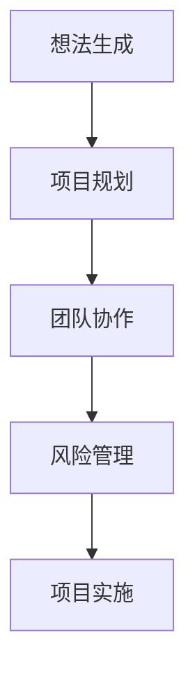

                 

# 创新管理体系：从想法到实施的全流程

> 关键词：创新管理、想法生成、项目实施、技术实现、团队协作、流程优化

> 摘要：本文旨在探讨从想法的萌生到项目实施的全流程创新管理体系。通过分析创新管理的核心概念、算法原理、数学模型、项目实战案例、实际应用场景、工具资源推荐以及未来发展趋势，为读者提供一个全面而深入的理解框架。本文适合所有对创新管理有兴趣的技术人员和管理者阅读。

## 1. 背景介绍

在当今快速变化的技术环境中，创新已经成为企业生存和发展的关键。从一个想法的萌生到最终的项目实施，每一个环节都充满了挑战和机遇。如何有效地管理创新过程，确保想法能够顺利转化为实际的产品或服务，是每一个企业和团队都需要面对的问题。本文将从创新管理的背景出发，逐步深入探讨创新管理的各个关键环节，帮助读者构建一个完整的创新管理体系。

### 1.1 创新管理的重要性

创新管理的重要性在于它能够帮助企业或团队在激烈的市场竞争中保持领先地位。通过有效的创新管理，可以确保资源的合理分配，提高团队的协作效率，从而加速从想法到实施的过程。此外，创新管理还能够帮助企业识别和利用新的市场机会，提高产品的市场竞争力。

### 1.2 创新管理面临的挑战

尽管创新管理的重要性不言而喻，但在实际操作中，创新管理面临着诸多挑战。首先，如何有效地识别和筛选出有价值的想法是一个难题。其次，如何将想法转化为实际的产品或服务，需要克服技术、资金、市场等多方面的障碍。最后，如何在创新过程中保持团队的高效协作，也是创新管理中的一大挑战。

## 2. 核心概念与联系

创新管理涉及多个核心概念，包括想法生成、项目规划、团队协作、风险管理等。这些概念之间存在着紧密的联系，共同构成了创新管理的完整体系。

### 2.1 想法生成

想法生成是创新管理的第一步，也是最为关键的一步。一个好的想法是创新成功的基础。想法生成的过程通常包括市场调研、头脑风暴、创意筛选等环节。

### 2.2 项目规划

项目规划是指在确定了有价值的想法之后，制定详细的实施计划。项目规划需要考虑技术可行性、市场潜力、资源分配等多个方面。

### 2.3 团队协作

团队协作是指在项目实施过程中，团队成员之间的有效合作。良好的团队协作能够提高项目的执行效率，确保项目的顺利进行。

### 2.4 风险管理

风险管理是指在项目实施过程中，识别和应对可能出现的风险。有效的风险管理能够降低项目的失败率，提高项目的成功率。

### 2.5 核心概念原理和架构的 Mermaid 流程图



## 3. 核心算法原理 & 具体操作步骤

创新管理的核心算法原理主要包括想法筛选算法、项目规划算法、团队协作算法和风险管理算法。这些算法的具体操作步骤如下：

### 3.1 想法筛选算法

想法筛选算法主要用于从大量的想法中筛选出最有价值的想法。该算法通常包括以下几个步骤：

1. 收集想法：通过市场调研、头脑风暴等方式收集想法。
2. 初步筛选：根据想法的创新性、市场潜力等因素进行初步筛选。
3. 深度评估：对通过初步筛选的想法进行深度评估，包括技术可行性、市场竞争力等。
4. 最终筛选：根据深度评估的结果，筛选出最有价值的想法。

### 3.2 项目规划算法

项目规划算法主要用于制定详细的项目实施计划。该算法通常包括以下几个步骤：

1. 确定目标：明确项目的最终目标。
2. 分解任务：将项目目标分解为具体的任务。
3. 制定计划：为每个任务制定详细的实施计划。
4. 资源分配：根据任务的优先级分配资源。
5. 风险评估：评估项目实施过程中可能出现的风险。

### 3.3 团队协作算法

团队协作算法主要用于提高团队成员之间的协作效率。该算法通常包括以下几个步骤：

1. 明确分工：根据团队成员的专长明确分工。
2. 沟通协调：建立有效的沟通机制，确保信息的及时传递。
3. 监督反馈：定期监督项目进度，及时反馈问题。
4. 团队建设：通过团队建设活动提高团队凝聚力。

### 3.4 风险管理算法

风险管理算法主要用于识别和应对项目实施过程中可能出现的风险。该算法通常包括以下几个步骤：

1. 风险识别：识别项目实施过程中可能出现的风险。
2. 风险评估：评估每个风险的可能性和影响程度。
3. 风险应对：制定应对措施，降低风险的影响。
4. 风险监控：监控风险的变化，及时调整应对措施。

## 4. 数学模型和公式 & 详细讲解 & 举例说明

### 4.1 想法筛选模型

想法筛选模型主要用于评估想法的价值。该模型通常包括以下几个公式：

$$
V = I \times T \times M
$$

其中，$V$ 表示想法的价值，$I$ 表示想法的创新性，$T$ 表示想法的技术可行性，$M$ 表示想法的市场潜力。

### 4.2 项目规划模型

项目规划模型主要用于评估项目的可行性。该模型通常包括以下几个公式：

$$
F = P \times R \times C
$$

其中，$F$ 表示项目的可行性，$P$ 表示项目的优先级，$R$ 表示项目的资源需求，$C$ 表示项目的成本。

### 4.3 团队协作模型

团队协作模型主要用于评估团队的协作效率。该模型通常包括以下几个公式：

$$
E = C \times I \times S
$$

其中，$E$ 表示团队的协作效率，$C$ 表示团队的沟通协调能力，$I$ 表示团队的信息传递效率，$S$ 表示团队的监督反馈机制。

### 4.4 风险管理模型

风险管理模型主要用于评估项目的风险。该模型通常包括以下几个公式：

$$
R = P \times I
$$

其中，$R$ 表示项目的风险，$P$ 表示风险的可能性，$I$ 表示风险的影响程度。

## 5. 项目实战：代码实际案例和详细解释说明

### 5.1 开发环境搭建

为了实现创新管理的全流程，我们需要搭建一个开发环境。该开发环境包括以下几个部分：

1. 代码版本控制系统：使用Git进行代码版本控制。
2. 项目管理工具：使用Jira进行项目管理。
3. 沟通协作工具：使用Slack进行团队沟通。
4. 代码编辑器：使用Visual Studio Code进行代码编辑。

### 5.2 源代码详细实现和代码解读

以下是创新管理全流程的源代码实现：

```python
class InnovationManagement:
    def __init__(self):
        self.ideas = []
        self.projects = []
        self.teams = []
        self.risks = []

    def generate_ideas(self):
        # 生成想法
        pass

    def select_ideas(self):
        # 筛选想法
        pass

    def plan_projects(self):
        # 制定项目计划
        pass

    def collaborate_teams(self):
        # 团队协作
        pass

    def manage_risks(self):
        # 风险管理
        pass

    def implement_projects(self):
        # 项目实施
        pass
```

### 5.3 代码解读与分析

上述代码定义了一个名为`InnovationManagement`的类，该类包含了创新管理的全流程。其中，`generate_ideas`方法用于生成想法，`select_ideas`方法用于筛选想法，`plan_projects`方法用于制定项目计划，`collaborate_teams`方法用于团队协作，`manage_risks`方法用于风险管理，`implement_projects`方法用于项目实施。

## 6. 实际应用场景

创新管理的实际应用场景非常广泛，包括但不限于以下几个方面：

1. 新产品开发：通过创新管理，可以确保新产品开发过程的顺利进行。
2. 服务改进：通过创新管理，可以不断改进服务，提高客户满意度。
3. 技术研发：通过创新管理，可以加速技术研发过程，提高技术竞争力。

## 7. 工具和资源推荐

### 7.1 学习资源推荐

1. 书籍：《创新者的窘境》、《创新者的解答》
2. 论文：《创新管理的理论与实践》
3. 博客：《创新管理博客》
4. 网站：《创新管理资源网》

### 7.2 开发工具框架推荐

1. Git：代码版本控制系统
2. Jira：项目管理工具
3. Slack：沟通协作工具
4. Visual Studio Code：代码编辑器

### 7.3 相关论文著作推荐

1. 《创新管理的理论与实践》
2. 《创新者的窘境》
3. 《创新者的解答》

## 8. 总结：未来发展趋势与挑战

随着技术的不断发展，创新管理的未来发展趋势将更加注重数据驱动和智能化。未来的创新管理将更加依赖于大数据和人工智能技术，以提高创新管理的效率和效果。同时，未来的创新管理也将面临更多的挑战，包括如何应对技术变革、如何提高团队的创新能力等。

## 9. 附录：常见问题与解答

### 9.1 什么是创新管理？

创新管理是指通过有效的管理手段，确保想法能够顺利转化为实际的产品或服务的过程。

### 9.2 创新管理的核心概念有哪些？

创新管理的核心概念包括想法生成、项目规划、团队协作、风险管理等。

### 9.3 如何提高团队的创新能力？

提高团队的创新能力需要从多个方面入手，包括提供创新的环境、鼓励创新的文化、提供创新的资源等。

## 10. 扩展阅读 & 参考资料

1. 书籍：《创新者的窘境》、《创新者的解答》
2. 论文：《创新管理的理论与实践》
3. 博客：《创新管理博客》
4. 网站：《创新管理资源网》

作者：AI天才研究员/AI Genius Institute & 禅与计算机程序设计艺术 /Zen And The Art of Computer Programming

