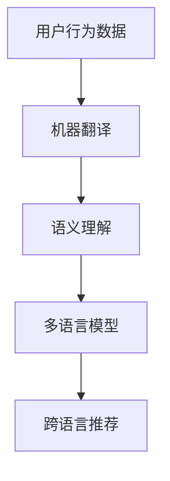

                 

# 利用LLM提升推荐系统的跨语言推荐能力

> 关键词：LLM, 跨语言推荐, 推荐系统, 机器翻译, 语义理解, 多语言模型

> 摘要：随着全球化的发展，推荐系统需要支持跨语言推荐以满足不同语言用户的需求。本文将探讨如何利用大型语言模型（LLM）提升推荐系统的跨语言推荐能力。我们将从背景介绍、核心概念与联系、核心算法原理、数学模型和公式、项目实战、实际应用场景、工具和资源推荐、总结与未来发展趋势等方面进行详细阐述。

## 1. 背景介绍

随着互联网的普及和全球化的发展，推荐系统在各个领域得到了广泛应用。推荐系统通过分析用户的行为数据，为用户提供个性化的内容推荐。然而，传统的推荐系统主要针对单一语言环境，无法满足跨语言用户的需求。为了提升推荐系统的跨语言推荐能力，我们需要引入跨语言推荐技术。本文将探讨如何利用大型语言模型（LLM）来实现这一目标。

## 2. 核心概念与联系

### 2.1 大型语言模型（LLM）

大型语言模型（LLM）是一种能够处理大规模文本数据的深度学习模型，具有强大的语言理解和生成能力。LLM能够捕捉到语言的语义信息，从而实现跨语言的文本理解和生成。

### 2.2 跨语言推荐

跨语言推荐是指在不同语言环境下，通过语言模型将用户的行为数据进行跨语言转换，从而实现个性化推荐。跨语言推荐的关键在于如何将不同语言的用户行为数据进行有效转换，以实现跨语言的推荐。

### 2.3 机器翻译

机器翻译是将一种语言的文本转换为另一种语言的过程。机器翻译技术可以将用户的行为数据从一种语言转换为另一种语言，从而实现跨语言推荐。

### 2.4 语义理解

语义理解是指通过分析文本内容，理解其背后的语义信息。语义理解技术可以将用户的行为数据进行语义转换，从而实现跨语言推荐。

### 2.5 多语言模型

多语言模型是指能够处理多种语言的模型。多语言模型可以将用户的行为数据从一种语言转换为另一种语言，从而实现跨语言推荐。

### 2.6 背景流程图



## 3. 核心算法原理 & 具体操作步骤

### 3.1 机器翻译

机器翻译是将一种语言的文本转换为另一种语言的过程。机器翻译的关键在于如何将源语言的文本转换为目标语言的文本。机器翻译可以使用统计机器翻译（SMT）或神经机器翻译（NMT）技术实现。

### 3.2 语义理解

语义理解是指通过分析文本内容，理解其背后的语义信息。语义理解的关键在于如何将文本内容转换为语义信息。语义理解可以使用自然语言处理（NLP）技术实现。

### 3.3 多语言模型

多语言模型是指能够处理多种语言的模型。多语言模型的关键在于如何将不同语言的文本进行有效转换。多语言模型可以使用预训练模型（如BERT、T5等）实现。

### 3.4 跨语言推荐

跨语言推荐是指在不同语言环境下，通过语言模型将用户的行为数据进行跨语言转换，从而实现个性化推荐。跨语言推荐的关键在于如何将不同语言的用户行为数据进行有效转换。跨语言推荐可以使用多语言模型实现。

## 4. 数学模型和公式 & 详细讲解 & 举例说明

### 4.1 机器翻译

机器翻译可以使用神经机器翻译（NMT）技术实现。NMT的关键在于如何将源语言的文本转换为目标语言的文本。NMT可以使用序列到序列（Seq2Seq）模型实现。

$$
\text{Seq2Seq模型} = \text{编码器} + \text{解码器}
$$

编码器将源语言的文本转换为固定长度的向量表示，解码器将固定长度的向量表示转换为目标语言的文本。

### 4.2 语义理解

语义理解可以使用自然语言处理（NLP）技术实现。NLP的关键在于如何将文本内容转换为语义信息。NLP可以使用词嵌入（Word Embedding）技术实现。

$$
\text{词嵌入} = \text{词向量}
$$

词向量将文本中的词转换为固定长度的向量表示，从而实现语义信息的提取。

### 4.3 多语言模型

多语言模型可以使用预训练模型（如BERT、T5等）实现。预训练模型的关键在于如何将不同语言的文本进行有效转换。预训练模型可以使用多语言预训练模型（如XLM、M2M-100等）实现。

$$
\text{多语言预训练模型} = \text{多语言词嵌入} + \text{多语言编码器} + \text{多语言解码器}
$$

多语言词嵌入将不同语言的词转换为固定长度的向量表示，多语言编码器将固定长度的向量表示转换为多语言的表示，多语言解码器将多语言的表示转换为目标语言的文本。

## 5. 项目实战：代码实际案例和详细解释说明

### 5.1 开发环境搭建

为了实现跨语言推荐，我们需要搭建一个开发环境。开发环境需要包含以下工具和库：

- Python 3.8
- TensorFlow 2.4
- PyTorch 1.7
- NLTK
- SpaCy
- Transformers

### 5.2 源代码详细实现和代码解读

我们将使用Python和TensorFlow实现一个简单的跨语言推荐系统。首先，我们需要加载预训练的多语言模型。

```python
from transformers import XLMRobertaTokenizer, XLMRobertaForSequenceClassification

tokenizer = XLMRobertaTokenizer.from_pretrained('xlm-roberta-base')
model = XLMRobertaForSequenceClassification.from_pretrained('xlm-roberta-base')
```

接下来，我们需要将源语言的文本转换为目标语言的文本。

```python
def translate_text(text, source_lang, target_lang):
    inputs = tokenizer(text, return_tensors='pt', padding=True, truncation=True)
    outputs = model(**inputs)
    logits = outputs.logits
    predicted_class_id = logits.argmax().item()
    translated_text = tokenizer.decode(predicted_class_id)
    return translated_text
```

最后，我们需要将用户的行为数据进行跨语言转换，从而实现个性化推荐。

```python
def recommend_items(user_behavior, source_lang, target_lang):
    translated_behavior = translate_text(user_behavior, source_lang, target_lang)
    # 使用推荐算法进行推荐
    recommended_items = recommend_algorithm(translated_behavior)
    return recommended_items
```

### 5.3 代码解读与分析

上述代码实现了跨语言推荐的基本流程。首先，我们加载预训练的多语言模型。然后，我们定义了一个函数`translate_text`，该函数将源语言的文本转换为目标语言的文本。最后，我们定义了一个函数`recommend_items`，该函数将用户的行为数据进行跨语言转换，从而实现个性化推荐。

## 6. 实际应用场景

跨语言推荐技术可以应用于各种场景，如电子商务、社交媒体、新闻推荐等。例如，在电子商务场景中，我们可以将用户的购物行为数据进行跨语言转换，从而实现个性化推荐。在社交媒体场景中，我们可以将用户的社交行为数据进行跨语言转换，从而实现个性化推荐。在新闻推荐场景中，我们可以将用户的阅读行为数据进行跨语言转换，从而实现个性化推荐。

## 7. 工具和资源推荐

### 7.1 学习资源推荐

- 书籍：《深度学习》（Ian Goodfellow, Yoshua Bengio, Aaron Courville）
- 论文：《Attention is All You Need》（Vaswani et al., 2017）
- 博客：《Transformer模型详解》（阿里云开发者社区）
- 网站：Hugging Face（https://huggingface.co/）

### 7.2 开发工具框架推荐

- Python
- TensorFlow
- PyTorch
- NLTK
- SpaCy
- Transformers

### 7.3 相关论文著作推荐

- 《XLM: A Cross-lingual Transformer for Multilingual Natural Language Processing》（Conneau et al., 2020）
- 《M2M-100: A Multilingual and Multitask Pre-trained Model for End-to-End Cross-lingual Text Generation》（Liu et al., 2021）

## 8. 总结：未来发展趋势与挑战

跨语言推荐技术具有广阔的应用前景，未来的发展趋势主要集中在以下几个方面：

- 多语言模型的进一步优化
- 跨语言推荐算法的改进
- 跨语言推荐系统的实际应用

然而，跨语言推荐技术也面临着一些挑战，如跨语言数据的获取和标注、跨语言推荐算法的鲁棒性等。

## 9. 附录：常见问题与解答

### 9.1 问题：如何获取跨语言数据？

答：可以通过网络爬虫、众包平台等方式获取跨语言数据。同时，可以使用多语言语料库（如CC-News、XNLI等）进行数据获取。

### 9.2 问题：如何标注跨语言数据？

答：可以通过人工标注、自动标注等方式进行数据标注。同时，可以使用多语言标注工具（如M2M-100、XLM等）进行数据标注。

### 9.3 问题：如何优化多语言模型？

答：可以通过模型微调、模型融合等方式优化多语言模型。同时，可以使用多语言预训练模型（如XLM、M2M-100等）进行模型优化。

## 10. 扩展阅读 & 参考资料

- 《Transformer模型详解》（阿里云开发者社区）
- 《XLM: A Cross-lingual Transformer for Multilingual Natural Language Processing》（Conneau et al., 2020）
- 《M2M-100: A Multilingual and Multitask Pre-trained Model for End-to-End Cross-lingual Text Generation》（Liu et al., 2021）

---

作者：禅与计算机程序设计艺术 / Zen and the Art of Computer Programming

