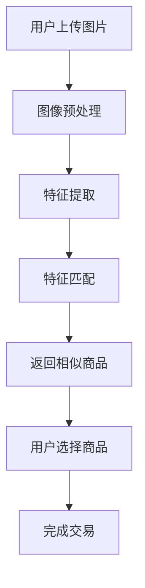

                 

# 图像搜索如何改变电商体验

> 关键词：图像搜索, 电商体验, 机器学习, 深度学习, 图像识别, 用户行为分析, 个性化推荐

> 摘要：本文将深入探讨图像搜索技术如何在电商领域中改变用户体验。通过分析图像搜索的核心概念、算法原理、实际应用案例，以及未来的发展趋势，我们将揭示图像搜索技术在电商中的巨大潜力。本文不仅为技术爱好者提供了详细的理论基础和实践指导，也为电商从业者提供了宝贵的见解和建议。

## 1. 背景介绍

随着互联网技术的飞速发展，电子商务已成为人们日常生活中不可或缺的一部分。为了提升用户体验，电商企业不断探索新的技术手段。图像搜索作为一种新兴的技术，正逐渐改变着电商行业的面貌。通过图像搜索，用户可以更直观地找到自己想要的商品，极大地提升了购物体验。本文将从技术角度出发，探讨图像搜索如何在电商领域中发挥作用。

## 2. 核心概念与联系

### 2.1 图像搜索概述

图像搜索是指通过图像识别技术，将用户上传的图片与数据库中的商品图片进行匹配，从而实现快速查找和推荐商品的功能。图像搜索技术的核心在于图像识别和匹配算法，这些算法能够从海量的商品图片中准确地识别出与用户上传图片相似的商品。

### 2.2 图像识别技术

图像识别技术是图像搜索的基础，它通过计算机视觉技术对图像进行分析和理解，提取出图像中的关键特征。图像识别技术主要包括以下几个步骤：

- **图像预处理**：包括图像去噪、灰度化、尺度归一化等操作，以提高识别的准确性。
- **特征提取**：通过卷积神经网络（CNN）等方法提取图像中的关键特征。
- **特征匹配**：将提取的特征与数据库中的特征进行匹配，找到最相似的商品。

### 2.3 图像匹配算法

图像匹配算法是图像搜索的关键，它决定了图像搜索的准确性和效率。常见的图像匹配算法包括：

- **基于特征点匹配**：通过检测图像中的关键点（如SIFT、SURF等），然后计算这些关键点之间的距离，找到最相似的商品。
- **基于深度学习的匹配**：通过训练深度神经网络模型，学习图像之间的相似性，从而实现高效的图像匹配。

### 2.4 图像搜索流程图

为了更好地理解图像搜索的流程，我们使用Mermaid流程图来表示：



## 3. 核心算法原理 & 具体操作步骤

### 3.1 图像预处理

图像预处理是图像搜索的第一步，其目的是提高图像识别的准确性。具体操作步骤如下：

1. **去噪**：通过滤波器去除图像中的噪声，提高图像质量。
2. **灰度化**：将彩色图像转换为灰度图像，减少计算量。
3. **尺度归一化**：将图像调整到统一的尺寸，便于后续处理。

### 3.2 特征提取

特征提取是图像搜索的关键步骤，其目的是从图像中提取出关键特征。具体操作步骤如下：

1. **卷积神经网络（CNN）**：通过多层卷积和池化操作，提取图像中的关键特征。
2. **特征向量**：将提取的特征转换为特征向量，便于后续匹配。

### 3.3 特征匹配

特征匹配是图像搜索的核心步骤，其目的是找到与用户上传图片最相似的商品。具体操作步骤如下：

1. **特征距离计算**：通过计算特征向量之间的距离，找到最相似的商品。
2. **相似度计算**：通过计算特征向量之间的相似度，找到最相似的商品。

### 3.4 实际操作步骤

1. **用户上传图片**：用户通过上传图片的方式，向系统提交商品查询请求。
2. **图像预处理**：对用户上传的图片进行预处理，提高图像质量。
3. **特征提取**：通过卷积神经网络提取图像中的关键特征。
4. **特征匹配**：通过计算特征向量之间的距离或相似度，找到最相似的商品。
5. **返回结果**：将匹配结果返回给用户，供用户选择。

## 4. 数学模型和公式 & 详细讲解 & 举例说明

### 4.1 特征距离计算

特征距离计算是特征匹配的关键步骤，常用的特征距离计算方法包括欧氏距离和余弦相似度。

- **欧氏距离**：用于衡量两个向量之间的距离，公式如下：

  $$ d(\mathbf{x}, \mathbf{y}) = \sqrt{\sum_{i=1}^{n} (x_i - y_i)^2} $$

- **余弦相似度**：用于衡量两个向量之间的夹角余弦值，公式如下：

  $$ \text{cosine}(\mathbf{x}, \mathbf{y}) = \frac{\mathbf{x} \cdot \mathbf{y}}{\|\mathbf{x}\| \|\mathbf{y}\|} $$

### 4.2 特征向量相似度计算

特征向量相似度计算是特征匹配的关键步骤，常用的特征向量相似度计算方法包括欧氏距离和余弦相似度。

- **欧氏距离**：用于衡量两个向量之间的距离，公式如下：

  $$ d(\mathbf{x}, \mathbf{y}) = \sqrt{\sum_{i=1}^{n} (x_i - y_i)^2} $$

- **余弦相似度**：用于衡量两个向量之间的夹角余弦值，公式如下：

  $$ \text{cosine}(\mathbf{x}, \mathbf{y}) = \frac{\mathbf{x} \cdot \mathbf{y}}{\|\mathbf{x}\| \|\mathbf{y}\|} $$

### 4.3 举例说明

假设我们有两个特征向量 $\mathbf{x} = [1, 2, 3]$ 和 $\mathbf{y} = [4, 5, 6]$，我们可以通过欧氏距离和余弦相似度来计算它们之间的相似度。

- **欧氏距离**：

  $$ d(\mathbf{x}, \mathbf{y}) = \sqrt{(1-4)^2 + (2-5)^2 + (3-6)^2} = \sqrt{27} \approx 5.196 $$

- **余弦相似度**：

  $$ \text{cosine}(\mathbf{x}, \mathbf{y}) = \frac{1 \cdot 4 + 2 \cdot 5 + 3 \cdot 6}{\sqrt{1^2 + 2^2 + 3^2} \cdot \sqrt{4^2 + 5^2 + 6^2}} = \frac{32}{\sqrt{14} \cdot \sqrt{77}} \approx 0.974 $$

## 5. 项目实战：代码实际案例和详细解释说明

### 5.1 开发环境搭建

为了实现图像搜索功能，我们需要搭建一个开发环境。具体步骤如下：

1. **安装Python**：确保安装了Python 3.7及以上版本。
2. **安装依赖库**：安装必要的Python库，如Pillow、OpenCV、TensorFlow等。
3. **配置环境变量**：配置Python环境变量，确保能够正常运行代码。

### 5.2 源代码详细实现和代码解读

以下是一个简单的图像搜索代码示例，使用了卷积神经网络（CNN）进行特征提取和匹配。

```python
import cv2
import numpy as np
from tensorflow.keras.models import load_model

# 加载预训练的卷积神经网络模型
model = load_model('cnn_model.h5')

# 图像预处理
def preprocess_image(image_path):
    image = cv2.imread(image_path)
    image = cv2.cvtColor(image, cv2.COLOR_BGR2GRAY)
    image = cv2.resize(image, (224, 224))
    image = image.astype('float32') / 255.0
    image = np.expand_dims(image, axis=(0, -1))
    return image

# 特征提取
def extract_features(image):
    features = model.predict(image)
    return features

# 特征匹配
def match_features(query_features, database_features):
    distances = np.linalg.norm(query_features - database_features, axis=1)
    return np.argmin(distances)

# 主函数
def main():
    query_image_path = 'query_image.jpg'
    database_image_paths = ['database_image1.jpg', 'database_image2.jpg', 'database_image3.jpg']
    
    query_image = preprocess_image(query_image_path)
    query_features = extract_features(query_image)
    
    database_features = []
    for image_path in database_image_paths:
        database_image = preprocess_image(image_path)
        database_features.append(extract_features(database_image))
    
    best_match_index = match_features(query_features, np.array(database_features))
    print(f'Best match: {database_image_paths[best_match_index]}')

if __name__ == '__main__':
    main()
```

### 5.3 代码解读与分析

1. **加载预训练的卷积神经网络模型**：使用`load_model`函数加载预训练的CNN模型。
2. **图像预处理**：将用户上传的图片进行灰度化、尺度归一化等操作。
3. **特征提取**：通过CNN模型提取图像的特征。
4. **特征匹配**：通过计算特征向量之间的距离，找到最相似的商品。

## 6. 实际应用场景

图像搜索技术在电商领域的应用非常广泛，具体应用场景包括：

1. **商品搜索**：用户可以通过上传图片的方式，快速找到与图片相似的商品。
2. **个性化推荐**：通过分析用户的购物行为，为用户推荐相似的商品。
3. **商品分类**：通过图像识别技术，自动对商品进行分类，提高商品管理的效率。
4. **用户行为分析**：通过分析用户的购物行为，了解用户的购物偏好，提高用户体验。

## 7. 工具和资源推荐

### 7.1 学习资源推荐

1. **书籍**：《计算机视觉：算法与应用》（Computer Vision: Algorithms and Applications）
2. **论文**：《深度学习在图像识别中的应用》（Application of Deep Learning in Image Recognition）
3. **博客**：阿里云开发者社区（https://dev.aliyun.com/）
4. **网站**：GitHub（https://github.com/）

### 7.2 开发工具框架推荐

1. **Python库**：Pillow、OpenCV、TensorFlow
2. **开发框架**：Keras、PyTorch

### 7.3 相关论文著作推荐

1. **论文**：《基于深度学习的图像搜索技术研究》（Research on Image Search Technology Based on Deep Learning）
2. **著作**：《计算机视觉与模式识别》（Computer Vision and Pattern Recognition）

## 8. 总结：未来发展趋势与挑战

图像搜索技术在电商领域的应用前景广阔，未来的发展趋势主要包括：

1. **更准确的图像识别**：通过改进深度学习模型，提高图像识别的准确性。
2. **更高效的特征提取**：通过优化特征提取算法，提高特征提取的效率。
3. **更个性化的推荐**：通过分析用户的购物行为，为用户推荐更个性化的商品。

然而，图像搜索技术也面临着一些挑战，主要包括：

1. **数据隐私问题**：如何保护用户的隐私，避免数据泄露。
2. **计算资源消耗**：如何降低计算资源的消耗，提高系统的运行效率。
3. **算法鲁棒性**：如何提高算法的鲁棒性，应对各种复杂的情况。

## 9. 附录：常见问题与解答

### 9.1 问题1：如何提高图像识别的准确性？

**解答**：可以通过改进深度学习模型，增加训练数据量，优化特征提取算法等方式提高图像识别的准确性。

### 9.2 问题2：如何降低计算资源的消耗？

**解答**：可以通过优化算法，使用更高效的计算框架，减少不必要的计算等方式降低计算资源的消耗。

### 9.3 问题3：如何保护用户的隐私？

**解答**：可以通过加密技术，匿名化处理等方式保护用户的隐私。

## 10. 扩展阅读 & 参考资料

1. **书籍**：《计算机视觉：算法与应用》（Computer Vision: Algorithms and Applications）
2. **论文**：《深度学习在图像识别中的应用》（Application of Deep Learning in Image Recognition）
3. **博客**：阿里云开发者社区（https://dev.aliyun.com/）
4. **网站**：GitHub（https://github.com/）

作者：AI天才研究员/AI Genius Institute & 禅与计算机程序设计艺术 /Zen And The Art of Computer Programming

