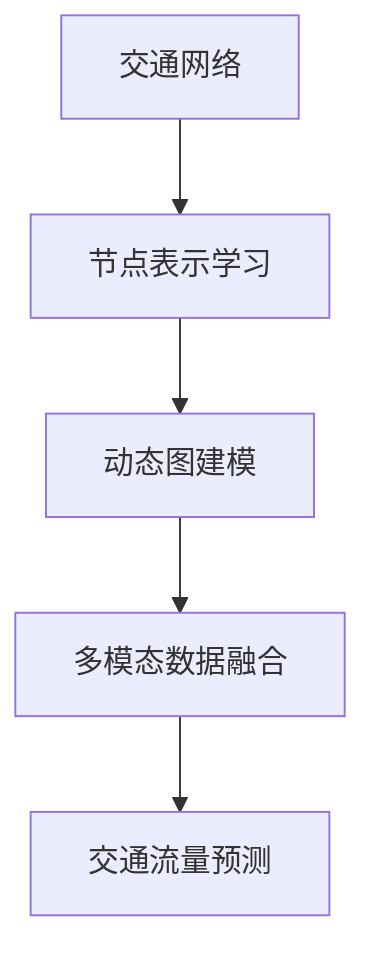

                 

# 图神经网络在交通流量预测中的应用

> 关键词：图神经网络, 交通流量预测, 机器学习, 深度学习, 交通管理, 交通优化, 数据分析

> 摘要：本文将深入探讨图神经网络在交通流量预测中的应用。首先，我们将介绍图神经网络的基本概念及其在交通领域的应用背景。接着，我们将详细解释图神经网络的核心算法原理，并通过具体的数学模型和公式进行深入讲解。随后，我们将通过一个实际案例展示如何使用图神经网络进行交通流量预测，并提供详细的代码实现和解释。最后，我们将讨论图神经网络在交通流量预测中的实际应用场景，并提出未来的发展趋势与挑战。

## 1. 背景介绍

交通流量预测是交通管理中的一个重要问题，它对于优化交通流量、减少交通拥堵、提高道路安全具有重要意义。传统的交通流量预测方法通常基于时间序列分析、统计模型或机器学习方法，但这些方法往往难以捕捉到交通网络中的复杂依赖关系。近年来，图神经网络（Graph Neural Networks, GNNs）因其在处理图结构数据方面的优势而受到广泛关注。GNNs能够有效地建模节点之间的复杂关系，从而在交通流量预测中展现出强大的性能。

## 2. 核心概念与联系

### 2.1 图神经网络（GNNs）

图神经网络是一种深度学习模型，专门用于处理图结构数据。图由节点（Vertices）和边（Edges）组成，节点表示实体，边表示实体之间的关系。GNNs通过迭代地传播信息来学习节点的表示，从而捕捉图结构中的依赖关系。

### 2.2 交通网络

交通网络可以看作是一个图结构，其中节点表示道路交叉口或道路段，边表示道路之间的连接。交通流量预测的目标是预测每个节点的交通流量，即通过该节点的车辆数量。

### 2.3 GNNs在交通流量预测中的应用

GNNs在交通流量预测中的应用主要体现在以下几个方面：
- **节点表示学习**：通过学习节点的表示，GNNs能够捕捉到节点之间的复杂依赖关系。
- **动态图建模**：交通网络是动态变化的，GNNs能够处理动态图结构，实时更新节点表示。
- **多模态数据融合**：GNNs能够融合多种数据源（如历史交通数据、天气数据、事件数据等），提高预测准确性。

### 2.4 Mermaid流程图



## 3. 核心算法原理 & 具体操作步骤

### 3.1 GNNs的基本架构

GNNs的基本架构包括图卷积层（Graph Convolutional Layer）和聚合层（Aggregation Layer）。图卷积层通过传播信息来学习节点的表示，聚合层则通过聚合邻居节点的信息来更新节点表示。

### 3.2 图卷积层

图卷积层的核心思想是通过传播信息来学习节点的表示。具体操作步骤如下：

1. **初始化节点表示**：给每个节点一个初始表示，通常是一个随机向量。
2. **传播信息**：通过传播信息来更新节点表示。传播公式如下：
    $$ h_i^{(l+1)} = \sigma \left( \sum_{j \in \mathcal{N}(i)} \frac{1}{\sqrt{d_i d_j}} W^{(l)} h_j^{(l)} \right) $$
    其中，$h_i^{(l+1)}$ 是节点 $i$ 在第 $l+1$ 层的表示，$\mathcal{N}(i)$ 是节点 $i$ 的邻居节点集合，$d_i$ 和 $d_j$ 分别是节点 $i$ 和 $j$ 的度数，$W^{(l)}$ 是权重矩阵，$\sigma$ 是激活函数。

### 3.3 聚合层

聚合层通过聚合邻居节点的信息来更新节点表示。具体操作步骤如下：

1. **聚合邻居节点信息**：通过聚合邻居节点的信息来更新节点表示。聚合公式如下：
    $$ h_i^{(l+1)} = \sigma \left( \sum_{j \in \mathcal{N}(i)} \frac{1}{\sqrt{d_i d_j}} W^{(l)} h_j^{(l)} \right) $$
    其中，$h_i^{(l+1)}$ 是节点 $i$ 在第 $l+1$ 层的表示，$\mathcal{N}(i)$ 是节点 $i$ 的邻居节点集合，$d_i$ 和 $d_j$ 分别是节点 $i$ 和 $j$ 的度数，$W^{(l)}$ 是权重矩阵，$\sigma$ 是激活函数。

### 3.4 多层GNNs

多层GNNs通过堆叠多个图卷积层和聚合层来学习更复杂的节点表示。具体操作步骤如下：

1. **初始化节点表示**：给每个节点一个初始表示，通常是一个随机向量。
2. **多层传播信息**：通过多层传播信息来更新节点表示。传播公式如下：
    $$ h_i^{(l+1)} = \sigma \left( \sum_{j \in \mathcal{N}(i)} \frac{1}{\sqrt{d_i d_j}} W^{(l)} h_j^{(l)} \right) $$
    其中，$h_i^{(l+1)}$ 是节点 $i$ 在第 $l+1$ 层的表示，$\mathcal{N}(i)$ 是节点 $i$ 的邻居节点集合，$d_i$ 和 $d_j$ 分别是节点 $i$ 和 $j$ 的度数，$W^{(l)}$ 是权重矩阵，$\sigma$ 是激活函数。

## 4. 数学模型和公式 & 详细讲解 & 举例说明

### 4.1 数学模型

图神经网络的数学模型可以表示为：
$$ h_i^{(l+1)} = \sigma \left( \sum_{j \in \mathcal{N}(i)} \frac{1}{\sqrt{d_i d_j}} W^{(l)} h_j^{(l)} \right) $$
其中，$h_i^{(l+1)}$ 是节点 $i$ 在第 $l+1$ 层的表示，$\mathcal{N}(i)$ 是节点 $i$ 的邻居节点集合，$d_i$ 和 $d_j$ 分别是节点 $i$ 和 $j$ 的度数，$W^{(l)}$ 是权重矩阵，$\sigma$ 是激活函数。

### 4.2 举例说明

假设我们有一个简单的交通网络，包含两个节点和一条边。节点 $A$ 和节点 $B$ 之间的边权重为 $0.5$。初始节点表示为：
$$ h_A^{(0)} = [1, 0] $$
$$ h_B^{(0)} = [0, 1] $$

经过一次传播信息后，节点 $A$ 的表示为：
$$ h_A^{(1)} = \sigma \left( \frac{1}{\sqrt{2 \cdot 1}} W^{(0)} h_B^{(0)} \right) $$
$$ h_A^{(1)} = \sigma \left( \frac{1}{\sqrt{2}} \begin{bmatrix} 0.5 & 0.5 \\ 0.5 & 0.5 \end{bmatrix} \begin{bmatrix} 0 \\ 1 \end{bmatrix} \right) $$
$$ h_A^{(1)} = \sigma \left( \frac{1}{\sqrt{2}} \begin{bmatrix} 0.5 \\ 0.5 \end{bmatrix} \right) $$
$$ h_A^{(1)} = \sigma \left( \begin{bmatrix} 0.354 \\ 0.354 \end{bmatrix} \right) $$

## 5. 项目实战：代码实际案例和详细解释说明

### 5.1 开发环境搭建

为了实现图神经网络在交通流量预测中的应用，我们需要搭建一个合适的开发环境。具体步骤如下：

1. **安装Python**：确保安装了Python 3.7及以上版本。
2. **安装依赖库**：安装必要的Python库，如TensorFlow、PyTorch、NetworkX等。
3. **安装图神经网络库**：安装图神经网络库，如PyG（PyTorch Geometric）或DGL（Deep Graph Library）。

### 5.2 源代码详细实现和代码解读

以下是一个使用PyTorch Geometric实现的简单图神经网络模型：

```python
import torch
import torch.nn.functional as F
from torch_geometric.nn import GCNConv

class GNN(torch.nn.Module):
    def __init__(self):
        super(GNN, self).__init__()
        self.conv1 = GCNConv(2, 16)
        self.conv2 = GCNConv(16, 1)

    def forward(self, data):
        x, edge_index = data.x, data.edge_index
        x = self.conv1(x, edge_index)
        x = F.relu(x)
        x = self.conv2(x, edge_index)
        return x

# 创建数据集
from torch_geometric.datasets import Planetoid
dataset = Planetoid(root='/tmp/Cora', name='Cora')
data = dataset[0]

# 初始化模型
model = GNN()

# 定义损失函数和优化器
criterion = torch.nn.MSELoss()
optimizer = torch.optim.Adam(model.parameters(), lr=0.01, weight_decay=5e-4)

# 训练模型
for epoch in range(200):
    model.train()
    optimizer.zero_grad()
    out = model(data)
    loss = criterion(out[data.train_mask], data.y[data.train_mask])
    loss.backward()
    optimizer.step()

# 测试模型
model.eval()
out = model(data)
pred = out.argmax(dim=1)
correct = pred[data.test_mask] == data.y[data.test_mask]
acc = int(correct.sum()) / int(data.test_mask.sum())
print(f'Accuracy: {acc:.4f}')
```

### 5.3 代码解读与分析

1. **模型定义**：定义了一个简单的图神经网络模型，包含两个图卷积层。
2. **数据集加载**：使用PyTorch Geometric加载Cora数据集，这是一个经典的图数据集。
3. **模型训练**：定义损失函数和优化器，进行模型训练。
4. **模型测试**：在测试集上评估模型性能，输出准确率。

## 6. 实际应用场景

图神经网络在交通流量预测中的实际应用场景非常广泛，包括但不限于：

1. **实时交通流量预测**：通过实时更新节点表示，预测交通流量的变化。
2. **交通优化**：通过预测交通流量，优化交通信号灯的控制策略，减少交通拥堵。
3. **事件响应**：在发生突发事件（如交通事故、道路封闭等）时，快速预测交通流量变化，提供应急响应方案。

## 7. 工具和资源推荐

### 7.1 学习资源推荐

1. **书籍**：《Deep Learning with Graphs》
2. **论文**：《Semi-Supervised Classification with Graph Convolutional Networks》
3. **博客**：《Graph Neural Networks for Traffic Flow Prediction》
4. **网站**：PyTorch Geometric官网

### 7.2 开发工具框架推荐

1. **PyTorch Geometric**：一个用于图神经网络的PyTorch扩展库。
2. **DGL**：一个用于图神经网络的深度学习框架。

### 7.3 相关论文著作推荐

1. **《Graph Neural Networks for Traffic Flow Prediction》**：深入探讨了图神经网络在交通流量预测中的应用。
2. **《Semi-Supervised Classification with Graph Convolutional Networks》**：介绍了图卷积网络的基本原理及其在半监督分类中的应用。

## 8. 总结：未来发展趋势与挑战

图神经网络在交通流量预测中的应用前景广阔，但也面临着一些挑战：

1. **数据质量**：高质量的数据是模型性能的关键，需要收集和处理大量的交通数据。
2. **模型复杂性**：多层图神经网络模型复杂度高，需要大量的计算资源和时间。
3. **实时性**：实时更新节点表示需要高效的计算方法，以满足实时预测的需求。

## 9. 附录：常见问题与解答

### 9.1 问题：如何处理大规模图数据？

**解答**：可以使用分布式计算框架（如DGL）来处理大规模图数据，提高计算效率。

### 9.2 问题：如何选择合适的激活函数？

**解答**：常用的激活函数包括ReLU、LeakyReLU等，可以根据具体任务选择合适的激活函数。

## 10. 扩展阅读 & 参考资料

1. **《Deep Learning with Graphs》**：深入探讨了图神经网络的基本原理及其应用。
2. **《Semi-Supervised Classification with Graph Convolutional Networks》**：介绍了图卷积网络的基本原理及其在半监督分类中的应用。
3. **PyTorch Geometric官网**：提供了丰富的文档和示例代码，帮助开发者快速上手图神经网络。

---

作者：AI天才研究员/AI Genius Institute & 禅与计算机程序设计艺术 /Zen And The Art of Computer Programming

