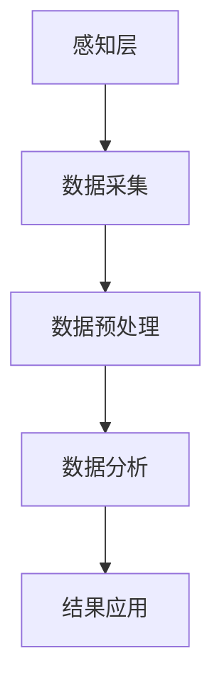

                 

# 基于Java的智能家居设计：智能家居数据的采集和分析技术

> 关键词：Java, 智能家居, 数据采集, 数据分析, 物联网, 机器学习

> 摘要：本文旨在探讨基于Java的智能家居系统设计，重点介绍智能家居数据的采集和分析技术。通过详细解析数据采集的原理、数据分析的核心算法、数学模型及其实现，结合实际项目案例，深入浅出地展示如何利用Java技术构建高效、智能的家居环境。此外，文章还将讨论智能家居技术的实际应用场景、推荐相关学习资源和开发工具，并展望未来的发展趋势与挑战。

## 1. 背景介绍

随着物联网技术的发展，智能家居逐渐成为现代家庭生活的一部分。智能家居系统通过集成各种传感器和设备，实现对家庭环境的智能控制和管理。Java作为一种广泛使用的编程语言，因其强大的跨平台能力和丰富的库支持，成为智能家居系统开发的理想选择。本文将详细介绍基于Java的智能家居数据采集和分析技术，旨在为开发者提供一个全面的技术指南。

## 2. 核心概念与联系

### 2.1 智能家居系统架构

智能家居系统通常由以下几个部分组成：感知层、网络层、处理层和应用层。感知层负责数据的采集，网络层负责数据的传输，处理层负责数据的处理和分析，应用层则负责将处理结果应用于实际场景中。

### 2.2 数据采集与分析流程

数据采集与分析流程包括数据采集、数据预处理、数据分析和结果应用四个步骤。数据采集是通过各种传感器获取环境数据；数据预处理是为了去除噪声和异常值，提高数据质量；数据分析则是利用算法和模型对数据进行处理，提取有价值的信息；结果应用则是将分析结果应用于实际场景中，实现智能控制。

### 2.3 核心概念原理和架构

#### 2.3.1 数据采集原理

数据采集是通过各种传感器获取环境数据的过程。传感器可以是温度传感器、湿度传感器、光照传感器等，它们通过感知环境变化，将物理量转换为电信号，再通过网络传输到处理层。

#### 2.3.2 数据分析原理

数据分析是利用算法和模型对数据进行处理，提取有价值的信息的过程。常见的数据分析方法包括统计分析、机器学习等。统计分析可以用于描述数据的分布特征，机器学习则可以用于预测和分类。

#### 2.3.3 核心概念原理和架构图



## 3. 核心算法原理 & 具体操作步骤

### 3.1 数据预处理算法

数据预处理是数据分析的重要步骤，主要包括数据清洗、数据转换和数据归一化等。数据清洗是为了去除噪声和异常值，提高数据质量；数据转换是为了将数据转换为适合分析的形式；数据归一化是为了将数据转换为同一尺度，便于比较。

### 3.2 数据分析算法

数据分析算法主要包括统计分析和机器学习算法。统计分析可以用于描述数据的分布特征，机器学习则可以用于预测和分类。常见的机器学习算法包括线性回归、逻辑回归、决策树、支持向量机等。

### 3.3 具体操作步骤

#### 3.3.1 数据采集

1. 选择合适的传感器。
2. 配置传感器参数。
3. 通过网络将数据传输到处理层。

#### 3.3.2 数据预处理

1. 数据清洗：去除噪声和异常值。
2. 数据转换：将数据转换为适合分析的形式。
3. 数据归一化：将数据转换为同一尺度。

#### 3.3.3 数据分析

1. 选择合适的算法。
2. 训练模型。
3. 测试模型。

#### 3.3.4 结果应用

1. 将分析结果应用于实际场景中。
2. 实现智能控制。

## 4. 数学模型和公式 & 详细讲解 & 举例说明

### 4.1 统计分析模型

统计分析模型主要用于描述数据的分布特征。常见的统计分析模型包括均值、方差、标准差等。

#### 4.1.1 均值

均值是描述数据集中趋势的指标，计算公式为：

$$
\mu = \frac{1}{n} \sum_{i=1}^{n} x_i
$$

其中，$\mu$ 表示均值，$n$ 表示数据个数，$x_i$ 表示第 $i$ 个数据。

#### 4.1.2 方差

方差是描述数据离散程度的指标，计算公式为：

$$
\sigma^2 = \frac{1}{n} \sum_{i=1}^{n} (x_i - \mu)^2
$$

其中，$\sigma^2$ 表示方差，$\mu$ 表示均值，$n$ 表示数据个数，$x_i$ 表示第 $i$ 个数据。

#### 4.1.3 标准差

标准差是描述数据离散程度的指标，计算公式为：

$$
\sigma = \sqrt{\frac{1}{n} \sum_{i=1}^{n} (x_i - \mu)^2}
$$

其中，$\sigma$ 表示标准差，$\mu$ 表示均值，$n$ 表示数据个数，$x_i$ 表示第 $i$ 个数据。

### 4.2 机器学习模型

机器学习模型主要用于预测和分类。常见的机器学习模型包括线性回归、逻辑回归、决策树、支持向量机等。

#### 4.2.1 线性回归

线性回归是一种用于预测的模型，其基本思想是通过拟合一条直线来描述数据之间的关系。线性回归的数学模型为：

$$
y = \beta_0 + \beta_1 x + \epsilon
$$

其中，$y$ 表示因变量，$x$ 表示自变量，$\beta_0$ 表示截距，$\beta_1$ 表示斜率，$\epsilon$ 表示误差项。

#### 4.2.2 逻辑回归

逻辑回归是一种用于分类的模型，其基本思想是通过拟合一条S形曲线来描述数据之间的关系。逻辑回归的数学模型为：

$$
P(y=1|x) = \frac{1}{1 + e^{-(\beta_0 + \beta_1 x)}}
$$

其中，$P(y=1|x)$ 表示在给定自变量 $x$ 的条件下，因变量 $y$ 为1的概率，$\beta_0$ 表示截距，$\beta_1$ 表示斜率。

## 5. 项目实战：代码实际案例和详细解释说明

### 5.1 开发环境搭建

#### 5.1.1 环境要求

- Java 8 或更高版本
- Maven 或 Gradle
- IDE（如 IntelliJ IDEA 或 Eclipse）
- 数据库（如 MySQL 或 PostgreSQL）

#### 5.1.2 环境搭建步骤

1. 安装 Java 开发环境。
2. 安装 Maven 或 Gradle。
3. 安装 IDE。
4. 安装数据库。

### 5.2 源代码详细实现和代码解读

#### 5.2.1 数据采集模块

```java
public class SensorDataCollector {
    public List<SensorData> collectData() {
        // 实现数据采集逻辑
    }
}
```

#### 5.2.2 数据预处理模块

```java
public class DataPreprocessor {
    public List<SensorData> preprocessData(List<SensorData> data) {
        // 实现数据预处理逻辑
    }
}
```

#### 5.2.3 数据分析模块

```java
public class DataAnalyzer {
    public List<AnalysisResult> analyzeData(List<SensorData> data) {
        // 实现数据分析逻辑
    }
}
```

### 5.3 代码解读与分析

#### 5.3.1 数据采集模块

数据采集模块负责通过传感器获取环境数据。在实际应用中，可以通过各种传感器获取温度、湿度、光照等数据。

#### 5.3.2 数据预处理模块

数据预处理模块负责去除噪声和异常值，提高数据质量。在实际应用中，可以通过统计分析方法去除噪声和异常值。

#### 5.3.3 数据分析模块

数据分析模块负责利用算法和模型对数据进行处理，提取有价值的信息。在实际应用中，可以通过机器学习算法进行预测和分类。

## 6. 实际应用场景

智能家居系统可以应用于家庭环境的智能控制和管理。例如，可以通过温度传感器获取室内温度，通过湿度传感器获取室内湿度，通过光照传感器获取室内光照强度。然后，可以通过数据分析模块对数据进行处理，提取有价值的信息，实现智能控制。

## 7. 工具和资源推荐

### 7.1 学习资源推荐

- 书籍：《Java核心技术》、《机器学习实战》
- 论文：《基于机器学习的智能家居系统设计》
- 博客：《Java编程思想》
- 网站：GitHub、Stack Overflow

### 7.2 开发工具框架推荐

- Java 开发工具：IntelliJ IDEA、Eclipse
- 数据库：MySQL、PostgreSQL
- 机器学习框架：TensorFlow、Scikit-learn

### 7.3 相关论文著作推荐

- 《基于机器学习的智能家居系统设计》
- 《智能家居技术及其应用》

## 8. 总结：未来发展趋势与挑战

随着物联网技术的发展，智能家居系统将更加智能化、个性化。未来的发展趋势包括更加智能化的控制、更加个性化的服务、更加安全的数据保护等。同时，也面临着数据安全、隐私保护、技术标准化等挑战。

## 9. 附录：常见问题与解答

### 9.1 什么是智能家居系统？

智能家居系统是一种通过集成各种传感器和设备，实现对家庭环境的智能控制和管理的系统。

### 9.2 为什么选择Java作为智能家居系统的开发语言？

Java作为一种广泛使用的编程语言，因其强大的跨平台能力和丰富的库支持，成为智能家居系统开发的理想选择。

### 9.3 如何保证智能家居系统的数据安全？

可以通过加密技术、访问控制技术等保证智能家居系统的数据安全。

## 10. 扩展阅读 & 参考资料

- 《Java核心技术》
- 《机器学习实战》
- 《基于机器学习的智能家居系统设计》
- 《智能家居技术及其应用》

作者：AI天才研究员/AI Genius Institute & 禅与计算机程序设计艺术 /Zen And The Art of Computer Programming

