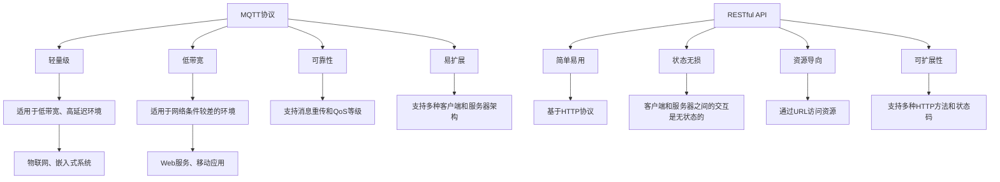
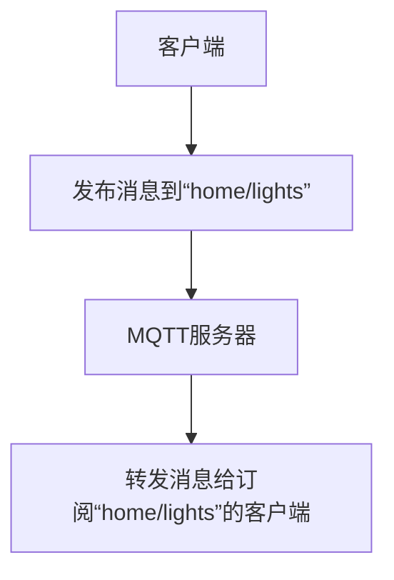
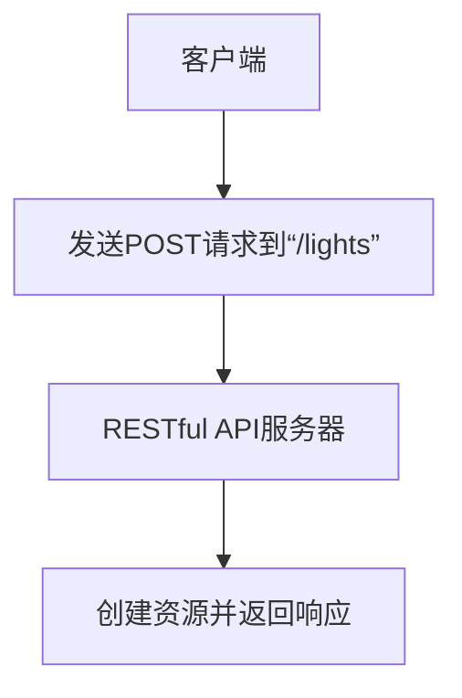

                 

# 基于MQTT协议和RESTful API的智能家居设备适配性分析

> 关键词：MQTT, RESTful API, 智能家居, 设备适配, 协议对比, 技术选型, 实战案例

> 摘要：本文将深入探讨基于MQTT协议和RESTful API的智能家居设备适配性分析。通过对比两种协议的特点，我们将分析它们在智能家居场景中的适用性，并通过实际案例展示如何实现设备适配。本文旨在为开发者提供一个全面的技术参考，帮助他们在智能家居领域做出明智的技术选择。

## 1. 背景介绍

随着物联网技术的快速发展，智能家居设备逐渐成为家庭生活的重要组成部分。为了实现设备间的互联互通，开发者需要选择合适的通信协议。MQTT（Message Queuing Telemetry Transport）和RESTful API是两种常用的协议，它们在智能家居领域各有优势和局限性。本文将从技术原理、应用场景、代码实现等方面进行深入分析，帮助读者更好地理解这两种协议的适配性。

## 2. 核心概念与联系

### 2.1 MQTT协议

MQTT是一种轻量级的消息协议，适用于低带宽、高延迟的网络环境。它基于发布/订阅模式，支持点对点和多对多的消息传递。MQTT协议的特点如下：

- **轻量级**：MQTT协议的报文格式简单，传输效率高。
- **低带宽**：适用于网络条件较差的环境。
- **可靠性**：支持消息重传和QoS（Quality of Service）等级。
- **易扩展**：支持多种客户端和服务器架构。

### 2.2 RESTful API

RESTful API是一种基于HTTP协议的架构风格，适用于Web服务。它通过统一的接口实现资源的创建、读取、更新和删除（CRUD）操作。RESTful API的特点如下：

- **简单易用**：基于HTTP协议，易于理解和实现。
- **状态无损**：客户端和服务器之间的交互是无状态的。
- **资源导向**：通过URL访问资源，支持幂等性和缓存。
- **可扩展性**：支持多种HTTP方法和状态码。

### 2.3 MQTT与RESTful API的对比

| 特性       | MQTT                         | RESTful API                   |
|------------|------------------------------|-------------------------------|
| 传输效率   | 高                           | 中等                         |
| 网络适应性 | 低带宽、高延迟环境           | 通用网络环境                   |
| 可靠性     | 支持消息重传和QoS等级         | 依赖于HTTP的可靠性            |
| 扩展性     | 支持多种客户端和服务器架构   | 支持多种HTTP客户端和服务器架构 |
| 状态管理   | 无状态                       | 有状态                       |
| 适用场景   | 物联网、嵌入式系统           | Web服务、移动应用             |

### 2.4 Mermaid流程图



## 3. 核心算法原理 & 具体操作步骤

### 3.1 MQTT协议的核心算法

MQTT协议的核心算法包括客户端与服务器的连接建立、消息发布与订阅、消息传输和QoS等级的处理。

1. **连接建立**：客户端通过TCP连接到MQTT服务器，发送连接请求。
2. **消息发布**：客户端将消息发布到指定的主题。
3. **消息订阅**：客户端订阅感兴趣的主题。
4. **消息传输**：服务器将消息转发给订阅该主题的客户端。
5. **QoS等级处理**：根据QoS等级，服务器处理消息的重传和确认。

### 3.2 RESTful API的核心算法

RESTful API的核心算法包括资源的创建、读取、更新和删除操作。

1. **资源创建**：客户端通过POST请求创建资源。
2. **资源读取**：客户端通过GET请求读取资源。
3. **资源更新**：客户端通过PUT或PATCH请求更新资源。
4. **资源删除**：客户端通过DELETE请求删除资源。

### 3.3 具体操作步骤

#### 3.3.1 MQTT协议的具体操作步骤

1. **连接建立**：
   - 客户端发送连接请求到MQTT服务器。
   - 服务器验证客户端的身份，并建立连接。

2. **消息发布**：
   - 客户端将消息发布到指定的主题。
   - 服务器将消息转发给订阅该主题的客户端。

3. **消息订阅**：
   - 客户端订阅感兴趣的主题。
   - 服务器将消息转发给订阅该主题的客户端。

4. **QoS等级处理**：
   - 根据QoS等级，服务器处理消息的重传和确认。

#### 3.3.2 RESTful API的具体操作步骤

1. **资源创建**：
   - 客户端发送POST请求到资源的URL。
   - 服务器创建资源并返回响应。

2. **资源读取**：
   - 客户端发送GET请求到资源的URL。
   - 服务器返回资源的详细信息。

3. **资源更新**：
   - 客户端发送PUT或PATCH请求到资源的URL。
   - 服务器更新资源并返回响应。

4. **资源删除**：
   - 客户端发送DELETE请求到资源的URL。
   - 服务器删除资源并返回响应。

## 4. 数学模型和公式 & 详细讲解 & 举例说明

### 4.1 MQTT协议的数学模型

MQTT协议的数学模型可以表示为：

$$
\text{MQTT} = \{ \text{连接建立} \rightarrow \text{消息发布} \rightarrow \text{消息订阅} \rightarrow \text{QoS等级处理} \}
$$

### 4.2 RESTful API的数学模型

RESTful API的数学模型可以表示为：

$$
\text{RESTful API} = \{ \text{资源创建} \rightarrow \text{资源读取} \rightarrow \text{资源更新} \rightarrow \text{资源删除} \}
$$

### 4.3 举例说明

#### 4.3.1 MQTT协议的举例说明

假设有一个智能家居系统，需要控制家中的灯光。客户端可以通过MQTT协议发布消息到“home/lights”主题，服务器将消息转发给订阅该主题的客户端。



#### 4.3.2 RESTful API的举例说明

假设有一个智能家居系统，需要控制家中的灯光。客户端可以通过RESTful API发送POST请求到“/lights”资源的URL，服务器创建资源并返回响应。



## 5. 项目实战：代码实际案例和详细解释说明

### 5.1 开发环境搭建

为了实现基于MQTT协议和RESTful API的智能家居设备适配，我们需要搭建相应的开发环境。以下是开发环境的搭建步骤：

1. **安装MQTT客户端库**：
   - 使用Python的`paho-mqtt`库。
   - 使用Node.js的`mqtt`库。

2. **安装RESTful API框架**：
   - 使用Python的`Flask`框架。
   - 使用Node.js的`Express`框架。

### 5.2 源代码详细实现和代码解读

#### 5.2.1 MQTT客户端代码实现

```python
import paho.mqtt.client as mqtt

# MQTT客户端配置
broker_address = "localhost"
port = 1883
topic = "home/lights"

# 连接回调函数
def on_connect(client, userdata, flags, rc):
    print("Connected with result code " + str(rc))
    client.subscribe(topic)

# 发布回调函数
def on_publish(client, userdata, mid):
    print("Message published: " + str(mid))

# 创建MQTT客户端
client = mqtt.Client()
client.on_connect = on_connect
client.on_publish = on_publish

# 连接到MQTT服务器
client.connect(broker_address, port, 60)

# 发布消息
client.publish(topic, "turn on")
client.loop_forever()
```

#### 5.2.2 RESTful API服务器代码实现

```python
from flask import Flask, request, jsonify

app = Flask(__name__)

# 模拟灯光状态
lights = {"status": "off"}

# 创建资源
@app.route('/lights', methods=['POST'])
def create_light():
    lights["status"] = "on"
    return jsonify(lights), 201

# 读取资源
@app.route('/lights', methods=['GET'])
def read_light():
    return jsonify(lights)

# 更新资源
@app.route('/lights', methods=['PUT'])
def update_light():
    lights["status"] = request.json.get("status", lights["status"])
    return jsonify(lights)

# 删除资源
@app.route('/lights', methods=['DELETE'])
def delete_light():
    lights["status"] = "off"
    return jsonify(lights), 204

if __name__ == '__main__':
    app.run(host='0.0.0.0', port=5000)
```

### 5.3 代码解读与分析

#### 5.3.1 MQTT客户端代码解读

- **连接回调函数**：`on_connect`函数在客户端连接到MQTT服务器时被调用。
- **发布回调函数**：`on_publish`函数在客户端成功发布消息时被调用。
- **创建MQTT客户端**：使用`paho-mqtt`库创建MQTT客户端。
- **连接到MQTT服务器**：使用`client.connect`方法连接到MQTT服务器。
- **发布消息**：使用`client.publish`方法发布消息到指定的主题。

#### 5.3.2 RESTful API服务器代码解读

- **创建Flask应用**：使用`Flask`框架创建RESTful API服务器。
- **模拟灯光状态**：使用字典`lights`模拟灯光状态。
- **创建资源**：使用`@app.route`装饰器定义POST请求的处理函数。
- **读取资源**：使用`@app.route`装饰器定义GET请求的处理函数。
- **更新资源**：使用`@app.route`装饰器定义PUT请求的处理函数。
- **删除资源**：使用`@app.route`装饰器定义DELETE请求的处理函数。

## 6. 实际应用场景

### 6.1 基于MQTT协议的应用场景

MQTT协议适用于物联网设备的远程控制和数据采集。例如，智能家居系统可以通过MQTT协议控制家中的灯光、空调、窗帘等设备。

### 6.2 基于RESTful API的应用场景

RESTful API适用于Web服务和移动应用的开发。例如，智能家居系统可以通过RESTful API实现设备的远程控制和状态查询。

## 7. 工具和资源推荐

### 7.1 学习资源推荐

- **书籍**：《RESTful Web Services》、《MQTT: A Lightweight Publish/Subscribe Protocol》
- **论文**：《MQTT: A Lightweight Publish/Subscribe Protocol》、《RESTful Web Services》
- **博客**：《MQTT协议详解》、《RESTful API详解》
- **网站**：MQTT.org、RESTful API教程

### 7.2 开发工具框架推荐

- **MQTT客户端库**：`paho-mqtt`（Python）、`mqtt`（Node.js）
- **RESTful API框架**：`Flask`（Python）、`Express`（Node.js）

### 7.3 相关论文著作推荐

- **MQTT论文**：《MQTT: A Lightweight Publish/Subscribe Protocol》
- **RESTful API论文**：《RESTful Web Services》

## 8. 总结：未来发展趋势与挑战

### 8.1 未来发展趋势

- **物联网技术的普及**：MQTT和RESTful API将在物联网领域得到更广泛的应用。
- **智能家居的普及**：智能家居设备将更加智能化，实现更复杂的控制和管理。
- **边缘计算的发展**：边缘计算将提高智能家居系统的响应速度和处理能力。

### 8.2 挑战

- **安全性问题**：智能家居设备的安全性问题需要得到重视。
- **能耗问题**：智能家居设备的能耗问题需要得到解决。
- **标准化问题**：智能家居设备的标准化问题需要得到解决。

## 9. 附录：常见问题与解答

### 9.1 问题1：MQTT和RESTful API的区别是什么？

**解答**：MQTT是一种轻量级的消息协议，适用于低带宽、高延迟的网络环境。RESTful API是一种基于HTTP协议的架构风格，适用于Web服务和移动应用。

### 9.2 问题2：MQTT和RESTful API的适用场景是什么？

**解答**：MQTT适用于物联网设备的远程控制和数据采集。RESTful API适用于Web服务和移动应用的开发。

## 10. 扩展阅读 & 参考资料

- **MQTT协议详解**：[MQTT.org](https://mqtt.org/)
- **RESTful API详解**：[RESTful API教程](https://restfulapi.net/)
- **MQTT论文**：《MQTT: A Lightweight Publish/Subscribe Protocol》
- **RESTful API论文**：《RESTful Web Services》

---

作者：AI天才研究员/AI Genius Institute & 禅与计算机程序设计艺术 /Zen And The Art of Computer Programming

