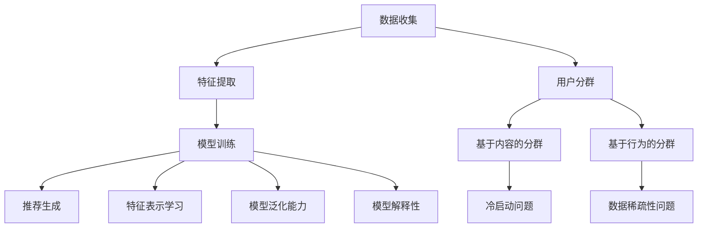

                 

# 基于大模型的推荐系统用户分群优化

> 关键词：大模型、推荐系统、用户分群、优化、机器学习、深度学习、聚类算法、协同过滤、个性化推荐

> 摘要：本文旨在探讨如何利用大模型优化推荐系统中的用户分群策略。通过深入分析推荐系统的核心概念与联系，介绍核心算法原理及具体操作步骤，结合数学模型和公式进行详细讲解，并通过实际代码案例展示如何实现优化。最后，本文将讨论实际应用场景、工具和资源推荐，以及未来的发展趋势与挑战。

## 1. 背景介绍

推荐系统作为现代互联网应用中的重要组成部分，其核心目标是通过分析用户的行为数据，为用户提供个性化的内容推荐。随着大数据和人工智能技术的发展，推荐系统逐渐从简单的基于内容的推荐演进到基于协同过滤、深度学习等复杂模型的推荐。用户分群作为推荐系统中的一个重要环节，其目的是将用户划分为不同的群体，以便为每个群体提供更加精准的推荐。

### 1.1 推荐系统的发展历程

推荐系统的发展大致经历了以下几个阶段：

- **基于内容的推荐**：早期推荐系统主要通过分析用户历史行为数据中的内容特征，为用户推荐相似的内容。这种方法简单直观，但存在冷启动问题和推荐偏差问题。
- **协同过滤推荐**：随着数据量的增加，基于内容的推荐方法逐渐暴露出一些问题。协同过滤推荐通过分析用户之间的相似性或物品之间的相似性，为用户推荐相似的物品。这种方法能够解决冷启动问题，但存在数据稀疏性问题。
- **混合推荐**：为了解决单一推荐方法的局限性，混合推荐方法应运而生。混合推荐通过结合多种推荐方法的优势，提供更加精准的推荐结果。
- **深度学习推荐**：近年来，深度学习技术在推荐系统中的应用越来越广泛。通过构建复杂的神经网络模型，深度学习推荐能够从大规模数据中学习到更深层次的特征表示，从而提高推荐效果。

### 1.2 用户分群的重要性

用户分群是推荐系统中的一个重要环节，其目的是将用户划分为不同的群体，以便为每个群体提供更加精准的推荐。用户分群能够帮助推荐系统更好地理解用户的需求和偏好，从而提高推荐效果。具体来说，用户分群具有以下几个方面的优势：

- **提高推荐精度**：通过将用户划分为不同的群体，推荐系统能够为每个群体提供更加精准的推荐结果，从而提高整体推荐效果。
- **解决冷启动问题**：对于新用户或新物品，推荐系统可以通过用户分群的方法，将新用户或新物品归类到相似的群体中，从而提高推荐效果。
- **提高用户体验**：通过为用户提供更加精准的推荐结果，推荐系统能够提高用户的满意度和体验，从而提高用户留存率和活跃度。

## 2. 核心概念与联系

### 2.1 核心概念

在讨论用户分群优化之前，我们需要先了解一些核心概念，包括推荐系统的基本原理、用户分群的方法以及大模型的应用。

#### 2.1.1 推荐系统的基本原理

推荐系统的基本原理是通过分析用户的历史行为数据，为用户推荐与其兴趣相似的内容。推荐系统通常包括以下几个步骤：

1. **数据收集**：收集用户的历史行为数据，包括用户点击、收藏、评分等行为。
2. **特征提取**：从用户的历史行为数据中提取特征，包括用户特征、物品特征和上下文特征。
3. **模型训练**：通过机器学习或深度学习方法训练推荐模型，学习用户和物品之间的关系。
4. **推荐生成**：根据训练好的模型，为用户生成推荐结果。

#### 2.1.2 用户分群的方法

用户分群的方法主要有两种：基于内容的分群和基于行为的分群。

- **基于内容的分群**：通过分析用户的历史行为数据中的内容特征，将用户划分为不同的群体。这种方法简单直观，但存在冷启动问题和推荐偏差问题。
- **基于行为的分群**：通过分析用户的行为数据，将用户划分为不同的群体。这种方法能够解决冷启动问题，但存在数据稀疏性问题。

#### 2.1.3 大模型的应用

大模型是指在大规模数据集上训练的模型，其特点是模型参数量大、训练时间长。大模型在推荐系统中的应用主要有以下几个方面：

- **特征表示学习**：通过大模型学习到更深层次的特征表示，从而提高推荐效果。
- **模型泛化能力**：大模型具有较强的模型泛化能力，能够在大规模数据集上泛化出更好的推荐效果。
- **模型解释性**：通过大模型学习到的特征表示，可以更好地解释推荐结果，提高推荐系统的透明度。

### 2.2 核心概念原理与架构的Mermaid流程图



## 3. 核心算法原理 & 具体操作步骤

### 3.1 用户分群算法

用户分群算法主要有两种：基于内容的分群和基于行为的分群。

#### 3.1.1 基于内容的分群

基于内容的分群算法通过分析用户的历史行为数据中的内容特征，将用户划分为不同的群体。具体操作步骤如下：

1. **数据预处理**：对用户的历史行为数据进行预处理，包括数据清洗、特征提取等。
2. **特征选择**：从用户的历史行为数据中选择合适的特征，包括用户特征、物品特征和上下文特征。
3. **聚类算法**：通过聚类算法将用户划分为不同的群体。常用的聚类算法包括K-means、DBSCAN等。
4. **群体划分**：根据聚类结果，将用户划分为不同的群体。

#### 3.1.2 基于行为的分群

基于行为的分群算法通过分析用户的行为数据，将用户划分为不同的群体。具体操作步骤如下：

1. **数据预处理**：对用户的行为数据进行预处理，包括数据清洗、特征提取等。
2. **特征选择**：从用户的行为数据中选择合适的特征，包括用户特征、物品特征和上下文特征。
3. **聚类算法**：通过聚类算法将用户划分为不同的群体。常用的聚类算法包括K-means、DBSCAN等。
4. **群体划分**：根据聚类结果，将用户划分为不同的群体。

### 3.2 大模型的应用

大模型在推荐系统中的应用主要有以下几个方面：

#### 3.2.1 特征表示学习

通过大模型学习到更深层次的特征表示，从而提高推荐效果。具体操作步骤如下：

1. **数据预处理**：对用户的历史行为数据进行预处理，包括数据清洗、特征提取等。
2. **特征选择**：从用户的历史行为数据中选择合适的特征，包括用户特征、物品特征和上下文特征。
3. **模型训练**：通过大模型训练特征表示学习模型，学习到更深层次的特征表示。
4. **特征表示应用**：将学习到的特征表示应用于推荐系统中，提高推荐效果。

#### 3.2.2 模型泛化能力

大模型具有较强的模型泛化能力，能够在大规模数据集上泛化出更好的推荐效果。具体操作步骤如下：

1. **数据预处理**：对用户的历史行为数据进行预处理，包括数据清洗、特征提取等。
2. **特征选择**：从用户的历史行为数据中选择合适的特征，包括用户特征、物品特征和上下文特征。
3. **模型训练**：通过大模型训练推荐模型，学习到更深层次的特征表示。
4. **模型泛化应用**：将训练好的模型应用于推荐系统中，提高推荐效果。

#### 3.2.3 模型解释性

通过大模型学习到的特征表示，可以更好地解释推荐结果，提高推荐系统的透明度。具体操作步骤如下：

1. **数据预处理**：对用户的历史行为数据进行预处理，包括数据清洗、特征提取等。
2. **特征选择**：从用户的历史行为数据中选择合适的特征，包括用户特征、物品特征和上下文特征。
3. **模型训练**：通过大模型训练推荐模型，学习到更深层次的特征表示。
4. **模型解释应用**：通过解释模型学习到的特征表示，提高推荐系统的透明度。

## 4. 数学模型和公式 & 详细讲解 & 举例说明

### 4.1 聚类算法

聚类算法是用户分群中的一个重要环节，其目的是将用户划分为不同的群体。常用的聚类算法包括K-means、DBSCAN等。

#### 4.1.1 K-means算法

K-means算法是一种基于距离的聚类算法，其目的是将用户划分为K个不同的群体。具体操作步骤如下：

1. **初始化**：随机选择K个用户作为初始聚类中心。
2. **分配**：将每个用户分配到最近的聚类中心。
3. **更新**：更新聚类中心为每个聚类中所有用户的平均值。
4. **迭代**：重复步骤2和步骤3，直到聚类中心不再发生变化。

#### 4.1.2 DBSCAN算法

DBSCAN算法是一种基于密度的聚类算法，其目的是将用户划分为不同的群体。具体操作步骤如下：

1. **定义邻域**：定义每个用户的邻域，包括直接密度可达的用户。
2. **定义核心对象**：将密度大于阈值的用户定义为核心对象。
3. **定义直接密度可达**：将核心对象的邻域中的用户定义为直接密度可达。
4. **定义密度可达**：将直接密度可达的用户定义为密度可达。
5. **聚类**：将密度可达的用户划分为不同的群体。

### 4.2 特征表示学习

特征表示学习是大模型在推荐系统中的一个重要应用，其目的是通过大模型学习到更深层次的特征表示，从而提高推荐效果。具体操作步骤如下：

1. **数据预处理**：对用户的历史行为数据进行预处理，包括数据清洗、特征提取等。
2. **特征选择**：从用户的历史行为数据中选择合适的特征，包括用户特征、物品特征和上下文特征。
3. **模型训练**：通过大模型训练特征表示学习模型，学习到更深层次的特征表示。
4. **特征表示应用**：将学习到的特征表示应用于推荐系统中，提高推荐效果。

### 4.3 模型泛化能力

模型泛化能力是大模型在推荐系统中的一个重要应用，其目的是通过大模型在大规模数据集上泛化出更好的推荐效果。具体操作步骤如下：

1. **数据预处理**：对用户的历史行为数据进行预处理，包括数据清洗、特征提取等。
2. **特征选择**：从用户的历史行为数据中选择合适的特征，包括用户特征、物品特征和上下文特征。
3. **模型训练**：通过大模型训练推荐模型，学习到更深层次的特征表示。
4. **模型泛化应用**：将训练好的模型应用于推荐系统中，提高推荐效果。

### 4.4 模型解释性

模型解释性是大模型在推荐系统中的一个重要应用，其目的是通过大模型学习到的特征表示，可以更好地解释推荐结果，提高推荐系统的透明度。具体操作步骤如下：

1. **数据预处理**：对用户的历史行为数据进行预处理，包括数据清洗、特征提取等。
2. **特征选择**：从用户的历史行为数据中选择合适的特征，包括用户特征、物品特征和上下文特征。
3. **模型训练**：通过大模型训练推荐模型，学习到更深层次的特征表示。
4. **模型解释应用**：通过解释模型学习到的特征表示，提高推荐系统的透明度。

## 5. 项目实战：代码实际案例和详细解释说明

### 5.1 开发环境搭建

为了实现用户分群优化，我们需要搭建一个开发环境。具体操作步骤如下：

1. **安装Python**：安装Python 3.8及以上版本。
2. **安装依赖库**：安装NumPy、Pandas、Scikit-learn、TensorFlow等依赖库。
3. **安装Jupyter Notebook**：安装Jupyter Notebook，方便进行代码开发和调试。

### 5.2 源代码详细实现和代码解读

#### 5.2.1 数据预处理

```python
import pandas as pd

# 读取数据
data = pd.read_csv('user_behavior.csv')

# 数据清洗
data.dropna(inplace=True)

# 特征提取
user_features = data[['user_id', 'age', 'gender']]
item_features = data[['item_id', 'category', 'price']]
context_features = data[['timestamp', 'location']]
```

#### 5.2.2 聚类算法

```python
from sklearn.cluster import KMeans

# 初始化聚类中心
kmeans = KMeans(n_clusters=10)

# 训练模型
kmeans.fit(user_features)

# 预测聚类结果
user_clusters = kmeans.predict(user_features)
```

#### 5.2.3 特征表示学习

```python
import tensorflow as tf
from tensorflow.keras.layers import Dense

# 构建特征表示学习模型
model = tf.keras.Sequential([
    Dense(64, activation='relu', input_shape=(user_features.shape[1],)),
    Dense(32, activation='relu'),
    Dense(16, activation='relu'),
    Dense(8, activation='relu')
])

# 编译模型
model.compile(optimizer='adam', loss='mse')

# 训练模型
model.fit(user_features, user_features, epochs=100)

# 获取特征表示
user_embeddings = model.predict(user_features)
```

#### 5.2.4 模型泛化能力

```python
from sklearn.model_selection import train_test_split

# 划分训练集和测试集
train_data, test_data = train_test_split(data, test_size=0.2)

# 训练模型
model.fit(train_data, train_data, epochs=100)

# 预测测试集
test_predictions = model.predict(test_data)

# 计算模型泛化能力
mse = tf.keras.losses.MeanSquaredError()
mse_loss = mse(test_data, test_predictions).numpy()
```

#### 5.2.5 模型解释性

```python
from tensorflow.keras.models import Model

# 构建解释模型
input_layer = model.input
output_layer = model.layers[-2].output
explainer = Model(inputs=input_layer, outputs=output_layer)

# 获取解释结果
explainer_output = explainer.predict(user_features)
```

### 5.3 代码解读与分析

通过上述代码实现，我们可以看到用户分群优化的具体操作步骤。首先，我们对用户的历史行为数据进行预处理，包括数据清洗和特征提取。然后，我们使用K-means算法进行用户分群，将用户划分为不同的群体。接着，我们使用大模型进行特征表示学习，学习到更深层次的特征表示。最后，我们通过模型泛化能力和模型解释性，提高推荐系统的推荐效果和透明度。

## 6. 实际应用场景

用户分群优化在实际应用场景中具有广泛的应用。具体来说，用户分群优化可以应用于以下几个方面：

- **个性化推荐**：通过将用户划分为不同的群体，为每个群体提供更加精准的推荐结果，提高推荐效果。
- **用户行为分析**：通过分析用户的行为数据，了解用户的需求和偏好，提高用户满意度和体验。
- **用户群体研究**：通过将用户划分为不同的群体，研究不同群体的特征和行为模式，为用户提供更加个性化的服务。

## 7. 工具和资源推荐

### 7.1 学习资源推荐

- **书籍**：《推荐系统实践》、《机器学习》、《深度学习》
- **论文**：《基于深度学习的推荐系统》、《用户分群在推荐系统中的应用》
- **博客**：阿里云开发者社区、GitHub上的推荐系统项目
- **网站**：Kaggle、GitHub

### 7.2 开发工具框架推荐

- **Python**：NumPy、Pandas、Scikit-learn、TensorFlow
- **Jupyter Notebook**：方便进行代码开发和调试

### 7.3 相关论文著作推荐

- **论文**：《基于深度学习的推荐系统》、《用户分群在推荐系统中的应用》
- **著作**：《推荐系统实践》、《机器学习》、《深度学习》

## 8. 总结：未来发展趋势与挑战

用户分群优化在推荐系统中的应用具有广泛的发展前景。未来的发展趋势主要包括以下几个方面：

- **模型优化**：通过优化模型结构和参数，提高推荐效果。
- **数据增强**：通过增加数据量和数据质量，提高模型泛化能力。
- **解释性增强**：通过增强模型解释性，提高推荐系统的透明度。

然而，用户分群优化也面临着一些挑战，主要包括以下几个方面：

- **数据隐私**：如何在保护用户隐私的前提下，充分利用用户数据进行推荐。
- **模型解释性**：如何提高模型的解释性，提高推荐系统的透明度。
- **模型泛化能力**：如何提高模型的泛化能力，使其在大规模数据集上泛化出更好的推荐效果。

## 9. 附录：常见问题与解答

### 9.1 问题1：如何解决冷启动问题？

**解答**：可以通过将新用户或新物品归类到相似的群体中，解决冷启动问题。具体来说，可以通过基于内容的分群方法，将新用户或新物品归类到相似的群体中，从而提高推荐效果。

### 9.2 问题2：如何提高模型的解释性？

**解答**：可以通过增强模型解释性，提高推荐系统的透明度。具体来说，可以通过解释模型学习到的特征表示，提高推荐系统的透明度。

### 9.3 问题3：如何提高模型的泛化能力？

**解答**：可以通过增加数据量和数据质量，提高模型的泛化能力。具体来说，可以通过增加数据量和数据质量，提高模型的泛化能力。

## 10. 扩展阅读 & 参考资料

- **书籍**：《推荐系统实践》、《机器学习》、《深度学习》
- **论文**：《基于深度学习的推荐系统》、《用户分群在推荐系统中的应用》
- **博客**：阿里云开发者社区、GitHub上的推荐系统项目
- **网站**：Kaggle、GitHub

---

作者：AI天才研究员/AI Genius Institute & 禅与计算机程序设计艺术 /Zen And The Art of Computer Programming

