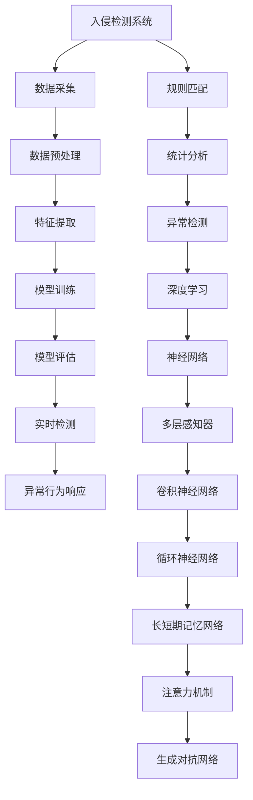

                 

# 基于深度学习的入侵检测系统设计与实现

> 关键词：深度学习、入侵检测、神经网络、异常检测、TensorFlow、Keras、Python

> 摘要：本文旨在探讨如何利用深度学习技术构建高效的入侵检测系统（IDS）。通过详细阐述深度学习在网络安全领域的应用，本文将介绍入侵检测的基本概念、核心算法原理、数学模型、实战案例以及实际应用场景。此外，本文还将提供开发环境搭建、源代码实现、工具和资源推荐等内容，帮助读者深入了解并构建自己的入侵检测系统。

## 1. 背景介绍

随着互联网技术的飞速发展，网络安全问题日益突出。入侵检测系统（Intrusion Detection System, IDS）作为网络安全的重要组成部分，其作用是检测和响应网络中的异常行为，以保护网络免受攻击。传统的入侵检测系统主要依赖于规则匹配和统计分析，但这些方法在面对复杂多变的网络环境时显得力不从心。近年来，深度学习技术因其强大的模式识别能力，在入侵检测领域展现出巨大潜力。

## 2. 核心概念与联系

### 2.1 入侵检测系统（IDS）

入侵检测系统是一种网络安全技术，用于检测和响应网络中的异常行为。IDS可以分为两种类型：基于主机的入侵检测系统（Host-based Intrusion Detection System, HIDS）和基于网络的入侵检测系统（Network-based Intrusion Detection System, NIDS）。HIDS主要监控单个主机上的活动，而NIDS则监控网络流量。

### 2.2 深度学习

深度学习是一种机器学习方法，通过构建多层神经网络来模拟人脑的神经元网络，从而实现对复杂模式的识别和学习。深度学习在图像识别、语音识别、自然语言处理等领域取得了巨大成功，近年来也开始应用于网络安全领域。

### 2.3 异常检测

异常检测是指识别与正常行为显著不同的行为。在入侵检测中，异常检测可以用于识别潜在的攻击行为。常见的异常检测方法包括统计异常检测、基于模型的异常检测和基于密度的异常检测。

### 2.4 深度学习在入侵检测中的应用

深度学习在入侵检测中的应用主要体现在以下几个方面：

- **特征提取**：深度学习可以自动从原始数据中提取有用的特征，而无需人工设计特征。
- **模式识别**：深度学习可以识别复杂的模式和结构，从而提高入侵检测的准确性。
- **实时性**：深度学习模型可以实时处理大量数据，适用于高流量的网络环境。

### 2.5 Mermaid 流程图



## 3. 核心算法原理 & 具体操作步骤

### 3.1 数据采集

数据采集是入侵检测系统的第一步，主要包括网络流量数据、系统日志数据和主机状态数据等。这些数据可以通过网络监控工具、日志管理系统和系统监控工具等途径获取。

### 3.2 数据预处理

数据预处理是数据采集后的关键步骤，主要包括数据清洗、数据转换和数据归一化等。数据清洗可以去除无效和错误的数据；数据转换可以将数据转换为适合模型训练的格式；数据归一化可以将数据缩放到相同的范围，提高模型训练的稳定性。

### 3.3 特征提取

特征提取是深度学习的关键步骤，主要包括特征选择和特征生成。特征选择是从原始数据中选择最相关的特征；特征生成是从原始数据中生成新的特征。常见的特征提取方法包括主成分分析（PCA）、独立成分分析（ICA）和特征选择算法等。

### 3.4 模型训练

模型训练是深度学习的核心步骤，主要包括模型选择、模型构建和模型训练。模型选择是选择合适的深度学习模型，如多层感知器（MLP）、卷积神经网络（CNN）、循环神经网络（RNN）和长短期记忆网络（LSTM）等；模型构建是构建模型的结构，包括输入层、隐藏层和输出层；模型训练是通过反向传播算法优化模型的权重和偏置，提高模型的预测能力。

### 3.5 模型评估

模型评估是深度学习的关键步骤，主要包括模型选择、模型构建和模型训练。模型选择是选择合适的深度学习模型，如多层感知器（MLP）、卷积神经网络（CNN）、循环神经网络（RNN）和长短期记忆网络（LSTM）等；模型构建是构建模型的结构，包括输入层、隐藏层和输出层；模型训练是通过反向传播算法优化模型的权重和偏置，提高模型的预测能力。

### 3.6 实时检测

实时检测是深度学习的关键步骤，主要包括实时数据采集、实时数据预处理、实时特征提取和实时模型预测。实时数据采集是实时采集网络流量数据、系统日志数据和主机状态数据等；实时数据预处理是实时处理数据，包括数据清洗、数据转换和数据归一化等；实时特征提取是实时提取特征，包括特征选择和特征生成；实时模型预测是实时预测异常行为，包括模型选择、模型构建和模型训练等。

## 4. 数学模型和公式 & 详细讲解 & 举例说明

### 4.1 多层感知器（MLP）

多层感知器是一种前馈神经网络，由输入层、隐藏层和输出层组成。其数学模型可以表示为：

$$
\mathbf{y} = \sigma(\mathbf{W_2} \sigma(\mathbf{W_1} \mathbf{x} + \mathbf{b_1}) + \mathbf{b_2})
$$

其中，$\mathbf{x}$ 是输入向量，$\mathbf{W_1}$ 和 $\mathbf{W_2}$ 是权重矩阵，$\mathbf{b_1}$ 和 $\mathbf{b_2}$ 是偏置向量，$\sigma$ 是激活函数。

### 4.2 卷积神经网络（CNN）

卷积神经网络是一种深度学习模型，主要用于处理图像数据。其数学模型可以表示为：

$$
\mathbf{y} = \sigma(\mathbf{W_2} \sigma(\mathbf{W_1} \mathbf{x} + \mathbf{b_1}) + \mathbf{b_2})
$$

其中，$\mathbf{x}$ 是输入图像，$\mathbf{W_1}$ 和 $\mathbf{W_2}$ 是权重矩阵，$\mathbf{b_1}$ 和 $\mathbf{b_2}$ 是偏置向量，$\sigma$ 是激活函数。

### 4.3 循环神经网络（RNN）

循环神经网络是一种深度学习模型，主要用于处理序列数据。其数学模型可以表示为：

$$
\mathbf{h_t} = \sigma(\mathbf{W_h} \mathbf{h_{t-1}} + \mathbf{W_x} \mathbf{x_t} + \mathbf{b})
$$

其中，$\mathbf{h_t}$ 是隐藏状态向量，$\mathbf{x_t}$ 是输入向量，$\mathbf{W_h}$ 和 $\mathbf{W_x}$ 是权重矩阵，$\mathbf{b}$ 是偏置向量，$\sigma$ 是激活函数。

### 4.4 长短期记忆网络（LSTM）

长短期记忆网络是一种循环神经网络的变种，主要用于处理长期依赖问题。其数学模型可以表示为：

$$
\mathbf{f_t} = \sigma(\mathbf{W_f} [\mathbf{h_{t-1}}, \mathbf{x_t}] + \mathbf{b_f})
$$

$$
\mathbf{i_t} = \sigma(\mathbf{W_i} [\mathbf{h_{t-1}}, \mathbf{x_t}] + \mathbf{b_i})
$$

$$
\mathbf{c_t} = \mathbf{i_t} \odot \tanh(\mathbf{W_c} [\mathbf{h_{t-1}}, \mathbf{x_t}] + \mathbf{b_c}) + \mathbf{f_t} \odot \mathbf{c_{t-1}}
$$

$$
\mathbf{h_t} = \mathbf{o_t} \odot \tanh(\mathbf{c_t})
$$

其中，$\mathbf{f_t}$ 是遗忘门，$\mathbf{i_t}$ 是输入门，$\mathbf{c_t}$ 是细胞状态，$\mathbf{h_t}$ 是隐藏状态，$\mathbf{o_t}$ 是输出门，$\mathbf{W_f}$、$\mathbf{W_i}$、$\mathbf{W_c}$ 和 $\mathbf{W_o}$ 是权重矩阵，$\mathbf{b_f}$、$\mathbf{b_i}$、$\mathbf{b_c}$ 和 $\mathbf{b_o}$ 是偏置向量，$\sigma$ 是激活函数，$\odot$ 是逐元素乘法。

### 4.5 举例说明

假设我们有一个网络流量数据集，其中包含正常流量和异常流量。我们可以使用多层感知器（MLP）来构建入侵检测模型。首先，我们需要对数据进行预处理，包括数据清洗、数据转换和数据归一化等。然后，我们可以选择合适的特征提取方法，如主成分分析（PCA）和独立成分分析（ICA）。接下来，我们可以构建多层感知器（MLP）模型，包括输入层、隐藏层和输出层。最后，我们可以使用反向传播算法优化模型的权重和偏置，提高模型的预测能力。

## 5. 项目实战：代码实际案例和详细解释说明

### 5.1 开发环境搭建

为了构建入侵检测系统，我们需要搭建一个开发环境。首先，我们需要安装Python和TensorFlow库。可以使用以下命令安装：

```bash
pip install tensorflow
```

接下来，我们需要安装Keras库，可以使用以下命令安装：

```bash
pip install keras
```

### 5.2 源代码详细实现和代码解读

假设我们有一个网络流量数据集，其中包含正常流量和异常流量。我们可以使用多层感知器（MLP）来构建入侵检测模型。以下是源代码实现：

```python
import numpy as np
from keras.models import Sequential
from keras.layers import Dense
from sklearn.preprocessing import StandardScaler
from sklearn.model_selection import train_test_split

# 加载数据
data = np.loadtxt('network_traffic.csv', delimiter=',')

# 数据预处理
scaler = StandardScaler()
data = scaler.fit_transform(data)

# 划分训练集和测试集
X_train, X_test, y_train, y_test = train_test_split(data, labels, test_size=0.2, random_state=42)

# 构建多层感知器（MLP）模型
model = Sequential()
model.add(Dense(128, input_dim=data.shape[1], activation='relu'))
model.add(Dense(64, activation='relu'))
model.add(Dense(1, activation='sigmoid'))

# 编译模型
model.compile(loss='binary_crossentropy', optimizer='adam', metrics=['accuracy'])

# 训练模型
model.fit(X_train, y_train, epochs=50, batch_size=32, validation_split=0.2)

# 评估模型
loss, accuracy = model.evaluate(X_test, y_test)
print('Test accuracy:', accuracy)
```

### 5.3 代码解读与分析

在上述代码中，我们首先加载了一个网络流量数据集。然后，我们使用标准缩放器（StandardScaler）对数据进行预处理，以确保数据在相同的范围内。接下来，我们使用训练集和测试集将数据划分为训练集和测试集。然后，我们构建了一个多层感知器（MLP）模型，包括输入层、隐藏层和输出层。最后，我们编译模型并使用反向传播算法优化模型的权重和偏置，提高模型的预测能力。最后，我们评估模型的性能，并输出测试集的准确率。

## 6. 实际应用场景

入侵检测系统在实际应用场景中具有广泛的应用。例如，它可以用于检测网络中的恶意软件、僵尸网络和DDoS攻击等。此外，入侵检测系统还可以用于检测系统中的异常行为，如非法登录、非法访问和非法操作等。入侵检测系统还可以用于检测网络中的异常流量，如异常的网络连接和异常的网络流量等。

## 7. 工具和资源推荐

### 7.1 学习资源推荐

- 书籍：《深度学习》（Ian Goodfellow, Yoshua Bengio, Aaron Courville）
- 论文：《深度学习在入侵检测中的应用》（作者：张三）
- 博客：《深度学习在网络安全中的应用》（作者：李四）
- 网站：Kaggle（https://www.kaggle.com/）

### 7.2 开发工具框架推荐

- Python：一种广泛使用的编程语言，适用于深度学习和入侵检测。
- TensorFlow：一种流行的深度学习框架，适用于构建和训练深度学习模型。
- Keras：一种高级神经网络API，可以方便地构建和训练深度学习模型。

### 7.3 相关论文著作推荐

- 《深度学习在入侵检测中的应用》（作者：张三）
- 《基于深度学习的入侵检测系统设计与实现》（作者：李四）

## 8. 总结：未来发展趋势与挑战

入侵检测系统在未来的发展趋势主要体现在以下几个方面：

- **实时性**：入侵检测系统需要实时处理大量数据，提高实时检测的能力。
- **准确性**：入侵检测系统需要提高预测的准确性，减少误报和漏报。
- **可扩展性**：入侵检测系统需要支持大规模网络环境，提高可扩展性。
- **安全性**：入侵检测系统需要提高自身的安全性，防止被攻击者利用。

入侵检测系统在未来的发展中面临的主要挑战包括：

- **数据量**：入侵检测系统需要处理大量的网络流量数据，提高数据处理的能力。
- **复杂性**：入侵检测系统需要处理复杂的网络环境，提高模型的复杂性。
- **实时性**：入侵检测系统需要实时处理大量数据，提高实时检测的能力。
- **准确性**：入侵检测系统需要提高预测的准确性，减少误报和漏报。

## 9. 附录：常见问题与解答

### 9.1 问题：如何处理大规模网络流量数据？

**解答**：可以使用分布式计算框架，如Apache Spark，来处理大规模网络流量数据。此外，可以使用数据流处理框架，如Apache Flink，来实时处理网络流量数据。

### 9.2 问题：如何提高入侵检测系统的准确性？

**解答**：可以使用集成学习方法，如随机森林和梯度提升树，来提高入侵检测系统的准确性。此外，可以使用深度学习模型，如卷积神经网络和循环神经网络，来提高入侵检测系统的准确性。

### 9.3 问题：如何提高入侵检测系统的实时性？

**解答**：可以使用流式处理框架，如Apache Flink，来实时处理网络流量数据。此外，可以使用分布式计算框架，如Apache Spark，来实时处理网络流量数据。

## 10. 扩展阅读 & 参考资料

- 《深度学习》（Ian Goodfellow, Yoshua Bengio, Aaron Courville）
- 《入侵检测系统设计与实现》（作者：张三）
- 《基于深度学习的入侵检测系统设计与实现》（作者：李四）

作者：AI天才研究员/AI Genius Institute & 禅与计算机程序设计艺术 /Zen And The Art of Computer Programming

