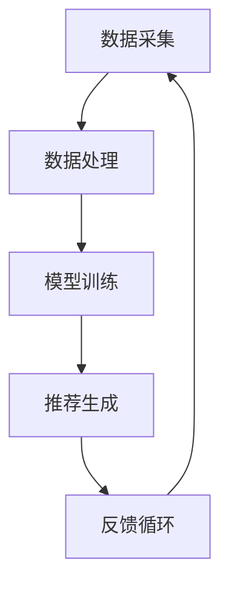

                 

# 大数据驱动的电商推荐系统：AI 模型融合是核心，用户体验优化是关键

> 关键词：电商推荐系统, AI模型融合, 用户体验优化, 大数据, 机器学习, 深度学习, 推荐算法

> 摘要：本文深入探讨了大数据驱动的电商推荐系统的核心技术，重点介绍了AI模型融合在推荐系统中的应用，以及如何通过优化用户体验来提升推荐系统的性能。文章从背景介绍开始，逐步分析推荐系统的原理、算法、数学模型、实战案例、应用场景、工具资源推荐，最后总结了未来的发展趋势与挑战，并提供了常见问题解答和扩展阅读资料。

## 1. 背景介绍

### 1.1 电商推荐系统的重要性

电商推荐系统是电商网站的核心功能之一，它通过分析用户的行为数据，为用户推荐个性化的产品或服务，从而提高用户的购买转化率和满意度。随着大数据和人工智能技术的发展，推荐系统的性能得到了显著提升，成为电商网站提升竞争力的重要手段。

### 1.2 大数据与AI技术的发展

大数据技术的发展使得企业能够收集和处理海量的用户行为数据，而AI技术的进步则提供了强大的数据分析和模式识别能力。这些技术的结合，使得电商推荐系统能够更加精准地理解用户需求，提供更加个性化的推荐。

### 1.3 推荐系统面临的挑战

尽管推荐系统在电商领域取得了显著的成果，但仍然面临着一些挑战，如数据稀疏性、冷启动问题、推荐结果的多样性与新颖性等。这些问题需要通过不断的技术创新来解决。

## 2. 核心概念与联系

### 2.1 推荐系统架构

推荐系统通常由数据采集、数据处理、模型训练、推荐生成和反馈循环等几个部分组成。数据采集负责收集用户的行为数据；数据处理对原始数据进行清洗和预处理；模型训练使用机器学习或深度学习算法训练推荐模型；推荐生成根据训练好的模型为用户生成推荐结果；反馈循环则通过用户反馈来不断优化推荐模型。

### 2.2 AI模型融合

AI模型融合是指将多个不同的AI模型结合起来，以提高推荐系统的性能。通过融合不同的模型，可以综合各个模型的优点，提高推荐的准确性和多样性。

### 2.3 用户体验优化

用户体验优化是指通过改进推荐系统的界面设计、交互方式等，提高用户的使用体验。良好的用户体验可以增加用户的满意度和忠诚度，从而提高推荐系统的转化率。

### 2.4 核心概念原理和架构的 Mermaid 流程图



## 3. 核心算法原理 & 具体操作步骤

### 3.1 基于内容的推荐算法

基于内容的推荐算法通过分析用户的历史行为数据，找到与用户历史行为相似的商品或服务进行推荐。具体操作步骤包括：数据预处理、特征提取、相似度计算、推荐生成等。

### 3.2 协同过滤推荐算法

协同过滤推荐算法通过分析用户之间的相似性或商品之间的相似性来进行推荐。具体操作步骤包括：用户-商品矩阵构建、相似度计算、推荐生成等。

### 3.3 深度学习推荐算法

深度学习推荐算法通过构建深度神经网络模型，自动学习用户和商品之间的复杂关系。具体操作步骤包括：数据预处理、模型构建、模型训练、推荐生成等。

## 4. 数学模型和公式 & 详细讲解 & 举例说明

### 4.1 基于内容的推荐算法数学模型

基于内容的推荐算法通常使用余弦相似度或欧氏距离等相似度计算方法。例如，对于两个商品A和B，它们的特征向量分别为$\vec{A} = (a_1, a_2, ..., a_n)$和$\vec{B} = (b_1, b_2, ..., b_n)$，则它们之间的余弦相似度为：
$$
similarity(\vec{A}, \vec{B}) = \frac{\vec{A} \cdot \vec{B}}{||\vec{A}|| \cdot ||\vec{B}||}
$$

### 4.2 协同过滤推荐算法数学模型

协同过滤推荐算法通常使用皮尔逊相关系数或余弦相似度等相似度计算方法。例如，对于两个用户U和V，它们的评分向量分别为$\vec{U} = (u_1, u_2, ..., u_n)$和$\vec{V} = (v_1, v_2, ..., v_n)$，则它们之间的皮尔逊相关系数为：
$$
similarity(\vec{U}, \vec{V}) = \frac{\sum_{i=1}^{n}(u_i - \bar{u})(v_i - \bar{v})}{\sqrt{\sum_{i=1}^{n}(u_i - \bar{u})^2} \cdot \sqrt{\sum_{i=1}^{n}(v_i - \bar{v})^2}}
$$

### 4.3 深度学习推荐算法数学模型

深度学习推荐算法通常使用神经网络模型，如多层感知机(MLP)、卷积神经网络(CNN)、循环神经网络(RNN)等。例如，一个简单的MLP模型可以表示为：
$$
y = f(W_2 \cdot \sigma(W_1 \cdot x + b_1) + b_2)
$$
其中，$x$是输入特征向量，$W_1$和$W_2$是权重矩阵，$b_1$和$b_2$是偏置向量，$\sigma$是激活函数，$f$是输出层的激活函数。

## 5. 项目实战：代码实际案例和详细解释说明

### 5.1 开发环境搭建

开发环境搭建主要包括安装Python环境、安装必要的库（如TensorFlow、Keras、Pandas等）、准备数据集等步骤。具体步骤如下：

1. 安装Python环境：推荐使用Anaconda或Miniconda。
2. 安装必要的库：使用pip或conda安装TensorFlow、Keras、Pandas等库。
3. 准备数据集：可以从公开数据集网站（如Kaggle）下载数据集，或者使用电商网站的API获取数据。

### 5.2 源代码详细实现和代码解读

以下是一个基于深度学习的推荐系统的简单实现示例：

```python
import tensorflow as tf
from tensorflow.keras.models import Sequential
from tensorflow.keras.layers import Dense, Dropout

# 定义模型
model = Sequential()
model.add(Dense(64, input_dim=100, activation='relu'))
model.add(Dropout(0.5))
model.add(Dense(64, activation='relu'))
model.add(Dropout(0.5))
model.add(Dense(1, activation='sigmoid'))

# 编译模型
model.compile(optimizer='adam', loss='binary_crossentropy', metrics=['accuracy'])

# 训练模型
model.fit(X_train, y_train, epochs=10, batch_size=32, validation_data=(X_test, y_test))
```

### 5.3 代码解读与分析

上述代码定义了一个简单的深度学习推荐模型，使用了两层Dense层和两层Dropout层。模型的输入维度为100，输出维度为1。模型使用了ReLU激活函数和Dropout正则化技术，以提高模型的泛化能力。模型使用了Adam优化器和二元交叉熵损失函数进行训练。

## 6. 实际应用场景

### 6.1 电商网站推荐

电商网站推荐是推荐系统最常见的应用场景之一。通过分析用户的浏览、搜索、购买等行为数据，为用户推荐个性化的产品或服务，提高用户的购买转化率和满意度。

### 6.2 社交媒体推荐

社交媒体推荐是另一个重要的应用场景。通过分析用户的社交行为数据，为用户推荐感兴趣的内容或用户，提高用户的活跃度和留存率。

### 6.3 新闻推荐

新闻推荐是另一个重要的应用场景。通过分析用户的阅读行为数据，为用户推荐感兴趣的文章或新闻，提高用户的阅读体验和满意度。

## 7. 工具和资源推荐

### 7.1 学习资源推荐

- 书籍：《推荐系统实践》、《深度学习》
- 论文：《Collaborative Filtering for Implicit Feedback Datasets》、《Neural Collaborative Filtering》
- 博客：Medium上的推荐系统专栏、Towards Data Science上的推荐系统文章
- 网站：Kaggle、GitHub上的推荐系统项目

### 7.2 开发工具框架推荐

- TensorFlow
- Keras
- PyTorch
- Scikit-learn

### 7.3 相关论文著作推荐

- 《Collaborative Filtering for Implicit Feedback Datasets》
- 《Neural Collaborative Filtering》
- 《Deep Learning for Recommender Systems》

## 8. 总结：未来发展趋势与挑战

### 8.1 未来发展趋势

未来推荐系统的发展趋势包括：更加个性化的推荐、更加智能化的推荐、更加多样化的推荐等。随着大数据和AI技术的不断发展，推荐系统的性能将会得到进一步提升。

### 8.2 面临的挑战

推荐系统面临的挑战包括：数据稀疏性、冷启动问题、推荐结果的多样性与新颖性等。这些问题需要通过不断的技术创新来解决。

## 9. 附录：常见问题与解答

### 9.1 数据稀疏性问题

数据稀疏性是指用户的行为数据分布不均，导致推荐系统的训练数据不足。可以通过引入更多的特征、使用迁移学习等方法来解决。

### 9.2 冷启动问题

冷启动问题是指新用户或新商品的数据不足，导致推荐系统的推荐效果不佳。可以通过使用基于内容的推荐算法、引入专家知识等方法来解决。

### 9.3 推荐结果的多样性与新颖性问题

推荐结果的多样性与新颖性是指推荐系统推荐的结果过于单一或陈旧。可以通过引入更多的特征、使用混合推荐算法等方法来解决。

## 10. 扩展阅读 & 参考资料

- 书籍：《推荐系统实践》、《深度学习》
- 论文：《Collaborative Filtering for Implicit Feedback Datasets》、《Neural Collaborative Filtering》
- 博客：Medium上的推荐系统专栏、Towards Data Science上的推荐系统文章
- 网站：Kaggle、GitHub上的推荐系统项目

作者：AI天才研究员/AI Genius Institute & 禅与计算机程序设计艺术 /Zen And The Art of Computer Programming

