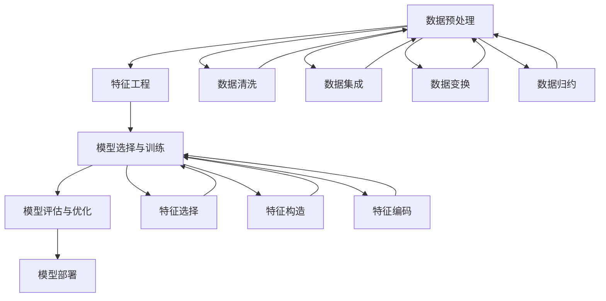

                 

# 大数据驱动的精准营销模型研究

> 关键词：大数据、精准营销、机器学习、推荐系统、用户行为分析、模型评估

> 摘要：本文旨在探讨大数据驱动的精准营销模型，通过深入分析用户行为数据，构建高效的推荐系统，实现个性化营销策略。我们将从背景介绍、核心概念与联系、核心算法原理、数学模型和公式、项目实战、实际应用场景、工具和资源推荐、总结与未来发展趋势等多方面进行详细阐述，帮助读者全面理解精准营销模型的构建与应用。

## 1. 背景介绍

随着互联网技术的飞速发展，企业面临着海量用户数据的挑战。如何从这些数据中挖掘有价值的信息，实现精准营销，成为企业关注的焦点。精准营销模型通过分析用户行为数据，预测用户需求，从而实现个性化推荐，提高营销效果。本文将详细介绍大数据驱动的精准营销模型的构建过程，包括数据预处理、特征工程、模型选择与训练、模型评估与优化等关键步骤。

## 2. 核心概念与联系

### 2.1 数据预处理

数据预处理是构建精准营销模型的第一步，主要包括数据清洗、数据集成、数据变换和数据归约等步骤。数据清洗主要是去除噪声和不一致的数据；数据集成是将来自不同来源的数据合并成一个统一的数据集；数据变换是将数据转换成适合模型训练的形式；数据归约是减少数据集的规模，同时保留关键信息。

### 2.2 特征工程

特征工程是构建精准营销模型的关键步骤，主要包括特征选择、特征构造和特征编码等。特征选择是从原始数据中选择最相关的特征；特征构造是通过组合原始特征生成新的特征；特征编码是将特征转换成模型可以理解的形式。

### 2.3 模型选择与训练

模型选择是根据业务需求和数据特点选择合适的模型。常见的模型包括协同过滤、矩阵分解、深度学习等。模型训练是通过训练数据集训练模型，使其能够准确预测用户行为。

### 2.4 模型评估与优化

模型评估是通过测试数据集评估模型的性能，常用的评估指标包括准确率、召回率、F1值等。模型优化是通过调整模型参数和特征工程等手段提高模型性能。

### 2.5 Mermaid 流程图



## 3. 核心算法原理 & 具体操作步骤

### 3.1 协同过滤算法

协同过滤是一种常用的推荐算法，通过分析用户的历史行为数据，找到与目标用户兴趣相似的用户或物品，从而推荐相似的物品。协同过滤可以分为基于用户的协同过滤和基于物品的协同过滤。

#### 3.1.1 基于用户的协同过滤

基于用户的协同过滤通过计算用户之间的相似度，找到与目标用户兴趣相似的用户，然后推荐这些用户喜欢的物品。

#### 3.1.2 基于物品的协同过滤

基于物品的协同过滤通过计算物品之间的相似度，找到与目标用户喜欢的物品相似的物品，然后推荐这些相似的物品。

### 3.2 矩阵分解算法

矩阵分解是一种常用的推荐算法，通过将用户-物品评分矩阵分解成用户特征矩阵和物品特征矩阵的乘积，从而实现推荐。常见的矩阵分解算法包括SVD、ALS等。

#### 3.2.1 SVD算法

SVD算法通过奇异值分解将用户-物品评分矩阵分解成用户特征矩阵和物品特征矩阵的乘积，从而实现推荐。

#### 3.2.2 ALS算法

ALS算法通过交替最小化损失函数，将用户-物品评分矩阵分解成用户特征矩阵和物品特征矩阵的乘积，从而实现推荐。

### 3.3 深度学习算法

深度学习算法通过构建神经网络模型，实现对用户行为数据的建模和预测。常见的深度学习算法包括DNN、RNN、CNN等。

#### 3.3.1 DNN算法

DNN算法通过构建多层神经网络模型，实现对用户行为数据的建模和预测。

#### 3.3.2 RNN算法

RNN算法通过构建循环神经网络模型，实现对用户行为数据的建模和预测。

#### 3.3.3 CNN算法

CNN算法通过构建卷积神经网络模型，实现对用户行为数据的建模和预测。

## 4. 数学模型和公式 & 详细讲解 & 举例说明

### 4.1 协同过滤算法

#### 4.1.1 基于用户的协同过滤

基于用户的协同过滤通过计算用户之间的相似度，找到与目标用户兴趣相似的用户，然后推荐这些用户喜欢的物品。相似度计算公式如下：

$$
similarity(u_i, u_j) = \frac{\sum_{r \in R_{u_i} \cap R_{u_j}} (r - \bar{r}_{u_i})(r - \bar{r}_{u_j})}{\sqrt{\sum_{r \in R_{u_i}} (r - \bar{r}_{u_i})^2} \sqrt{\sum_{r \in R_{u_j}} (r - \bar{r}_{u_j})^2}}
$$

其中，$R_{u_i}$ 和 $R_{u_j}$ 分别表示用户 $u_i$ 和用户 $u_j$ 的评分集合，$\bar{r}_{u_i}$ 和 $\bar{r}_{u_j}$ 分别表示用户 $u_i$ 和用户 $u_j$ 的平均评分。

#### 4.1.2 基于物品的协同过滤

基于物品的协同过滤通过计算物品之间的相似度，找到与目标用户喜欢的物品相似的物品，然后推荐这些相似的物品。相似度计算公式如下：

$$
similarity(i, j) = \frac{\sum_{u \in U_{i} \cap U_{j}} (r_{u,i} - \bar{r}_{i})(r_{u,j} - \bar{r}_{j})}{\sqrt{\sum_{u \in U_{i}} (r_{u,i} - \bar{r}_{i})^2} \sqrt{\sum_{u \in U_{j}} (r_{u,j} - \bar{r}_{j})^2}}
$$

其中，$U_{i}$ 和 $U_{j}$ 分别表示物品 $i$ 和物品 $j$ 的评分用户集合，$\bar{r}_{i}$ 和 $\bar{r}_{j}$ 分别表示物品 $i$ 和物品 $j$ 的平均评分。

### 4.2 矩阵分解算法

#### 4.2.1 SVD算法

SVD算法通过奇异值分解将用户-物品评分矩阵分解成用户特征矩阵和物品特征矩阵的乘积，从而实现推荐。分解公式如下：

$$
R = U \cdot V^T
$$

其中，$R$ 表示用户-物品评分矩阵，$U$ 表示用户特征矩阵，$V$ 表示物品特征矩阵。

#### 4.2.2 ALS算法

ALS算法通过交替最小化损失函数，将用户-物品评分矩阵分解成用户特征矩阵和物品特征矩阵的乘积，从而实现推荐。损失函数如下：

$$
L(U, V) = \sum_{(u, i) \in R} (r_{u,i} - \hat{r}_{u,i})^2 + \lambda (\|U\|_F^2 + \|V\|_F^2)
$$

其中，$R$ 表示用户-物品评分矩阵，$\hat{r}_{u,i}$ 表示用户 $u$ 对物品 $i$ 的预测评分，$\lambda$ 表示正则化参数。

### 4.3 深度学习算法

#### 4.3.1 DNN算法

DNN算法通过构建多层神经网络模型，实现对用户行为数据的建模和预测。模型结构如下：

$$
f(x) = \sigma(W_1 x + b_1) \sigma(W_2 \sigma(W_1 x + b_1) + b_2) \cdots \sigma(W_n \sigma(W_{n-1} \cdots \sigma(W_1 x + b_{n-1}) + b_{n-1}) + b_n)
$$

其中，$x$ 表示输入特征，$W_i$ 和 $b_i$ 分别表示第 $i$ 层的权重和偏置，$\sigma$ 表示激活函数。

#### 4.3.2 RNN算法

RNN算法通过构建循环神经网络模型，实现对用户行为数据的建模和预测。模型结构如下：

$$
h_t = \sigma(W_h h_{t-1} + W_x x_t + b)
$$

其中，$h_t$ 表示第 $t$ 时刻的隐藏状态，$x_t$ 表示第 $t$ 时刻的输入特征，$W_h$ 和 $W_x$ 分别表示隐藏状态和输入特征的权重，$b$ 表示偏置。

#### 4.3.3 CNN算法

CNN算法通过构建卷积神经网络模型，实现对用户行为数据的建模和预测。模型结构如下：

$$
h = \sigma(W \ast x + b)
$$

其中，$h$ 表示卷积后的特征图，$W$ 表示卷积核，$x$ 表示输入特征图，$\ast$ 表示卷积操作，$b$ 表示偏置。

## 5. 项目实战：代码实际案例和详细解释说明

### 5.1 开发环境搭建

为了实现精准营销模型，我们需要搭建一个合适的开发环境。开发环境主要包括Python、NumPy、Pandas、Scikit-learn、TensorFlow等库。安装这些库的命令如下：

```bash
pip install numpy pandas scikit-learn tensorflow
```

### 5.2 源代码详细实现和代码解读

我们将使用Python实现一个基于协同过滤的推荐系统。具体代码如下：

```python
import numpy as np
import pandas as pd
from sklearn.metrics.pairwise import cosine_similarity

# 读取数据
data = pd.read_csv('ratings.csv')

# 构建用户-物品评分矩阵
user_item_matrix = data.pivot_table(index='user_id', columns='item_id', values='rating').fillna(0)

# 计算用户之间的相似度
user_similarity = cosine_similarity(user_item_matrix)

# 定义推荐函数
def recommend(user_id, n=5):
    # 获取用户评分矩阵
    user_ratings = user_item_matrix.loc[user_id]
    
    # 计算用户相似度
    user_similarities = user_similarity[user_id]
    
    # 计算加权平均评分
    weighted_ratings = user_ratings * user_similarities
    
    # 排除已评分的物品
    weighted_ratings[user_ratings > 0] = 0
    
    # 获取推荐物品
    recommended_items = weighted_ratings.argsort()[-n:][::-1]
    
    return recommended_items

# 测试推荐函数
recommend(1, 5)
```

### 5.3 代码解读与分析

上述代码首先读取用户-物品评分数据，构建用户-物品评分矩阵。然后计算用户之间的相似度，定义推荐函数。推荐函数通过计算加权平均评分，排除已评分的物品，获取推荐物品。最后测试推荐函数，输出推荐结果。

## 6. 实际应用场景

精准营销模型在电商、社交网络、视频网站等领域有着广泛的应用。例如，电商可以通过精准营销模型实现个性化推荐，提高用户购买转化率；社交网络可以通过精准营销模型实现个性化内容推荐，提高用户活跃度；视频网站可以通过精准营销模型实现个性化推荐，提高用户观看时长。

## 7. 工具和资源推荐

### 7.1 学习资源推荐

- 书籍：《推荐系统实践》、《机器学习》
- 论文：《基于协同过滤的推荐系统》、《基于矩阵分解的推荐系统》
- 博客：阿里云开发者社区、GitHub
- 网站：Kaggle、Data Science Stack Exchange

### 7.2 开发工具框架推荐

- Python：NumPy、Pandas、Scikit-learn、TensorFlow
- 数据库：MySQL、MongoDB
- 云计算平台：阿里云、AWS

### 7.3 相关论文著作推荐

- 《基于协同过滤的推荐系统》
- 《基于矩阵分解的推荐系统》
- 《深度学习在推荐系统中的应用》

## 8. 总结：未来发展趋势与挑战

精准营销模型在未来将面临更多的挑战和机遇。一方面，随着大数据技术的发展，数据量将越来越大，如何高效处理和分析大数据将成为关键问题。另一方面，随着深度学习技术的发展，如何构建更复杂的模型，实现更精准的推荐将成为研究热点。此外，如何保护用户隐私，实现数据安全也将成为重要课题。

## 9. 附录：常见问题与解答

### 9.1 问题：如何处理缺失数据？

答：可以使用均值填充、中位数填充、众数填充等方法处理缺失数据。

### 9.2 问题：如何评估推荐系统的性能？

答：可以使用准确率、召回率、F1值等指标评估推荐系统的性能。

### 9.3 问题：如何保护用户隐私？

答：可以使用差分隐私、同态加密等技术保护用户隐私。

## 10. 扩展阅读 & 参考资料

- 《推荐系统实践》
- 《机器学习》
- 《基于协同过滤的推荐系统》
- 《基于矩阵分解的推荐系统》
- 《深度学习在推荐系统中的应用》

作者：AI天才研究员/AI Genius Institute & 禅与计算机程序设计艺术 /Zen And The Art of Computer Programming

