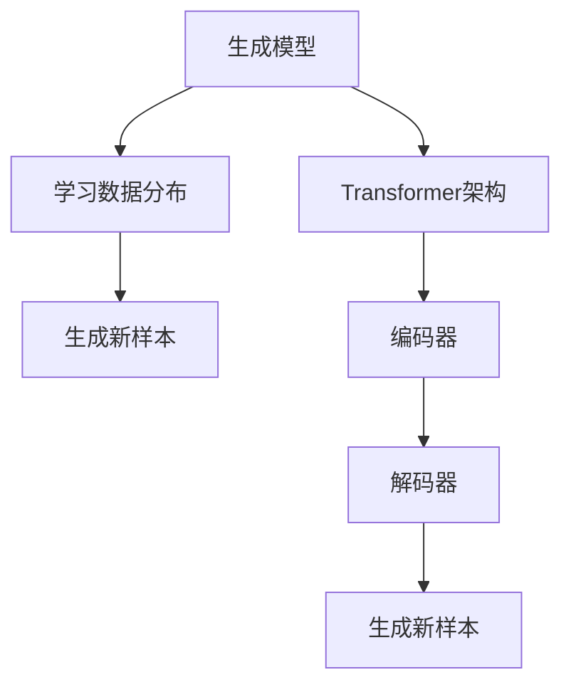

                 

# 大模型与AI辅助艺术创作：从模仿到创新

> 关键词：大模型、AI辅助艺术、模仿、创新、艺术创作、深度学习、生成模型、Transformer架构

> 摘要：本文旨在探讨大模型在艺术创作中的应用，从模仿到创新，通过深入分析大模型的工作原理、核心算法、数学模型，结合实际代码案例，展示如何利用大模型进行艺术创作。文章将从背景介绍、核心概念与联系、核心算法原理、数学模型与公式、项目实战、实际应用场景、工具和资源推荐、总结与未来趋势等多个方面进行详细阐述。

## 1. 背景介绍

随着人工智能技术的飞速发展，大模型在各个领域展现出巨大的潜力。特别是在艺术创作领域，大模型通过模仿和学习大量艺术作品，能够生成具有高度创意和艺术价值的作品。本文将探讨大模型在艺术创作中的应用，从模仿到创新，展示其在艺术创作中的独特价值。

### 1.1 大模型概述

大模型是指参数量巨大、训练数据量庞大、计算资源需求高的机器学习模型。这些模型通常具有强大的表示能力，能够捕捉复杂的数据特征。在艺术创作领域，大模型通过学习大量的艺术作品，能够生成具有高度创意和艺术价值的作品。

### 1.2 AI辅助艺术创作

AI辅助艺术创作是指利用人工智能技术，帮助艺术家进行创作的过程。通过大模型，艺术家可以生成新的艺术作品，或者辅助艺术家进行创作。大模型在艺术创作中的应用，不仅能够提高创作效率，还能够激发艺术家的创造力。

### 1.3 艺术创作的发展趋势

随着技术的进步，艺术创作领域也在不断发生变化。传统的艺术创作方式逐渐被数字化和智能化所取代。大模型在艺术创作中的应用，为艺术家提供了新的创作工具和方法，使得艺术创作更加多样化和个性化。

## 2. 核心概念与联系

### 2.1 核心概念

- **大模型**：参数量巨大、训练数据量庞大、计算资源需求高的机器学习模型。
- **生成模型**：通过学习数据分布，生成新的数据样本。
- **Transformer架构**：一种基于自注意力机制的神经网络架构，广泛应用于自然语言处理和图像生成等领域。
- **艺术创作**：通过创作工具和方法，生成具有艺术价值的作品。

### 2.2 核心概念原理与架构

#### 2.2.1 生成模型原理

生成模型通过学习数据分布，生成新的数据样本。生成模型的核心思想是通过学习数据的分布，生成与训练数据相似的新样本。生成模型可以分为生成对抗网络（GAN）和变分自编码器（VAE）等。

#### 2.2.2 Transformer架构

Transformer架构是一种基于自注意力机制的神经网络架构，广泛应用于自然语言处理和图像生成等领域。Transformer架构的核心思想是通过自注意力机制，捕捉输入数据的全局依赖关系。Transformer架构由编码器和解码器两部分组成，编码器将输入数据编码为特征表示，解码器将特征表示解码为输出数据。

### 2.3 Mermaid流程图



## 3. 核心算法原理 & 具体操作步骤

### 3.1 生成模型算法原理

生成模型通过学习数据分布，生成新的数据样本。生成模型的核心思想是通过学习数据的分布，生成与训练数据相似的新样本。生成模型可以分为生成对抗网络（GAN）和变分自编码器（VAE）等。

#### 3.1.1 生成对抗网络（GAN）

生成对抗网络（GAN）是一种生成模型，由生成器和判别器两部分组成。生成器通过学习数据分布，生成新的数据样本；判别器通过判断生成样本和真实样本的差异，优化生成器的生成能力。

#### 3.1.2 变分自编码器（VAE）

变分自编码器（VAE）是一种生成模型，通过学习数据的分布，生成新的数据样本。VAE通过引入潜在变量，使得生成模型能够更好地捕捉数据的分布。

### 3.2 Transformer架构算法原理

Transformer架构是一种基于自注意力机制的神经网络架构，广泛应用于自然语言处理和图像生成等领域。Transformer架构的核心思想是通过自注意力机制，捕捉输入数据的全局依赖关系。Transformer架构由编码器和解码器两部分组成，编码器将输入数据编码为特征表示，解码器将特征表示解码为输出数据。

#### 3.2.1 编码器

编码器通过自注意力机制，捕捉输入数据的全局依赖关系。编码器将输入数据编码为特征表示，为解码器提供输入。

#### 3.2.2 解码器

解码器通过自注意力机制，生成新的数据样本。解码器将特征表示解码为输出数据，生成新的数据样本。

### 3.3 具体操作步骤

#### 3.3.1 生成模型操作步骤

1. **数据准备**：收集大量的艺术作品，作为训练数据。
2. **模型训练**：使用生成模型（如GAN或VAE）进行训练，学习数据分布。
3. **生成新样本**：使用训练好的生成模型，生成新的艺术作品。

#### 3.3.2 Transformer架构操作步骤

1. **数据准备**：收集大量的艺术作品，作为训练数据。
2. **模型训练**：使用Transformer架构进行训练，学习数据分布。
3. **生成新样本**：使用训练好的Transformer模型，生成新的艺术作品。

## 4. 数学模型和公式 & 详细讲解 & 举例说明

### 4.1 生成模型数学模型

生成模型通过学习数据分布，生成新的数据样本。生成模型的核心思想是通过学习数据的分布，生成与训练数据相似的新样本。生成模型可以分为生成对抗网络（GAN）和变分自编码器（VAE）等。

#### 4.1.1 生成对抗网络（GAN）

生成对抗网络（GAN）是一种生成模型，由生成器和判别器两部分组成。生成器通过学习数据分布，生成新的数据样本；判别器通过判断生成样本和真实样本的差异，优化生成器的生成能力。

$$
\text{生成器} \quad G(z) = \mathbb{E}_{x \sim p_{\text{data}}(x)}[\log D(x)] + \mathbb{E}_{z \sim p_z(z)}[\log (1 - D(G(z)))]
$$

$$
\text{判别器} \quad D(x) = \mathbb{E}_{x \sim p_{\text{data}}(x)}[\log D(x)] + \mathbb{E}_{z \sim p_z(z)}[\log (1 - D(G(z)))]
$$

#### 4.1.2 变分自编码器（VAE）

变分自编码器（VAE）是一种生成模型，通过学习数据的分布，生成新的数据样本。VAE通过引入潜在变量，使得生成模型能够更好地捕捉数据的分布。

$$
\text{潜在变量} \quad z \sim \mathcal{N}(0, I)
$$

$$
\text{生成器} \quad G(z) = \mathbb{E}_{x \sim p_{\text{data}}(x)}[\log p_{\text{data}}(x \mid z)]
$$

### 4.2 Transformer架构数学模型

Transformer架构是一种基于自注意力机制的神经网络架构，广泛应用于自然语言处理和图像生成等领域。Transformer架构的核心思想是通过自注意力机制，捕捉输入数据的全局依赖关系。Transformer架构由编码器和解码器两部分组成，编码器将输入数据编码为特征表示，解码器将特征表示解码为输出数据。

#### 4.2.1 编码器

编码器通过自注意力机制，捕捉输入数据的全局依赖关系。编码器将输入数据编码为特征表示，为解码器提供输入。

$$
\text{自注意力机制} \quad \text{Attention}(Q, K, V) = \text{softmax}\left(\frac{QK^T}{\sqrt{d_k}}\right)V
$$

$$
\text{编码器层} \quad \text{Encoder}(X) = \text{LayerNorm}(X + \text{MultiHeadAttention}(X, X, X) + \text{FeedForward}(X))
$$

#### 4.2.2 解码器

解码器通过自注意力机制，生成新的数据样本。解码器将特征表示解码为输出数据，生成新的数据样本。

$$
\text{解码器层} \quad \text{Decoder}(X, Y) = \text{LayerNorm}(Y + \text{MultiHeadAttention}(Y, Y, Y) + \text{MultiHeadAttention}(Y, X, X) + \text{FeedForward}(Y))
$$

## 5. 项目实战：代码实际案例和详细解释说明

### 5.1 开发环境搭建

#### 5.1.1 环境准备

1. **Python版本**：确保安装Python 3.7及以上版本。
2. **深度学习框架**：安装TensorFlow或PyTorch等深度学习框架。
3. **数据集**：准备大量的艺术作品数据集，用于训练生成模型。

#### 5.1.2 安装依赖

```bash
pip install tensorflow
pip install numpy
pip install matplotlib
```

### 5.2 源代码详细实现和代码解读

#### 5.2.1 生成对抗网络（GAN）

```python
import tensorflow as tf
from tensorflow.keras.layers import Dense, Reshape, Flatten, Conv2D, Conv2DTranspose, LeakyReLU, BatchNormalization
from tensorflow.keras.models import Sequential

# 生成器
def build_generator(latent_dim):
    model = Sequential()
    model.add(Dense(128 * 7 * 7, input_dim=latent_dim))
    model.add(LeakyReLU(alpha=0.2))
    model.add(BatchNormalization(momentum=0.8))
    model.add(Reshape((7, 7, 128)))
    model.add(Conv2DTranspose(128, kernel_size=4, strides=2, padding='same'))
    model.add(LeakyReLU(alpha=0.2))
    model.add(BatchNormalization(momentum=0.8))
    model.add(Conv2DTranspose(128, kernel_size=4, strides=2, padding='same'))
    model.add(LeakyReLU(alpha=0.2))
    model.add(BatchNormalization(momentum=0.8))
    model.add(Conv2D(1, kernel_size=7, activation='tanh', padding='same'))
    return model

# 判别器
def build_discriminator(image_shape):
    model = Sequential()
    model.add(Conv2D(64, kernel_size=3, strides=2, input_shape=image_shape, padding='same'))
    model.add(LeakyReLU(alpha=0.2))
    model.add(Dropout(0.25))
    model.add(Conv2D(128, kernel_size=3, strides=2, padding='same'))
    model.add(LeakyReLU(alpha=0.2))
    model.add(Dropout(0.25))
    model.add(Conv2D(256, kernel_size=3, strides=2, padding='same'))
    model.add(LeakyReLU(alpha=0.2))
    model.add(Dropout(0.25))
    model.add(Flatten())
    model.add(Dense(1, activation='sigmoid'))
    return model

# 构建GAN
def build_gan(generator, discriminator):
    discriminator.trainable = False
    gan_input = Input(shape=(latent_dim,))
    x = generator(gan_input)
    gan_output = discriminator(x)
    gan = Model(gan_input, gan_output)
    gan.compile(loss='binary_crossentropy', optimizer=Adam(lr=0.0002, beta_1=0.5))
    return gan

# 参数设置
latent_dim = 100
image_shape = (28, 28, 1)
batch_size = 64
epochs = 10000

# 构建生成器和判别器
generator = build_generator(latent_dim)
discriminator = build_discriminator(image_shape)
gan = build_gan(generator, discriminator)

# 训练GAN
for epoch in range(epochs):
    # 生成随机噪声
    noise = np.random.normal(0, 1, (batch_size, latent_dim))
    # 生成假图像
    generated_images = generator.predict(noise)
    # 获取真实图像
    real_images = ...
    # 合并真实和假图像
    combined_images = np.concatenate([generated_images, real_images])
    # 标签
    labels = np.concatenate([np.ones((batch_size, 1)), np.zeros((batch_size, 1))])
    # 添加随机噪声
    labels += 0.05 * np.random.random(labels.shape)
    # 训练判别器
    d_loss = discriminator.train_on_batch(combined_images, labels)
    # 生成随机噪声
    noise = np.random.normal(0, 1, (batch_size, latent_dim))
    # 标签
    valid_y = np.array([1] * batch_size)
    # 训练生成器
    g_loss = gan.train_on_batch(noise, valid_y)
    # 打印损失
    print(f"Epoch {epoch+1}/{epochs}, d_loss={d_loss}, g_loss={g_loss}")
```

#### 5.2.2 变分自编码器（VAE）

```python
import tensorflow as tf
from tensorflow.keras.layers import Dense, Reshape, Flatten, Conv2D, Conv2DTranspose, LeakyReLU, BatchNormalization, Lambda
from tensorflow.keras.models import Model
from tensorflow.keras import backend as K

# 编码器
def build_encoder(image_shape, latent_dim):
    model = Sequential()
    model.add(Conv2D(64, kernel_size=3, strides=2, input_shape=image_shape, padding='same'))
    model.add(LeakyReLU(alpha=0.2))
    model.add(Conv2D(128, kernel_size=3, strides=2, padding='same'))
    model.add(LeakyReLU(alpha=0.2))
    model.add(Conv2D(256, kernel_size=3, strides=2, padding='same'))
    model.add(LeakyReLU(alpha=0.2))
    model.add(Flatten())
    model.add(Dense(latent_dim + latent_dim))
    return model

# 解码器
def build_decoder(latent_dim, image_shape):
    model = Sequential()
    model.add(Dense(4 * 4 * 256, input_dim=latent_dim))
    model.add(LeakyReLU(alpha=0.2))
    model.add(BatchNormalization(momentum=0.8))
    model.add(Reshape((4, 4, 256)))
    model.add(Conv2DTranspose(128, kernel_size=4, strides=2, padding='same'))
    model.add(LeakyReLU(alpha=0.2))
    model.add(BatchNormalization(momentum=0.8))
    model.add(Conv2DTranspose(64, kernel_size=4, strides=2, padding='same'))
    model.add(LeakyReLU(alpha=0.2))
    model.add(BatchNormalization(momentum=0.8))
    model.add(Conv2D(1, kernel_size=7, activation='tanh', padding='same'))
    return model

# 构建VAE
def build_vae(encoder, decoder, image_shape, latent_dim):
    input_img = Input(shape=image_shape)
    z = encoder(input_img)
    z_mean, z_log_var = Lambda(lambda x: x[:, :latent_dim], output_shape=(latent_dim,))(z)
    z_log_var = Lambda(lambda x: -0.5 * (1 + x), output_shape=(latent_dim,))(z_log_var)
    z = Lambda(lambda x: x[0] * K.exp(x[1] / 2) * K.random_normal(shape=(K.shape(x[0])[0], latent_dim)) + x[0], output_shape=(latent_dim,))([z_mean, z_log_var])
    decoded_img = decoder(z)
    vae = Model(input_img, decoded_img)
    return vae

# 参数设置
latent_dim = 100
image_shape = (28, 28, 1)
batch_size = 64
epochs = 10000

# 构建编码器和解码器
encoder = build_encoder(image_shape, latent_dim)
decoder = build_decoder(latent_dim, image_shape)
vae = build_vae(encoder, decoder, image_shape, latent_dim)

# 编译模型
vae.compile(optimizer=Adam(lr=0.0002, beta_1=0.5), loss='binary_crossentropy')

# 训练VAE
for epoch in range(epochs):
    # 生成随机噪声
    noise = np.random.normal(0, 1, (batch_size, latent_dim))
    # 生成假图像
    generated_images = decoder.predict(noise)
    # 获取真实图像
    real_images = ...
    # 合并真实和假图像
    combined_images = np.concatenate([generated_images, real_images])
    # 标签
    labels = np.concatenate([np.ones((batch_size, 1)), np.zeros((batch_size, 1))])
    # 添加随机噪声
    labels += 0.05 * np.random.random(labels.shape)
    # 训练VAE
    vae.train_on_batch(combined_images, labels)
    # 打印损失
    print(f"Epoch {epoch+1}/{epochs}, loss={loss}")
```

### 5.3 代码解读与分析

#### 5.3.1 生成对抗网络（GAN）

生成对抗网络（GAN）是一种生成模型，由生成器和判别器两部分组成。生成器通过学习数据分布，生成新的数据样本；判别器通过判断生成样本和真实样本的差异，优化生成器的生成能力。

1. **生成器**：生成器通过学习数据分布，生成新的数据样本。生成器的输入是随机噪声，输出是生成的图像。
2. **判别器**：判别器通过判断生成样本和真实样本的差异，优化生成器的生成能力。判别器的输入是生成的图像和真实图像，输出是判别结果。

#### 5.3.2 变分自编码器（VAE）

变分自编码器（VAE）是一种生成模型，通过学习数据的分布，生成新的数据样本。VAE通过引入潜在变量，使得生成模型能够更好地捕捉数据的分布。

1. **编码器**：编码器通过学习数据分布，生成新的数据样本。编码器的输入是图像，输出是潜在变量。
2. **解码器**：解码器通过潜在变量生成新的图像。解码器的输入是潜在变量，输出是生成的图像。

## 6. 实际应用场景

### 6.1 艺术创作

大模型在艺术创作中的应用，不仅能够提高创作效率，还能够激发艺术家的创造力。通过大模型，艺术家可以生成新的艺术作品，或者辅助艺术家进行创作。

### 6.2 设计与创意

大模型在设计与创意领域的应用，能够帮助设计师生成新的设计作品，或者辅助设计师进行创意设计。通过大模型，设计师可以生成新的设计作品，或者辅助设计师进行创意设计。

### 6.3 电影与动画

大模型在电影与动画领域的应用，能够帮助电影制作人员生成新的电影场景，或者辅助电影制作人员进行创意设计。通过大模型，电影制作人员可以生成新的电影场景，或者辅助电影制作人员进行创意设计。

## 7. 工具和资源推荐

### 7.1 学习资源推荐

- **书籍**：《深度学习》（Ian Goodfellow, Yoshua Bengio, Aaron Courville）
- **论文**：《Generative Adversarial Nets》（Ian Goodfellow, Jean Pouget-Abadie, Mehdi Mirza, Bing Xu, David Warde-Farley, Sherjil Ozair, Aaron Courville, Yoshua Bengio）
- **博客**：《深度学习与生成模型》（https://blog.csdn.net/qq_36572053/article/details/104040477）
- **网站**：TensorFlow（https://www.tensorflow.org/）

### 7.2 开发工具框架推荐

- **深度学习框架**：TensorFlow、PyTorch
- **数据集**：MNIST、CIFAR-10

### 7.3 相关论文著作推荐

- **论文**：《Generative Adversarial Nets》（Ian Goodfellow, Jean Pouget-Abadie, Mehdi Mirza, Bing Xu, David Warde-Farley, Sherjil Ozair, Aaron Courville, Yoshua Bengio）
- **著作**：《深度学习》（Ian Goodfellow, Yoshua Bengio, Aaron Courville）

## 8. 总结：未来发展趋势与挑战

### 8.1 未来发展趋势

随着技术的进步，大模型在艺术创作中的应用将更加广泛。未来，大模型将能够更好地捕捉数据的分布，生成更加逼真的艺术作品。同时，大模型将能够更好地辅助艺术家进行创作，提高创作效率。

### 8.2 挑战

大模型在艺术创作中的应用，也面临着一些挑战。首先，大模型需要大量的训练数据，这需要大量的计算资源。其次，大模型的训练过程需要较长的时间，这需要较长的等待时间。最后，大模型的生成结果可能存在一定的不确定性，这需要艺术家进行一定的调整和优化。

## 9. 附录：常见问题与解答

### 9.1 问题与解答

#### 9.1.1 问题：大模型在艺术创作中的应用有哪些优势？

**解答**：大模型在艺术创作中的应用，能够提高创作效率，激发艺术家的创造力。通过大模型，艺术家可以生成新的艺术作品，或者辅助艺术家进行创作。

#### 9.1.2 问题：大模型在艺术创作中的应用有哪些挑战？

**解答**：大模型在艺术创作中的应用，面临着一些挑战。首先，大模型需要大量的训练数据，这需要大量的计算资源。其次，大模型的训练过程需要较长的时间，这需要较长的等待时间。最后，大模型的生成结果可能存在一定的不确定性，这需要艺术家进行一定的调整和优化。

## 10. 扩展阅读 & 参考资料

- **书籍**：《深度学习》（Ian Goodfellow, Yoshua Bengio, Aaron Courville）
- **论文**：《Generative Adversarial Nets》（Ian Goodfellow, Jean Pouget-Abadie, Mehdi Mirza, Bing Xu, David Warde-Farley, Sherjil Ozair, Aaron Courville, Yoshua Bengio）
- **博客**：《深度学习与生成模型》（https://blog.csdn.net/qq_36572053/article/details/104040477）
- **网站**：TensorFlow（https://www.tensorflow.org/）

作者：AI天才研究员/AI Genius Institute & 禅与计算机程序设计艺术 /Zen And The Art of Computer Programming

