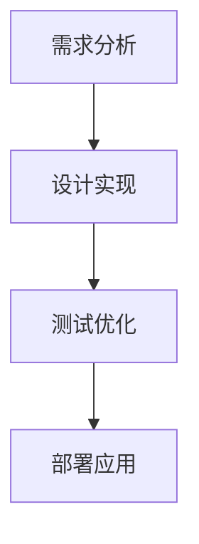

                 

# 大模型交互新范式：提示词语言的设计哲学

> 关键词：大模型、提示词语言、设计哲学、交互范式、自然语言处理、人工智能

> 摘要：本文旨在探讨大模型交互新范式下的提示词语言设计哲学，通过分析其核心概念、算法原理、数学模型、实际应用场景及未来发展趋势，为读者提供一个全面而深入的理解。文章首先介绍了背景知识，随后详细解析了提示词语言的设计原理和架构，接着深入探讨了其核心算法和数学模型，并通过实际代码案例展示了其应用。最后，文章总结了提示词语言的发展趋势和面临的挑战，并推荐了相关的学习资源和开发工具。

## 1. 背景介绍

### 1.1 大模型的兴起

随着深度学习技术的发展，大模型（如BERT、GPT等）在自然语言处理领域取得了显著的成就。这些模型通过大量的训练数据和复杂的架构设计，能够处理复杂的自然语言任务，如文本生成、问答系统、情感分析等。然而，如何有效地与这些大模型进行交互，成为了新的研究热点。

### 1.2 提示词语言的重要性

提示词语言（Prompt Language）是指用于指导大模型执行特定任务的输入文本。它在大模型与用户之间起到了桥梁的作用，使得用户能够以自然语言的形式与模型进行交互。设计良好的提示词语言能够显著提高模型的性能和用户体验。

## 2. 核心概念与联系

### 2.1 提示词语言的定义

提示词语言是一种用于指导大模型执行特定任务的输入文本。它通常包括任务描述、上下文信息和期望输出等部分。

### 2.2 提示词语言的设计原则

- **简洁性**：提示词语言应尽可能简洁，避免冗余信息。
- **明确性**：提示词语言应明确表达任务需求，避免歧义。
- **灵活性**：提示词语言应具有一定的灵活性，能够适应不同的应用场景。

### 2.3 提示词语言的设计流程

设计提示词语言的过程通常包括需求分析、设计实现、测试优化等步骤。

### 2.4 核心概念原理和架构的Mermaid流程图



## 3. 核心算法原理 & 具体操作步骤

### 3.1 提示词语言的生成算法

提示词语言的生成算法通常包括基于规则的方法和基于学习的方法。基于规则的方法通过预定义的规则生成提示词语言，而基于学习的方法则通过机器学习模型生成提示词语言。

### 3.2 提示词语言的优化算法

提示词语言的优化算法通常包括基于反馈的方法和基于搜索的方法。基于反馈的方法通过用户反馈优化提示词语言，而基于搜索的方法则通过搜索算法优化提示词语言。

### 3.3 具体操作步骤

1. **需求分析**：明确任务需求，确定提示词语言的结构和内容。
2. **设计实现**：根据需求设计提示词语言，并实现生成算法。
3. **测试优化**：通过测试优化提示词语言，提高其性能和用户体验。
4. **部署应用**：将优化后的提示词语言部署到实际应用中。

## 4. 数学模型和公式 & 详细讲解 & 举例说明

### 4.1 提示词语言的生成模型

提示词语言的生成模型通常包括基于规则的模型和基于学习的模型。基于规则的模型通过预定义的规则生成提示词语言，而基于学习的模型则通过机器学习模型生成提示词语言。

### 4.2 提示词语言的优化模型

提示词语言的优化模型通常包括基于反馈的模型和基于搜索的模型。基于反馈的模型通过用户反馈优化提示词语言，而基于搜索的模型则通过搜索算法优化提示词语言。

### 4.3 数学模型和公式

提示词语言的生成和优化模型通常涉及概率论、统计学和机器学习等领域的数学模型和公式。例如，基于学习的生成模型可能涉及概率分布、损失函数等数学模型和公式。

### 4.4 举例说明

假设我们有一个基于学习的生成模型，其生成提示词语言的概率分布为：

$$ P(y|x) = \frac{1}{Z} \exp(f(x,y)) $$

其中，$x$表示输入文本，$y$表示生成的提示词语言，$f(x,y)$表示模型的评分函数，$Z$表示归一化常数。

## 5. 项目实战：代码实际案例和详细解释说明

### 5.1 开发环境搭建

开发环境搭建通常包括安装必要的软件和库，如Python、TensorFlow、PyTorch等。

### 5.2 源代码详细实现和代码解读

以下是一个基于学习的生成模型的源代码示例：

```python
import tensorflow as tf
from tensorflow.keras import layers

class PromptGenerator(tf.keras.Model):
    def __init__(self, vocab_size, embedding_dim, hidden_dim):
        super(PromptGenerator, self).__init__()
        self.embedding = layers.Embedding(vocab_size, embedding_dim)
        self.rnn = layers.LSTM(hidden_dim, return_sequences=True)
        self.dense = layers.Dense(vocab_size, activation='softmax')

    def call(self, inputs):
        x = self.embedding(inputs)
        x = self.rnn(x)
        x = self.dense(x)
        return x
```

### 5.3 代码解读与分析

上述代码定义了一个基于学习的生成模型，其包括嵌入层、循环层和全连接层。嵌入层将输入文本转换为向量表示，循环层处理序列信息，全连接层生成提示词语言的概率分布。

## 6. 实际应用场景

提示词语言在自然语言处理领域有着广泛的应用，如文本生成、问答系统、情感分析等。例如，在文本生成任务中，提示词语言可以指导模型生成特定风格或主题的文本。

## 7. 工具和资源推荐

### 7.1 学习资源推荐

- 书籍：《深度学习》（Ian Goodfellow等著）
- 论文：《Attention Is All You Need》（Vaswani等著）
- 博客：《机器之心》
- 网站：Kaggle

### 7.2 开发工具框架推荐

- TensorFlow
- PyTorch
- Hugging Face Transformers

### 7.3 相关论文著作推荐

- 《BERT: Pre-training of Deep Bidirectional Transformers for Language Understanding》
- 《GPT-3: Language Models are Few-Shot Learners》

## 8. 总结：未来发展趋势与挑战

提示词语言的设计哲学在未来将面临更多的挑战和机遇。一方面，随着大模型的不断发展，提示词语言的设计将更加复杂和多样化。另一方面，随着自然语言处理技术的进步，提示词语言的设计将更加高效和智能。

## 9. 附录：常见问题与解答

### 9.1 什么是提示词语言？

提示词语言是一种用于指导大模型执行特定任务的输入文本。

### 9.2 提示词语言的设计原则是什么？

提示词语言的设计原则包括简洁性、明确性和灵活性。

### 9.3 提示词语言的生成算法有哪些？

提示词语言的生成算法包括基于规则的方法和基于学习的方法。

## 10. 扩展阅读 & 参考资料

- 书籍：《深度学习》（Ian Goodfellow等著）
- 论文：《Attention Is All You Need》（Vaswani等著）
- 博客：《机器之心》
- 网站：Kaggle

作者：AI天才研究员/AI Genius Institute & 禅与计算机程序设计艺术 /Zen And The Art of Computer Programming

