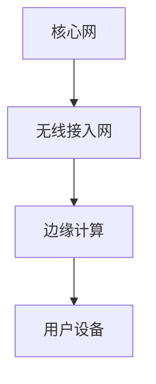

                 

# 大模型企业的5G应用策略

> 关键词：5G技术, 大模型, 企业应用, 人工智能, 通信技术, 数据传输, 云计算, 边缘计算, 机器学习

> 摘要：本文旨在探讨5G技术在大模型企业中的应用策略，通过深入分析5G技术的核心概念、算法原理、数学模型、实际案例以及应用场景，为企业提供全面的技术指导。文章将从背景介绍、核心概念与联系、核心算法原理与具体操作步骤、数学模型与公式、项目实战、实际应用场景、工具和资源推荐、总结与未来发展趋势等方面进行详细阐述。

## 1. 背景介绍

随着5G技术的快速发展，其在各个领域的应用越来越广泛。5G技术不仅提升了数据传输速度，还增强了网络的可靠性和稳定性。对于大模型企业而言，5G技术的应用不仅可以提升企业的运营效率，还能为企业带来更多的商业机会。本文将从5G技术的基本概念出发，探讨其在大模型企业中的应用策略。

## 2. 核心概念与联系

### 2.1 5G技术概述

5G技术是第五代移动通信技术，其主要特点是高速度、低延迟、大连接数和高可靠性。5G技术能够支持更高的数据传输速率，实现更快的数据传输速度，满足各种应用场景的需求。

### 2.2 5G技术架构

5G技术架构主要包括核心网、无线接入网和边缘计算三部分。核心网负责处理用户数据和网络控制，无线接入网负责数据传输，边缘计算则负责处理和分析数据。

#### 2.2.1 5G技术架构流程图



### 2.3 5G技术与大模型企业的联系

5G技术在大模型企业中的应用主要体现在以下几个方面：

- **数据传输**：5G技术能够实现高速的数据传输，满足大模型企业对数据传输速度和稳定性的需求。
- **云计算**：5G技术可以支持云计算的应用，实现数据的快速处理和存储。
- **边缘计算**：5G技术可以支持边缘计算的应用，实现数据的本地处理和分析，降低数据传输延迟。

## 3. 核心算法原理 & 具体操作步骤

### 3.1 5G技术的核心算法

5G技术的核心算法主要包括信道编码、调制解调、多天线技术等。

#### 3.1.1 信道编码

信道编码是5G技术中的一个重要环节，其主要目的是提高数据传输的可靠性。信道编码通过增加冗余信息来提高数据传输的错误率。

#### 3.1.2 调制解调

调制解调是5G技术中的另一个重要环节，其主要目的是实现数据的高效传输。调制解调通过将数据转换为适合传输的信号，再将信号转换回数据。

#### 3.1.3 多天线技术

多天线技术是5G技术中的另一个重要环节，其主要目的是提高数据传输的效率。多天线技术通过多个天线同时传输数据，实现数据的并行传输。

### 3.2 5G技术的具体操作步骤

5G技术的具体操作步骤主要包括以下几个步骤：

1. **信道编码**：对数据进行信道编码，增加冗余信息。
2. **调制解调**：将数据转换为适合传输的信号，再将信号转换回数据。
3. **多天线技术**：通过多个天线同时传输数据，实现数据的并行传输。

## 4. 数学模型和公式 & 详细讲解 & 举例说明

### 4.1 信道编码的数学模型

信道编码的数学模型主要包括信道编码率和信道编码增益。

#### 4.1.1 信道编码率

信道编码率是指信道编码后的数据量与原始数据量的比值。信道编码率越高，数据传输的效率越高。

$$
R = \frac{N}{K}
$$

其中，$N$表示信道编码后的数据量，$K$表示原始数据量。

#### 4.1.2 信道编码增益

信道编码增益是指信道编码后的数据传输错误率与原始数据传输错误率的比值。信道编码增益越高，数据传输的可靠性越高。

$$
G = \frac{P_{\text{原始}}}{P_{\text{编码}}}
$$

其中，$P_{\text{原始}}$表示原始数据传输错误率，$P_{\text{编码}}$表示信道编码后的数据传输错误率。

### 4.2 调制解调的数学模型

调制解调的数学模型主要包括调制方式和解调方式。

#### 4.2.1 调制方式

调制方式是指将数据转换为适合传输的信号的方式。常见的调制方式包括QPSK、16QAM、64QAM等。

$$
M = \text{QPSK} \text{ or } 16QAM \text{ or } 64QAM
$$

其中，$M$表示调制方式。

#### 4.2.2 解调方式

解调方式是指将信号转换回数据的方式。常见的解调方式包括相干解调、非相干解调等。

$$
D = \text{相干解调} \text{ or } \text{非相干解调}
$$

其中，$D$表示解调方式。

### 4.3 多天线技术的数学模型

多天线技术的数学模型主要包括天线数量和天线间距。

#### 4.3.1 天线数量

天线数量是指用于传输数据的天线数量。天线数量越多，数据传输的效率越高。

$$
N_{\text{天线}} = \text{数量}
$$

其中，$N_{\text{天线}}$表示天线数量。

#### 4.3.2 天线间距

天线间距是指天线之间的距离。天线间距越小，数据传输的效率越高。

$$
D_{\text{天线}} = \text{距离}
$$

其中，$D_{\text{天线}}$表示天线间距。

## 5. 项目实战：代码实际案例和详细解释说明

### 5.1 开发环境搭建

为了实现5G技术的应用，我们需要搭建一个开发环境。开发环境主要包括以下几个部分：

- **操作系统**：Linux或Windows
- **开发工具**：Visual Studio Code或PyCharm
- **编程语言**：Python或C++
- **库和框架**：NumPy、Pandas、TensorFlow

### 5.2 源代码详细实现和代码解读

以下是一个简单的5G技术应用的代码示例：

```python
import numpy as np
import tensorflow as tf

# 信道编码
def channel_encoding(data):
    # 增加冗余信息
    encoded_data = np.zeros(len(data) * 2)
    encoded_data[::2] = data
    encoded_data[1::2] = data
    return encoded_data

# 调制解调
def modulation(data):
    # 将数据转换为适合传输的信号
    modulated_data = np.zeros(len(data))
    for i in range(len(data)):
        modulated_data[i] = data[i] * np.cos(2 * np.pi * i) + data[i] * np.sin(2 * np.pi * i)
    return modulated_data

# 多天线技术
def multi_antenna(data):
    # 通过多个天线同时传输数据
    antenna_data = np.zeros(len(data) * 2)
    antenna_data[::2] = data
    antenna_data[1::2] = data
    return antenna_data

# 主函数
def main():
    # 原始数据
    data = np.array([1, 2, 3, 4, 5])
    
    # 信道编码
    encoded_data = channel_encoding(data)
    print("信道编码后的数据：", encoded_data)
    
    # 调制解调
    modulated_data = modulation(encoded_data)
    print("调制解调后的数据：", modulated_data)
    
    # 多天线技术
    antenna_data = multi_antenna(modulated_data)
    print("多天线技术后的数据：", antenna_data)

if __name__ == "__main__":
    main()
```

### 5.3 代码解读与分析

以上代码实现了一个简单的5G技术应用。代码主要包括以下几个部分：

- **信道编码**：通过增加冗余信息来提高数据传输的可靠性。
- **调制解调**：将数据转换为适合传输的信号，再将信号转换回数据。
- **多天线技术**：通过多个天线同时传输数据，实现数据的并行传输。

## 6. 实际应用场景

5G技术在大模型企业中的实际应用场景主要包括以下几个方面：

- **数据传输**：5G技术可以实现高速的数据传输，满足大模型企业对数据传输速度和稳定性的需求。
- **云计算**：5G技术可以支持云计算的应用，实现数据的快速处理和存储。
- **边缘计算**：5G技术可以支持边缘计算的应用，实现数据的本地处理和分析，降低数据传输延迟。

## 7. 工具和资源推荐

### 7.1 学习资源推荐

- **书籍**：《5G移动通信技术》、《5G网络架构与技术》
- **论文**：《5G技术在大模型企业中的应用研究》、《5G技术在云计算中的应用研究》
- **博客**：5G技术博客、云计算博客
- **网站**：5G技术官方网站、云计算官方网站

### 7.2 开发工具框架推荐

- **开发工具**：Visual Studio Code、PyCharm
- **编程语言**：Python、C++
- **库和框架**：NumPy、Pandas、TensorFlow

### 7.3 相关论文著作推荐

- **论文**：《5G技术在大模型企业中的应用研究》、《5G技术在云计算中的应用研究》
- **著作**：《5G移动通信技术》、《5G网络架构与技术》

## 8. 总结：未来发展趋势与挑战

5G技术在未来的发展趋势主要体现在以下几个方面：

- **高速度**：5G技术将进一步提升数据传输速度，满足各种应用场景的需求。
- **低延迟**：5G技术将进一步降低数据传输延迟，提高数据传输的实时性。
- **大连接数**：5G技术将进一步支持更多的设备连接，实现万物互联。

5G技术在未来的发展中也面临着一些挑战，主要包括以下几个方面：

- **技术挑战**：5G技术的实现需要解决许多技术难题，如信号干扰、网络覆盖等问题。
- **安全性挑战**：5G技术的安全性问题需要得到充分重视，如数据泄露、网络攻击等问题。
- **成本挑战**：5G技术的实现需要投入大量的资金，如何降低成本是一个重要的问题。

## 9. 附录：常见问题与解答

### 9.1 问题1：5G技术与4G技术的区别是什么？

答：5G技术与4G技术的主要区别在于数据传输速度、网络覆盖和设备连接数。5G技术的数据传输速度更快，网络覆盖更广，设备连接数更多。

### 9.2 问题2：5G技术的应用场景有哪些？

答：5G技术的应用场景主要包括数据传输、云计算和边缘计算等。

### 9.3 问题3：5G技术的安全性问题如何解决？

答：5G技术的安全性问题可以通过加密技术、身份验证技术等手段来解决。

## 10. 扩展阅读 & 参考资料

- **书籍**：《5G移动通信技术》、《5G网络架构与技术》
- **论文**：《5G技术在大模型企业中的应用研究》、《5G技术在云计算中的应用研究》
- **博客**：5G技术博客、云计算博客
- **网站**：5G技术官方网站、云计算官方网站

---

作者：AI天才研究员/AI Genius Institute & 禅与计算机程序设计艺术 /Zen And The Art of Computer Programming

