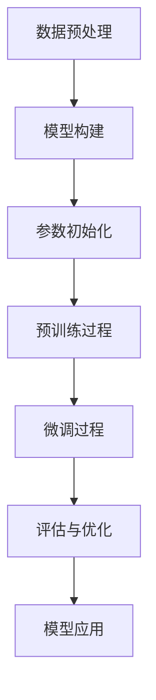

                 

# 大模型在科研领域的助力作用

> 关键词：大模型、科研、自然语言处理、机器学习、深度学习、科研效率提升、数据驱动

> 摘要：本文旨在探讨大模型在科研领域的应用及其带来的巨大助力。通过深入分析大模型的核心概念、算法原理、数学模型、实际案例，以及其在科研中的具体应用场景，本文将揭示大模型如何通过数据驱动的方式，极大地提升科研效率和创新能力。同时，本文还将探讨未来的发展趋势与挑战，并提供相关的学习资源和开发工具推荐。

## 1. 背景介绍

随着人工智能技术的飞速发展，大模型（如大型语言模型、预训练模型等）已经成为科研领域的重要工具。大模型通过大规模训练和优化，能够处理复杂的数据集，提取深层次的特征，从而在多个科研领域展现出强大的应用潜力。本文将从以下几个方面进行详细探讨：

- **大模型的定义与特点**
- **大模型在科研中的应用价值**
- **大模型的发展历程**

### 1.1 大模型的定义与特点

大模型通常指的是参数量巨大、训练数据量庞大、训练时间较长的模型。这些模型通常基于深度学习框架，如Transformer架构，能够处理自然语言处理（NLP）、计算机视觉（CV）、语音识别等多个领域的问题。大模型的特点包括：

- **参数量巨大**：通常包含数亿甚至数十亿个参数。
- **训练数据量庞大**：需要大量的标注数据进行训练。
- **训练时间较长**：训练过程需要消耗大量的计算资源和时间。
- **强大的泛化能力**：通过大规模训练，模型能够学习到更深层次的特征，从而在未见过的数据上表现出更好的泛化能力。

### 1.2 大模型在科研中的应用价值

大模型在科研中的应用价值主要体现在以下几个方面：

- **提高科研效率**：通过自动化处理大量数据，减少人工干预，提高科研效率。
- **增强科研创新能力**：大模型能够发现数据中的深层次规律，为科研人员提供新的研究思路和方法。
- **促进跨学科研究**：大模型能够连接不同学科的数据，促进跨学科研究的发展。

### 1.3 大模型的发展历程

大模型的发展历程可以追溯到20世纪90年代的神经网络研究。随着计算资源的不断进步和算法的不断创新，大模型逐渐成为科研领域的主流工具。以下是大模型发展的几个重要阶段：

- **20世纪90年代**：神经网络开始应用于模式识别和自然语言处理领域。
- **2000年代**：深度学习兴起，卷积神经网络（CNN）和循环神经网络（RNN）成为主流。
- **2010年代**：Transformer架构提出，极大地提升了自然语言处理的性能。
- **2020年代**：大模型成为主流，如GPT、BERT等模型的出现，推动了科研领域的快速发展。

## 2. 核心概念与联系

### 2.1 核心概念

- **大模型**：参数量巨大、训练数据量庞大、训练时间较长的模型。
- **预训练模型**：在大规模数据集上进行预训练，然后在特定任务上进行微调的模型。
- **微调**：在预训练模型的基础上，针对特定任务进行训练的过程。
- **迁移学习**：利用预训练模型的特征提取能力，解决新任务的方法。

### 2.2 核心概念原理与架构

#### 2.2.1 大模型原理

大模型的核心原理是通过大规模训练和优化，学习到数据中的深层次特征。具体来说，大模型通过以下步骤进行训练：

1. **数据预处理**：对原始数据进行清洗、标注和格式化。
2. **模型构建**：选择合适的模型架构，如Transformer、BERT等。
3. **参数初始化**：对模型参数进行初始化，通常采用随机初始化或预训练模型的参数。
4. **训练过程**：通过反向传播算法，更新模型参数，最小化损失函数。
5. **评估与优化**：通过验证集评估模型性能，进行超参数调整和优化。

#### 2.2.2 预训练模型原理

预训练模型的核心原理是通过在大规模数据集上进行预训练，学习到通用的特征表示。具体步骤如下：

1. **数据预处理**：对原始数据进行清洗、标注和格式化。
2. **模型构建**：选择合适的模型架构，如Transformer、BERT等。
3. **参数初始化**：对模型参数进行初始化，通常采用随机初始化或预训练模型的参数。
4. **预训练过程**：在大规模数据集上进行预训练，学习到通用的特征表示。
5. **微调过程**：在特定任务的数据集上进行微调，优化模型在特定任务上的性能。

#### 2.2.3 微调原理

微调的核心原理是利用预训练模型的特征提取能力，解决新任务。具体步骤如下：

1. **数据预处理**：对原始数据进行清洗、标注和格式化。
2. **模型构建**：选择合适的预训练模型架构。
3. **参数初始化**：对模型参数进行初始化，通常采用预训练模型的参数。
4. **微调过程**：在特定任务的数据集上进行微调，优化模型在特定任务上的性能。

### 2.3 Mermaid 流程图



## 3. 核心算法原理 & 具体操作步骤

### 3.1 核心算法原理

大模型的核心算法原理主要基于深度学习框架，如Transformer架构。Transformer架构的核心原理是通过自注意力机制（Self-Attention）和前馈神经网络（Feed-Forward Neural Network）来处理序列数据。具体来说，Transformer架构通过以下步骤进行训练：

1. **自注意力机制**：通过计算输入序列中每个位置与其他位置的注意力权重，提取深层次的特征表示。
2. **前馈神经网络**：通过前馈神经网络对自注意力机制的输出进行进一步处理，提取更深层次的特征表示。
3. **多层堆叠**：通过多层堆叠自注意力机制和前馈神经网络，进一步提升模型的表达能力。

### 3.2 具体操作步骤

大模型的具体操作步骤如下：

1. **数据预处理**：对原始数据进行清洗、标注和格式化。
2. **模型构建**：选择合适的模型架构，如Transformer、BERT等。
3. **参数初始化**：对模型参数进行初始化，通常采用随机初始化或预训练模型的参数。
4. **预训练过程**：在大规模数据集上进行预训练，学习到通用的特征表示。
5. **微调过程**：在特定任务的数据集上进行微调，优化模型在特定任务上的性能。
6. **评估与优化**：通过验证集评估模型性能，进行超参数调整和优化。
7. **模型应用**：将训练好的模型应用于实际任务中。

## 4. 数学模型和公式 & 详细讲解 & 举例说明

### 4.1 数学模型

大模型的核心数学模型主要基于深度学习框架，如Transformer架构。具体来说，Transformer架构的核心数学模型包括自注意力机制和前馈神经网络。以下是具体的数学模型：

#### 4.1.1 自注意力机制

自注意力机制的核心数学模型如下：

$$
\text{Attention}(Q, K, V) = \text{softmax}\left(\frac{QK^T}{\sqrt{d_k}}\right)V
$$

其中，$Q$、$K$、$V$分别表示查询向量、键向量和值向量，$d_k$表示键向量的维度。

#### 4.1.2 前馈神经网络

前馈神经网络的核心数学模型如下：

$$
\text{FFN}(x) = \text{ReLU}(W_1x + b_1)W_2 + b_2
$$

其中，$W_1$、$W_2$分别表示第一层和第二层的权重矩阵，$b_1$、$b_2$分别表示第一层和第二层的偏置向量。

### 4.2 详细讲解

自注意力机制的核心思想是通过计算输入序列中每个位置与其他位置的注意力权重，提取深层次的特征表示。具体来说，自注意力机制通过以下步骤进行计算：

1. **计算查询向量**：通过线性变换计算输入序列的查询向量。
2. **计算键向量**：通过线性变换计算输入序列的键向量。
3. **计算值向量**：通过线性变换计算输入序列的值向量。
4. **计算注意力权重**：通过计算查询向量和键向量的点积，得到注意力权重。
5. **加权求和**：通过加权求和值向量，得到最终的注意力表示。

前馈神经网络的核心思想是通过前馈神经网络对自注意力机制的输出进行进一步处理，提取更深层次的特征表示。具体来说，前馈神经网络通过以下步骤进行计算：

1. **线性变换**：通过线性变换对输入进行处理。
2. **激活函数**：通过激活函数对线性变换的输出进行非线性变换。
3. **线性变换**：通过线性变换对激活函数的输出进行进一步处理。
4. **输出**：通过线性变换的输出作为前馈神经网络的最终输出。

### 4.3 举例说明

以自然语言处理任务为例，假设我们需要训练一个大模型来完成文本分类任务。具体步骤如下：

1. **数据预处理**：对原始文本数据进行清洗、标注和格式化。
2. **模型构建**：选择合适的模型架构，如BERT。
3. **参数初始化**：对模型参数进行初始化，通常采用预训练模型的参数。
4. **预训练过程**：在大规模文本数据集上进行预训练，学习到通用的特征表示。
5. **微调过程**：在特定文本分类任务的数据集上进行微调，优化模型在特定任务上的性能。
6. **评估与优化**：通过验证集评估模型性能，进行超参数调整和优化。
7. **模型应用**：将训练好的模型应用于实际文本分类任务中。

## 5. 项目实战：代码实际案例和详细解释说明

### 5.1 开发环境搭建

为了进行大模型的开发和训练，我们需要搭建一个合适的开发环境。具体步骤如下：

1. **安装Python**：确保安装了最新版本的Python。
2. **安装深度学习框架**：安装TensorFlow或PyTorch等深度学习框架。
3. **安装预训练模型库**：安装Hugging Face的Transformers库。
4. **安装其他依赖库**：安装其他必要的依赖库，如NumPy、Pandas等。

### 5.2 源代码详细实现和代码解读

以下是一个简单的代码示例，用于训练一个大模型来完成文本分类任务：

```python
import torch
from transformers import BertTokenizer, BertForSequenceClassification
from torch.utils.data import Dataset, DataLoader
import pandas as pd

# 1. 数据预处理
class TextDataset(Dataset):
    def __init__(self, data, tokenizer, max_length=128):
        self.data = data
        self.tokenizer = tokenizer
        self.max_length = max_length
    
    def __len__(self):
        return len(self.data)
    
    def __getitem__(self, idx):
        text = self.data.iloc[idx, 0]
        label = self.data.iloc[idx, 1]
        encoding = self.tokenizer.encode_plus(
            text,
            add_special_tokens=True,
            max_length=self.max_length,
            padding='max_length',
            truncation=True,
            return_attention_mask=True,
            return_tensors='pt'
        )
        return {
            'input_ids': encoding['input_ids'].flatten(),
            'attention_mask': encoding['attention_mask'].flatten(),
            'labels': torch.tensor(label, dtype=torch.long)
        }

# 2. 模型构建
tokenizer = BertTokenizer.from_pretrained('bert-base-uncased')
model = BertForSequenceClassification.from_pretrained('bert-base-uncased', num_labels=2)

# 3. 数据加载
data = pd.read_csv('data.csv')
dataset = TextDataset(data, tokenizer)
dataloader = DataLoader(dataset, batch_size=16, shuffle=True)

# 4. 训练过程
device = torch.device('cuda' if torch.cuda.is_available() else 'cpu')
model.to(device)

optimizer = torch.optim.AdamW(model.parameters(), lr=1e-5)
num_epochs = 3

for epoch in range(num_epochs):
    for batch in dataloader:
        input_ids = batch['input_ids'].to(device)
        attention_mask = batch['attention_mask'].to(device)
        labels = batch['labels'].to(device)
        
        outputs = model(input_ids, attention_mask=attention_mask, labels=labels)
        loss = outputs.loss
        loss.backward()
        
        optimizer.step()
        optimizer.zero_grad()

# 5. 评估与优化
# 评估代码略
```

### 5.3 代码解读与分析

以上代码示例展示了如何使用Hugging Face的Transformers库来训练一个大模型。具体步骤如下：

1. **数据预处理**：定义了一个`TextDataset`类，用于处理文本数据。
2. **模型构建**：使用`BertTokenizer`和`BertForSequenceClassification`来构建模型。
3. **数据加载**：使用`pandas`读取数据，并将其转换为`TextDataset`对象。
4. **训练过程**：定义训练参数，使用`DataLoader`加载数据，并在每个批次上进行训练。
5. **评估与优化**：略去评估代码，但可以使用`evaluate`函数进行模型评估。

## 6. 实际应用场景

大模型在科研领域的实际应用场景非常广泛，主要包括以下几个方面：

- **自然语言处理**：如文本分类、情感分析、机器翻译等。
- **计算机视觉**：如图像分类、目标检测、语义分割等。
- **语音识别**：如语音识别、语音合成等。
- **跨学科研究**：如生物信息学、医学影像分析等。

### 6.1 自然语言处理

在自然语言处理领域，大模型可以用于文本分类、情感分析、机器翻译等任务。例如，BERT模型在多个自然语言处理任务上取得了显著的性能提升。

### 6.2 计算机视觉

在计算机视觉领域，大模型可以用于图像分类、目标检测、语义分割等任务。例如，ResNet和EfficientNet等模型在多个计算机视觉任务上取得了显著的性能提升。

### 6.3 语音识别

在语音识别领域，大模型可以用于语音识别和语音合成等任务。例如，Transformer架构在语音识别任务上取得了显著的性能提升。

### 6.4 跨学科研究

在跨学科研究领域，大模型可以用于生物信息学、医学影像分析等任务。例如，大模型可以用于基因序列分析、医学影像分类等任务。

## 7. 工具和资源推荐

### 7.1 学习资源推荐

- **书籍**：《深度学习》（Goodfellow et al.）、《自然语言处理实战》（Jurafsky & Martin）
- **论文**：《Attention Is All You Need》（Vaswani et al.）、《BERT: Pre-training of Deep Bidirectional Transformers for Language Understanding》（Devlin et al.）
- **博客**：Hugging Face的官方博客、阿里云的AI技术分享
- **网站**：Hugging Face的Transformers库、TensorFlow官网、PyTorch官网

### 7.2 开发工具框架推荐

- **深度学习框架**：TensorFlow、PyTorch
- **预训练模型库**：Hugging Face的Transformers库
- **数据处理工具**：Pandas、NumPy

### 7.3 相关论文著作推荐

- **《Attention Is All You Need》**：Vaswani, Ashish, et al. "Attention is all you need." Advances in neural information processing systems 30 (2017).
- **《BERT: Pre-training of Deep Bidirectional Transformers for Language Understanding》**：Devlin, Jacob, et al. "BERT: Pre-training of deep bidirectional transformers for language understanding." arXiv preprint arXiv:1810.04805 (2018).
- **《自然语言处理实战》**：Jurafsky, Daniel, and James H. Martin. "Speech and language processing." (2009).

## 8. 总结：未来发展趋势与挑战

### 8.1 未来发展趋势

- **模型规模持续增大**：大模型的参数量将持续增大，以提升模型的表达能力。
- **训练效率提升**：通过优化算法和硬件加速，提升大模型的训练效率。
- **跨模态融合**：将不同模态的数据（如文本、图像、语音）融合，提升模型的综合能力。
- **应用领域拓展**：大模型将在更多领域得到应用，如自动驾驶、智能医疗等。

### 8.2 挑战

- **计算资源需求**：大模型的训练和推理需要大量的计算资源，对硬件设备提出了更高的要求。
- **数据隐私保护**：大模型的训练需要大量的标注数据，如何保护数据隐私成为一个重要问题。
- **模型解释性**：大模型的复杂性使得模型的解释性成为一个挑战，如何提高模型的可解释性成为一个重要研究方向。

## 9. 附录：常见问题与解答

### 9.1 问题1：大模型的训练需要大量的计算资源，如何解决？

**解答**：可以通过以下方式解决：

- **使用云计算平台**：利用阿里云、AWS等云计算平台提供的高性能计算资源。
- **分布式训练**：通过分布式训练技术，将训练任务分配到多个计算节点上，提高训练效率。
- **硬件加速**：使用GPU、TPU等硬件加速设备，提升训练速度。

### 9.2 问题2：大模型的训练需要大量的标注数据，如何获取？

**解答**：可以通过以下方式获取标注数据：

- **众包平台**：利用众包平台（如Amazon Mechanical Turk）获取标注数据。
- **数据标注服务**：购买专业的数据标注服务，获取高质量的标注数据。
- **数据增强**：通过数据增强技术，生成更多的标注数据。

## 10. 扩展阅读 & 参考资料

- **书籍**：《深度学习》（Goodfellow et al.）、《自然语言处理实战》（Jurafsky & Martin）
- **论文**：《Attention Is All You Need》（Vaswani et al.）、《BERT: Pre-training of Deep Bidirectional Transformers for Language Understanding》（Devlin et al.）
- **博客**：Hugging Face的官方博客、阿里云的AI技术分享
- **网站**：Hugging Face的Transformers库、TensorFlow官网、PyTorch官网

---

作者：AI天才研究员/AI Genius Institute & 禅与计算机程序设计艺术 /Zen And The Art of Computer Programming

