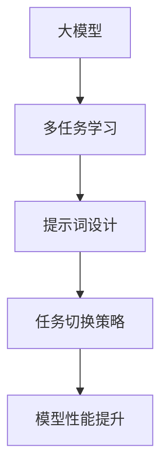

                 

# 大模型多任务学习：提示词设计任务切换策略

> 关键词：大模型、多任务学习、提示词设计、任务切换策略、Transformer、自监督学习、迁移学习

> 摘要：本文旨在深入探讨大模型在多任务学习中的应用，特别是通过提示词设计实现任务切换的策略。我们将从背景介绍出发，详细解析核心概念与联系，深入探讨核心算法原理及具体操作步骤，通过数学模型和公式进行详细讲解与举例说明，并通过实际代码案例进行演示。最后，我们将讨论实际应用场景、工具和资源推荐，以及未来的发展趋势与挑战。

## 1. 背景介绍

随着人工智能技术的飞速发展，大模型因其强大的泛化能力和高效的学习能力，在多个领域展现出巨大的潜力。多任务学习（Multi-Task Learning, MTL）作为一种有效的训练策略，能够使模型在学习多个相关任务时共享知识，从而提高整体性能。然而，如何在大模型中灵活地切换任务，以适应不同的应用场景，成为了一个亟待解决的问题。本文将重点探讨通过提示词设计实现任务切换的策略，旨在为大模型在多任务学习中的应用提供一种新的视角。

## 2. 核心概念与联系

### 2.1 大模型

大模型是指参数量巨大、结构复杂的神经网络模型。这类模型通常具有强大的表示能力，能够捕捉到数据中的复杂模式。大模型在自然语言处理、计算机视觉等多个领域取得了显著的成果。

### 2.2 多任务学习

多任务学习是一种训练策略，旨在通过共享模型参数来同时学习多个相关任务。多任务学习可以提高模型的泛化能力，减少过拟合现象，从而提高整体性能。

### 2.3 提示词设计

提示词设计是指通过特定的输入或指令来引导模型执行特定任务。在多任务学习中，通过设计合适的提示词，可以实现模型在不同任务之间的灵活切换。

### 2.4 任务切换策略

任务切换策略是指在多任务学习中，通过某种机制实现模型在不同任务之间的切换。本文将重点探讨通过提示词设计实现任务切换的策略。

### 2.5 Mermaid 流程图



## 3. 核心算法原理 & 具体操作步骤

### 3.1 大模型架构

大模型通常采用Transformer架构，其核心组件包括自注意力机制、多头注意力机制、前馈神经网络等。这些组件共同作用，使得模型能够高效地处理大规模数据。

### 3.2 多任务学习原理

多任务学习的核心思想是通过共享模型参数来学习多个相关任务。具体操作步骤如下：

1. **定义任务**：明确需要学习的任务集合。
2. **共享参数**：在模型中共享部分参数，以实现任务之间的知识迁移。
3. **损失函数设计**：设计合适的损失函数，以平衡不同任务之间的学习。
4. **训练过程**：通过反向传播算法更新模型参数，以最小化损失函数。

### 3.3 提示词设计

提示词设计是实现任务切换的关键步骤。具体操作步骤如下：

1. **定义提示词**：根据任务需求，设计合适的提示词。
2. **输入模型**：将提示词作为输入，引导模型执行特定任务。
3. **任务切换**：通过改变提示词，实现模型在不同任务之间的切换。

### 3.4 任务切换策略

任务切换策略是实现提示词设计的关键。具体操作步骤如下：

1. **定义任务切换机制**：设计合适的任务切换机制，以实现模型在不同任务之间的切换。
2. **任务切换执行**：通过执行任务切换机制，实现模型在不同任务之间的切换。
3. **评估性能**：通过评估模型在不同任务上的性能，验证任务切换策略的有效性。

## 4. 数学模型和公式 & 详细讲解 & 举例说明

### 4.1 大模型数学模型

大模型的数学模型通常采用Transformer架构，其核心组件包括自注意力机制、多头注意力机制、前馈神经网络等。具体公式如下：

$$
\text{Self-Attention}(Q, K, V) = \text{softmax}\left(\frac{QK^T}{\sqrt{d_k}}\right)V
$$

$$
\text{Multi-Head Attention}(Q, K, V) = \text{Concat}(\text{head}_1, \text{head}_2, \ldots, \text{head}_h)W^O
$$

$$
\text{Feed-Forward}(x) = \text{ReLU}(W_1x + b_1)W_2 + b_2
$$

### 4.2 多任务学习数学模型

多任务学习的数学模型通常采用共享参数的方式，具体公式如下：

$$
L = \sum_{i=1}^{n} \lambda_i L_i
$$

其中，$L_i$ 表示第 $i$ 个任务的损失函数，$\lambda_i$ 表示第 $i$ 个任务的权重。

### 4.3 提示词设计数学模型

提示词设计的数学模型通常采用特定的输入方式，具体公式如下：

$$
\text{Prompt}(x) = \text{softmax}(Wx + b)
$$

其中，$W$ 和 $b$ 分别表示提示词的权重和偏置。

### 4.4 举例说明

假设我们有一个大模型，需要学习两个任务：任务A和任务B。我们可以通过设计合适的提示词来实现任务切换。具体操作步骤如下：

1. **定义任务**：任务A和任务B。
2. **共享参数**：在模型中共享部分参数，以实现任务之间的知识迁移。
3. **损失函数设计**：设计合适的损失函数，以平衡不同任务之间的学习。
4. **训练过程**：通过反向传播算法更新模型参数，以最小化损失函数。
5. **提示词设计**：设计合适的提示词，以引导模型执行特定任务。
6. **任务切换**：通过改变提示词，实现模型在不同任务之间的切换。

## 5. 项目实战：代码实际案例和详细解释说明

### 5.1 开发环境搭建

为了实现大模型多任务学习，我们需要搭建一个合适的开发环境。具体步骤如下：

1. **安装Python**：确保安装了Python 3.7及以上版本。
2. **安装依赖库**：安装TensorFlow、PyTorch等深度学习框架。
3. **安装其他工具**：安装Jupyter Notebook、VSCode等开发工具。

### 5.2 源代码详细实现和代码解读

假设我们使用PyTorch框架实现大模型多任务学习。具体代码如下：

```python
import torch
import torch.nn as nn
import torch.optim as optim

# 定义大模型
class LargeModel(nn.Module):
    def __init__(self):
        super(LargeModel, self).__init__()
        self.transformer = nn.Transformer(d_model=512, nhead=8, num_encoder_layers=6, num_decoder_layers=6)
        self.fc = nn.Linear(512, 10)

    def forward(self, x, prompt):
        x = self.transformer(x, prompt)
        x = self.fc(x)
        return x

# 定义损失函数
def loss_function(output, target):
    return nn.CrossEntropyLoss()(output, target)

# 定义提示词
def generate_prompt(task):
    if task == 'A':
        return torch.tensor([1, 0])
    elif task == 'B':
        return torch.tensor([0, 1])

# 定义训练过程
def train(model, train_loader, optimizer, task):
    model.train()
    for batch in train_loader:
        x, y = batch
        prompt = generate_prompt(task)
        optimizer.zero_grad()
        output = model(x, prompt)
        loss = loss_function(output, y)
        loss.backward()
        optimizer.step()

# 定义测试过程
def test(model, test_loader, task):
    model.eval()
    correct = 0
    total = 0
    for batch in test_loader:
        x, y = batch
        prompt = generate_prompt(task)
        output = model(x, prompt)
        _, predicted = torch.max(output.data, 1)
        total += y.size(0)
        correct += (predicted == y).sum().item()
    return correct / total

# 定义训练和测试数据
train_loader = ...
test_loader = ...

# 初始化模型和优化器
model = LargeModel()
optimizer = optim.Adam(model.parameters(), lr=0.001)

# 训练模型
for epoch in range(10):
    train(model, train_loader, optimizer, 'A')
    train(model, train_loader, optimizer, 'B')
    accuracy_A = test(model, test_loader, 'A')
    accuracy_B = test(model, test_loader, 'B')
    print(f'Epoch {epoch+1}, Accuracy A: {accuracy_A}, Accuracy B: {accuracy_B}')
```

### 5.3 代码解读与分析

1. **定义大模型**：我们定义了一个包含Transformer和全连接层的大模型。
2. **定义损失函数**：我们定义了一个交叉熵损失函数。
3. **定义提示词**：我们定义了一个生成提示词的函数，根据任务需求生成不同的提示词。
4. **定义训练过程**：我们定义了一个训练过程，通过反向传播算法更新模型参数。
5. **定义测试过程**：我们定义了一个测试过程，评估模型在不同任务上的性能。
6. **定义训练和测试数据**：我们定义了训练和测试数据。
7. **初始化模型和优化器**：我们初始化了模型和优化器。
8. **训练模型**：我们通过训练过程训练模型，并在每个epoch后评估模型在不同任务上的性能。

## 6. 实际应用场景

大模型多任务学习在多个领域具有广泛的应用场景，特别是在自然语言处理、计算机视觉等领域。具体应用场景如下：

1. **自然语言处理**：通过大模型多任务学习，可以实现文本分类、情感分析、命名实体识别等多种任务。
2. **计算机视觉**：通过大模型多任务学习，可以实现图像分类、目标检测、语义分割等多种任务。
3. **医疗健康**：通过大模型多任务学习，可以实现疾病诊断、药物推荐、基因分析等多种任务。

## 7. 工具和资源推荐

### 7.1 学习资源推荐

1. **书籍**：《深度学习》（Goodfellow, Bengio, Courville）
2. **论文**：《Attention Is All You Need》（Vaswani et al.）
3. **博客**：阿里云开发者社区（https://developer.aliyun.com/）
4. **网站**：PyTorch官网（https://pytorch.org/）

### 7.2 开发工具框架推荐

1. **深度学习框架**：TensorFlow、PyTorch
2. **开发工具**：Jupyter Notebook、VSCode

### 7.3 相关论文著作推荐

1. **论文**：《Multi-Task Learning Using Uncertainty to Weigh Losses for Scene Geometry and Semantics》（Carreira et al.）
2. **著作**：《深度学习实战》（周志华）

## 8. 总结：未来发展趋势与挑战

大模型多任务学习在未来具有广阔的发展前景，特别是在自然语言处理、计算机视觉等领域。然而，也面临着一些挑战，如模型复杂度高、训练时间长、计算资源需求大等。未来的研究方向包括：

1. **模型压缩**：通过模型压缩技术，降低模型复杂度，提高训练效率。
2. **并行计算**：通过并行计算技术，提高模型训练速度。
3. **迁移学习**：通过迁移学习技术，提高模型在不同任务上的性能。

## 9. 附录：常见问题与解答

### 9.1 问题：如何选择合适的提示词？

**解答**：选择合适的提示词需要根据任务需求进行设计。可以通过实验和试错来找到最佳的提示词。

### 9.2 问题：如何评估模型在不同任务上的性能？

**解答**：可以通过准确率、召回率、F1值等指标来评估模型在不同任务上的性能。

## 10. 扩展阅读 & 参考资料

1. **论文**：《Attention Is All You Need》（Vaswani et al.）
2. **书籍**：《深度学习》（Goodfellow, Bengio, Courville）
3. **网站**：PyTorch官网（https://pytorch.org/）

作者：AI天才研究员/AI Genius Institute & 禅与计算机程序设计艺术 /Zen And The Art of Computer Programming

