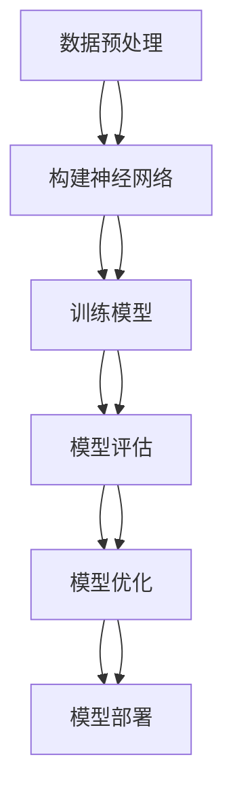

                 

# 大模型时代的创业者创业心态修炼：自我认知、自我管理与自我突破

> 关键词：大模型、创业者、自我认知、自我管理、自我突破、创业心态、技术趋势

> 摘要：在大模型时代，创业者面临着前所未有的机遇与挑战。本文旨在探讨创业者如何通过自我认知、自我管理与自我突破，以适应这一新时代的技术变革。我们将从背景介绍、核心概念与联系、核心算法原理、数学模型与公式、项目实战、实际应用场景、工具和资源推荐、总结与未来趋势等多个维度进行深入分析，帮助创业者在大模型时代实现自我成长与突破。

## 1. 背景介绍

随着人工智能技术的飞速发展，大模型已经成为推动行业变革的关键力量。大模型具有强大的学习能力和泛化能力，能够处理复杂的数据和任务，为各行各业带来前所未有的机遇。然而，大模型的开发与应用也带来了诸多挑战，包括技术难度、资源需求、伦理问题等。创业者需要具备敏锐的洞察力和强大的心理素质，才能在这一时代脱颖而出。

## 2. 核心概念与联系

### 2.1 大模型概述

大模型是指具有大量参数和训练数据的机器学习模型，通常包含数百万甚至数十亿个参数。大模型能够通过深度学习技术，从海量数据中学习复杂的模式和规律，从而实现高精度的预测和决策。大模型的核心在于其强大的泛化能力和自适应能力，能够在不同场景下表现出色。

### 2.2 创业者心态

创业者心态是指创业者在创业过程中所持有的心理状态和思维方式。良好的创业者心态能够帮助创业者克服困难，抓住机遇，实现自我突破。创业者心态包括自我认知、自我管理、自我突破等多个方面，是创业者成功的关键因素之一。

### 2.3 核心概念原理与架构

大模型的核心概念原理包括深度学习、神经网络、注意力机制、自注意力机制等。这些概念原理构成了大模型的基本架构。以下是大模型的基本架构流程图：



## 3. 核心算法原理 & 具体操作步骤

### 3.1 深度学习与神经网络

深度学习是一种基于神经网络的机器学习方法，通过多层神经网络实现对复杂数据的建模。神经网络由输入层、隐藏层和输出层组成，每一层包含多个神经元。神经元之间通过权重连接，形成复杂的网络结构。深度学习的核心在于通过反向传播算法调整权重，实现模型的优化。

### 3.2 注意力机制与自注意力机制

注意力机制是一种用于处理序列数据的方法，能够使模型关注输入序列中的重要部分。自注意力机制是一种特殊的注意力机制，能够在同一序列中进行自我注意力计算，从而捕捉序列内部的依赖关系。自注意力机制的核心在于计算查询、键和值之间的相似度，通过加权求和得到最终的输出。

### 3.3 具体操作步骤

1. **数据预处理**：对原始数据进行清洗、归一化、特征提取等操作，为模型训练做准备。
2. **构建神经网络**：根据任务需求选择合适的网络结构，包括层数、神经元数量、激活函数等。
3. **训练模型**：使用训练数据对模型进行训练，通过反向传播算法调整权重，优化模型性能。
4. **模型评估**：使用验证数据对模型进行评估，计算准确率、损失等指标，判断模型性能。
5. **模型优化**：根据评估结果对模型进行优化，包括调整超参数、增加正则化项等。
6. **模型部署**：将训练好的模型部署到实际应用场景中，实现对新数据的预测和决策。

## 4. 数学模型和公式 & 详细讲解 & 举例说明

### 4.1 深度学习数学模型

深度学习的数学模型主要包括线性代数、概率论与统计学、微积分等。以下是深度学习中常用的数学公式：

1. **线性代数**：向量、矩阵、张量等基本概念。
2. **概率论与统计学**：概率分布、期望、方差等基本概念。
3. **微积分**：导数、梯度、损失函数等基本概念。

### 4.2 举例说明

假设我们有一个简单的线性回归模型，其数学公式为：

$$
y = w_1x_1 + w_2x_2 + b
$$

其中，$y$ 是预测值，$x_1$ 和 $x_2$ 是输入特征，$w_1$ 和 $w_2$ 是权重，$b$ 是偏置项。通过最小化损失函数，我们可以求解最优的权重和偏置项。

## 5. 项目实战：代码实际案例和详细解释说明

### 5.1 开发环境搭建

为了进行大模型的开发，我们需要搭建一个合适的开发环境。以下是开发环境的搭建步骤：

1. **安装Python**：确保安装了最新版本的Python。
2. **安装深度学习框架**：选择合适的深度学习框架，如TensorFlow、PyTorch等。
3. **安装依赖库**：安装必要的依赖库，如NumPy、Pandas等。
4. **配置环境变量**：配置Python环境变量，确保能够正常运行代码。

### 5.2 源代码详细实现和代码解读

以下是一个简单的线性回归模型的实现代码：

```python
import numpy as np
import tensorflow as tf

# 数据预处理
x_data = np.random.rand(100).astype(np.float32)
y_data = x_data * 0.1 + 0.3

# 构建神经网络
Weights = tf.Variable(tf.random.uniform([1], -1.0, 1.0))
biases = tf.Variable(tf.zeros([1]))

y = Weights * x_data + biases

# 计算损失函数
loss = tf.reduce_mean(tf.square(y - y_data))

# 定义优化器
optimizer = tf.train.GradientDescentOptimizer(0.5)

# 训练模型
train = optimizer.minimize(loss)

# 初始化变量
init = tf.global_variables_initializer()

# 运行会话
with tf.Session() as sess:
    sess.run(init)
    for step in range(201):
        sess.run(train)
        if step % 20 == 0:
            print(step, sess.run(Weights), sess.run(biases))
```

### 5.3 代码解读与分析

1. **数据预处理**：生成随机数据作为输入特征和输出标签。
2. **构建神经网络**：定义权重和偏置项，构建线性回归模型。
3. **计算损失函数**：使用均方误差作为损失函数。
4. **定义优化器**：使用梯度下降优化器进行模型训练。
5. **训练模型**：通过反向传播算法调整权重和偏置项，优化模型性能。
6. **初始化变量**：初始化模型中的变量。
7. **运行会话**：通过会话运行模型，输出训练过程中的权重和偏置项。

## 6. 实际应用场景

大模型在多个领域都有广泛的应用，包括自然语言处理、计算机视觉、语音识别等。以下是大模型在实际应用场景中的具体案例：

1. **自然语言处理**：大模型可以用于文本分类、情感分析、机器翻译等任务。
2. **计算机视觉**：大模型可以用于图像分类、目标检测、语义分割等任务。
3. **语音识别**：大模型可以用于语音识别、语音合成等任务。

## 7. 工具和资源推荐

### 7.1 学习资源推荐

1. **书籍**：《深度学习》、《神经网络与深度学习》等。
2. **论文**：《Attention Is All You Need》、《BERT: Pre-training of Deep Bidirectional Transformers for Language Understanding》等。
3. **博客**：Medium、Towards Data Science等。
4. **网站**：TensorFlow官网、PyTorch官网等。

### 7.2 开发工具框架推荐

1. **深度学习框架**：TensorFlow、PyTorch等。
2. **数据处理工具**：Pandas、NumPy等。
3. **可视化工具**：Matplotlib、Seaborn等。

### 7.3 相关论文著作推荐

1. **《Attention Is All You Need》**：介绍自注意力机制在Transformer模型中的应用。
2. **《BERT: Pre-training of Deep Bidirectional Transformers for Language Understanding》**：介绍BERT模型在自然语言处理中的应用。
3. **《GPT-3: Language Models are Few-Shot Learners》**：介绍GPT-3模型在自然语言生成中的应用。

## 8. 总结：未来发展趋势与挑战

### 8.1 未来发展趋势

1. **模型规模扩大**：大模型的参数量将进一步增加，模型性能将进一步提升。
2. **模型效率优化**：通过模型剪枝、量化等技术提高模型的计算效率。
3. **模型可解释性增强**：通过注意力机制等技术提高模型的可解释性。
4. **模型应用领域扩展**：大模型将在更多领域得到应用，如医疗、金融等。

### 8.2 挑战

1. **资源需求增加**：大模型的训练和部署需要大量的计算资源和存储资源。
2. **伦理问题**：大模型的应用可能引发隐私保护、数据安全等问题。
3. **技术难度增加**：大模型的开发和应用需要深厚的技术积累和经验。

## 9. 附录：常见问题与解答

### 9.1 问题1：如何选择合适的深度学习框架？

**解答**：选择深度学习框架时，需要考虑框架的易用性、社区支持、性能等因素。TensorFlow和PyTorch是目前最流行的深度学习框架，可以根据个人需求选择合适的框架。

### 9.2 问题2：如何提高模型的泛化能力？

**解答**：提高模型的泛化能力可以通过增加训练数据、使用正则化技术、调整模型结构等方法实现。

### 9.3 问题3：如何解决大模型的计算资源需求问题？

**解答**：可以通过使用云计算服务、分布式计算等方法解决大模型的计算资源需求问题。

## 10. 扩展阅读 & 参考资料

1. **《深度学习》**：Ian Goodfellow、Yoshua Bengio、Aaron Courville著。
2. **《神经网络与深度学习》**：Michael Nielsen著。
3. **《Attention Is All You Need》**：Vaswani et al.著。
4. **《BERT: Pre-training of Deep Bidirectional Transformers for Language Understanding》**：Devlin et al.著。
5. **TensorFlow官网**：https://www.tensorflow.org/
6. **PyTorch官网**：https://pytorch.org/

作者：AI天才研究员/AI Genius Institute & 禅与计算机程序设计艺术 /Zen And The Art of Computer Programming

