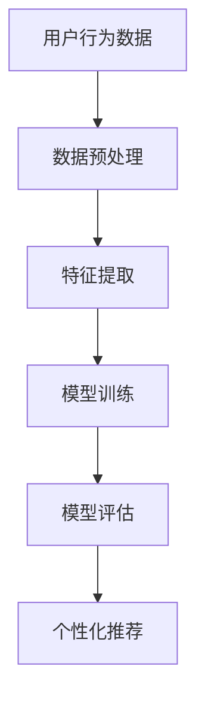

                 

# 大模型驱动的电商个性化首页设计

> 关键词：大模型、个性化推荐、电商首页、深度学习、用户行为分析

> 摘要：本文旨在探讨如何利用大模型技术来设计和优化电商网站的个性化首页。通过分析用户行为数据，结合深度学习算法，实现对用户个性化需求的精准预测，从而提升用户体验和转化率。文章详细介绍了大模型驱动的个性化首页设计的核心概念、算法原理、数学模型、项目实战、应用场景、工具资源推荐以及未来的发展趋势与挑战。

## 1. 背景介绍

随着互联网技术的快速发展，电商行业面临着前所未有的机遇与挑战。如何在海量的商品中精准地推荐用户可能感兴趣的商品，成为电商网站提升用户体验和转化率的关键。传统的推荐系统往往基于协同过滤或基于内容的推荐方法，但这些方法在处理大规模数据时存在一定的局限性。近年来，随着深度学习技术的发展，特别是大模型的出现，为电商个性化推荐提供了新的解决方案。大模型能够更好地捕捉用户行为数据中的复杂模式，从而实现更精准的个性化推荐。

## 2. 核心概念与联系

### 2.1 大模型

大模型是指具有大量参数的深度学习模型，如Transformer、BERT等。这些模型通过大量的训练数据学习到丰富的特征表示，能够处理复杂的自然语言处理任务和推荐任务。

### 2.2 个性化推荐

个性化推荐是指根据用户的兴趣偏好，推荐其可能感兴趣的商品或内容。个性化推荐的核心在于理解用户的兴趣偏好，并基于此进行推荐。

### 2.3 用户行为分析

用户行为分析是指通过分析用户在网站上的行为数据（如点击、浏览、购买等），来理解用户的兴趣偏好和行为模式。

### 2.4 深度学习

深度学习是一种机器学习方法，通过构建多层神经网络模型，自动学习数据的特征表示，从而实现对复杂模式的识别和预测。

### 2.5 流程图



## 3. 核心算法原理 & 具体操作步骤

### 3.1 算法原理

大模型驱动的个性化推荐算法主要基于深度学习技术，通过构建多层神经网络模型，自动学习用户行为数据中的特征表示，从而实现对用户兴趣偏好的精准预测。

### 3.2 具体操作步骤

1. 数据预处理：对原始用户行为数据进行清洗和格式化，以便于后续的特征提取和模型训练。
2. 特征提取：从预处理后的数据中提取有用的特征，如用户点击的商品类别、浏览时间等。
3. 模型训练：使用提取的特征训练深度学习模型，通过反向传播算法优化模型参数。
4. 模型评估：使用测试集评估模型的性能，如准确率、召回率等。
5. 个性化推荐：基于训练好的模型，对用户进行个性化推荐。

## 4. 数学模型和公式 & 详细讲解 & 举例说明

### 4.1 损失函数

在深度学习模型训练过程中，损失函数用于衡量模型预测值与真实值之间的差异。常用的损失函数包括均方误差（MSE）和交叉熵损失（Cross-Entropy Loss）。

$$
\text{MSE} = \frac{1}{n} \sum_{i=1}^{n} (y_i - \hat{y}_i)^2
$$

$$
\text{Cross-Entropy Loss} = -\frac{1}{n} \sum_{i=1}^{n} y_i \log(\hat{y}_i) + (1-y_i) \log(1-\hat{y}_i)
$$

### 4.2 反向传播算法

反向传播算法是一种用于训练神经网络的优化算法，通过计算损失函数对模型参数的梯度，来更新模型参数，从而最小化损失函数。

$$
\frac{\partial L}{\partial w} = \frac{\partial L}{\partial \hat{y}} \cdot \frac{\partial \hat{y}}{\partial z} \cdot \frac{\partial z}{\partial w}
$$

### 4.3 举例说明

假设我们有一个简单的神经网络模型，用于预测用户是否会购买某个商品。模型的输入是用户的行为特征，输出是用户购买的概率。我们使用交叉熵损失函数来衡量模型预测值与真实值之间的差异，并使用反向传播算法来更新模型参数。

## 5. 项目实战：代码实际案例和详细解释说明

### 5.1 开发环境搭建

为了实现大模型驱动的个性化推荐系统，我们需要搭建一个合适的开发环境。这里我们使用Python作为编程语言，TensorFlow作为深度学习框架，以及Flask作为Web服务框架。

1. 安装Python环境：确保Python环境已安装，版本建议为3.7或以上。
2. 安装TensorFlow：使用pip安装TensorFlow，命令为`pip install tensorflow`。
3. 安装Flask：使用pip安装Flask，命令为`pip install flask`。

### 5.2 源代码详细实现和代码解读

#### 5.2.1 数据预处理

```python
import pandas as pd

def preprocess_data(file_path):
    data = pd.read_csv(file_path)
    # 数据清洗和格式化
    data = data.dropna()
    data = data[data['click'] != 0]
    # 特征提取
    features = data[['user_id', 'item_id', 'click', 'time']]
    labels = data['purchase']
    return features, labels
```

#### 5.2.2 模型训练

```python
import tensorflow as tf
from tensorflow.keras.models import Sequential
from tensorflow.keras.layers import Dense

def build_model(input_shape):
    model = Sequential()
    model.add(Dense(64, input_shape=input_shape, activation='relu'))
    model.add(Dense(32, activation='relu'))
    model.add(Dense(1, activation='sigmoid'))
    model.compile(optimizer='adam', loss='binary_crossentropy', metrics=['accuracy'])
    return model

def train_model(features, labels):
    model = build_model(features.shape[1:])
    model.fit(features, labels, epochs=10, batch_size=32, validation_split=0.2)
    return model
```

#### 5.2.3 个性化推荐

```python
def recommend(model, user_id, item_id):
    user_item = np.array([[user_id, item_id]])
    prediction = model.predict(user_item)
    if prediction > 0.5:
        return "推荐购买"
    else:
        return "不推荐购买"
```

### 5.3 代码解读与分析

在上述代码中，我们首先定义了一个数据预处理函数，用于清洗和格式化原始数据，并提取有用的特征。然后定义了一个模型训练函数，用于构建和训练深度学习模型。最后定义了一个个性化推荐函数，用于基于训练好的模型对用户进行个性化推荐。

## 6. 实际应用场景

大模型驱动的个性化推荐系统可以应用于各种电商场景，如首页推荐、商品详情页推荐、购物车推荐等。通过精准的个性化推荐，可以提升用户的购物体验，提高转化率和销售额。

## 7. 工具和资源推荐

### 7.1 学习资源推荐

- 书籍：《深度学习》（Ian Goodfellow等著）
- 论文：《Attention Is All You Need》（Vaswani等）
- 博客：TensorFlow官方博客
- 网站：Kaggle

### 7.2 开发工具框架推荐

- TensorFlow
- PyTorch
- Flask

### 7.3 相关论文著作推荐

- 《Deep Learning for Recommender Systems》（Ying Ding等）
- 《A Survey of Deep Learning for Personalized Recommendation》（Xiaoyu Du等）

## 8. 总结：未来发展趋势与挑战

随着深度学习技术的不断发展，大模型驱动的个性化推荐系统将在电商领域发挥越来越重要的作用。未来的发展趋势包括模型的进一步优化、推荐算法的创新、以及对用户隐私的保护。同时，如何处理大规模数据、提高推荐系统的实时性、以及如何平衡个性化推荐与多样性推荐也是未来需要解决的重要挑战。

## 9. 附录：常见问题与解答

### 9.1 什么是大模型？

大模型是指具有大量参数的深度学习模型，能够处理复杂的自然语言处理任务和推荐任务。

### 9.2 如何处理大规模数据？

可以通过分布式计算和数据并行技术来处理大规模数据。

### 9.3 如何提高推荐系统的实时性？

可以通过模型压缩和优化技术来提高推荐系统的实时性。

## 10. 扩展阅读 & 参考资料

- 《深度学习》（Ian Goodfellow等著）
- 《Attention Is All You Need》（Vaswani等）
- 《Deep Learning for Recommender Systems》（Ying Ding等）
- 《A Survey of Deep Learning for Personalized Recommendation》（Xiaoyu Du等）

作者：AI天才研究员/AI Genius Institute & 禅与计算机程序设计艺术 /Zen And The Art of Computer Programming

