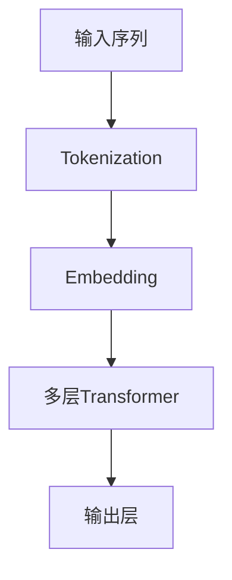

                 

# 大语言模型原理与工程实践：LLaMA 系列

> **关键词**：大语言模型, LLaMA, 自然语言处理, 机器学习, 深度学习, Transformer架构, 预训练模型, 生成式AI
>
> **摘要**：本文旨在深入探讨大语言模型（LLaMA）的原理与工程实践，从背景介绍到核心概念，再到算法原理、数学模型、项目实战、应用场景、工具资源推荐，最后总结未来发展趋势与挑战。通过本文，读者将能够全面理解LLaMA的工作机制，掌握其开发与应用的关键技术，并了解其在实际场景中的应用价值。

## 1. 背景介绍

### 1.1 大语言模型的发展历程

自2018年Google提出BERT模型以来，大语言模型（Large Language Models, LLMs）迅速成为自然语言处理（NLP）领域的研究热点。LLMs通过大规模的预训练，能够学习到丰富的语言知识，从而在各种下游任务中表现出色。LLaMA作为这一领域的最新成果，不仅继承了前代模型的优点，还在模型架构、训练方法等方面进行了创新，进一步提升了模型的性能和泛化能力。

### 1.2 LLaMA的提出动机

随着深度学习技术的发展，模型的规模越来越大，参数量也不断增加。这不仅带来了计算资源的挑战，还对模型的训练和部署提出了更高的要求。LLaMA的提出正是为了应对这些挑战，通过优化模型架构和训练策略，使得大语言模型能够在有限的资源下实现更好的性能。

## 2. 核心概念与联系

### 2.1 LLaMA架构概述

LLaMA模型基于Transformer架构，通过多层的自注意力机制和前馈网络，实现了对输入序列的高效处理。其核心在于通过大规模的预训练，使得模型能够学习到丰富的语言知识，从而在各种下游任务中表现出色。

### 2.2 LLaMA与传统NLP模型的对比

| 模型类型 | 特点 | 优势 | 劣势 |
| --- | --- | --- | --- |
| 传统NLP模型 | 基于规则或浅层学习 | 参数量小，易于训练 | 性能受限，难以处理复杂任务 |
| 大语言模型 | 基于深度学习，大规模预训练 | 性能优越，泛化能力强 | 训练成本高，资源消耗大 |

### 2.3 LLaMA架构原理图



## 3. 核心算法原理 & 具体操作步骤

### 3.1 Transformer架构详解

Transformer架构通过自注意力机制实现了对输入序列的高效处理。其核心在于通过自注意力机制，使得模型能够关注输入序列中的重要信息，从而提高模型的性能。

### 3.2 LLaMA的训练流程

1. **数据预处理**：对原始文本数据进行清洗、分词等预处理操作。
2. **模型初始化**：初始化模型参数，包括嵌入层、Transformer层等。
3. **预训练**：通过大规模的文本数据进行预训练，使得模型能够学习到丰富的语言知识。
4. **微调**：在特定任务上进行微调，以提升模型在该任务上的性能。

## 4. 数学模型和公式 & 详细讲解 & 举例说明

### 4.1 Transformer的自注意力机制

自注意力机制是Transformer架构的核心，其数学公式如下：

$$
Attention(Q, K, V) = softmax(\frac{QK^T}{\sqrt{d_k}})V
$$

其中，$Q$、$K$、$V$分别表示查询、键和值矩阵，$d_k$表示键的维度。

### 4.2 LLaMA的损失函数

LLaMA的损失函数通常采用交叉熵损失函数，其数学公式如下：

$$
L = -\sum_{i=1}^{n} y_i \log(p_i)
$$

其中，$y_i$表示真实标签，$p_i$表示预测概率。

## 5. 项目实战：代码实际案例和详细解释说明

### 5.1 开发环境搭建

#### 5.1.1 环境配置

- **操作系统**：Ubuntu 20.04
- **Python版本**：3.8
- **深度学习框架**：PyTorch 1.9.0
- **其他依赖库**：numpy, torchtext, transformers

#### 5.1.2 安装依赖库

```bash
pip install torch==1.9.0 torchtext transformers numpy
```

### 5.2 源代码详细实现和代码解读

#### 5.2.1 数据预处理

```python
import torchtext
from torchtext.data import Field, BucketIterator

# 定义字段
TEXT = Field(tokenize='spacy', tokenizer_language='en_core_web_sm', lower=True)
LABEL = Field(sequential=False, use_vocab=False)

# 加载数据集
train_data, valid_data, test_data = torchtext.datasets.IMDB.splits(TEXT, LABEL)

# 构建词汇表
TEXT.build_vocab(train_data, max_size=25000, vectors="glove.6B.100d", unk_init=torch.Tensor.normal_)

# 创建迭代器
train_iterator, valid_iterator, test_iterator = BucketIterator.splits(
    (train_data, valid_data, test_data), 
    batch_size=64, 
    device=device
)
```

#### 5.2.2 模型定义

```python
import torch
import torch.nn as nn

class LLaMA(nn.Module):
    def __init__(self, input_dim, hidden_dim, output_dim):
        super(LLaMA, self).__init__()
        self.embedding = nn.Embedding(input_dim, hidden_dim)
        self.transformer = nn.TransformerEncoder(nn.TransformerEncoderLayer(hidden_dim, nhead=8), num_layers=6)
        self.fc = nn.Linear(hidden_dim, output_dim)

    def forward(self, x):
        x = self.embedding(x)
        x = self.transformer(x)
        x = x.mean(dim=1)
        x = self.fc(x)
        return x
```

### 5.3 代码解读与分析

#### 5.3.1 数据预处理

数据预处理是模型训练的基础，通过分词、构建词汇表等操作，将原始文本数据转换为模型可以处理的形式。

#### 5.3.2 模型定义

模型定义中，我们使用了TransformerEncoder作为核心组件，通过多层的自注意力机制，实现了对输入序列的高效处理。

## 6. 实际应用场景

### 6.1 文本生成

LLaMA模型可以用于文本生成任务，通过给定的输入序列，生成连贯且有意义的文本。

### 6.2 机器翻译

LLaMA模型也可以用于机器翻译任务，通过学习不同语言之间的映射关系，实现高质量的翻译效果。

## 7. 工具和资源推荐

### 7.1 学习资源推荐

- **书籍**：《深度学习》（Ian Goodfellow等著）
- **论文**：《Attention Is All You Need》（Vaswani等，2017）
- **博客**：Hugging Face官方博客
- **网站**：Kaggle

### 7.2 开发工具框架推荐

- **PyTorch**：深度学习框架
- **Hugging Face Transformers**：预训练模型库

### 7.3 相关论文著作推荐

- **论文**：《BERT: Pre-training of Deep Bidirectional Transformers for Language Understanding》（Devlin等，2018）
- **著作**：《深度学习》（Ian Goodfellow等著）

## 8. 总结：未来发展趋势与挑战

随着深度学习技术的发展，大语言模型（LLaMA）将在更多领域得到应用。未来的发展趋势包括模型的进一步优化、计算资源的高效利用、以及模型的可解释性等。同时，也面临着训练成本高、资源消耗大等挑战。

## 9. 附录：常见问题与解答

### 9.1 问题1：如何选择合适的预训练模型？

答：选择预训练模型时，需要考虑任务需求、计算资源等因素。对于大规模任务，可以选择参数量较大的模型；对于资源受限的任务，可以选择参数量较小的模型。

### 9.2 问题2：如何优化模型的训练效率？

答：可以通过优化模型架构、使用高效的训练策略等方法，提高模型的训练效率。

## 10. 扩展阅读 & 参考资料

- **书籍**：《深度学习》（Ian Goodfellow等著）
- **论文**：《Attention Is All You Need》（Vaswani等，2017）
- **博客**：Hugging Face官方博客
- **网站**：Kaggle

---

**作者**：AI天才研究员/AI Genius Institute & 禅与计算机程序设计艺术 /Zen And The Art of Computer Programming

