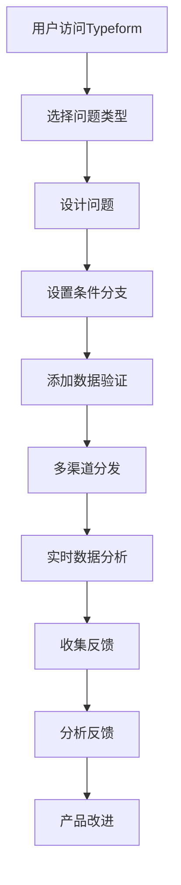
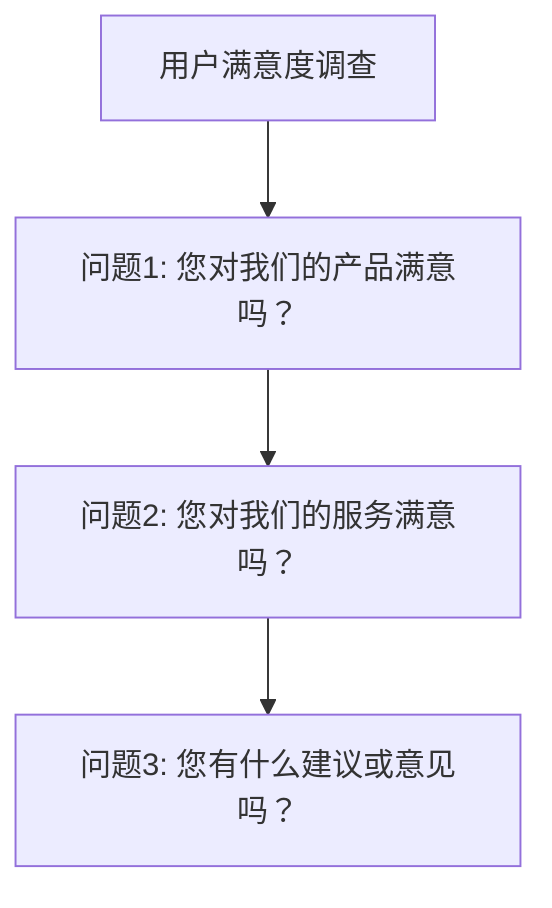
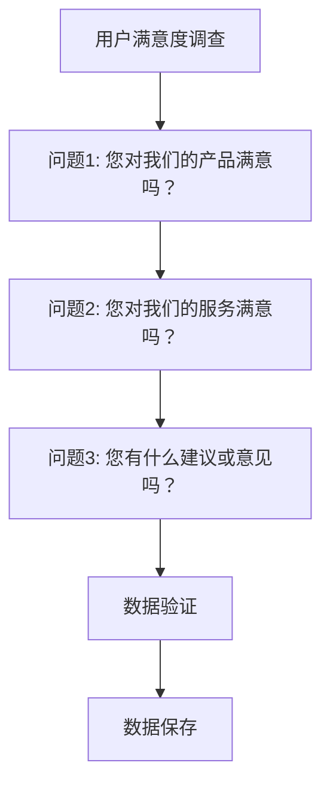

                 

# 如何利用Typeform创建互动式问卷收集用户反馈

> 关键词：Typeform, 互动式问卷, 用户反馈, 问卷设计, 数据收集

> 摘要：本文将详细介绍如何利用Typeform创建互动式问卷来收集用户反馈。我们将从背景介绍开始，逐步深入探讨核心概念、具体操作步骤、项目实战案例，并分析实际应用场景。通过本文，读者将能够掌握如何设计和部署高质量的互动式问卷，从而有效地收集用户反馈，为产品改进提供有力支持。

## 1. 背景介绍

在当今数字化时代，用户反馈对于产品改进和优化至关重要。传统的问卷调查方法往往存在响应率低、数据收集效率低下等问题。Typeform作为一种互动式问卷工具，能够显著提升问卷的吸引力和数据收集效率。本文将详细介绍如何利用Typeform创建互动式问卷，以收集高质量的用户反馈。

### 1.1 互动式问卷的优势

- **提高响应率**：通过丰富的交互设计和视觉吸引力，提高用户参与度。
- **数据质量**：通过验证逻辑和条件分支，确保数据的准确性和完整性。
- **实时分析**：支持实时数据收集和分析，快速获取反馈结果。

### 1.2 Typeform的基本功能

- **丰富的表单设计**：支持多种问题类型，如单选、多选、文本输入等。
- **条件分支**：根据用户回答自动跳转到相关问题。
- **数据验证**：内置验证逻辑，确保数据的准确性和完整性。
- **多渠道分发**：支持多种渠道分发，如电子邮件、社交媒体等。
- **实时分析**：提供实时数据分析工具，帮助快速获取反馈结果。

## 2. 核心概念与联系

### 2.1 互动式问卷设计原则

- **简洁明了**：问题设计应简洁明了，避免冗长和复杂的问题。
- **逻辑清晰**：问题之间的逻辑关系应清晰，避免让用户感到困惑。
- **视觉吸引力**：通过丰富的视觉元素和动画效果，提高问卷的吸引力。
- **用户导向**：从用户的角度出发，设计易于理解和回答的问题。

### 2.2 Typeform的核心功能

- **表单设计**：支持多种问题类型，如单选、多选、文本输入等。
- **条件分支**：根据用户回答自动跳转到相关问题。
- **数据验证**：内置验证逻辑，确保数据的准确性和完整性。
- **多渠道分发**：支持多种渠道分发，如电子邮件、社交媒体等。
- **实时分析**：提供实时数据分析工具，帮助快速获取反馈结果。

### 2.3 Mermaid流程图

## 3. 核心算法原理 & 具体操作步骤

### 3.1 设计问题

- **问题类型选择**：根据需求选择合适的问题类型，如单选、多选、文本输入等。
- **问题设计**：确保问题简洁明了，避免冗长和复杂的问题。
- **问题顺序**：合理安排问题顺序，确保逻辑清晰。

### 3.2 设置条件分支

- **条件逻辑**：根据用户回答自动跳转到相关问题。
- **分支设计**：设计合理的分支逻辑，确保用户能够顺利回答所有问题。

### 3.3 添加数据验证

- **验证逻辑**：设置数据验证逻辑，确保数据的准确性和完整性。
- **错误提示**：提供清晰的错误提示，帮助用户纠正错误。

### 3.4 多渠道分发

- **渠道选择**：选择合适的分发渠道，如电子邮件、社交媒体等。
- **分发策略**：制定合理的分发策略，确保问卷能够覆盖目标用户群体。

### 3.5 实时数据分析

- **数据分析工具**：利用Typeform提供的实时数据分析工具，快速获取反馈结果。
- **数据可视化**：通过图表和报告形式展示数据分析结果。

## 4. 数学模型和公式 & 详细讲解 & 举例说明

### 4.1 数据验证逻辑

- **必填项验证**：确保所有必填项都被填写。
- **数据类型验证**：确保输入的数据类型符合预期。
- **范围验证**：确保输入的数据在指定范围内。

### 4.2 举例说明

假设我们设计了一个关于用户满意度的问卷，包含以下问题：

1. **问题类型选择**：单选、多选、文本输入等。
2. **问题设计**：确保问题简洁明了，避免冗长和复杂的问题。
3. **问题顺序**：合理安排问题顺序，确保逻辑清晰。

### 4.3 数据验证逻辑

- **必填项验证**：确保所有必填项都被填写。
- **数据类型验证**：确保输入的数据类型符合预期。
- **范围验证**：确保输入的数据在指定范围内。

## 5. 项目实战：代码实际案例和详细解释说明

### 5.1 开发环境搭建

- **Typeform账户**：注册并登录Typeform账户。
- **问卷设计工具**：使用Typeform提供的问卷设计工具进行问卷设计。

### 5.2 源代码详细实现和代码解读

#### 5.2.1 问卷设计

#### 5.2.2 数据验证逻辑

### 5.3 代码解读与分析

- **问卷设计**：通过Typeform提供的问卷设计工具，设计问卷结构。
- **数据验证**：通过设置数据验证逻辑，确保数据的准确性和完整性。
- **数据保存**：通过Typeform提供的数据保存功能，将数据保存到指定位置。

## 6. 实际应用场景

### 6.1 产品改进

通过收集用户反馈，可以及时发现产品存在的问题，从而进行改进。

### 6.2 用户体验优化

通过收集用户反馈，可以了解用户对产品的满意度，从而优化用户体验。

### 6.3 市场调研

通过收集用户反馈，可以了解市场趋势和用户需求，为市场调研提供有力支持。

## 7. 工具和资源推荐

### 7.1 学习资源推荐

- **Typeform官方文档**：提供详细的使用指南和示例。
- **Typeform教程视频**：提供视频教程，帮助用户快速上手。
- **Typeform社区**：加入Typeform社区，与其他用户交流经验。

### 7.2 开发工具框架推荐

- **Typeform API**：通过Typeform API，可以实现自动化数据收集和分析。
- **Typeform SDK**：提供多种编程语言的SDK，方便集成到现有系统中。

### 7.3 相关论文著作推荐

- **《用户反馈分析与应用》**：深入探讨用户反馈分析方法和应用。
- **《互动式问卷设计与优化》**：详细讲解互动式问卷设计和优化方法。

## 8. 总结：未来发展趋势与挑战

### 8.1 未来发展趋势

- **智能化**：通过人工智能技术，实现更智能的数据分析和反馈处理。
- **个性化**：通过个性化问卷设计，提高用户参与度和反馈质量。
- **多渠道融合**：通过多渠道融合，实现更广泛的用户覆盖。

### 8.2 挑战

- **数据安全**：确保用户数据的安全性和隐私保护。
- **用户体验**：提高问卷设计的用户体验，避免用户流失。
- **数据分析**：提高数据分析的准确性和效率。

## 9. 附录：常见问题与解答

### 9.1 问题1：如何设置条件分支？

- **解答**：在Typeform中，可以通过设置条件分支来实现。例如，如果用户选择某个选项，则跳转到相关问题。

### 9.2 问题2：如何进行数据验证？

- **解答**：在Typeform中，可以通过设置数据验证逻辑来确保数据的准确性和完整性。例如，设置必填项验证、数据类型验证和范围验证。

## 10. 扩展阅读 & 参考资料

- **Typeform官方文档**：[https://www.typeform.com/](https://www.typeform.com/)
- **Typeform教程视频**：[https://www.youtube.com/c/Typeform](https://www.youtube.com/c/Typeform)
- **Typeform社区**：[https://community.typeform.com/](https://community.typeform.com/)

---

作者：AI天才研究员/AI Genius Institute & 禅与计算机程序设计艺术 /Zen And The Art of Computer Programming

