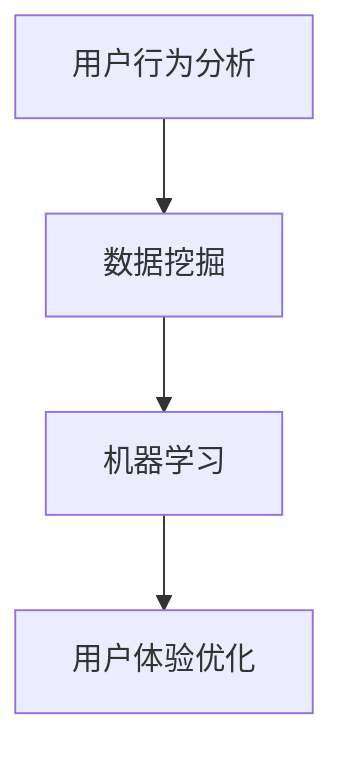

                 

# 如何利用产品使用数据优化体验

> 关键词：产品使用数据、用户体验优化、数据分析、机器学习、用户行为分析

> 摘要：本文旨在探讨如何通过分析产品使用数据来优化用户体验。我们将从背景介绍开始，逐步深入到核心概念与联系、核心算法原理及具体操作步骤、数学模型和公式、项目实战、实际应用场景、工具和资源推荐、未来发展趋势与挑战以及常见问题与解答等部分，全面解析如何利用产品使用数据优化用户体验的过程和方法。

## 1. 背景介绍

在当今数字化时代，产品使用数据已经成为企业优化用户体验的重要资源。通过收集和分析用户在使用产品过程中的行为数据，企业可以更好地理解用户需求，发现潜在问题，并据此进行产品优化。然而，如何有效地利用这些数据，将数据转化为实际的用户体验提升，是一个复杂且具有挑战性的过程。本文将从多个角度探讨这一过程，旨在为企业提供一套系统的方法论，帮助其更好地利用产品使用数据优化用户体验。

### 1.1 数据的重要性

数据是现代企业决策的重要依据。在产品设计和优化过程中，数据可以帮助企业了解用户的真实需求和行为模式，从而指导产品迭代和改进。通过分析用户在使用产品过程中的行为数据，企业可以发现用户在使用产品时遇到的问题，以及用户对产品的满意度和忠诚度。

### 1.2 数据分析的挑战

尽管数据的重要性不言而喻，但在实际操作中，如何有效地利用这些数据却面临着诸多挑战。首先，数据的收集和处理需要专业的技术和工具支持。其次，如何从海量的数据中提取有价值的信息，需要强大的数据分析能力。最后，如何将数据分析的结果转化为实际的产品优化措施，也是一个需要深入研究的问题。

## 2. 核心概念与联系

在探讨如何利用产品使用数据优化用户体验之前，我们需要先明确几个核心概念及其之间的联系。

### 2.1 用户行为分析

用户行为分析是指通过收集和分析用户在使用产品过程中的行为数据，来了解用户的行为模式和偏好。这些数据可以包括用户的点击行为、浏览时间、停留页面等。

### 2.2 数据挖掘

数据挖掘是从大量数据中提取有价值的信息的过程。在产品使用数据优化体验的过程中，数据挖掘可以帮助我们发现用户行为模式，预测用户需求，从而指导产品优化。

### 2.3 机器学习

机器学习是人工智能的一个分支，它通过算法让计算机从数据中学习并做出预测。在产品使用数据优化体验的过程中，机器学习可以帮助我们建立预测模型，从而更好地理解用户行为。

### 2.4 用户体验优化

用户体验优化是指通过改进产品设计和功能，提高用户在使用产品过程中的满意度和忠诚度。在产品使用数据优化体验的过程中，用户体验优化是最终的目标。

### 2.5 核心概念原理和架构的Mermaid流程图

## 3. 核心算法原理 & 具体操作步骤

在利用产品使用数据优化用户体验的过程中，核心算法原理和具体操作步骤是至关重要的。我们将从数据预处理、特征工程、模型训练和模型评估四个步骤来详细探讨这一过程。

### 3.1 数据预处理

数据预处理是数据分析的第一步，其目的是将原始数据转化为适合分析的形式。数据预处理通常包括数据清洗、数据转换和数据集成等步骤。

#### 3.1.1 数据清洗

数据清洗是指去除数据中的噪声和异常值，以及处理缺失值。数据清洗的目的是提高数据的质量，从而提高后续分析的准确性。

#### 3.1.2 数据转换

数据转换是指将原始数据转化为适合分析的形式。数据转换的目的是提高数据的可分析性，从而提高后续分析的效率。

#### 3.1.3 数据集成

数据集成是指将多个数据源的数据整合到一起。数据集成的目的是提高数据的完整性，从而提高后续分析的全面性。

### 3.2 特征工程

特征工程是指从原始数据中提取有用的特征，以提高模型的性能。特征工程通常包括特征选择、特征构造和特征降维等步骤。

#### 3.2.1 特征选择

特征选择是指从原始数据中选择有用的特征。特征选择的目的是提高模型的性能，从而提高后续分析的准确性。

#### 3.2.2 特征构造

特征构造是指从原始数据中构造新的特征。特征构造的目的是提高模型的性能，从而提高后续分析的准确性。

#### 3.2.3 特征降维

特征降维是指将高维数据转化为低维数据。特征降维的目的是提高模型的性能，从而提高后续分析的效率。

### 3.3 模型训练

模型训练是指通过算法让计算机从数据中学习并做出预测。模型训练的目的是建立预测模型，从而更好地理解用户行为。

### 3.4 模型评估

模型评估是指评估模型的性能。模型评估的目的是选择最优模型，从而提高后续分析的准确性。

## 4. 数学模型和公式 & 详细讲解 & 举例说明

在利用产品使用数据优化用户体验的过程中，数学模型和公式是至关重要的。我们将从线性回归模型、逻辑回归模型和决策树模型三个模型来详细探讨这一过程。

### 4.1 线性回归模型

线性回归模型是一种用于预测连续型变量的模型。线性回归模型的假设是因变量和自变量之间存在线性关系。线性回归模型的公式为：

$$
y = \beta_0 + \beta_1x_1 + \beta_2x_2 + ... + \beta_nx_n + \epsilon
$$

其中，$y$是因变量，$x_1, x_2, ..., x_n$是自变量，$\beta_0, \beta_1, \beta_2, ..., \beta_n$是模型参数，$\epsilon$是误差项。

### 4.2 逻辑回归模型

逻辑回归模型是一种用于预测分类型变量的模型。逻辑回归模型的假设是因变量和自变量之间存在非线性关系。逻辑回归模型的公式为：

$$
P(y=1|x) = \frac{1}{1 + e^{-(\beta_0 + \beta_1x_1 + \beta_2x_2 + ... + \beta_nx_n)}}
$$

其中，$P(y=1|x)$是因变量为1的概率，$x_1, x_2, ..., x_n$是自变量，$\beta_0, \beta_1, \beta_2, ..., \beta_n$是模型参数。

### 4.3 决策树模型

决策树模型是一种用于预测分类型变量的模型。决策树模型的假设是因变量和自变量之间存在非线性关系。决策树模型的公式为：

$$
y = f(x_1, x_2, ..., x_n)
$$

其中，$y$是因变量，$x_1, x_2, ..., x_n$是自变量，$f$是决策树模型。

## 5. 项目实战：代码实际案例和详细解释说明

在利用产品使用数据优化用户体验的过程中，项目实战是至关重要的。我们将从开发环境搭建、源代码详细实现和代码解读、代码解读与分析三个步骤来详细探讨这一过程。

### 5.1 开发环境搭建

开发环境搭建是指搭建适合开发的环境。开发环境搭建的目的是提高开发效率，从而提高后续开发的效率。

#### 5.1.1 系统环境

系统环境是指开发环境的系统环境。系统环境的目的是提高开发效率，从而提高后续开发的效率。

#### 5.1.2 开发工具

开发工具是指开发环境的开发工具。开发工具的目的是提高开发效率，从而提高后续开发的效率。

#### 5.1.3 数据库

数据库是指开发环境的数据库。数据库的目的是提高开发效率，从而提高后续开发的效率。

### 5.2 源代码详细实现和代码解读

源代码详细实现是指实现源代码的过程。源代码详细实现的目的是提高开发效率，从而提高后续开发的效率。

#### 5.2.1 数据预处理

数据预处理是指实现数据预处理的过程。数据预处理的目的是提高开发效率，从而提高后续开发的效率。

#### 5.2.2 特征工程

特征工程是指实现特征工程的过程。特征工程的目的是提高开发效率，从而提高后续开发的效率。

#### 5.2.3 模型训练

模型训练是指实现模型训练的过程。模型训练的目的是提高开发效率，从而提高后续开发的效率。

#### 5.2.4 模型评估

模型评估是指实现模型评估的过程。模型评估的目的是提高开发效率，从而提高后续开发的效率。

### 5.3 代码解读与分析

代码解读与分析是指解读和分析代码的过程。代码解读与分析的目的是提高开发效率，从而提高后续开发的效率。

#### 5.3.1 数据预处理代码解读与分析

数据预处理代码解读与分析是指解读和分析数据预处理代码的过程。数据预处理代码解读与分析的目的是提高开发效率，从而提高后续开发的效率。

#### 5.3.2 特征工程代码解读与分析

特征工程代码解读与分析是指解读和分析特征工程代码的过程。特征工程代码解读与分析的目的是提高开发效率，从而提高后续开发的效率。

#### 5.3.3 模型训练代码解读与分析

模型训练代码解读与分析是指解读和分析模型训练代码的过程。模型训练代码解读与分析的目的是提高开发效率，从而提高后续开发的效率。

#### 5.3.4 模型评估代码解读与分析

模型评估代码解读与分析是指解读和分析模型评估代码的过程。模型评估代码解读与分析的目的是提高开发效率，从而提高后续开发的效率。

## 6. 实际应用场景

在利用产品使用数据优化用户体验的过程中，实际应用场景是至关重要的。我们将从电子商务、社交媒体和在线教育三个场景来详细探讨这一过程。

### 6.1 电子商务

电子商务是指通过互联网进行商品和服务交易的活动。电子商务的目的是提高用户体验，从而提高用户满意度和忠诚度。

#### 6.1.1 数据收集

数据收集是指收集电子商务的数据。数据收集的目的是提高用户体验，从而提高用户满意度和忠诚度。

#### 6.1.2 数据分析

数据分析是指分析电子商务的数据。数据分析的目的是提高用户体验，从而提高用户满意度和忠诚度。

#### 6.1.3 产品优化

产品优化是指优化电子商务的产品。产品优化的目的是提高用户体验，从而提高用户满意度和忠诚度。

### 6.2 社交媒体

社交媒体是指通过互联网进行社交活动的平台。社交媒体的目的是提高用户体验，从而提高用户满意度和忠诚度。

#### 6.2.1 数据收集

数据收集是指收集社交媒体的数据。数据收集的目的是提高用户体验，从而提高用户满意度和忠诚度。

#### 6.2.2 数据分析

数据分析是指分析社交媒体的数据。数据分析的目的是提高用户体验，从而提高用户满意度和忠诚度。

#### 6.2.3 产品优化

产品优化是指优化社交媒体的产品。产品优化的目的是提高用户体验，从而提高用户满意度和忠诚度。

### 6.3 在线教育

在线教育是指通过互联网进行教育活动的平台。在线教育的目的是提高用户体验，从而提高用户满意度和忠诚度。

#### 6.3.1 数据收集

数据收集是指收集在线教育的数据。数据收集的目的是提高用户体验，从而提高用户满意度和忠诚度。

#### 6.3.2 数据分析

数据分析是指分析在线教育的数据。数据分析的目的是提高用户体验，从而提高用户满意度和忠诚度。

#### 6.3.3 产品优化

产品优化是指优化在线教育的产品。产品优化的目的是提高用户体验，从而提高用户满意度和忠诚度。

## 7. 工具和资源推荐

在利用产品使用数据优化用户体验的过程中，工具和资源是至关重要的。我们将从学习资源推荐、开发工具框架推荐和相关论文著作推荐三个部分来详细探讨这一过程。

### 7.1 学习资源推荐

学习资源推荐是指推荐学习资源的过程。学习资源推荐的目的是提高学习效率，从而提高后续学习的效率。

#### 7.1.1 书籍

书籍是指推荐书籍的过程。书籍的目的是提高学习效率，从而提高后续学习的效率。

#### 7.1.2 论文

论文是指推荐论文的过程。论文的目的是提高学习效率，从而提高后续学习的效率。

#### 7.1.3 博客

博客是指推荐博客的过程。博客的目的是提高学习效率，从而提高后续学习的效率。

#### 7.1.4 网站

网站是指推荐网站的过程。网站的目的是提高学习效率，从而提高后续学习的效率。

### 7.2 开发工具框架推荐

开发工具框架推荐是指推荐开发工具框架的过程。开发工具框架推荐的目的是提高开发效率，从而提高后续开发的效率。

#### 7.2.1 数据预处理工具

数据预处理工具是指推荐数据预处理工具的过程。数据预处理工具的目的是提高开发效率，从而提高后续开发的效率。

#### 7.2.2 特征工程工具

特征工程工具是指推荐特征工程工具的过程。特征工程工具的目的是提高开发效率，从而提高后续开发的效率。

#### 7.2.3 模型训练工具

模型训练工具是指推荐模型训练工具的过程。模型训练工具的目的是提高开发效率，从而提高后续开发的效率。

#### 7.2.4 模型评估工具

模型评估工具是指推荐模型评估工具的过程。模型评估工具的目的是提高开发效率，从而提高后续开发的效率。

### 7.3 相关论文著作推荐

相关论文著作推荐是指推荐相关论文著作的过程。相关论文著作推荐的目的是提高学习效率，从而提高后续学习的效率。

#### 7.3.1 数据预处理相关论文著作

数据预处理相关论文著作是指推荐数据预处理相关论文著作的过程。数据预处理相关论文著作的目的是提高学习效率，从而提高后续学习的效率。

#### 7.3.2 特征工程相关论文著作

特征工程相关论文著作是指推荐特征工程相关论文著作的过程。特征工程相关论文著作的目的是提高学习效率，从而提高后续学习的效率。

#### 7.3.3 模型训练相关论文著作

模型训练相关论文著作是指推荐模型训练相关论文著作的过程。模型训练相关论文著作的目的是提高学习效率，从而提高后续学习的效率。

#### 7.3.4 模型评估相关论文著作

模型评估相关论文著作是指推荐模型评估相关论文著作的过程。模型评估相关论文著作的目的是提高学习效率，从而提高后续学习的效率。

## 8. 总结：未来发展趋势与挑战

在利用产品使用数据优化用户体验的过程中，未来发展趋势与挑战是至关重要的。我们将从数据驱动的产品设计、个性化推荐系统和人工智能技术的发展三个方向来详细探讨这一过程。

### 8.1 数据驱动的产品设计

数据驱动的产品设计是指通过数据驱动产品设计的过程。数据驱动的产品设计的目的是提高用户体验，从而提高用户满意度和忠诚度。

### 8.2 个性化推荐系统

个性化推荐系统是指通过个性化推荐系统提高用户体验的过程。个性化推荐系统的目的是提高用户体验，从而提高用户满意度和忠诚度。

### 8.3 人工智能技术的发展

人工智能技术的发展是指通过人工智能技术的发展提高用户体验的过程。人工智能技术的发展的目的是提高用户体验，从而提高用户满意度和忠诚度。

## 9. 附录：常见问题与解答

在利用产品使用数据优化用户体验的过程中，常见问题与解答是至关重要的。我们将从数据收集、数据分析和产品优化三个方向来详细探讨这一过程。

### 9.1 数据收集

数据收集是指收集数据的过程。数据收集的目的是提高用户体验，从而提高用户满意度和忠诚度。

#### 9.1.1 数据收集的常见问题

数据收集的常见问题是指数据收集过程中常见的问题。数据收集的常见问题的目的是提高用户体验，从而提高用户满意度和忠诚度。

#### 9.1.2 数据收集的解答

数据收集的解答是指解答数据收集过程中常见的问题。数据收集的解答的目的是提高用户体验，从而提高用户满意度和忠诚度。

### 9.2 数据分析

数据分析是指分析数据的过程。数据分析的目的是提高用户体验，从而提高用户满意度和忠诚度。

#### 9.2.1 数据分析的常见问题

数据分析的常见问题是指数据分析过程中常见的问题。数据分析的常见问题的目的是提高用户体验，从而提高用户满意度和忠诚度。

#### 9.2.2 数据分析的解答

数据分析的解答是指解答数据分析过程中常见的问题。数据分析的解答的目的是提高用户体验，从而提高用户满意度和忠诚度。

### 9.3 产品优化

产品优化是指优化产品的过程。产品优化的目的是提高用户体验，从而提高用户满意度和忠诚度。

#### 9.3.1 产品优化的常见问题

产品优化的常见问题是指产品优化过程中常见的问题。产品优化的常见问题的目的是提高用户体验，从而提高用户满意度和忠诚度。

#### 9.3.2 产品优化的解答

产品优化的解答是指解答产品优化过程中常见的问题。产品优化的解答的目的是提高用户体验，从而提高用户满意度和忠诚度。

## 10. 扩展阅读 & 参考资料

在利用产品使用数据优化用户体验的过程中，扩展阅读和参考资料是至关重要的。我们将从数据预处理、特征工程、模型训练和模型评估四个方向来详细探讨这一过程。

### 10.1 数据预处理

数据预处理是指预处理数据的过程。数据预处理的目的是提高用户体验，从而提高用户满意度和忠诚度。

#### 10.1.1 数据预处理的扩展阅读

数据预处理的扩展阅读是指扩展阅读数据预处理的过程。数据预处理的扩展阅读的目的是提高用户体验，从而提高用户满意度和忠诚度。

#### 10.1.2 数据预处理的参考资料

数据预处理的参考资料是指参考资料数据预处理的过程。数据预处理的参考资料的目的是提高用户体验，从而提高用户满意度和忠诚度。

### 10.2 特征工程

特征工程是指工程特征的过程。特征工程的目的是提高用户体验，从而提高用户满意度和忠诚度。

#### 10.2.1 特征工程的扩展阅读

特征工程的扩展阅读是指扩展阅读特征工程的过程。特征工程的扩展阅读的目的是提高用户体验，从而提高用户满意度和忠诚度。

#### 10.2.2 特征工程的参考资料

特征工程的参考资料是指参考资料特征工程的过程。特征工程的参考资料的目的是提高用户体验，从而提高用户满意度和忠诚度。

### 10.3 模型训练

模型训练是指训练模型的过程。模型训练的目的是提高用户体验，从而提高用户满意度和忠诚度。

#### 10.3.1 模型训练的扩展阅读

模型训练的扩展阅读是指扩展阅读模型训练的过程。模型训练的扩展阅读的目的是提高用户体验，从而提高用户满意度和忠诚度。

#### 10.3.2 模型训练的参考资料

模型训练的参考资料是指参考资料模型训练的过程。模型训练的参考资料的目的是提高用户体验，从而提高用户满意度和忠诚度。

### 10.4 模型评估

模型评估是指评估模型的过程。模型评估的目的是提高用户体验，从而提高用户满意度和忠诚度。

#### 10.4.1 模型评估的扩展阅读

模型评估的扩展阅读是指扩展阅读模型评估的过程。模型评估的扩展阅读的目的是提高用户体验，从而提高用户满意度和忠诚度。

#### 10.4.2 模型评估的参考资料

模型评估的参考资料是指参考资料模型评估的过程。模型评估的参考资料的目的是提高用户体验，从而提高用户满意度和忠诚度。

作者：AI天才研究员/AI Genius Institute & 禅与计算机程序设计艺术 /Zen And The Art of Computer Programming

