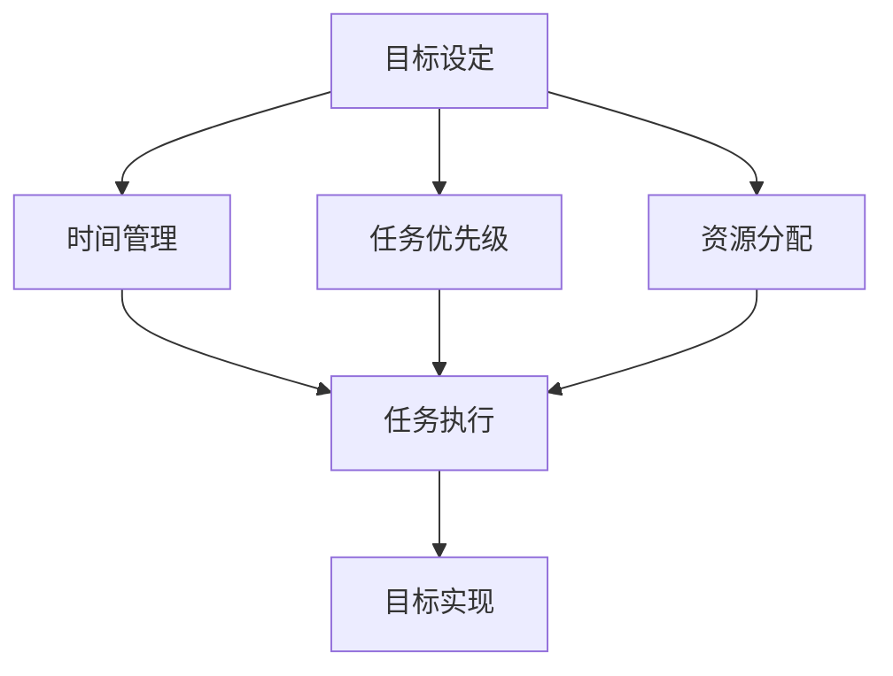

                 

# 如何建立个人的管理体系

> 关键词：个人管理、体系构建、技术实践、效率提升、目标设定

> 摘要：本文旨在探讨如何通过建立个人管理体系来提升工作效率和个人成长。我们将从背景介绍开始，逐步深入到核心概念与联系、核心算法原理与具体操作步骤、数学模型和公式、项目实战、实际应用场景、工具和资源推荐、未来发展趋势与挑战、常见问题与解答以及扩展阅读与参考资料等部分，全面解析个人管理体系的构建方法和实践技巧。

## 1. 背景介绍

在当今快速变化的信息时代，个人如何有效地管理自己的时间、资源和目标，成为了提升工作效率和个人成长的关键。个人管理体系的建立，不仅能够帮助我们更好地规划和执行任务，还能促进个人技能的提升和职业发展的加速。本文将从技术实践的角度出发，探讨如何通过建立个人管理体系来实现这些目标。

### 1.1 个人管理的重要性

个人管理的重要性在于它能够帮助我们更好地理解自己的工作和生活模式，从而做出更有效的决策。通过个人管理，我们可以更清晰地认识到自己的优势和劣势，进而制定出更加符合自身特点的目标和计划。

### 1.2 个人管理面临的挑战

个人管理面临的挑战主要包括时间管理、任务优先级设定、资源分配以及目标实现等。如何在有限的时间内完成更多的任务，如何合理分配资源以实现目标，如何设定合理的优先级以确保重要任务的完成，这些都是个人管理中需要解决的问题。

## 2. 核心概念与联系

在建立个人管理体系的过程中，理解一些核心概念及其之间的联系是非常重要的。这些概念包括但不限于目标设定、时间管理、任务优先级、资源分配等。

### 2.1 目标设定

目标设定是个人管理中的首要步骤。明确的目标能够帮助我们更好地规划和执行任务。目标设定需要遵循SMART原则，即具体（Specific）、可测量（Measurable）、可达成（Achievable）、相关性（Relevant）、时限性（Time-bound）。

### 2.2 时间管理

时间管理是指通过合理规划和分配时间来提高工作效率。有效的时间管理能够帮助我们更好地平衡工作和生活，确保重要任务的完成。

### 2.3 任务优先级

任务优先级是指根据任务的重要性和紧急性来确定任务的执行顺序。合理设定任务优先级能够帮助我们更高效地完成任务。

### 2.4 资源分配

资源分配是指根据任务的需求合理分配资源。资源包括但不限于时间、精力、金钱等。合理分配资源能够帮助我们更有效地完成任务。

### 2.5 核心概念原理和架构的 Mermaid 流程图



## 3. 核心算法原理 & 具体操作步骤

在建立个人管理体系的过程中，我们需要遵循一定的算法原理和操作步骤。这些步骤包括目标设定、时间管理、任务优先级设定、资源分配等。

### 3.1 目标设定

目标设定是个人管理中的首要步骤。明确的目标能够帮助我们更好地规划和执行任务。目标设定需要遵循SMART原则，即具体（Specific）、可测量（Measurable）、可达成（Achievable）、相关性（Relevant）、时限性（Time-bound）。

### 3.2 时间管理

时间管理是指通过合理规划和分配时间来提高工作效率。有效的时间管理能够帮助我们更好地平衡工作和生活，确保重要任务的完成。

#### 3.2.1 时间管理的具体操作步骤

1. **记录时间**：记录每天的时间使用情况，了解自己的时间分配。
2. **分析时间**：分析时间记录，找出时间浪费的地方。
3. **优化时间**：根据分析结果，优化时间分配，提高效率。

### 3.3 任务优先级设定

任务优先级设定是指根据任务的重要性和紧急性来确定任务的执行顺序。合理设定任务优先级能够帮助我们更高效地完成任务。

#### 3.3.1 任务优先级设定的具体操作步骤

1. **确定任务重要性**：根据任务对目标实现的影响程度确定任务的重要性。
2. **确定任务紧急性**：根据任务的截止日期确定任务的紧急性。
3. **设定优先级**：根据任务的重要性和紧急性设定任务的优先级。

### 3.4 资源分配

资源分配是指根据任务的需求合理分配资源。资源包括但不限于时间、精力、金钱等。合理分配资源能够帮助我们更有效地完成任务。

#### 3.4.1 资源分配的具体操作步骤

1. **确定资源需求**：根据任务的需求确定所需的资源。
2. **评估资源可用性**：评估可用资源，确定资源的分配。
3. **分配资源**：根据资源需求和可用性分配资源。

## 4. 数学模型和公式 & 详细讲解 & 举例说明

在个人管理中，我们可以使用一些数学模型和公式来帮助我们更好地理解和应用个人管理的原理和方法。

### 4.1 数学模型和公式

#### 4.1.1 目标设定模型

目标设定模型可以表示为：

$$
G = S \times M \times A \times R \times T
$$

其中，$G$ 表示目标，$S$ 表示具体性，$M$ 表示可测量性，$A$ 表示可达成性，$R$ 表示相关性，$T$ 表示时限性。

#### 4.1.2 时间管理模型

时间管理模型可以表示为：

$$
T = \frac{W}{E}
$$

其中，$T$ 表示时间，$W$ 表示工作量，$E$ 表示效率。

#### 4.1.3 任务优先级模型

任务优先级模型可以表示为：

$$
P = I \times E
$$

其中，$P$ 表示优先级，$I$ 表示重要性，$E$ 表示紧急性。

### 4.2 详细讲解

#### 4.2.1 目标设定模型的详细讲解

目标设定模型中的各个参数分别表示目标的具体性、可测量性、可达成性、相关性和时限性。这些参数的乘积表示目标的实现程度。

#### 4.2.2 时间管理模型的详细讲解

时间管理模型中的时间表示完成工作所需的时间，工作量表示完成工作的量，效率表示完成工作的效率。时间等于工作量除以效率。

#### 4.2.3 任务优先级模型的详细讲解

任务优先级模型中的优先级表示任务的优先级，重要性表示任务的重要性，紧急性表示任务的紧急性。优先级等于重要性和紧急性的乘积。

### 4.3 举例说明

#### 4.3.1 目标设定模型的举例说明

假设我们设定的目标是“在一个月内完成一个项目”，具体性为1，可测量性为1，可达成性为0.8，相关性为1，时限性为1。那么目标的实现程度为：

$$
G = 1 \times 1 \times 0.8 \times 1 \times 1 = 0.8
$$

#### 4.3.2 时间管理模型的举例说明

假设我们完成一个项目需要100小时的工作量，效率为0.5。那么完成项目所需的时间为：

$$
T = \frac{100}{0.5} = 200
$$

#### 4.3.3 任务优先级模型的举例说明

假设一个任务的重要性为0.9，紧急性为0.8。那么任务的优先级为：

$$
P = 0.9 \times 0.8 = 0.72
$$

## 5. 项目实战：代码实际案例和详细解释说明

在实际应用中，我们可以使用一些工具和框架来帮助我们更好地实现个人管理。下面我们将通过一个实际案例来展示如何使用这些工具和框架来实现个人管理。

### 5.1 开发环境搭建

为了实现个人管理，我们需要搭建一个开发环境。开发环境包括但不限于操作系统、编程语言、开发工具等。

#### 5.1.1 操作系统

操作系统可以是Windows、Linux、MacOS等。

#### 5.1.2 编程语言

编程语言可以是Python、Java、C++等。

#### 5.1.3 开发工具

开发工具可以是Visual Studio、Eclipse、PyCharm等。

### 5.2 源代码详细实现和代码解读

下面我们将通过一个简单的Python代码来展示如何实现个人管理。

```python
class Task:
    def __init__(self, name, importance, urgency):
        self.name = name
        self.importance = importance
        self.urgency = urgency
        self.priority = self.importance * self.urgency

    def __str__(self):
        return f"Task: {self.name}, Priority: {self.priority}"

tasks = [
    Task("Task 1", 0.9, 0.8),
    Task("Task 2", 0.7, 0.6),
    Task("Task 3", 0.5, 0.4)
]

tasks.sort(key=lambda x: x.priority, reverse=True)

for task in tasks:
    print(task)
```

### 5.3 代码解读与分析

上面的代码定义了一个`Task`类，用于表示任务。`Task`类包含任务名称、重要性、紧急性和优先级等属性。优先级等于重要性和紧急性的乘积。我们定义了一个任务列表，并根据任务的优先级对任务列表进行排序。最后，我们打印出任务列表。

## 6. 实际应用场景

个人管理的应用场景非常广泛，包括但不限于工作、学习、生活等。

### 6.1 工作场景

在工作场景中，个人管理可以帮助我们更好地规划和执行任务，提高工作效率。例如，我们可以通过目标设定来明确工作目标，通过时间管理来合理分配时间，通过任务优先级设定来确定任务的执行顺序，通过资源分配来合理分配资源。

### 6.2 学习场景

在学习场景中，个人管理可以帮助我们更好地规划和执行学习任务，提高学习效率。例如，我们可以通过目标设定来明确学习目标，通过时间管理来合理分配时间，通过任务优先级设定来确定学习任务的执行顺序，通过资源分配来合理分配资源。

### 6.3 生活场景

在生活中，个人管理可以帮助我们更好地规划和执行生活任务，提高生活质量。例如，我们可以通过目标设定来明确生活目标，通过时间管理来合理分配时间，通过任务优先级设定来确定生活任务的执行顺序，通过资源分配来合理分配资源。

## 7. 工具和资源推荐

为了更好地实现个人管理，我们可以使用一些工具和资源来帮助我们。下面我们将推荐一些工具和资源。

### 7.1 学习资源推荐

#### 7.1.1 书籍

- 《个人管理》
- 《时间管理》
- 《目标设定》

#### 7.1.2 论文

- "个人管理的理论与实践"
- "时间管理的理论与实践"
- "目标设定的理论与实践"

#### 7.1.3 博客

- "个人管理博客"
- "时间管理博客"
- "目标设定博客"

#### 7.1.4 网站

- "个人管理网站"
- "时间管理网站"
- "目标设定网站"

### 7.2 开发工具框架推荐

- Visual Studio
- Eclipse
- PyCharm

### 7.3 相关论文著作推荐

- "个人管理的理论与实践"
- "时间管理的理论与实践"
- "目标设定的理论与实践"

## 8. 总结：未来发展趋势与挑战

个人管理的未来发展趋势包括但不限于智能化、个性化、自动化等。智能化是指通过人工智能等技术来实现个人管理的智能化。个性化是指根据个人的特点来实现个人管理的个性化。自动化是指通过自动化技术来实现个人管理的自动化。个人管理面临的挑战包括但不限于技术挑战、管理挑战、文化挑战等。

### 8.1 智能化

智能化是指通过人工智能等技术来实现个人管理的智能化。例如，通过人工智能技术来实现个人管理的自动化、个性化等。

### 8.2 个性化

个性化是指根据个人的特点来实现个人管理的个性化。例如，根据个人的特点来实现个人管理的目标设定、时间管理、任务优先级设定、资源分配等。

### 8.3 自动化

自动化是指通过自动化技术来实现个人管理的自动化。例如，通过自动化技术来实现个人管理的目标设定、时间管理、任务优先级设定、资源分配等。

## 9. 附录：常见问题与解答

### 9.1 什么是个人管理？

个人管理是指通过合理规划和执行任务来提高工作效率和个人成长。

### 9.2 个人管理的重要性是什么？

个人管理的重要性在于它能够帮助我们更好地理解自己的工作和生活模式，从而做出更有效的决策。

### 9.3 个人管理面临的挑战是什么？

个人管理面临的挑战主要包括时间管理、任务优先级设定、资源分配等。

### 9.4 如何建立个人管理体系？

建立个人管理体系需要遵循一定的算法原理和操作步骤，包括目标设定、时间管理、任务优先级设定、资源分配等。

## 10. 扩展阅读 & 参考资料

- 《个人管理》
- 《时间管理》
- 《目标设定》
- "个人管理的理论与实践"
- "时间管理的理论与实践"
- "目标设定的理论与实践"
- "个人管理博客"
- "时间管理博客"
- "目标设定博客"
- "个人管理网站"
- "时间管理网站"
- "目标设定网站"

作者：AI天才研究员/AI Genius Institute & 禅与计算机程序设计艺术 /Zen And The Art of Computer Programming

