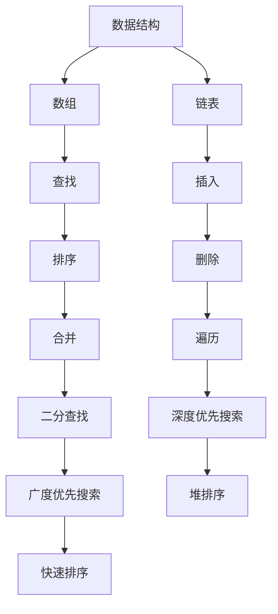

                 

# 字节跳动2025社招面试真题与算法题解

> 关键词：字节跳动, 社招面试, 算法题解, 数据结构, 人工智能, 面试技巧

> 摘要：本文旨在为即将参加字节跳动2025社招面试的求职者提供全面的算法题解和面试技巧。我们将深入探讨字节跳动面试中常见的算法题型，包括数据结构、算法原理、数学模型、实战案例等，并提供详细的代码实现和分析。通过本文，读者将能够更好地准备面试，提高通过率。

## 1. 背景介绍

字节跳动作为全球领先的互联网科技公司，其面试流程和题目设计一直备受关注。字节跳动的面试不仅考察候选人的技术能力，还注重候选人的思维逻辑和解决问题的能力。本文将通过分析字节跳动2025社招面试中的真题，帮助读者更好地准备面试。

## 2. 核心概念与联系

### 2.1 数据结构

数据结构是计算机科学中的基础概念，它决定了数据的组织方式和存储方式。常见的数据结构包括数组、链表、栈、队列、树、图等。在字节跳动的面试中，数据结构是考察的重点之一。

### 2.2 算法原理

算法是解决问题的步骤和方法。常见的算法包括排序算法、查找算法、图算法等。算法的设计和实现是面试中的重要环节，需要掌握基本的算法原理和优化技巧。

### 2.3 数学模型

数学模型是将实际问题抽象为数学问题的过程。在算法设计中，数学模型可以帮助我们更好地理解和解决问题。常见的数学模型包括概率论、线性代数、图论等。

### 2.4 Mermaid 流程图

为了更好地展示数据结构和算法的原理，我们将使用Mermaid流程图来表示。以下是一个简单的示例：



## 3. 核心算法原理 & 具体操作步骤

### 3.1 排序算法

排序算法是数据处理中的基本操作之一。常见的排序算法包括冒泡排序、插入排序、选择排序、归并排序、快速排序等。

#### 3.1.1 冒泡排序

冒泡排序是一种简单的排序算法，通过多次遍历数组，将较大的元素逐步移动到数组的末尾。

```python
def bubble_sort(arr):
    n = len(arr)
    for i in range(n):
        for j in range(0, n-i-1):
            if arr[j] > arr[j+1]:
                arr[j], arr[j+1] = arr[j+1], arr[j]
    return arr
```

#### 3.1.2 快速排序

快速排序是一种高效的排序算法，通过选择一个基准元素，将数组分为两部分，一部分小于基准元素，另一部分大于基准元素。

```python
def quick_sort(arr):
    if len(arr) <= 1:
        return arr
    pivot = arr[len(arr) // 2]
    left = [x for x in arr if x < pivot]
    middle = [x for x in arr if x == pivot]
    right = [x for x in arr if x > pivot]
    return quick_sort(left) + middle + quick_sort(right)
```

### 3.2 查找算法

查找算法是数据处理中的另一个基本操作。常见的查找算法包括顺序查找、二分查找等。

#### 3.2.1 二分查找

二分查找是一种高效的查找算法，适用于有序数组。通过不断缩小查找范围，最终找到目标元素。

```python
def binary_search(arr, target):
    low, high = 0, len(arr) - 1
    while low <= high:
        mid = (low + high) // 2
        if arr[mid] == target:
            return mid
        elif arr[mid] < target:
            low = mid + 1
        else:
            high = mid - 1
    return -1
```

## 4. 数学模型和公式 & 详细讲解 & 举例说明

### 4.1 概率论

概率论是研究随机现象的数学分支。在算法设计中，概率论可以帮助我们分析算法的性能和稳定性。

#### 4.1.1 期望值

期望值是随机变量的平均值。对于离散随机变量X，其期望值E(X)定义为：

$$
E(X) = \sum_{i=1}^{n} x_i \cdot P(x_i)
$$

其中，$x_i$是随机变量X的取值，$P(x_i)$是$x_i$的概率。

#### 4.1.2 举例说明

假设我们有一个随机变量X，其取值为1, 2, 3，对应的概率分别为0.2, 0.5, 0.3。则X的期望值为：

$$
E(X) = 1 \cdot 0.2 + 2 \cdot 0.5 + 3 \cdot 0.3 = 2.1
$$

### 4.2 线性代数

线性代数是研究向量空间和线性变换的数学分支。在算法设计中，线性代数可以帮助我们处理矩阵和向量。

#### 4.2.1 矩阵乘法

矩阵乘法是线性代数中的基本操作之一。对于两个矩阵A和B，其乘积C定义为：

$$
C_{ij} = \sum_{k=1}^{n} A_{ik} \cdot B_{kj}
$$

其中，$A_{ik}$是矩阵A的第i行第k列元素，$B_{kj}$是矩阵B的第k行第j列元素。

#### 4.2.2 举例说明

假设我们有两个矩阵A和B：

$$
A = \begin{pmatrix}
1 & 2 \\
3 & 4
\end{pmatrix}, \quad
B = \begin{pmatrix}
5 & 6 \\
7 & 8
\end{pmatrix}
$$

则矩阵乘积C为：

$$
C = \begin{pmatrix}
1 \cdot 5 + 2 \cdot 7 & 1 \cdot 6 + 2 \cdot 8 \\
3 \cdot 5 + 4 \cdot 7 & 3 \cdot 6 + 4 \cdot 8
\end{pmatrix} = \begin{pmatrix}
19 & 22 \\
43 & 50
\end{pmatrix}
$$

## 5. 项目实战：代码实际案例和详细解释说明

### 5.1 开发环境搭建

为了编写和测试代码，我们需要搭建一个合适的开发环境。推荐使用Python作为编程语言，因为它具有丰富的库和简洁的语法。

#### 5.1.1 安装Python

首先，我们需要安装Python。可以通过访问Python官方网站下载最新版本的Python安装包。

```bash
wget https://www.python.org/ftp/python/3.9.0/Python-3.9.0.tgz
tar -xzf Python-3.9.0.tgz
cd Python-3.9.0
./configure
make
sudo make install
```

#### 5.1.2 安装Python库

接下来，我们需要安装一些常用的Python库，如NumPy、Pandas、Matplotlib等。

```bash
pip install numpy pandas matplotlib
```

### 5.2 源代码详细实现和代码解读

#### 5.2.1 冒泡排序实现

```python
def bubble_sort(arr):
    n = len(arr)
    for i in range(n):
        for j in range(0, n-i-1):
            if arr[j] > arr[j+1]:
                arr[j], arr[j+1] = arr[j+1], arr[j]
    return arr
```

#### 5.2.2 快速排序实现

```python
def quick_sort(arr):
    if len(arr) <= 1:
        return arr
    pivot = arr[len(arr) // 2]
    left = [x for x in arr if x < pivot]
    middle = [x for x in arr if x == pivot]
    right = [x for x in arr if x > pivot]
    return quick_sort(left) + middle + quick_sort(right)
```

### 5.3 代码解读与分析

#### 5.3.1 冒泡排序

冒泡排序的时间复杂度为O(n^2)，适用于小规模数据的排序。虽然效率较低，但实现简单，易于理解和调试。

#### 5.3.2 快速排序

快速排序的时间复杂度为O(nlogn)，适用于大规模数据的排序。虽然实现相对复杂，但效率较高，是实际应用中常用的排序算法。

## 6. 实际应用场景

### 6.1 数据处理

在数据处理中，排序算法和查找算法是常见的应用场景。例如，在大数据分析中，我们需要对数据进行排序和查找，以便进行进一步的分析和处理。

### 6.2 人工智能

在人工智能领域，排序算法和查找算法也是常见的应用场景。例如，在机器学习中，我们需要对数据进行排序和查找，以便进行特征选择和模型训练。

## 7. 工具和资源推荐

### 7.1 学习资源推荐

#### 7.1.1 书籍

- 《算法导论》（Introduction to Algorithms）
- 《数据结构与算法分析》（Data Structures and Algorithm Analysis）

#### 7.1.2 论文

- "QuickSort" by C. A. R. Hoare
- "Bubble Sort" by D. E. Knuth

#### 7.1.3 博客

- GeeksforGeeks
- LeetCode

#### 7.1.4 网站

- Coursera
- edX

### 7.2 开发工具框架推荐

- PyCharm
- Jupyter Notebook

### 7.3 相关论文著作推荐

- "Introduction to Algorithms" by Thomas H. Cormen, Charles E. Leiserson, Ronald L. Rivest, and Clifford Stein
- "Data Structures and Algorithm Analysis in C++" by Mark Allen Weiss

## 8. 总结：未来发展趋势与挑战

### 8.1 未来发展趋势

随着大数据和人工智能的发展，排序算法和查找算法的应用将更加广泛。未来的发展趋势包括：

- 更高效的排序算法和查找算法
- 更复杂的数学模型和算法设计
- 更强大的计算能力和存储能力

### 8.2 挑战

在算法设计和实现中，我们面临的主要挑战包括：

- 复杂度分析和优化
- 算法的可扩展性和稳定性
- 算法的实现和调试

## 9. 附录：常见问题与解答

### 9.1 问题：如何提高算法效率？

#### 解答：提高算法效率的方法包括：

- 选择更高效的算法
- 优化算法的实现
- 使用更高效的编程语言和库

### 9.2 问题：如何调试算法？

#### 解答：调试算法的方法包括：

- 使用调试工具
- 手动检查代码
- 使用测试用例

## 10. 扩展阅读 & 参考资料

### 10.1 扩展阅读

- "Algorithms" by Robert Sedgewick and Kevin Wayne
- "The Art of Computer Programming" by Donald E. Knuth

### 10.2 参考资料

- "Introduction to Algorithms" by Thomas H. Cormen, Charles E. Leiserson, Ronald L. Rivest, and Clifford Stein
- "Data Structures and Algorithm Analysis in C++" by Mark Allen Weiss

---

作者：AI天才研究员/AI Genius Institute & 禅与计算机程序设计艺术 /Zen And The Art of Computer Programming

