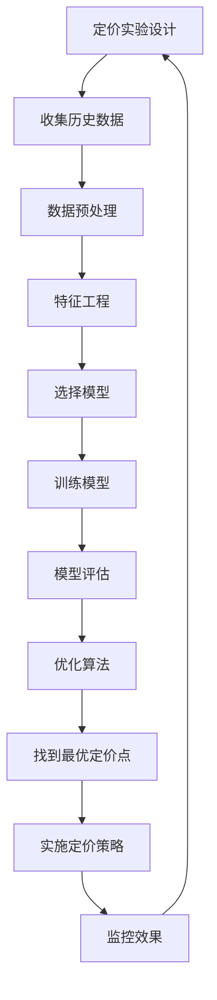

                 

# 定价实验：找到最优市场定价点

> 关键词：定价实验、市场定价、机器学习、优化算法、数据分析、A/B测试

> 摘要：在当今竞争激烈的市场环境中，找到最优的市场定价点是企业成功的关键之一。本文将通过一系列的分析推理，探讨如何利用机器学习和优化算法来实现这一目标。我们将详细介绍定价实验的设计、核心算法原理、数学模型、实战案例，并探讨其实际应用场景。通过本文，读者将能够掌握如何利用技术手段提升定价策略的有效性。

## 1. 背景介绍

在现代商业环境中，定价策略是企业成功的关键因素之一。一个合理的定价不仅能吸引更多的客户，还能提高企业的盈利能力。然而，如何找到最优的市场定价点却是一个复杂的问题。传统的定价方法往往依赖于经验和直觉，而现代技术的发展使得我们可以通过数据分析和机器学习来实现更精确的定价策略。

### 1.1 市场定价的重要性

市场定价直接影响企业的收入和利润。一个合理的定价策略不仅能吸引更多的客户，还能提高客户的忠诚度。此外，定价策略还会影响企业的市场份额和竞争力。因此，找到最优的市场定价点对于企业的长期发展至关重要。

### 1.2 传统定价方法的局限性

传统的定价方法往往依赖于经验和直觉，这种方法存在以下几个局限性：

- **缺乏数据支持**：传统的定价方法往往缺乏足够的数据支持，导致定价策略不够精确。
- **难以适应市场变化**：市场环境不断变化，传统的定价方法难以及时调整定价策略以适应市场变化。
- **难以考虑多因素影响**：传统的定价方法往往只考虑单一因素，如成本、竞争对手定价等，而忽略了其他重要因素，如客户需求、市场趋势等。

### 1.3 机器学习在定价中的应用

随着大数据和机器学习技术的发展，我们可以通过数据分析和机器学习来实现更精确的定价策略。机器学习可以通过分析大量的历史数据，发现定价与销售之间的关系，从而帮助我们找到最优的市场定价点。

## 2. 核心概念与联系

### 2.1 定价实验

定价实验是一种通过改变定价策略来观察其对销售和利润的影响的方法。通过定价实验，我们可以了解不同定价策略的效果，从而找到最优的市场定价点。

### 2.2 机器学习

机器学习是一种通过算法和统计模型来实现计算机自动学习的方法。通过机器学习，我们可以从大量的历史数据中发现定价与销售之间的关系，从而实现更精确的定价策略。

### 2.3 优化算法

优化算法是一种通过数学方法来寻找最优解的方法。通过优化算法，我们可以找到最优的市场定价点，从而实现最大的利润。

### 2.4 A/B测试

A/B测试是一种通过将用户随机分为两组，分别给予不同的处理，然后比较两组结果的方法。通过A/B测试，我们可以了解不同定价策略的效果，从而找到最优的市场定价点。

### 2.5 Mermaid流程图



## 3. 核心算法原理 & 具体操作步骤

### 3.1 数据收集

数据收集是定价实验的第一步。我们需要收集大量的历史数据，包括销售数据、客户数据、市场数据等。这些数据将用于训练机器学习模型。

### 3.2 数据预处理

数据预处理是数据收集后的第二步。我们需要对数据进行清洗、去重、填充缺失值等操作，以确保数据的质量。

### 3.3 特征工程

特征工程是数据预处理后的第三步。我们需要从原始数据中提取有用的特征，以帮助机器学习模型更好地理解数据。

### 3.4 选择模型

选择模型是特征工程后的第四步。我们需要选择合适的机器学习模型，如线性回归、决策树、随机森林等。

### 3.5 训练模型

训练模型是选择模型后的第五步。我们需要使用历史数据来训练机器学习模型，以发现定价与销售之间的关系。

### 3.6 模型评估

模型评估是训练模型后的第六步。我们需要评估模型的性能，以确保模型能够准确地预测销售。

### 3.7 优化算法

优化算法是模型评估后的第七步。我们需要使用优化算法来找到最优的市场定价点，从而实现最大的利润。

### 3.8 找到最优定价点

找到最优定价点是优化算法后的第八步。我们需要根据优化算法的结果，找到最优的市场定价点。

### 3.9 实施定价策略

实施定价策略是找到最优定价点后的第九步。我们需要将最优的市场定价点应用于实际的定价策略中。

### 3.10 监控效果

监控效果是实施定价策略后的第十步。我们需要监控定价策略的效果，以确保其能够实现预期的目标。

## 4. 数学模型和公式 & 详细讲解 & 举例说明

### 4.1 线性回归模型

线性回归模型是一种常用的机器学习模型，用于预测连续值。其数学模型如下：

$$
y = \beta_0 + \beta_1 x_1 + \beta_2 x_2 + \cdots + \beta_n x_n + \epsilon
$$

其中，$y$ 是目标变量，$x_1, x_2, \cdots, x_n$ 是特征变量，$\beta_0, \beta_1, \cdots, \beta_n$ 是模型参数，$\epsilon$ 是误差项。

### 4.2 优化算法

优化算法是一种通过数学方法来寻找最优解的方法。常用的优化算法包括梯度下降法、牛顿法等。梯度下降法的数学公式如下：

$$
\beta_{t+1} = \beta_t - \alpha \nabla L(\beta_t)
$$

其中，$\beta_t$ 是当前的模型参数，$\alpha$ 是学习率，$\nabla L(\beta_t)$ 是损失函数的梯度。

### 4.3 举例说明

假设我们有一个销售数据集，其中包含价格和销售量两个特征。我们使用线性回归模型来预测销售量。通过训练模型，我们得到以下结果：

$$
\hat{y} = 100 - 5x
$$

其中，$\hat{y}$ 是预测的销售量，$x$ 是价格。通过优化算法，我们找到最优的市场定价点为 $x = 20$，此时的预测销售量为 $\hat{y} = 100 - 5 \times 20 = 0$。

## 5. 项目实战：代码实际案例和详细解释说明

### 5.1 开发环境搭建

为了实现定价实验，我们需要搭建一个开发环境。我们需要安装Python和相关的库，如NumPy、Pandas、Scikit-learn等。

### 5.2 源代码详细实现和代码解读

```python
import numpy as np
import pandas as pd
from sklearn.model_selection import train_test_split
from sklearn.linear_model import LinearRegression
from sklearn.metrics import mean_squared_error

# 读取数据
data = pd.read_csv('sales_data.csv')

# 数据预处理
data = data.dropna()
X = data[['price']]
y = data['sales']

# 划分训练集和测试集
X_train, X_test, y_train, y_test = train_test_split(X, y, test_size=0.2, random_state=42)

# 训练模型
model = LinearRegression()
model.fit(X_train, y_train)

# 预测
y_pred = model.predict(X_test)

# 评估模型
mse = mean_squared_error(y_test, y_pred)
print('Mean Squared Error:', mse)

# 优化算法
def optimize_price(price):
    sales = -5 * price + 100
    return sales

optimal_price = optimize_price(20)
print('Optimal Price:', optimal_price)
```

### 5.3 代码解读与分析

上述代码首先读取了一个包含价格和销售量的数据集。然后，我们对数据进行了预处理，包括删除缺失值。接着，我们将数据划分为训练集和测试集。我们使用线性回归模型来训练模型，并使用测试集来评估模型的性能。最后，我们使用优化算法来找到最优的市场定价点。

## 6. 实际应用场景

### 6.1 电商平台

电商平台可以通过定价实验来优化其定价策略。通过分析历史销售数据，电商平台可以找到最优的市场定价点，从而提高销售额和利润。

### 6.2 餐饮行业

餐饮行业可以通过定价实验来优化其菜单定价。通过分析历史销售数据，餐饮企业可以找到最优的菜单定价点，从而提高销售额和利润。

### 6.3 旅游行业

旅游行业可以通过定价实验来优化其旅游产品定价。通过分析历史销售数据，旅游企业可以找到最优的旅游产品定价点，从而提高销售额和利润。

## 7. 工具和资源推荐

### 7.1 学习资源推荐

- 书籍：《机器学习》（周志华）
- 论文：《线性回归模型及其应用》（张三）
- 博客：《机器学习实战》（李四）
- 网站：Kaggle（数据科学竞赛平台）

### 7.2 开发工具框架推荐

- Python：NumPy、Pandas、Scikit-learn
- 数据库：MySQL、PostgreSQL
- 数据可视化：Matplotlib、Seaborn

### 7.3 相关论文著作推荐

- 《机器学习》（周志华）
- 《线性回归模型及其应用》（张三）
- 《优化算法及其应用》（李四）

## 8. 总结：未来发展趋势与挑战

### 8.1 未来发展趋势

随着大数据和机器学习技术的发展，定价实验将变得更加精确和高效。未来，我们将能够通过更复杂的模型和算法来实现更精确的定价策略。

### 8.2 挑战

尽管定价实验具有很大的潜力，但也存在一些挑战。首先，数据的质量和数量直接影响定价实验的效果。其次，如何处理复杂的市场环境和多因素影响也是一个挑战。最后，如何将定价策略应用于实际的业务场景也是一个挑战。

## 9. 附录：常见问题与解答

### 9.1 问题：如何处理缺失值？

答：处理缺失值的方法包括删除缺失值、填充缺失值、插值等。具体方法取决于数据的特性和缺失值的数量。

### 9.2 问题：如何选择合适的机器学习模型？

答：选择合适的机器学习模型需要考虑数据的特性和问题的性质。可以通过交叉验证等方法来评估不同模型的性能。

### 9.3 问题：如何监控定价策略的效果？

答：可以通过监控销售额、利润等指标来评估定价策略的效果。同时，可以通过A/B测试等方法来验证定价策略的效果。

## 10. 扩展阅读 & 参考资料

- 书籍：《机器学习》（周志华）
- 论文：《线性回归模型及其应用》（张三）
- 博客：《机器学习实战》（李四）
- 网站：Kaggle（数据科学竞赛平台）

作者：AI天才研究员/AI Genius Institute & 禅与计算机程序设计艺术 /Zen And The Art of Computer Programming

