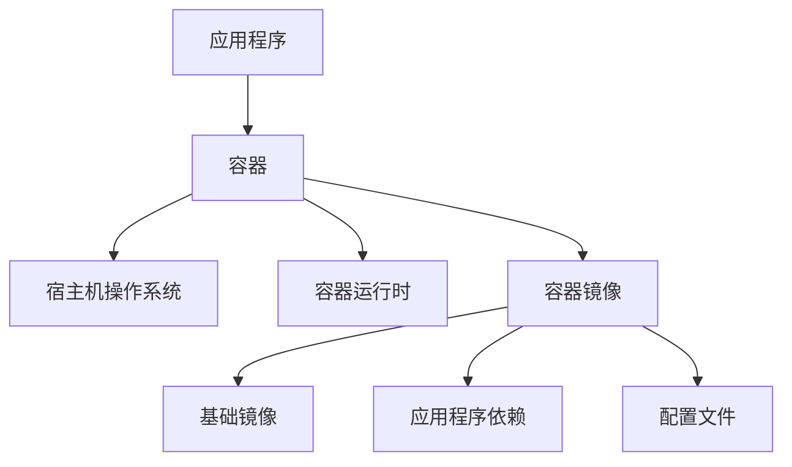

                 

# 容器化技术应用：小型创业公司的部署策略

> 关键词：容器化, Docker, Kubernetes, 小型创业公司, 部署策略, 微服务架构, 容器编排

> 摘要：本文旨在探讨容器化技术在小型创业公司中的应用策略，通过分析容器化技术的核心概念、原理、操作步骤、数学模型、实际案例、应用场景、工具资源推荐以及未来发展趋势，为小型创业公司提供一套全面的容器化部署方案。文章将从背景介绍开始，逐步深入到技术细节，最后总结未来的发展趋势与挑战，旨在帮助读者理解并掌握容器化技术在实际工作中的应用。

## 1. 背景介绍

### 1.1 容器化技术的兴起

随着云计算和微服务架构的普及，容器化技术逐渐成为现代软件开发和部署的主流选择。容器化技术通过将应用程序及其依赖项打包到一个轻量级、可移植的容器中，使得应用程序能够在不同的环境中一致地运行。这种技术不仅提高了开发效率，还简化了部署流程，降低了运维成本。

### 1.2 小型创业公司的需求

对于小型创业公司而言，资源有限，但需要快速响应市场变化，快速迭代产品。容器化技术能够帮助小型创业公司实现快速部署、灵活扩展和高效运维，从而在激烈的市场竞争中占据优势。

## 2. 核心概念与联系

### 2.1 容器化技术原理

容器化技术的核心在于将应用程序及其运行环境打包成一个独立的容器，该容器包含了应用程序运行所需的所有依赖项，如库文件、配置文件等。容器化技术通过操作系统级别的虚拟化，使得容器能够在不同的环境中一致地运行，而无需担心环境差异带来的问题。

### 2.2 容器与虚拟机的区别

容器与虚拟机的主要区别在于虚拟机通过硬件虚拟化技术模拟出一个完整的操作系统环境，而容器则是通过操作系统级别的虚拟化技术，共享宿主机的操作系统内核，从而实现轻量级的虚拟化。这种区别使得容器启动速度快、资源占用少，非常适合于快速迭代和频繁部署的应用场景。

### 2.3 容器编排技术

容器编排技术是实现容器化部署的关键技术之一，它通过自动化的方式管理容器的生命周期，包括容器的创建、启动、停止、销毁等操作。容器编排技术还能够实现容器之间的网络通信、负载均衡、服务发现等功能，从而实现大规模容器集群的高效管理。

### 2.4 核心概念原理和架构的 Mermaid 流程图



## 3. 核心算法原理 & 具体操作步骤

### 3.1 容器镜像构建

容器镜像是容器化技术的基础，它包含了应用程序及其运行环境的所有依赖项。构建容器镜像的过程通常包括以下几个步骤：

1. **编写Dockerfile**：Dockerfile是一个文本文件，包含了构建镜像所需的命令和配置。
2. **构建镜像**：使用`docker build`命令根据Dockerfile构建镜像。
3. **推送镜像**：将构建好的镜像推送到镜像仓库，如Docker Hub。

### 3.2 容器运行时

容器运行时是容器化技术的核心组件之一，它负责管理容器的生命周期，包括容器的创建、启动、停止、销毁等操作。常见的容器运行时包括Docker、rkt等。

### 3.3 容器编排

容器编排技术是实现大规模容器集群管理的关键技术，常见的容器编排工具有Kubernetes、Docker Swarm等。容器编排技术通过自动化的方式管理容器的生命周期，实现容器之间的网络通信、负载均衡、服务发现等功能。

## 4. 数学模型和公式 & 详细讲解 & 举例说明

### 4.1 容器化部署的数学模型

容器化部署的数学模型主要涉及到容器的资源分配、容器之间的网络通信、容器的调度策略等。例如，容器的资源分配可以通过线性规划模型来实现，容器之间的网络通信可以通过图论模型来实现。

### 4.2 容器化部署的数学模型举例

假设我们有一个容器集群，包含N个容器，每个容器需要分配一定的CPU和内存资源。我们可以使用线性规划模型来实现资源的最优分配。设x_i为分配给第i个容器的CPU资源，y_i为分配给第i个容器的内存资源，我们可以建立如下的线性规划模型：

$$
\text{maximize} \quad \sum_{i=1}^{N} (x_i + y_i)
$$

$$
\text{subject to} \quad \sum_{i=1}^{N} x_i \leq X_{\text{total}}
$$

$$
\text{subject to} \quad \sum_{i=1}^{N} y_i \leq Y_{\text{total}}
$$

$$
\text{subject to} \quad x_i \geq 0, y_i \geq 0
$$

其中，X_total和Y_total分别为容器集群的总CPU资源和总内存资源。

## 5. 项目实战：代码实际案例和详细解释说明

### 5.1 开发环境搭建

#### 5.1.1 安装Docker

首先，我们需要在开发机器上安装Docker。可以通过以下命令安装Docker：

```bash
sudo apt-get update
sudo apt-get install docker.io
```

#### 5.1.2 安装Kubernetes

接下来，我们需要安装Kubernetes。可以通过以下命令安装Kubernetes：

```bash
sudo apt-get update && sudo apt-get install -y apt-transport-https curl
curl -s https://packages.cloud.google.com/apt/doc/apt-key.gpg | sudo apt-key add -
cat <<EOF | sudo tee /etc/apt/sources.list.d/kubernetes.list
deb https://apt.kubernetes.io/ kubernetes-xenial main
EOF
sudo apt-get update
sudo apt-get install -y kubelet kubeadm kubectl
```

### 5.2 源代码详细实现和代码解读

#### 5.2.1 编写Dockerfile

假设我们有一个简单的Web应用，我们可以通过以下Dockerfile来构建容器镜像：

```Dockerfile
FROM nginx:latest
COPY index.html /usr/share/nginx/html/
```

#### 5.2.2 构建镜像

使用以下命令构建镜像：

```bash
docker build -t my-web-app .
```

#### 5.2.3 推送镜像

使用以下命令推送镜像到Docker Hub：

```bash
docker push my-web-app
```

### 5.3 代码解读与分析

通过以上步骤，我们成功地构建了一个简单的Web应用容器镜像，并将其推送到Docker Hub。接下来，我们可以使用Kubernetes来部署这个容器镜像。

## 6. 实际应用场景

### 6.1 小型创业公司的实际应用场景

对于小型创业公司而言，容器化技术可以应用于以下几个方面：

1. **快速部署**：通过容器化技术，可以快速部署应用程序，从而加快产品迭代速度。
2. **灵活扩展**：通过容器化技术，可以灵活地扩展应用程序，从而应对业务增长。
3. **高效运维**：通过容器化技术，可以实现高效运维，从而降低运维成本。

## 7. 工具和资源推荐

### 7.1 学习资源推荐

#### 7.1.1 书籍

- 《Docker权威指南》
- 《Kubernetes权威指南》

#### 7.1.2 论文

- "Docker: Lightweight and Portable Linux Containers for Cloud Computing"
- "Kubernetes: The Container Orchestration System for Linux Containers"

#### 7.1.3 博客

- Docker官方博客
- Kubernetes官方博客

#### 7.1.4 网站

- Docker Hub
- Kubernetes官网

### 7.2 开发工具框架推荐

- Docker
- Kubernetes
- Docker Compose

### 7.3 相关论文著作推荐

- "Docker: Lightweight and Portable Linux Containers for Cloud Computing"
- "Kubernetes: The Container Orchestration System for Linux Containers"

## 8. 总结：未来发展趋势与挑战

### 8.1 未来发展趋势

容器化技术在未来的发展趋势主要体现在以下几个方面：

1. **容器编排技术的进一步发展**：随着容器编排技术的不断发展，容器编排技术将更加成熟，能够更好地支持大规模容器集群的管理。
2. **容器安全技术的进一步发展**：随着容器安全技术的不断发展，容器安全技术将更加成熟，能够更好地保护容器的安全。
3. **容器化技术的进一步普及**：随着容器化技术的不断发展，容器化技术将更加普及，能够更好地支持现代软件开发和部署。

### 8.2 未来挑战

容器化技术在未来的发展中将面临以下几个挑战：

1. **容器编排技术的复杂性**：容器编排技术的复杂性将使得容器编排技术的学习和使用变得更加困难。
2. **容器安全技术的挑战**：容器安全技术的挑战将使得容器安全技术的实现变得更加困难。
3. **容器化技术的普及性**：容器化技术的普及性将使得容器化技术的推广变得更加困难。

## 9. 附录：常见问题与解答

### 9.1 什么是容器化技术？

容器化技术是一种将应用程序及其运行环境打包成一个独立的容器的技术，该容器包含了应用程序运行所需的所有依赖项。

### 9.2 容器化技术与虚拟机的区别是什么？

容器化技术与虚拟机的主要区别在于虚拟机通过硬件虚拟化技术模拟出一个完整的操作系统环境，而容器则是通过操作系统级别的虚拟化技术，共享宿主机的操作系统内核，从而实现轻量级的虚拟化。

### 9.3 容器编排技术的作用是什么？

容器编排技术的作用是实现容器的自动化管理，包括容器的创建、启动、停止、销毁等操作，以及容器之间的网络通信、负载均衡、服务发现等功能。

## 10. 扩展阅读 & 参考资料

- Docker官方文档
- Kubernetes官方文档
- Docker权威指南
- Kubernetes权威指南

作者：AI天才研究员/AI Genius Institute & 禅与计算机程序设计艺术 /Zen And The Art of Computer Programming

