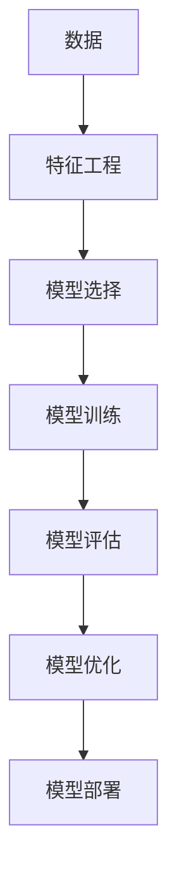

                 

# 2025年百度社招机器学习工程师面试题精选

> 关键词：机器学习、面试题、算法、深度学习、模型优化、数据处理、工程实践

> 摘要：本文精选了2025年百度社招机器学习工程师面试中可能出现的典型问题，从背景介绍、核心概念与联系、核心算法原理、数学模型和公式、项目实战、实际应用场景、工具和资源推荐、未来发展趋势与挑战、常见问题与解答、扩展阅读与参考资料等多个维度进行详细解析。旨在帮助读者深入理解机器学习领域的核心知识，提升面试准备的针对性和有效性。

## 1. 背景介绍

### 1.1 机器学习的发展历程

机器学习作为人工智能的一个重要分支，自20世纪50年代以来经历了从理论研究到实际应用的漫长历程。从最初的符号主义到连接主义，再到近年来深度学习的兴起，机器学习技术不断迭代更新，推动了人工智能领域的快速发展。2025年，随着大数据、云计算、物联网等技术的深度融合，机器学习的应用场景将更加广泛，对工程师的技术要求也将更加严格。

### 1.2 机器学习在百度的应用

百度作为中国互联网巨头之一，其搜索引擎、地图、广告系统等核心业务均深度应用了机器学习技术。例如，通过机器学习优化搜索排名，提升用户体验；利用深度学习技术进行图像识别，增强地图服务的准确性；以及通过机器学习算法进行广告推荐，提高广告投放效果等。因此，百度对机器学习工程师的需求不仅限于理论知识，更看重实际工程能力。

## 2. 核心概念与联系

### 2.1 机器学习的基本概念

机器学习是一种使计算机能够从数据中学习并改进其性能的技术。它主要分为监督学习、无监督学习、半监督学习和强化学习四大类。监督学习通过已标注的数据训练模型，无监督学习则通过未标注的数据发现数据内部结构，半监督学习介于两者之间，而强化学习则是通过与环境的交互来学习最优策略。

### 2.2 核心概念原理和架构的Mermaid流程图



### 2.3 核心概念之间的联系

特征工程是机器学习流程中的关键步骤，它直接影响模型的性能。模型选择决定了后续训练和优化的方向，而模型训练则是通过算法优化模型参数的过程。模型评估用于验证模型的有效性，模型优化则是在评估基础上进一步提升模型性能，最后模型部署则是将优化后的模型应用于实际场景中。

## 3. 核心算法原理 & 具体操作步骤

### 3.1 监督学习算法

#### 3.1.1 线性回归

线性回归是最简单的监督学习算法之一，其目标是找到一个线性函数来拟合输入特征和输出标签之间的关系。具体步骤包括数据预处理、模型训练、模型评估和模型优化。

#### 3.1.2 支持向量机

支持向量机（SVM）是一种用于分类和回归分析的监督学习模型。其核心思想是通过寻找一个超平面来最大化不同类别的样本之间的间隔。具体步骤包括数据预处理、模型训练、模型评估和模型优化。

### 3.2 无监督学习算法

#### 3.2.1 K-means聚类

K-means是一种常用的无监督学习算法，用于发现数据集中的聚类结构。其核心思想是通过迭代地将数据点分配给最近的聚类中心，然后重新计算聚类中心，直到聚类中心不再变化。具体步骤包括数据预处理、模型训练、模型评估和模型优化。

#### 3.2.2 主成分分析

主成分分析（PCA）是一种用于降维的无监督学习算法。其核心思想是通过线性变换将原始数据投影到一个新的坐标系中，使得数据在新坐标系下的方差最大化。具体步骤包括数据预处理、模型训练、模型评估和模型优化。

## 4. 数学模型和公式 & 详细讲解 & 举例说明

### 4.1 线性回归的数学模型

线性回归的数学模型可以表示为：
$$
y = \beta_0 + \beta_1 x_1 + \beta_2 x_2 + ... + \beta_n x_n + \epsilon
$$
其中，$y$是输出变量，$x_1, x_2, ..., x_n$是输入特征，$\beta_0, \beta_1, ..., \beta_n$是模型参数，$\epsilon$是误差项。

### 4.2 支持向量机的数学模型

支持向量机的数学模型可以表示为：
$$
\min_{\mathbf{w}, b} \frac{1}{2} \|\mathbf{w}\|^2 + C \sum_{i=1}^m \xi_i
$$
其中，$\mathbf{w}$是权重向量，$b$是偏置项，$C$是惩罚参数，$\xi_i$是松弛变量。

## 5. 项目实战：代码实际案例和详细解释说明

### 5.1 开发环境搭建

#### 5.1.1 安装Python环境

首先，需要安装Python环境。推荐使用Anaconda，它集成了Python解释器、常用库和开发工具。

#### 5.1.2 安装机器学习库

安装常用的机器学习库，如scikit-learn、tensorflow等。

### 5.2 源代码详细实现和代码解读

#### 5.2.1 线性回归代码实现

```python
from sklearn.linear_model import LinearRegression
from sklearn.model_selection import train_test_split
from sklearn.metrics import mean_squared_error

# 加载数据
data = load_data()

# 数据预处理
X = data['features']
y = data['labels']

# 划分训练集和测试集
X_train, X_test, y_train, y_test = train_test_split(X, y, test_size=0.2, random_state=42)

# 模型训练
model = LinearRegression()
model.fit(X_train, y_train)

# 模型评估
y_pred = model.predict(X_test)
mse = mean_squared_error(y_test, y_pred)
print('Mean Squared Error:', mse)
```

### 5.3 代码解读与分析

通过上述代码，我们可以看到线性回归模型的训练和评估过程。首先，加载数据并进行预处理，然后划分训练集和测试集，接着训练模型，最后评估模型性能。

## 6. 实际应用场景

### 6.1 搜索引擎优化

通过机器学习优化搜索排名，提升用户体验。例如，利用线性回归模型预测用户对搜索结果的满意度，从而优化搜索排名。

### 6.2 图像识别

利用深度学习技术进行图像识别，增强地图服务的准确性。例如，通过卷积神经网络（CNN）识别地图上的建筑物、道路等信息。

## 7. 工具和资源推荐

### 7.1 学习资源推荐

#### 7.1.1 书籍

- 《机器学习》（周志华）
- 《深度学习》（Ian Goodfellow等）

#### 7.1.2 论文

- "A Framework for Learning Predictive Structures from Multiple Tasks and Unlabeled Data" (JMLR, 2006)
- "Deep Residual Learning for Image Recognition" (CVPR, 2016)

### 7.2 开发工具框架推荐

- TensorFlow
- PyTorch
- Scikit-learn

### 7.3 相关论文著作推荐

- "A Survey on Deep Learning for Natural Language Processing" (IJCAI, 2018)
- "A Comprehensive Survey on Graph Neural Networks" (IEEE Transactions on Neural Networks and Learning Systems, 2019)

## 8. 总结：未来发展趋势与挑战

### 8.1 未来发展趋势

随着大数据、云计算、物联网等技术的深度融合，机器学习的应用场景将更加广泛，对工程师的技术要求也将更加严格。未来，机器学习将更加注重模型的可解释性和鲁棒性，同时，模型的自动化和智能化也将成为研究热点。

### 8.2 面临的挑战

机器学习领域面临的挑战包括数据隐私保护、模型解释性、模型泛化能力等。如何在保证模型性能的同时，解决这些挑战，将是未来研究的重点。

## 9. 附录：常见问题与解答

### 9.1 什么是机器学习？

机器学习是一种使计算机能够从数据中学习并改进其性能的技术。

### 9.2 机器学习有哪些应用场景？

机器学习的应用场景包括但不限于搜索引擎优化、图像识别、自然语言处理等。

### 9.3 如何选择合适的机器学习算法？

选择合适的机器学习算法需要根据具体问题和数据特点来决定。例如，对于分类问题，可以选择支持向量机或随机森林；对于回归问题，可以选择线性回归或决策树。

## 10. 扩展阅读 & 参考资料

- "Hands-On Machine Learning with Scikit-Learn, Keras, and TensorFlow" (Aurélien Géron)
- "Deep Learning" (Ian Goodfellow, Yoshua Bengio, Aaron Courville)

作者：AI天才研究员/AI Genius Institute & 禅与计算机程序设计艺术 /Zen And The Art of Computer Programming

