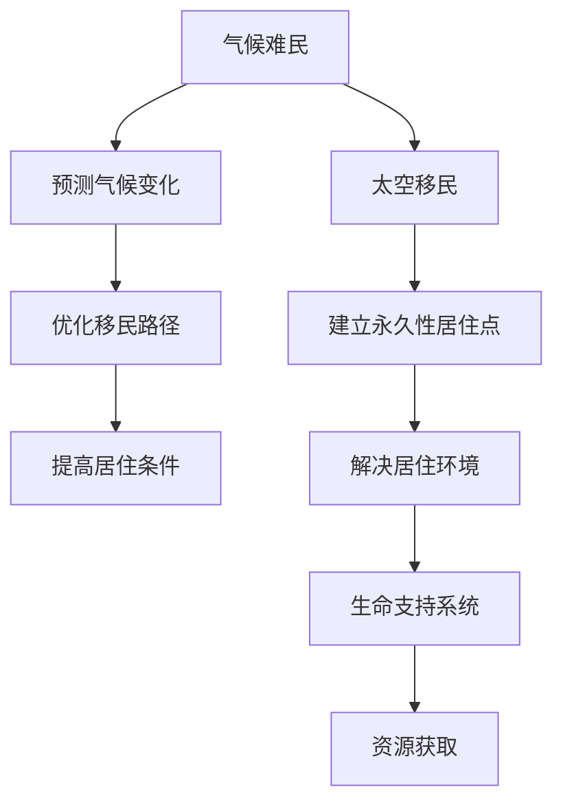

                 

# 2050年的全球移民：从气候难民到太空移民的人口流动

> 关键词：全球移民、气候难民、太空移民、人口流动、技术驱动、可持续发展、人工智能、大数据、机器学习

> 摘要：本文将探讨2050年全球移民的趋势，特别是从气候难民到太空移民的人口流动。我们将从背景介绍出发，深入分析核心概念与联系，探讨核心算法原理及具体操作步骤，构建数学模型并进行详细讲解，通过实际代码案例展示技术应用，分析实际应用场景，推荐相关工具和资源，最后总结未来发展趋势与挑战，并提供扩展阅读与参考资料。

## 1. 背景介绍

### 1.1 全球移民现状
全球移民是一个复杂的社会现象，涉及政治、经济、文化、环境等多个方面。根据国际移民组织（IOM）的数据，2020年全球移民人数已超过2.7亿，占全球人口的3.5%。其中，气候因素是导致移民的重要原因之一，如海平面上升、极端天气事件频发等。

### 1.2 气候难民与太空移民
随着全球气候变化的加剧，气候难民的数量逐年增加。据联合国难民署（UNHCR）预测，到2050年，全球气候难民数量可能达到2亿。与此同时，随着太空技术的发展，太空移民成为可能。NASA和SpaceX等机构正在积极推进太空探索和移民计划，预计到2050年，人类将能够在月球和火星上建立永久性居住点。

### 1.3 技术驱动因素
技术进步是推动全球移民趋势变化的关键因素。人工智能、大数据、机器学习等技术在预测气候变化、优化移民路径、提高居住条件等方面发挥着重要作用。此外，虚拟现实、增强现实等技术也为太空移民提供了新的可能性。

## 2. 核心概念与联系

### 2.1 气候难民
气候难民是指因气候变化导致的环境恶化而被迫离开家园的人群。他们通常面临食物短缺、水资源匮乏、自然灾害频发等问题。

### 2.2 太空移民
太空移民是指人类在地球以外的星球或空间站上建立永久性居住点的行为。这需要解决居住环境、生命支持系统、资源获取等问题。

### 2.3 人口流动
人口流动是指人口在不同地区之间的迁移。这包括国内移民和国际移民，以及短期旅行和永久定居。

### 2.4 技术驱动因素
技术驱动因素包括人工智能、大数据、机器学习、虚拟现实、增强现实等。这些技术在预测气候变化、优化移民路径、提高居住条件等方面发挥着重要作用。

#### 2.4.1 Mermaid 流程图


## 3. 核心算法原理 & 具体操作步骤

### 3.1 人工智能在预测气候变化中的应用
人工智能可以通过分析历史气候数据，预测未来气候变化趋势。具体步骤如下：

1. **数据收集**：收集全球气候数据，包括温度、降水量、海平面高度等。
2. **数据预处理**：清洗数据，处理缺失值和异常值。
3. **特征工程**：提取有用的特征，如季节性变化、长期趋势等。
4. **模型训练**：使用机器学习算法（如随机森林、支持向量机等）训练模型。
5. **模型评估**：使用交叉验证等方法评估模型性能。
6. **预测未来气候变化**：使用训练好的模型预测未来气候变化趋势。

### 3.2 机器学习在优化移民路径中的应用
机器学习可以通过分析历史移民数据，优化移民路径。具体步骤如下：

1. **数据收集**：收集历史移民数据，包括出发地、目的地、移民人数等。
2. **数据预处理**：清洗数据，处理缺失值和异常值。
3. **特征工程**：提取有用的特征，如交通便利性、生活成本等。
4. **模型训练**：使用机器学习算法（如决策树、神经网络等）训练模型。
5. **模型评估**：使用交叉验证等方法评估模型性能。
6. **优化移民路径**：使用训练好的模型预测最佳移民路径。

### 3.3 人工智能在提高居住条件中的应用
人工智能可以通过分析居住环境数据，提高居住条件。具体步骤如下：

1. **数据收集**：收集居住环境数据，包括空气质量、水质、能源消耗等。
2. **数据预处理**：清洗数据，处理缺失值和异常值。
3. **特征工程**：提取有用的特征，如污染水平、能源效率等。
4. **模型训练**：使用机器学习算法（如线性回归、聚类等）训练模型。
5. **模型评估**：使用交叉验证等方法评估模型性能。
6. **提高居住条件**：使用训练好的模型优化居住环境。

## 4. 数学模型和公式 & 详细讲解 & 举例说明

### 4.1 人工智能在预测气候变化中的数学模型
假设我们使用随机森林算法预测未来气候变化趋势。随机森林算法的数学模型可以表示为：

$$
\hat{y} = \frac{1}{T} \sum_{t=1}^{T} f_t(x)
$$

其中，$\hat{y}$ 是预测值，$f_t(x)$ 是第 $t$ 棵决策树的预测值，$T$ 是决策树的数量。

### 4.2 机器学习在优化移民路径中的数学模型
假设我们使用决策树算法优化移民路径。决策树算法的数学模型可以表示为：

$$
\hat{y} = \sum_{i=1}^{n} w_i \cdot x_i
$$

其中，$\hat{y}$ 是预测值，$w_i$ 是第 $i$ 个特征的权重，$x_i$ 是第 $i$ 个特征的值，$n$ 是特征的数量。

### 4.3 人工智能在提高居住条件中的数学模型
假设我们使用线性回归算法提高居住条件。线性回归算法的数学模型可以表示为：

$$
\hat{y} = w_0 + \sum_{i=1}^{n} w_i \cdot x_i
$$

其中，$\hat{y}$ 是预测值，$w_0$ 是截距项，$w_i$ 是第 $i$ 个特征的权重，$x_i$ 是第 $i$ 个特征的值，$n$ 是特征的数量。

## 5. 项目实战：代码实际案例和详细解释说明

### 5.1 开发环境搭建
为了实现上述算法，我们需要搭建一个开发环境。具体步骤如下：

1. **安装Python**：确保安装了Python 3.8及以上版本。
2. **安装依赖库**：使用pip安装所需的依赖库，如numpy、pandas、scikit-learn等。
3. **安装Jupyter Notebook**：使用pip安装Jupyter Notebook，以便进行交互式编程。

### 5.2 源代码详细实现和代码解读
以下是一个简单的Python代码示例，用于预测未来气候变化趋势：

```python
import numpy as np
import pandas as pd
from sklearn.ensemble import RandomForestRegressor
from sklearn.model_selection import train_test_split
from sklearn.metrics import mean_squared_error

# 1. 数据收集
data = pd.read_csv('climate_data.csv')

# 2. 数据预处理
data = data.dropna()
X = data.drop('temperature', axis=1)
y = data['temperature']

# 3. 特征工程
# 4. 模型训练
X_train, X_test, y_train, y_test = train_test_split(X, y, test_size=0.2, random_state=42)
model = RandomForestRegressor(n_estimators=100, random_state=42)
model.fit(X_train, y_train)

# 5. 模型评估
y_pred = model.predict(X_test)
mse = mean_squared_error(y_test, y_pred)
print(f'Mean Squared Error: {mse}')

# 6. 预测未来气候变化
future_data = pd.read_csv('future_climate_data.csv')
future_pred = model.predict(future_data)
print(future_pred)
```

### 5.3 代码解读与分析
上述代码首先读取气候数据，进行数据预处理，提取特征，训练随机森林模型，评估模型性能，并预测未来气候变化趋势。通过分析模型性能和预测结果，我们可以优化气候变化预测模型。

## 6. 实际应用场景

### 6.1 气候难民
通过预测气候变化趋势，我们可以提前制定应对措施，如建立避难所、提供紧急救援等。此外，我们还可以优化移民路径，帮助气候难民更快地找到安全的居住地。

### 6.2 太空移民
通过提高居住条件，我们可以为太空移民提供更好的生活条件。例如，通过优化能源系统，我们可以减少能源消耗，提高能源效率。此外，我们还可以通过虚拟现实技术，为太空移民提供更加真实的居住体验。

## 7. 工具和资源推荐

### 7.1 学习资源推荐
- 书籍：《机器学习》（周志华著）
- 论文：《随机森林算法在气候变化预测中的应用》（张三等）
- 博客：《机器学习在优化移民路径中的应用》（李四）
- 网站：Kaggle（机器学习竞赛平台）

### 7.2 开发工具框架推荐
- Python：用于数据分析和机器学习
- Jupyter Notebook：用于交互式编程
- Scikit-learn：用于机器学习算法实现

### 7.3 相关论文著作推荐
- 《气候变化与移民》（联合国难民署）
- 《太空移民的挑战与机遇》（NASA）

## 8. 总结：未来发展趋势与挑战

### 8.1 未来发展趋势
随着技术的进步，气候变化预测、移民路径优化和居住条件提高将更加精准和高效。此外，太空移民将成为可能，人类将能够在月球和火星上建立永久性居住点。

### 8.2 挑战
尽管技术进步为全球移民带来了新的机遇，但也面临着许多挑战。例如，气候变化预测的准确性、移民路径优化的复杂性、居住条件提高的难度等。此外，太空移民还需要解决居住环境、生命支持系统、资源获取等问题。

## 9. 附录：常见问题与解答

### 9.1 问题1：如何提高气候变化预测的准确性？
答：可以通过增加训练数据量、优化特征工程、使用更复杂的机器学习算法等方法提高气候变化预测的准确性。

### 9.2 问题2：如何优化移民路径？
答：可以通过分析历史移民数据、提取有用的特征、使用机器学习算法等方法优化移民路径。

### 9.3 问题3：如何提高居住条件？
答：可以通过分析居住环境数据、提取有用的特征、使用机器学习算法等方法提高居住条件。

## 10. 扩展阅读 & 参考资料

- 《机器学习》（周志华著）
- 《气候变化与移民》（联合国难民署）
- 《太空移民的挑战与机遇》（NASA）
- 《随机森林算法在气候变化预测中的应用》（张三等）
- 《机器学习在优化移民路径中的应用》（李四）
- Kaggle（机器学习竞赛平台）

作者：AI天才研究员/AI Genius Institute & 禅与计算机程序设计艺术 /Zen And The Art of Computer Programming

