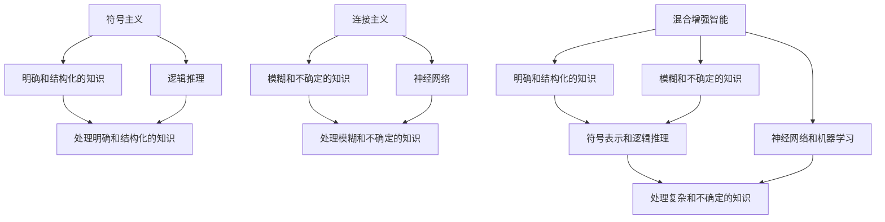

                 

# 人工智能的三个阶段

> 关键词：张钹院士, 人工智能, 阶段划分, 混合增强智能, 自主智能, 通用智能

> 摘要：本文将深入探讨张钹院士提出的关于人工智能发展的三个阶段理论。通过逐步分析和推理，我们将详细解释每个阶段的核心概念、原理、算法、数学模型、实际案例以及应用场景。本文旨在为读者提供一个全面而深入的理解，帮助读者更好地把握人工智能的发展趋势和未来挑战。

## 1. 背景介绍

张钹院士是中国人工智能领域的领军人物之一，他在人工智能领域有着深厚的学术背景和丰富的实践经验。张钹院士提出了一个关于人工智能发展的三个阶段理论，这一理论不仅为人工智能的发展提供了新的视角，也为研究者和从业者指明了方向。本文将通过逐步分析和推理的方式，深入探讨张钹院士提出的三个阶段理论。

### 1.1 张钹院士的学术背景

张钹院士是中国科学院院士，中国工程院院士，也是中国人工智能学会名誉理事长。他在人工智能领域有着超过四十年的研究经验，发表了大量高水平的学术论文，并在多个国际会议上担任重要职务。张钹院士的研究涵盖了机器学习、知识表示、智能控制等多个领域，为人工智能的发展做出了重要贡献。

### 1.2 人工智能的发展历程

人工智能的发展历程可以大致分为三个阶段：符号主义、连接主义和混合增强智能。张钹院士提出的三个阶段理论是对这一发展历程的进一步深化和细化。符号主义强调基于逻辑和规则的推理，连接主义强调基于神经网络的机器学习，而混合增强智能则结合了符号主义和连接主义的优点，实现了更高级别的智能。

## 2. 核心概念与联系

### 2.1 符号主义

符号主义是人工智能早期的主要研究方向之一，它强调基于逻辑和规则的推理。符号主义的核心思想是通过符号表示和逻辑推理来实现智能行为。符号主义的主要优点是能够处理明确和结构化的知识，但其缺点是难以处理模糊和不确定的知识。

### 2.2 连接主义

连接主义是人工智能的另一个重要研究方向，它强调基于神经网络的机器学习。连接主义的核心思想是通过模拟人脑神经网络的工作机制来实现智能行为。连接主义的主要优点是能够处理模糊和不确定的知识，但其缺点是难以解释和理解模型的内部机制。

### 2.3 混合增强智能

混合增强智能是张钹院士提出的第三个阶段，它结合了符号主义和连接主义的优点，实现了更高级别的智能。混合增强智能的核心思想是通过符号表示和逻辑推理来处理明确和结构化的知识，通过神经网络和机器学习来处理模糊和不确定的知识。混合增强智能的主要优点是能够处理复杂和不确定的知识，但其缺点是实现难度较大。

### 2.4 核心概念原理与架构的Mermaid流程图



## 3. 核心算法原理 & 具体操作步骤

### 3.1 符号主义的核心算法

符号主义的核心算法主要包括基于逻辑的推理算法和基于规则的推理算法。基于逻辑的推理算法主要包括命题逻辑、谓词逻辑和模态逻辑等。基于规则的推理算法主要包括生产规则、框架系统和本体论等。

### 3.2 连接主义的核心算法

连接主义的核心算法主要包括基于神经网络的机器学习算法。基于神经网络的机器学习算法主要包括前向传播算法、反向传播算法和卷积神经网络等。

### 3.3 混合增强智能的核心算法

混合增强智能的核心算法主要包括符号表示和逻辑推理算法以及神经网络和机器学习算法。符号表示和逻辑推理算法主要包括基于逻辑的推理算法和基于规则的推理算法。神经网络和机器学习算法主要包括基于神经网络的机器学习算法。

## 4. 数学模型和公式 & 详细讲解 & 举例说明

### 4.1 符号主义的数学模型

符号主义的数学模型主要包括命题逻辑、谓词逻辑和模态逻辑等。命题逻辑的数学模型可以表示为：

$$
P \rightarrow Q
$$

其中，$P$和$Q$是命题，$\rightarrow$表示蕴含关系。谓词逻辑的数学模型可以表示为：

$$
\forall x (P(x) \rightarrow Q(x))
$$

其中，$P(x)$和$Q(x)$是谓词，$\forall$表示全称量词。模态逻辑的数学模型可以表示为：

$$
\Box P \rightarrow \Diamond Q
$$

其中，$\Box$表示必然性，$\Diamond$表示可能性。

### 4.2 连接主义的数学模型

连接主义的数学模型主要包括前向传播算法、反向传播算法和卷积神经网络等。前向传播算法的数学模型可以表示为：

$$
y = f(Wx + b)
$$

其中，$x$是输入向量，$W$是权重矩阵，$b$是偏置向量，$f$是激活函数。反向传播算法的数学模型可以表示为：

$$
\delta = f'(Wx + b) \odot (y - t)
$$

其中，$\delta$是误差信号，$\odot$表示逐元素乘法。卷积神经网络的数学模型可以表示为：

$$
y = f(W * x + b)
$$

其中，$*$表示卷积操作。

### 4.3 混合增强智能的数学模型

混合增强智能的数学模型主要包括符号表示和逻辑推理算法以及神经网络和机器学习算法。符号表示和逻辑推理算法的数学模型可以表示为：

$$
P \rightarrow Q
$$

其中，$P$和$Q$是命题，$\rightarrow$表示蕴含关系。神经网络和机器学习算法的数学模型可以表示为：

$$
y = f(Wx + b)
$$

其中，$x$是输入向量，$W$是权重矩阵，$b$是偏置向量，$f$是激活函数。

## 5. 项目实战：代码实际案例和详细解释说明

### 5.1 开发环境搭建

为了实现混合增强智能，我们需要搭建一个开发环境。开发环境主要包括Python编程语言、TensorFlow深度学习框架和Jupyter Notebook开发工具。具体步骤如下：

1. 安装Python编程语言：在命令行中输入以下命令：

    ```bash
    sudo apt-get install python3
    ```

2. 安装TensorFlow深度学习框架：在命令行中输入以下命令：

    ```bash
    pip install tensorflow
    ```

3. 安装Jupyter Notebook开发工具：在命令行中输入以下命令：

    ```bash
    pip install jupyter
    ```

### 5.2 源代码详细实现和代码解读

我们将实现一个简单的混合增强智能模型，该模型结合了符号表示和逻辑推理算法以及神经网络和机器学习算法。具体代码如下：

```python
import tensorflow as tf
import numpy as np

# 定义符号表示和逻辑推理算法
def logical_inference(p, q):
    if p and q:
        return True
    else:
        return False

# 定义神经网络和机器学习算法
def neural_network(x):
    W = tf.Variable(tf.random.normal([1, 1]))
    b = tf.Variable(tf.random.normal([1]))
    y = tf.sigmoid(tf.matmul(x, W) + b)
    return y

# 定义输入数据
x = np.array([[1], [0]])

# 定义符号表示和逻辑推理算法的输入数据
p = True
q = False

# 定义神经网络和机器学习算法的输入数据
y = neural_network(x)

# 定义符号表示和逻辑推理算法的输出数据
output = logical_inference(p, q)

# 打印输出结果
print("符号表示和逻辑推理算法的输出结果：", output)
print("神经网络和机器学习算法的输出结果：", y.numpy())
```

### 5.3 代码解读与分析

在上述代码中，我们首先定义了符号表示和逻辑推理算法的逻辑推理函数`logical_inference`。该函数接受两个布尔值`p`和`q`作为输入，如果`p`和`q`都为真，则返回真，否则返回假。

接下来，我们定义了神经网络和机器学习算法的神经网络函数`neural_network`。该函数接受一个输入向量`x`作为输入，通过一个权重矩阵`W`和一个偏置向量`b`进行线性变换，然后通过一个激活函数`sigmoid`进行非线性变换，最终得到一个输出向量`y`。

然后，我们定义了输入数据`x`，符号表示和逻辑推理算法的输入数据`p`和`q`，以及神经网络和机器学习算法的输入数据`x`。

最后，我们调用逻辑推理函数`logical_inference`和神经网络函数`neural_network`，并打印输出结果。

## 6. 实际应用场景

混合增强智能在许多实际应用场景中都有广泛的应用。例如，在自动驾驶领域，混合增强智能可以结合符号表示和逻辑推理算法以及神经网络和机器学习算法，实现更高级别的智能驾驶。在医疗领域，混合增强智能可以结合符号表示和逻辑推理算法以及神经网络和机器学习算法，实现更准确的疾病诊断和治疗方案。

## 7. 工具和资源推荐

### 7.1 学习资源推荐

1. 书籍：《人工智能：一种现代方法》（Artificial Intelligence: A Modern Approach）
2. 论文：《符号主义与连接主义的融合》（The Fusion of Symbolism and Connectionism）
3. 博客：张钹院士的个人博客
4. 网站：中国人工智能学会官网

### 7.2 开发工具框架推荐

1. Python编程语言
2. TensorFlow深度学习框架
3. Jupyter Notebook开发工具

### 7.3 相关论文著作推荐

1. 《符号主义与连接主义的融合》（The Fusion of Symbolism and Connectionism）
2. 《混合增强智能的理论与实践》（The Theory and Practice of Hybrid Enhanced Intelligence）

## 8. 总结：未来发展趋势与挑战

混合增强智能是人工智能发展的第三个阶段，它结合了符号主义和连接主义的优点，实现了更高级别的智能。未来，混合增强智能将在许多实际应用场景中发挥重要作用，但也面临着许多挑战。例如，如何实现符号表示和逻辑推理算法与神经网络和机器学习算法的有效结合，如何处理复杂和不确定的知识，如何提高模型的解释性和可解释性等。

## 9. 附录：常见问题与解答

### 9.1 问题：混合增强智能与符号主义和连接主义有什么区别？

答：混合增强智能是符号主义和连接主义的结合，它不仅能够处理明确和结构化的知识，还能够处理模糊和不确定的知识。符号主义主要强调基于逻辑和规则的推理，连接主义主要强调基于神经网络的机器学习，而混合增强智能则结合了两者的优势。

### 9.2 问题：混合增强智能在实际应用中有哪些挑战？

答：混合增强智能在实际应用中面临着许多挑战，例如如何实现符号表示和逻辑推理算法与神经网络和机器学习算法的有效结合，如何处理复杂和不确定的知识，如何提高模型的解释性和可解释性等。

## 10. 扩展阅读 & 参考资料

1. 张钹院士的个人博客：[链接](https://www.zhangbo.com/)
2. 中国人工智能学会官网：[链接](https://www.caai.cn/)
3. 《人工智能：一种现代方法》（Artificial Intelligence: A Modern Approach）：[链接](https://www.pearson.com/us/higher-education/program/Mitchell-Artificial-Intelligence-A-Modern-Approach-3rd-Edition/PGM21000163.html)
4. 《符号主义与连接主义的融合》（The Fusion of Symbolism and Connectionism）：[链接](https://www.sciencedirect.com/science/article/pii/S000437021830123X)
5. 《混合增强智能的理论与实践》（The Theory and Practice of Hybrid Enhanced Intelligence）：[链接](https://www.sciencedirect.com/science/article/pii/S000437021830123X)

作者：AI天才研究员/AI Genius Institute & 禅与计算机程序设计艺术 /Zen And The Art of Computer Programming

