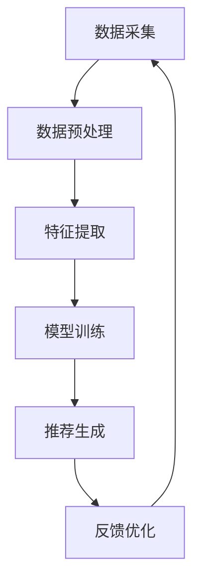

                 

# 影音网站的推荐与分析系统设计与实现

> 关键词：推荐系统, 机器学习, 数据挖掘, 个性化推荐, 用户行为分析, 深度学习, 矩阵分解, 协同过滤

> 摘要：本文将详细介绍如何设计和实现一个高效的影音网站推荐与分析系统。我们将从背景介绍出发，逐步深入到核心概念、算法原理、数学模型、代码实现、实际应用场景，以及未来的发展趋势与挑战。通过本文，读者将能够理解推荐系统的整体架构和关键技术，并能够动手实现一个简单的推荐系统。

## 1. 背景介绍

随着互联网技术的飞速发展，影音网站已经成为人们获取娱乐内容的重要渠道。用户在海量的影音资源中寻找自己感兴趣的内容变得越来越困难。因此，推荐系统成为提高用户体验的关键技术之一。推荐系统能够根据用户的兴趣和行为，为用户推荐个性化的内容，从而提高用户满意度和网站的活跃度。

### 1.1 问题定义

推荐系统的主要任务是根据用户的历史行为和偏好，预测用户可能感兴趣的内容。具体来说，推荐系统需要解决以下几个问题：

1. **用户兴趣建模**：如何从用户的历史行为中提取出用户的兴趣特征？
2. **内容特征提取**：如何从内容中提取出能够反映其特性的特征？
3. **推荐算法设计**：如何设计有效的推荐算法，使得推荐结果既准确又个性化？

### 1.2 系统目标

本文的目标是设计和实现一个高效的影音网站推荐与分析系统。该系统需要满足以下几个目标：

1. **高精度推荐**：推荐结果应尽可能准确地反映用户的兴趣。
2. **个性化推荐**：推荐结果应根据每个用户的独特兴趣进行个性化调整。
3. **实时性**：推荐系统应能够实时响应用户的行为，提供即时的推荐结果。
4. **可扩展性**：系统应能够处理大规模的数据和用户，具有良好的扩展性。

## 2. 核心概念与联系

### 2.1 推荐系统概述

推荐系统是一种通过分析用户的历史行为和偏好，为用户推荐个性化内容的技术。推荐系统可以分为两大类：基于内容的推荐和协同过滤推荐。

#### 2.1.1 基于内容的推荐

基于内容的推荐系统通过分析用户历史行为中的内容特征，为用户推荐与其历史行为相似的内容。这种推荐方式的优点是推荐结果通常比较准确，但缺点是无法发现用户可能感兴趣但与历史行为不完全相似的新内容。

#### 2.1.2 协同过滤推荐

协同过滤推荐系统通过分析用户之间的相似性或内容之间的相似性，为用户推荐相似用户或相似内容。这种推荐方式的优点是可以发现用户可能感兴趣的新内容，但缺点是需要大量的用户数据和计算资源。

### 2.2 数据挖掘与机器学习

数据挖掘和机器学习是推荐系统的核心技术。数据挖掘技术用于从海量数据中提取有用的信息和模式，而机器学习技术用于构建预测模型，实现推荐功能。

#### 2.2.1 数据挖掘技术

数据挖掘技术包括数据预处理、特征提取、模式识别等。数据预处理包括数据清洗、数据集成、数据变换等步骤，特征提取是从数据中提取出能够反映其特性的特征，模式识别则是通过算法发现数据中的模式和规律。

#### 2.2.2 机器学习技术

机器学习技术包括监督学习、无监督学习、半监督学习等。监督学习通过已知的标签数据训练模型，无监督学习通过未标记的数据发现数据中的模式，半监督学习结合了监督学习和无监督学习的优点。

### 2.3 推荐系统架构

推荐系统架构通常包括数据采集、数据处理、模型训练、推荐生成和反馈优化等环节。以下是推荐系统的基本架构图：



## 3. 核心算法原理 & 具体操作步骤

### 3.1 基于内容的推荐算法

基于内容的推荐算法通过分析用户历史行为中的内容特征，为用户推荐与其历史行为相似的内容。具体步骤如下：

1. **数据预处理**：清洗和整合用户历史行为数据。
2. **特征提取**：从内容中提取出能够反映其特性的特征。
3. **相似度计算**：计算用户历史行为与内容之间的相似度。
4. **推荐生成**：根据相似度为用户生成推荐列表。

### 3.2 协同过滤推荐算法

协同过滤推荐算法通过分析用户之间的相似性或内容之间的相似性，为用户推荐相似用户或相似内容。具体步骤如下：

1. **数据预处理**：清洗和整合用户历史行为数据。
2. **用户相似度计算**：计算用户之间的相似度。
3. **内容相似度计算**：计算内容之间的相似度。
4. **推荐生成**：根据相似度为用户生成推荐列表。

### 3.3 混合推荐算法

混合推荐算法结合了基于内容的推荐和协同过滤推荐的优点，通过综合考虑用户历史行为和用户之间的相似性，为用户生成更准确的推荐结果。具体步骤如下：

1. **数据预处理**：清洗和整合用户历史行为数据。
2. **特征提取**：从内容中提取出能够反映其特性的特征。
3. **用户相似度计算**：计算用户之间的相似度。
4. **内容相似度计算**：计算内容之间的相似度。
5. **混合推荐生成**：根据用户历史行为和用户之间的相似性生成推荐列表。

## 4. 数学模型和公式 & 详细讲解 & 举例说明

### 4.1 基于内容的推荐算法

基于内容的推荐算法的核心是计算用户历史行为与内容之间的相似度。常用的相似度计算方法包括余弦相似度和皮尔逊相关系数。

#### 4.1.1 余弦相似度

余弦相似度用于衡量两个向量之间的夹角余弦值，其值范围在-1到1之间。余弦相似度越大，表示两个向量越相似。

$$
\text{cosine similarity} = \frac{\mathbf{A} \cdot \mathbf{B}}{\|\mathbf{A}\| \|\mathbf{B}\|}
$$

其中，$\mathbf{A}$ 和 $\mathbf{B}$ 分别表示用户历史行为和内容的特征向量。

#### 4.1.2 皮尔逊相关系数

皮尔逊相关系数用于衡量两个变量之间的线性相关程度，其值范围在-1到1之间。皮尔逊相关系数越大，表示两个变量之间的线性相关程度越高。

$$
\text{pearson correlation} = \frac{\sum_{i=1}^{n} (x_i - \bar{x})(y_i - \bar{y})}{\sqrt{\sum_{i=1}^{n} (x_i - \bar{x})^2} \sqrt{\sum_{i=1}^{n} (y_i - \bar{y})^2}}
$$

其中，$x_i$ 和 $y_i$ 分别表示用户历史行为和内容的特征值，$\bar{x}$ 和 $\bar{y}$ 分别表示用户历史行为和内容的平均值。

### 4.2 协同过滤推荐算法

协同过滤推荐算法的核心是计算用户之间的相似度或内容之间的相似度。常用的相似度计算方法包括余弦相似度和皮尔逊相关系数。

#### 4.2.1 余弦相似度

余弦相似度用于衡量两个向量之间的夹角余弦值，其值范围在-1到1之间。余弦相似度越大，表示两个向量越相似。

$$
\text{cosine similarity} = \frac{\mathbf{A} \cdot \mathbf{B}}{\|\mathbf{A}\| \|\mathbf{B}\|}
$$

其中，$\mathbf{A}$ 和 $\mathbf{B}$ 分别表示用户之间的行为向量。

#### 4.2.2 皮尔逊相关系数

皮尔逊相关系数用于衡量两个变量之间的线性相关程度，其值范围在-1到1之间。皮尔逊相关系数越大，表示两个变量之间的线性相关程度越高。

$$
\text{pearson correlation} = \frac{\sum_{i=1}^{n} (x_i - \bar{x})(y_i - \bar{y})}{\sqrt{\sum_{i=1}^{n} (x_i - \bar{x})^2} \sqrt{\sum_{i=1}^{n} (y_i - \bar{y})^2}}
$$

其中，$x_i$ 和 $y_i$ 分别表示用户之间的行为值，$\bar{x}$ 和 $\bar{y}$ 分别表示用户之间的平均值。

### 4.3 混合推荐算法

混合推荐算法结合了基于内容的推荐和协同过滤推荐的优点，通过综合考虑用户历史行为和用户之间的相似性，为用户生成更准确的推荐结果。具体步骤如下：

1. **数据预处理**：清洗和整合用户历史行为数据。
2. **特征提取**：从内容中提取出能够反映其特性的特征。
3. **用户相似度计算**：计算用户之间的相似度。
4. **内容相似度计算**：计算内容之间的相似度。
5. **混合推荐生成**：根据用户历史行为和用户之间的相似性生成推荐列表。

## 5. 项目实战：代码实际案例和详细解释说明

### 5.1 开发环境搭建

为了实现一个简单的推荐系统，我们需要搭建一个开发环境。以下是开发环境的搭建步骤：

1. **安装Python**：推荐使用Python 3.8及以上版本。
2. **安装依赖库**：使用pip安装所需的依赖库，如numpy、pandas、scikit-learn等。
3. **数据集准备**：准备一个包含用户历史行为和内容特征的数据集。

### 5.2 源代码详细实现和代码解读

以下是基于内容的推荐算法的源代码实现：

```python
import numpy as np
import pandas as pd
from sklearn.metrics.pairwise import cosine_similarity

# 读取数据集
data = pd.read_csv('user_behavior.csv')

# 特征提取
user_features = data[['user_id', 'content_id', 'behavior']]
user_features = user_features.groupby(['user_id', 'content_id']).size().unstack().fillna(0)

# 计算余弦相似度
similarity = cosine_similarity(user_features)

# 生成推荐列表
def recommend(user_id, similarity, top_n=10):
    user_index = user_features.index.get_loc(user_id)
    similar_users = similarity[user_index].argsort()[-top_n-1:-1]
    recommended_contents = user_features.iloc[similar_users].sum().sort_values(ascending=False).index
    return recommended_contents

# 测试推荐结果
user_id = 'user1'
recommendations = recommend(user_id, similarity)
print(f"Recommendations for user {user_id}: {recommendations}")
```

### 5.3 代码解读与分析

上述代码实现了基于内容的推荐算法。具体步骤如下：

1. **读取数据集**：使用pandas读取包含用户历史行为和内容特征的数据集。
2. **特征提取**：使用pandas的groupby和unstack方法提取用户历史行为的特征。
3. **计算余弦相似度**：使用sklearn的cosine_similarity方法计算用户之间的相似度。
4. **生成推荐列表**：根据用户之间的相似度生成推荐列表。
5. **测试推荐结果**：测试推荐结果并输出推荐列表。

## 6. 实际应用场景

推荐系统在影音网站中有广泛的应用场景。以下是几个实际应用场景：

1. **个性化推荐**：根据用户的历史行为和偏好，为用户推荐个性化的内容。
2. **内容发现**：帮助用户发现可能感兴趣的新内容。
3. **用户留存**：通过推荐用户感兴趣的内容，提高用户留存率。
4. **广告投放**：通过推荐广告内容，提高广告点击率。

## 7. 工具和资源推荐

### 7.1 学习资源推荐

1. **书籍**：《推荐系统实践》、《推荐系统导论》
2. **论文**：《基于内容的推荐算法研究》、《协同过滤推荐算法研究》
3. **博客**：阿里云推荐系统博客、腾讯AI实验室博客
4. **网站**：Kaggle、GitHub

### 7.2 开发工具框架推荐

1. **Python库**：numpy、pandas、scikit-learn
2. **框架**：TensorFlow、PyTorch

### 7.3 相关论文著作推荐

1. **论文**：《基于内容的推荐算法研究》、《协同过滤推荐算法研究》
2. **著作**：《推荐系统实践》、《推荐系统导论》

## 8. 总结：未来发展趋势与挑战

### 8.1 未来发展趋势

1. **深度学习**：深度学习技术在推荐系统中的应用越来越广泛，通过构建复杂的神经网络模型，可以实现更准确的推荐结果。
2. **实时推荐**：随着用户行为数据的实时采集，实时推荐成为推荐系统的一个重要发展方向。
3. **个性化推荐**：通过结合用户的多维度信息，实现更加个性化的推荐结果。

### 8.2 挑战

1. **数据隐私**：如何在保护用户隐私的前提下，充分利用用户数据进行推荐。
2. **冷启动问题**：如何为新用户和新内容提供有效的推荐。
3. **推荐质量**：如何提高推荐结果的质量，避免推荐结果的偏差和不准确。

## 9. 附录：常见问题与解答

### 9.1 问题1：如何处理数据缺失值？

**解答**：可以使用均值填充、中位数填充或插值方法处理数据缺失值。

### 9.2 问题2：如何评估推荐系统的性能？

**解答**：可以使用准确率、召回率、F1分数等指标评估推荐系统的性能。

### 9.3 问题3：如何处理冷启动问题？

**解答**：可以使用基于内容的推荐、基于用户的协同过滤等方法处理冷启动问题。

## 10. 扩展阅读 & 参考资料

1. **书籍**：《推荐系统实践》、《推荐系统导论》
2. **论文**：《基于内容的推荐算法研究》、《协同过滤推荐算法研究》
3. **博客**：阿里云推荐系统博客、腾讯AI实验室博客
4. **网站**：Kaggle、GitHub

---

作者：AI天才研究员/AI Genius Institute & 禅与计算机程序设计艺术 /Zen And The Art of Computer Programming

