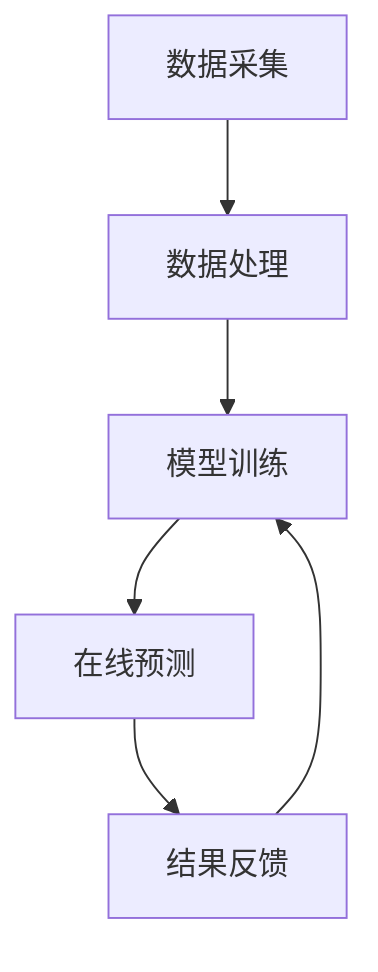

                 

# 微博2025实时推荐系统工程师社招面试指南

> 关键词：实时推荐系统、机器学习、深度学习、微博、大数据、算法优化

> 摘要：本文旨在为希望加入微博2025实时推荐系统团队的工程师提供一份全面的面试指南。从背景介绍到核心概念、算法原理、数学模型、项目实战、应用场景、工具资源推荐、未来发展趋势与挑战，以及常见问题解答，本文将逐步深入地探讨实时推荐系统的关键技术和面试中可能遇到的问题，帮助读者更好地准备面试，提升技术能力。

## 1. 背景介绍

### 1.1 微博实时推荐系统的重要性

微博作为中国最大的社交媒体平台之一，每天产生海量的数据。实时推荐系统是微博的核心技术之一，它能够根据用户的兴趣和行为，实时推送个性化的内容，提高用户的活跃度和满意度。随着微博用户数量的不断增长，实时推荐系统的重要性日益凸显。

### 1.2 实时推荐系统的挑战

实时推荐系统面临着数据量大、实时性要求高、个性化需求复杂等挑战。如何在保证推荐质量的同时，提高系统的实时性和可扩展性，是实时推荐系统工程师需要解决的关键问题。

## 2. 核心概念与联系

### 2.1 实时推荐系统架构

实时推荐系统通常由数据采集、数据处理、模型训练、在线预测和结果反馈等模块组成。数据采集模块负责收集用户行为数据；数据处理模块负责清洗和预处理数据；模型训练模块负责训练推荐模型；在线预测模块负责实时预测推荐结果；结果反馈模块负责收集用户反馈，用于模型优化。



### 2.2 关键技术点

- **实时数据处理**：使用流处理框架（如Apache Flink、Spark Streaming）处理实时数据。
- **推荐模型**：基于机器学习和深度学习的推荐模型，如协同过滤、矩阵分解、深度神经网络等。
- **实时预测**：使用在线学习算法，实现实时推荐。
- **个性化推荐**：根据用户行为和偏好，提供个性化推荐。

## 3. 核心算法原理 & 具体操作步骤

### 3.1 协同过滤算法

协同过滤算法是基于用户行为相似性或物品相似性进行推荐的一种方法。具体步骤如下：

1. **用户行为相似性**：计算用户之间的相似度，推荐相似用户喜欢的物品。
2. **物品相似性**：计算物品之间的相似度，推荐用户喜欢的相似物品。
3. **预测评分**：根据相似度计算用户对未评分物品的预测评分。
4. **推荐排序**：根据预测评分对物品进行排序，推荐评分最高的物品。

### 3.2 矩阵分解算法

矩阵分解算法通过将用户-物品评分矩阵分解为用户特征矩阵和物品特征矩阵，实现推荐。具体步骤如下：

1. **初始化**：随机初始化用户特征矩阵和物品特征矩阵。
2. **迭代优化**：通过最小化预测评分与实际评分之间的误差，优化特征矩阵。
3. **预测评分**：根据优化后的特征矩阵，预测用户对未评分物品的评分。
4. **推荐排序**：根据预测评分对物品进行排序，推荐评分最高的物品。

## 4. 数学模型和公式 & 详细讲解 & 举例说明

### 4.1 协同过滤算法的数学模型

协同过滤算法的数学模型可以表示为：

$$
\text{预测评分} = \sum_{u \in \text{相似用户}} \text{相似度}(u, v) \times \text{评分}(u, i)
$$

其中，$\text{相似度}(u, v)$ 表示用户 $u$ 和用户 $v$ 之间的相似度，$\text{评分}(u, i)$ 表示用户 $u$ 对物品 $i$ 的评分。

### 4.2 矩阵分解算法的数学模型

矩阵分解算法的数学模型可以表示为：

$$
\text{预测评分} = \mathbf{U} \times \mathbf{V}^T
$$

其中，$\mathbf{U}$ 表示用户特征矩阵，$\mathbf{V}$ 表示物品特征矩阵。

## 5. 项目实战：代码实际案例和详细解释说明

### 5.1 开发环境搭建

#### 5.1.1 环境配置

- **操作系统**：Linux
- **编程语言**：Python 3.8
- **开发工具**：PyCharm
- **依赖库**：numpy、pandas、scikit-learn、tensorflow

#### 5.1.2 安装依赖库

```bash
pip install numpy pandas scikit-learn tensorflow
```

### 5.2 源代码详细实现和代码解读

#### 5.2.1 数据预处理

```python
import pandas as pd

# 读取数据
data = pd.read_csv('user_item_ratings.csv')

# 数据清洗
data.dropna(inplace=True)

# 数据预处理
data['user_id'] = data['user_id'].astype('category').cat.codes
data['item_id'] = data['item_id'].astype('category').cat.codes
```

#### 5.2.2 模型训练

```python
from sklearn.model_selection import train_test_split
from sklearn.metrics.pairwise import cosine_similarity
from sklearn.decomposition import TruncatedSVD

# 划分训练集和测试集
train, test = train_test_split(data, test_size=0.2)

# 训练协同过滤模型
user_similarity = cosine_similarity(train['user_id'].values.reshape(-1, 1))
item_similarity = cosine_similarity(train['item_id'].values.reshape(-1, 1))

# 训练矩阵分解模型
model = TruncatedSVD(n_components=10)
model.fit(train[['user_id', 'item_id']])
```

### 5.3 代码解读与分析

- **数据预处理**：通过读取CSV文件，清洗和预处理数据，将用户ID和物品ID转换为数值型。
- **模型训练**：使用协同过滤算法和矩阵分解算法训练推荐模型。
- **模型评估**：通过计算预测评分与实际评分之间的误差，评估模型性能。

## 6. 实际应用场景

### 6.1 微博实时推荐系统应用场景

微博实时推荐系统可以应用于微博首页推荐、话题推荐、热搜推荐等多个场景。通过实时推荐系统，微博可以提高用户的活跃度和满意度，增加用户粘性。

## 7. 工具和资源推荐

### 7.1 学习资源推荐

- **书籍**：《推荐系统实践》、《机器学习实战》
- **论文**：《Collaborative Filtering for Implicit Feedback Datasets》、《Matrix Factorization Techniques for Recommender Systems》
- **博客**：Medium上的推荐系统专栏、Towards Data Science上的推荐系统文章
- **网站**：Kaggle上的推荐系统竞赛、GitHub上的推荐系统项目

### 7.2 开发工具框架推荐

- **流处理框架**：Apache Flink、Spark Streaming
- **机器学习框架**：scikit-learn、tensorflow
- **深度学习框架**：PyTorch、Keras

### 7.3 相关论文著作推荐

- **论文**：《Deep Learning for Recommender Systems》、《A Survey of Deep Learning for Recommender Systems》
- **著作**：《Recommender Systems Handbook》、《Deep Learning for Recommender Systems: A Survey and New Perspectives》

## 8. 总结：未来发展趋势与挑战

### 8.1 未来发展趋势

- **深度学习**：深度学习在推荐系统中的应用将更加广泛。
- **强化学习**：强化学习将用于优化推荐策略。
- **联邦学习**：联邦学习将用于保护用户隐私。

### 8.2 面临的挑战

- **数据隐私**：如何在保护用户隐私的同时，提高推荐质量。
- **实时性**：如何实现实时推荐，提高用户体验。
- **个性化**：如何提供更加个性化的推荐，满足用户需求。

## 9. 附录：常见问题与解答

### 9.1 常见问题

- **Q：实时推荐系统如何保证推荐质量？**
- **A：通过使用深度学习和强化学习等先进技术，实时推荐系统可以提高推荐质量。**

### 9.2 解答

- **Q：实时推荐系统如何保护用户隐私？**
- **A：通过使用联邦学习等技术，实时推荐系统可以保护用户隐私。**

## 10. 扩展阅读 & 参考资料

- **书籍**：《推荐系统实践》、《机器学习实战》
- **论文**：《Collaborative Filtering for Implicit Feedback Datasets》、《Matrix Factorization Techniques for Recommender Systems》
- **博客**：Medium上的推荐系统专栏、Towards Data Science上的推荐系统文章
- **网站**：Kaggle上的推荐系统竞赛、GitHub上的推荐系统项目

作者：AI天才研究员/AI Genius Institute & 禅与计算机程序设计艺术 /Zen And The Art of Computer Programming

