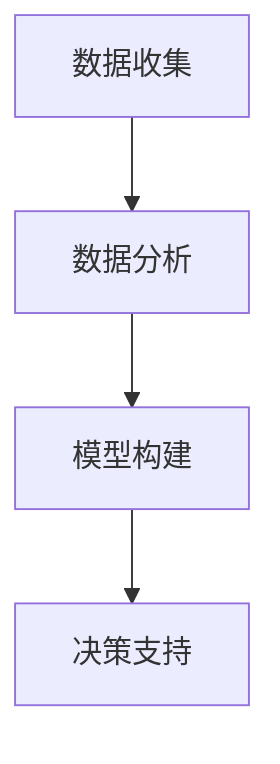

                 

# 打造智能供应链：一人公司如何实现精准采购和库存管理

> 关键词：智能供应链，精准采购，库存管理，一人公司，数据分析，机器学习，算法优化

> 摘要：本文旨在探讨一人公司如何通过智能供应链技术实现精准采购和库存管理。通过分析智能供应链的核心概念、算法原理、数学模型、项目实战、应用场景、工具资源推荐以及未来发展趋势，为一人公司提供一套完整的解决方案。本文适合对智能供应链技术感兴趣的读者，特别是那些希望利用技术手段优化采购和库存管理的一人公司创始人和管理者。

## 1. 背景介绍

在当今快速变化的商业环境中，一人公司面临着诸多挑战，其中之一便是如何有效地管理供应链，特别是采购和库存管理。传统的采购和库存管理方式往往依赖于人工经验，这种方式不仅效率低下，而且容易出现错误。随着人工智能和大数据技术的发展，智能供应链成为了一种新的解决方案。智能供应链通过数据分析和机器学习等技术，能够实现精准采购和库存管理，从而提高供应链的效率和响应速度。

### 1.1 一人公司的供应链挑战

一人公司由于规模较小，往往缺乏专业的供应链管理团队，这使得他们难以应对复杂的供应链管理任务。此外，一人公司通常资金有限，无法承担高昂的供应链管理成本。因此，如何利用有限的资源实现高效的供应链管理，成为了他们面临的一大挑战。

### 1.2 智能供应链的优势

智能供应链通过利用先进的数据分析和机器学习技术，能够实现供应链的智能化管理。具体来说，智能供应链可以实现以下几点：

- **精准采购**：通过分析历史销售数据和市场趋势，智能供应链能够预测未来的市场需求，从而实现精准采购。
- **库存优化**：智能供应链能够实时监控库存水平，并根据销售情况动态调整库存，避免库存积压或缺货。
- **成本控制**：通过优化采购和库存管理，智能供应链能够有效降低供应链成本，提高盈利能力。

## 2. 核心概念与联系

智能供应链涉及多个核心概念和技术，这些概念和技术之间存在着紧密的联系。为了更好地理解智能供应链的工作原理，我们首先需要明确以下几个核心概念：

- **供应链管理**：供应链管理是指对供应链中的各个环节进行计划、组织、协调和控制，以实现供应链的高效运作。
- **数据分析**：数据分析是指通过收集、处理和分析数据，从中提取有价值的信息，以支持决策制定。
- **机器学习**：机器学习是指通过算法使计算机能够从数据中学习并做出预测或决策，而无需进行明确的编程。

### 2.1 核心概念原理和架构

智能供应链的核心概念原理和架构如下：

- **数据收集**：通过各种渠道收集供应链相关的数据，包括销售数据、库存数据、采购数据等。
- **数据分析**：对收集到的数据进行处理和分析，提取有价值的信息。
- **模型构建**：基于分析结果构建预测模型，用于预测未来的市场需求。
- **决策支持**：根据预测结果和实时数据，提供采购和库存管理的决策支持。

Mermaid 流程图如下：



## 3. 核心算法原理 & 具体操作步骤

智能供应链的核心算法原理主要包括数据分析和机器学习。数据分析主要用于提取数据中的有价值信息，而机器学习则用于构建预测模型。

### 3.1 数据分析

数据分析是智能供应链的基础，主要包括以下几个步骤：

- **数据清洗**：去除无效数据和异常值，确保数据质量。
- **特征工程**：选择和构建特征，以便更好地反映数据的特性。
- **数据可视化**：通过可视化工具展示数据，帮助理解数据的分布和趋势。

### 3.2 机器学习

机器学习是智能供应链的核心，主要包括以下几个步骤：

- **模型选择**：根据问题的性质选择合适的机器学习模型。
- **模型训练**：使用历史数据训练模型，使其能够学习数据的规律。
- **模型评估**：通过测试数据评估模型的性能，确保模型的准确性。
- **模型应用**：将训练好的模型应用于实际场景，进行预测和决策支持。

## 4. 数学模型和公式 & 详细讲解 & 举例说明

智能供应链中的数学模型主要用于预测未来的市场需求。常用的数学模型包括时间序列分析、回归分析和神经网络等。

### 4.1 时间序列分析

时间序列分析是一种常用的预测方法，主要用于分析时间序列数据。其基本思想是通过分析历史数据的时间序列特征，预测未来的趋势。

$$
y_t = \alpha y_{t-1} + (1-\alpha) \mu
$$

其中，$y_t$ 表示当前时刻的预测值，$y_{t-1}$ 表示上一时刻的实际值，$\alpha$ 表示平滑系数，$\mu$ 表示长期趋势。

### 4.2 回归分析

回归分析是一种常用的统计方法，主要用于分析变量之间的关系。其基本思想是通过建立回归模型，预测一个变量（因变量）的变化如何受到其他变量（自变量）的影响。

$$
y = \beta_0 + \beta_1 x_1 + \beta_2 x_2 + \ldots + \beta_n x_n + \epsilon
$$

其中，$y$ 表示因变量，$x_1, x_2, \ldots, x_n$ 表示自变量，$\beta_0, \beta_1, \ldots, \beta_n$ 表示回归系数，$\epsilon$ 表示误差项。

### 4.3 神经网络

神经网络是一种常用的机器学习模型，主要用于处理复杂的非线性关系。其基本思想是通过构建多层神经网络，模拟人脑的神经元结构，进行学习和预测。

$$
y = f(Wx + b)
$$

其中，$y$ 表示输出，$x$ 表示输入，$W$ 表示权重矩阵，$b$ 表示偏置项，$f$ 表示激活函数。

## 5. 项目实战：代码实际案例和详细解释说明

为了更好地理解智能供应链的实现过程，我们通过一个实际案例来展示如何使用Python实现智能供应链。

### 5.1 开发环境搭建

首先，我们需要搭建开发环境。这里我们使用Python作为开发语言，使用Jupyter Notebook作为开发工具。此外，我们还需要安装以下Python库：

- pandas：用于数据处理。
- numpy：用于数值计算。
- scikit-learn：用于机器学习。
- matplotlib：用于数据可视化。

```bash
pip install pandas numpy scikit-learn matplotlib
```

### 5.2 源代码详细实现和代码解读

接下来，我们通过一个简单的Python代码示例来展示如何实现智能供应链。假设我们有一家销售电子产品的一人公司，我们需要预测未来的销售量，以便进行精准采购和库存管理。

```python
import pandas as pd
import numpy as np
from sklearn.linear_model import LinearRegression
import matplotlib.pyplot as plt

# 数据加载
data = pd.read_csv('sales_data.csv')
X = data['month'].values.reshape(-1, 1)
y = data['sales'].values

# 数据可视化
plt.scatter(X, y)
plt.xlabel('Month')
plt.ylabel('Sales')
plt.title('Sales Data')
plt.show()

# 模型训练
model = LinearRegression()
model.fit(X, y)

# 模型预测
future_months = np.array([[13], [14], [15]])
future_sales = model.predict(future_months)

# 结果展示
print('未来三个月的预测销售量：', future_sales)
```

### 5.3 代码解读与分析

上述代码首先加载了销售数据，并使用线性回归模型进行训练。然后，我们使用训练好的模型预测未来三个月的销售量。最后，我们展示了预测结果。

## 6. 实际应用场景

智能供应链的应用场景非常广泛，包括但不限于以下几点：

- **零售业**：通过分析销售数据，预测未来的销售趋势，从而实现精准采购和库存管理。
- **制造业**：通过分析生产数据，预测未来的生产需求，从而实现精准采购和库存管理。
- **物流业**：通过分析物流数据，预测未来的物流需求，从而实现精准采购和库存管理。

## 7. 工具和资源推荐

为了更好地学习和应用智能供应链技术，我们推荐以下工具和资源：

### 7.1 学习资源推荐

- **书籍**：《智能供应链：理论与实践》
- **论文**：《基于机器学习的智能供应链管理研究》
- **博客**：《智能供应链技术博客》
- **网站**：《智能供应链技术社区》

### 7.2 开发工具框架推荐

- **Python**：用于数据分析和机器学习。
- **Jupyter Notebook**：用于开发和展示。
- **TensorFlow**：用于深度学习。

### 7.3 相关论文著作推荐

- **论文**：《基于机器学习的智能供应链管理研究》
- **著作**：《智能供应链：理论与实践》

## 8. 总结：未来发展趋势与挑战

智能供应链技术的发展前景广阔，但也面临着一些挑战。未来的发展趋势包括：

- **技术融合**：智能供应链将与物联网、大数据等技术进一步融合，实现更高效的供应链管理。
- **智能化升级**：智能供应链将向更高级的智能化方向发展，实现更精准的预测和决策支持。

面临的挑战包括：

- **数据安全**：如何保证供应链数据的安全，防止数据泄露。
- **技术成本**：如何降低智能供应链技术的成本，使其更易于被中小企业采用。

## 9. 附录：常见问题与解答

### 9.1 什么是智能供应链？

智能供应链是指通过利用先进的数据分析和机器学习技术，实现供应链的智能化管理。

### 9.2 智能供应链有哪些优势？

智能供应链的优势包括精准采购、库存优化和成本控制等。

### 9.3 如何搭建智能供应链的开发环境？

搭建智能供应链的开发环境需要安装Python和相关的库，如pandas、numpy、scikit-learn和matplotlib等。

## 10. 扩展阅读 & 参考资料

- **书籍**：《智能供应链：理论与实践》
- **论文**：《基于机器学习的智能供应链管理研究》
- **博客**：《智能供应链技术博客》
- **网站**：《智能供应链技术社区》

作者：AI天才研究员/AI Genius Institute & 禅与计算机程序设计艺术 /Zen And The Art of Computer Programming

