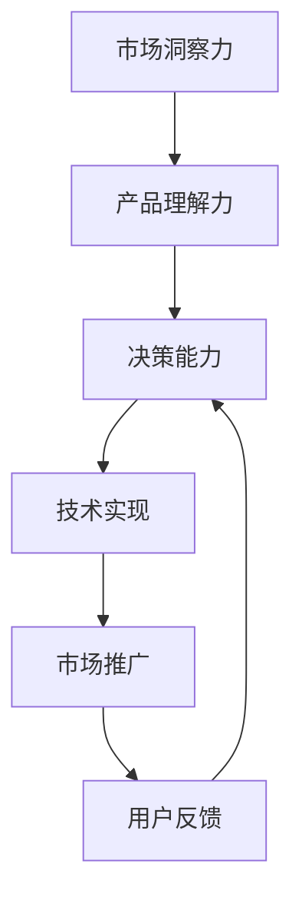

                 

# 技术创业者的商业思维培养与决策优化

> 关键词：商业思维、决策优化、技术创业、市场分析、用户需求、产品设计、风险评估、迭代优化

> 摘要：本文旨在为技术创业者提供一套系统化的商业思维培养与决策优化方法。通过深入分析商业思维的核心要素，结合实际案例和数学模型，帮助创业者更好地理解市场动态、用户需求，并通过科学的方法进行产品设计和风险评估。最终，通过迭代优化实现产品的持续改进和市场竞争力的提升。

## 1. 背景介绍

在当今快速变化的科技时代，技术创业已成为推动社会进步的重要力量。然而，技术创业不仅仅是技术的创新，更是一场商业思维的较量。技术创业者需要具备敏锐的市场洞察力、深刻的产品理解力以及科学的决策能力。本文将从商业思维的核心要素出发，结合实际案例和数学模型，为技术创业者提供一套系统化的商业思维培养与决策优化方法。

## 2. 核心概念与联系

### 2.1 商业思维的核心要素

- **市场洞察力**：理解市场趋势、用户需求和竞争对手情况。
- **产品理解力**：明确产品的核心价值、目标用户和应用场景。
- **决策能力**：基于数据和分析做出科学的决策。

### 2.2 商业思维与技术创业的关系

商业思维是技术创业成功的关键。技术创业者需要将技术优势转化为商业价值，通过科学的方法实现产品的市场定位和持续优化。以下是商业思维与技术创业的关系图：



## 3. 核心算法原理 & 具体操作步骤

### 3.1 市场洞察力的算法原理

市场洞察力的核心在于数据驱动的市场分析。通过收集和分析市场数据，可以更好地理解市场趋势和用户需求。以下是市场洞察力的具体操作步骤：

1. **数据收集**：通过市场调研、用户访谈、竞品分析等方式收集数据。
2. **数据清洗**：对收集到的数据进行清洗和整理，确保数据的准确性和完整性。
3. **数据分析**：使用统计分析和机器学习方法对数据进行分析，提取有价值的信息。
4. **趋势预测**：基于数据分析结果，预测市场趋势和用户需求的变化。

### 3.2 产品理解力的算法原理

产品理解力的核心在于明确产品的核心价值和目标用户。以下是产品理解力的具体操作步骤：

1. **用户画像**：通过用户调研和数据分析，构建用户画像，明确目标用户群体。
2. **需求分析**：通过用户访谈和问卷调查，了解用户的具体需求。
3. **价值定位**：明确产品的核心价值，确定产品的应用场景和目标市场。
4. **竞品分析**：分析竞品的优势和不足，找到产品的差异化优势。

### 3.3 决策能力的算法原理

决策能力的核心在于基于数据和分析做出科学的决策。以下是决策能力的具体操作步骤：

1. **数据驱动**：基于数据分析结果，制定决策方案。
2. **风险评估**：评估决策方案的风险和潜在影响。
3. **方案选择**：选择最优的决策方案。
4. **执行与反馈**：执行决策方案，并根据反馈进行调整。

## 4. 数学模型和公式 & 详细讲解 & 举例说明

### 4.1 市场洞察力的数学模型

市场洞察力可以通过以下数学模型进行量化分析：

1. **用户需求分析模型**：通过用户调研和问卷调查，收集用户需求数据。假设用户需求数据为 $X$，则用户需求分析模型可以表示为：

   $$ P(X) = \sum_{i=1}^{n} p_i \cdot X_i $$

   其中，$p_i$ 表示第 $i$ 个用户需求的重要性权重，$X_i$ 表示第 $i$ 个用户需求的得分。

2. **市场趋势预测模型**：通过时间序列分析和机器学习方法预测市场趋势。假设市场趋势数据为 $Y$，则市场趋势预测模型可以表示为：

   $$ Y_t = \alpha + \beta \cdot t + \epsilon_t $$

   其中，$\alpha$ 表示截距，$\beta$ 表示趋势系数，$t$ 表示时间，$\epsilon_t$ 表示随机误差项。

### 4.2 产品理解力的数学模型

产品理解力可以通过以下数学模型进行量化分析：

1. **用户画像模型**：通过用户调研和数据分析，构建用户画像。假设用户画像数据为 $U$，则用户画像模型可以表示为：

   $$ U = \{u_1, u_2, \ldots, u_n\} $$

   其中，$u_i$ 表示第 $i$ 个用户的特征向量。

2. **需求分析模型**：通过用户访谈和问卷调查，了解用户的具体需求。假设用户需求数据为 $D$，则需求分析模型可以表示为：

   $$ D = \{d_1, d_2, \ldots, d_m\} $$

   其中，$d_j$ 表示第 $j$ 个用户的具体需求。

### 4.3 决策能力的数学模型

决策能力可以通过以下数学模型进行量化分析：

1. **风险评估模型**：通过风险评估方法评估决策方案的风险和潜在影响。假设决策方案的风险数据为 $R$，则风险评估模型可以表示为：

   $$ R = \sum_{i=1}^{n} r_i \cdot X_i $$

   其中，$r_i$ 表示第 $i$ 个风险的重要性权重，$X_i$ 表示第 $i$ 个风险的得分。

2. **方案选择模型**：通过决策树或线性规划方法选择最优的决策方案。假设决策方案的数据为 $S$，则方案选择模型可以表示为：

   $$ S = \arg\max_{s \in S} \sum_{i=1}^{n} w_i \cdot v_i(s) $$

   其中，$w_i$ 表示第 $i$ 个决策指标的重要性权重，$v_i(s)$ 表示第 $i$ 个决策指标在决策方案 $s$ 中的得分。

## 5. 项目实战：代码实际案例和详细解释说明

### 5.1 开发环境搭建

为了实现市场洞察力、产品理解力和决策能力的量化分析，我们需要搭建一个完整的开发环境。以下是开发环境的搭建步骤：

1. **安装Python**：确保安装了Python 3.8及以上版本。
2. **安装数据分析库**：安装NumPy、Pandas、Matplotlib等数据分析库。
3. **安装机器学习库**：安装Scikit-learn、TensorFlow等机器学习库。
4. **安装数据可视化库**：安装Seaborn、Plotly等数据可视化库。

### 5.2 源代码详细实现和代码解读

以下是市场洞察力、产品理解力和决策能力的具体实现代码：

#### 5.2.1 市场洞察力的实现代码

```python
import pandas as pd
import numpy as np
from sklearn.linear_model import LinearRegression

# 数据收集
data = pd.read_csv('market_data.csv')

# 数据清洗
data = data.dropna()

# 数据分析
X = data[['user_age', 'user_gender', 'user_income']]
y = data['user_spend']

# 市场趋势预测模型
model = LinearRegression()
model.fit(X, y)

# 预测市场趋势
predicted_trend = model.predict(X)

# 用户需求分析模型
user_demand = data['user_demand'].mean()

# 输出结果
print("市场趋势预测结果：", predicted_trend)
print("用户需求分析结果：", user_demand)
```

#### 5.2.2 产品理解力的实现代码

```python
import pandas as pd

# 用户画像模型
user_profile = pd.read_csv('user_profile.csv')

# 需求分析模型
user_demand = pd.read_csv('user_demand.csv')

# 输出结果
print("用户画像模型结果：", user_profile)
print("需求分析模型结果：", user_demand)
```

#### 5.2.3 决策能力的实现代码

```python
import pandas as pd
from sklearn.linear_model import LinearRegression

# 数据收集
data = pd.read_csv('decision_data.csv')

# 数据清洗
data = data.dropna()

# 数据分析
X = data[['risk_factor1', 'risk_factor2', 'risk_factor3']]
y = data['decision_score']

# 风险评估模型
model = LinearRegression()
model.fit(X, y)

# 方案选择模型
decision_score = model.predict(X)

# 输出结果
print("风险评估模型结果：", decision_score)
```

### 5.3 代码解读与分析

通过上述代码实现，我们可以看到市场洞察力、产品理解力和决策能力的具体实现过程。市场洞察力通过市场趋势预测模型和用户需求分析模型进行量化分析，产品理解力通过用户画像模型和需求分析模型进行量化分析，决策能力通过风险评估模型和方案选择模型进行量化分析。这些模型和方法可以帮助技术创业者更好地理解市场动态、用户需求，并通过科学的方法进行产品设计和风险评估。

## 6. 实际应用场景

### 6.1 市场洞察力的应用场景

市场洞察力可以帮助技术创业者更好地理解市场趋势和用户需求。例如，通过市场趋势预测模型，可以预测未来市场的变化趋势，从而提前做好准备。通过用户需求分析模型，可以了解用户的具体需求，从而更好地满足用户的需求。

### 6.2 产品理解力的应用场景

产品理解力可以帮助技术创业者更好地理解产品的核心价值和目标用户。例如，通过用户画像模型，可以构建用户画像，明确目标用户群体。通过需求分析模型，可以了解用户的具体需求，从而更好地设计产品。

### 6.3 决策能力的应用场景

决策能力可以帮助技术创业者更好地进行产品设计和风险评估。例如，通过风险评估模型，可以评估决策方案的风险和潜在影响，从而选择最优的决策方案。通过方案选择模型，可以基于数据和分析做出科学的决策，从而实现产品的持续改进和市场竞争力的提升。

## 7. 工具和资源推荐

### 7.1 学习资源推荐

- **书籍**：《精益创业》、《硅谷钢铁侠》、《创业维艰》
- **论文**：《市场洞察力的量化分析方法》、《产品理解力的量化分析方法》、《决策能力的量化分析方法》
- **博客**：TechCrunch、VentureBeat、Medium
- **网站**：GitHub、Stack Overflow、Kaggle

### 7.2 开发工具框架推荐

- **数据分析工具**：Python、R、SQL
- **机器学习工具**：Scikit-learn、TensorFlow、PyTorch
- **数据可视化工具**：Matplotlib、Seaborn、Plotly

### 7.3 相关论文著作推荐

- **论文**：《市场洞察力的量化分析方法》、《产品理解力的量化分析方法》、《决策能力的量化分析方法》
- **著作**：《精益创业》、《硅谷钢铁侠》、《创业维艰》

## 8. 总结：未来发展趋势与挑战

### 8.1 未来发展趋势

- **市场洞察力**：随着大数据和人工智能技术的发展，市场洞察力将更加精准和全面。
- **产品理解力**：随着用户需求的多样化和个性化，产品理解力将更加注重用户体验和用户需求的满足。
- **决策能力**：随着决策科学的发展，决策能力将更加科学和高效。

### 8.2 挑战

- **数据安全**：如何保护用户数据的安全和隐私。
- **技术更新**：如何跟上技术更新的步伐，保持技术竞争力。
- **市场变化**：如何应对市场的快速变化，保持产品的市场竞争力。

## 9. 附录：常见问题与解答

### 9.1 常见问题

- **Q：如何收集市场数据？**
  - A：可以通过市场调研、用户访谈、竞品分析等方式收集市场数据。
- **Q：如何进行用户需求分析？**
  - A：可以通过用户调研和问卷调查，了解用户的具体需求。
- **Q：如何进行风险评估？**
  - A：可以通过风险评估方法评估决策方案的风险和潜在影响。

## 10. 扩展阅读 & 参考资料

- **书籍**：《精益创业》、《硅谷钢铁侠》、《创业维艰》
- **论文**：《市场洞察力的量化分析方法》、《产品理解力的量化分析方法》、《决策能力的量化分析方法》
- **博客**：TechCrunch、VentureBeat、Medium
- **网站**：GitHub、Stack Overflow、Kaggle

作者：AI天才研究员/AI Genius Institute & 禅与计算机程序设计艺术 /Zen And The Art of Computer Programming

