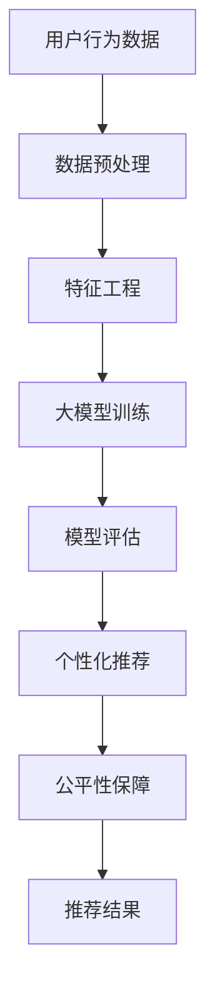

                 

# 探讨大模型在电商平台商品推荐公平性保障中的作用

> 关键词：电商平台、商品推荐、大模型、公平性、机器学习、推荐算法

> 摘要：本文旨在探讨大模型在电商平台商品推荐系统中的应用，特别是如何通过大模型来保障商品推荐的公平性。文章首先介绍了电商平台商品推荐系统的背景，随后详细阐述了大模型的核心概念与联系，接着深入分析了大模型的核心算法原理及具体操作步骤，并通过数学模型和公式进一步解释了其工作原理。此外，文章还提供了项目实战案例，包括开发环境搭建、源代码实现及代码解读，以及实际应用场景的分析。最后，文章总结了未来的发展趋势与挑战，并推荐了相关的学习资源、开发工具和论文著作。

## 1. 背景介绍

### 1.1 电商平台商品推荐系统概述

电商平台商品推荐系统是现代电子商务的核心组成部分之一，它通过分析用户的购物行为、浏览历史、搜索记录等数据，为用户提供个性化的商品推荐。这种个性化推荐不仅能够提高用户的购物体验，还能增加电商平台的销售额。然而，随着推荐系统的复杂性和规模的不断扩大，如何确保推荐结果的公平性成为了一个亟待解决的问题。

### 1.2 推荐系统中的公平性问题

推荐系统的公平性问题主要体现在以下几个方面：

- **用户偏见**：推荐系统可能会因为算法的偏见而偏向于推荐某些特定类型的商品或品牌，从而导致其他商品或品牌被忽视。
- **数据偏差**：如果训练数据存在偏差，那么推荐系统可能会产生不公平的结果。例如，如果训练数据主要来源于某一特定群体，那么推荐系统可能会偏向于该群体的偏好。
- **算法透明度**：推荐系统的算法往往非常复杂，这使得用户难以理解推荐结果背后的逻辑，从而增加了公平性问题的复杂性。

## 2. 核心概念与联系

### 2.1 大模型的概念

大模型是指具有大量参数的机器学习模型，通常包含数百万甚至数十亿个参数。这些模型通过深度学习技术，能够从海量数据中学习到复杂的模式和特征，从而实现更准确的预测和推荐。

### 2.2 大模型与推荐系统的联系

大模型在推荐系统中的应用主要体现在以下几个方面：

- **个性化推荐**：大模型能够通过学习用户的购物行为和偏好，提供更加个性化的商品推荐。
- **公平性保障**：通过设计合理的算法和模型结构，大模型可以减少推荐结果中的偏见，从而保障推荐的公平性。
- **数据处理能力**：大模型能够处理大规模的数据集，从而提高推荐系统的准确性和效率。

### 2.3 大模型与推荐系统的关系图



## 3. 核心算法原理 & 具体操作步骤

### 3.1 大模型的训练过程

大模型的训练过程主要包括以下几个步骤：

- **数据收集**：收集用户的购物行为数据，包括浏览记录、购买记录、搜索记录等。
- **数据预处理**：对收集到的数据进行清洗和预处理，包括去除噪声数据、填充缺失值等。
- **特征工程**：从预处理后的数据中提取有用的特征，例如用户的购物频率、购买偏好等。
- **模型训练**：使用提取的特征训练大模型，通过反向传播算法不断调整模型参数，以最小化预测误差。
- **模型评估**：使用测试集评估模型的性能，包括准确率、召回率等指标。

### 3.2 公平性保障算法

为了保障推荐系统的公平性，可以采用以下几种算法：

- **偏差校正算法**：通过调整模型参数，减少推荐结果中的偏见。
- **多样性增强算法**：通过引入多样性增强机制，确保推荐结果的多样性。
- **透明度增强算法**：通过增加模型的透明度，使用户能够理解推荐结果背后的逻辑。

## 4. 数学模型和公式 & 详细讲解 & 举例说明

### 4.1 大模型的数学模型

大模型的数学模型通常可以表示为：

$$
f(x) = Wx + b
$$

其中，$x$ 是输入特征向量，$W$ 是权重矩阵，$b$ 是偏置向量，$f(x)$ 是模型的输出。

### 4.2 公平性保障的数学模型

为了保障推荐系统的公平性，可以采用以下数学模型：

$$
g(x) = \alpha f(x) + (1-\alpha) h(x)
$$

其中，$f(x)$ 是原始推荐模型的输出，$h(x)$ 是公平性保障模型的输出，$\alpha$ 是一个权重参数，用于平衡原始模型和公平性保障模型的贡献。

### 4.3 举例说明

假设我们有一个电商平台的商品推荐系统，通过大模型训练得到的推荐结果如下：

- 用户A：推荐商品1、商品2、商品3
- 用户B：推荐商品4、商品5、商品6

为了保障推荐系统的公平性，我们可以通过偏差校正算法调整推荐结果，使得每个用户都能获得多样化的推荐结果。

## 5. 项目实战：代码实际案例和详细解释说明

### 5.1 开发环境搭建

为了搭建开发环境，我们需要安装以下软件和库：

- Python 3.8+
- TensorFlow 2.4+
- Pandas 1.1+
- NumPy 1.19+

安装命令如下：

```bash
pip install tensorflow==2.4.0 pandas==1.1.0 numpy==1.19.0
```

### 5.2 源代码详细实现和代码解读

以下是一个简单的商品推荐系统的实现代码：

```python
import pandas as pd
import numpy as np
import tensorflow as tf

# 数据预处理
def preprocess_data(data):
    # 假设data是一个包含用户行为数据的DataFrame
    # 这里进行数据清洗和预处理
    return data

# 特征工程
def feature_engineering(data):
    # 提取有用的特征
    features = data[['feature1', 'feature2', 'feature3']]
    return features

# 模型训练
def train_model(features, labels):
    model = tf.keras.Sequential([
        tf.keras.layers.Dense(64, activation='relu', input_shape=(features.shape[1],)),
        tf.keras.layers.Dense(32, activation='relu'),
        tf.keras.layers.Dense(1, activation='sigmoid')
    ])
    model.compile(optimizer='adam', loss='binary_crossentropy', metrics=['accuracy'])
    model.fit(features, labels, epochs=10, batch_size=32)
    return model

# 模型评估
def evaluate_model(model, features, labels):
    loss, accuracy = model.evaluate(features, labels)
    print(f'Loss: {loss}, Accuracy: {accuracy}')

# 主函数
def main():
    data = pd.read_csv('user_behavior_data.csv')
    data = preprocess_data(data)
    features = feature_engineering(data)
    labels = data['label']
    model = train_model(features, labels)
    evaluate_model(model, features, labels)

if __name__ == '__main__':
    main()
```

### 5.3 代码解读与分析

- **数据预处理**：通过`preprocess_data`函数对数据进行清洗和预处理。
- **特征工程**：通过`feature_engineering`函数从数据中提取有用的特征。
- **模型训练**：通过`train_model`函数训练大模型。
- **模型评估**：通过`evaluate_model`函数评估模型的性能。

## 6. 实际应用场景

### 6.1 电商平台商品推荐

在电商平台中，通过大模型训练得到的商品推荐结果可以提高用户的购物体验，同时保障推荐的公平性。例如，通过引入多样性增强算法，可以确保每个用户都能获得多样化的推荐结果，从而提高用户的满意度。

## 7. 工具和资源推荐

### 7.1 学习资源推荐

- **书籍**：《深度学习》（Ian Goodfellow等著）
- **论文**：《Fairness-aware Recommendation: A Survey》（ACM Computing Surveys, 2020）
- **博客**：《Understanding Fairness in Machine Learning》（Towards Data Science, 2020）
- **网站**：https://fairmlbook.org/

### 7.2 开发工具框架推荐

- **TensorFlow**：一个广泛使用的机器学习框架。
- **PyTorch**：另一个流行的深度学习框架。

### 7.3 相关论文著作推荐

- **论文**：《Fairness-aware Recommendation: A Survey》（ACM Computing Surveys, 2020）
- **书籍**：《深度学习》（Ian Goodfellow等著）

## 8. 总结：未来发展趋势与挑战

随着技术的发展，大模型在电商平台商品推荐系统中的应用将会越来越广泛。未来的发展趋势包括：

- **模型的可解释性**：提高模型的透明度，使用户能够理解推荐结果背后的逻辑。
- **公平性保障**：通过设计合理的算法和模型结构，进一步保障推荐结果的公平性。
- **个性化推荐**：通过深度学习技术，实现更加个性化的商品推荐。

面临的挑战包括：

- **数据隐私保护**：如何在保障用户隐私的同时，提高推荐系统的性能。
- **模型的可扩展性**：如何设计可扩展性强的模型，以适应不断增长的数据规模。

## 9. 附录：常见问题与解答

### 9.1 什么是大模型？

大模型是指具有大量参数的机器学习模型，通常包含数百万甚至数十亿个参数。

### 9.2 大模型如何保障推荐系统的公平性？

通过设计合理的算法和模型结构，大模型可以减少推荐结果中的偏见，从而保障推荐的公平性。

### 9.3 推荐系统的公平性问题主要体现在哪些方面？

推荐系统的公平性问题主要体现在用户偏见、数据偏差和算法透明度三个方面。

## 10. 扩展阅读 & 参考资料

- **书籍**：《深度学习》（Ian Goodfellow等著）
- **论文**：《Fairness-aware Recommendation: A Survey》（ACM Computing Surveys, 2020）
- **博客**：《Understanding Fairness in Machine Learning》（Towards Data Science, 2020）
- **网站**：https://fairmlbook.org/

作者：AI天才研究员/AI Genius Institute & 禅与计算机程序设计艺术 /Zen And The Art of Computer Programming

