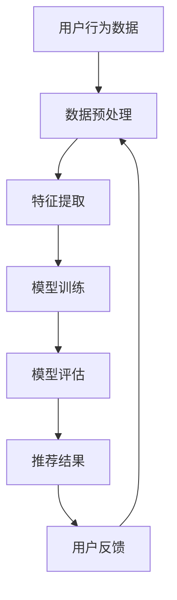

                 

# 探讨大模型在电商平台用户兴趣短期预测中的潜力

> 关键词：大模型、电商平台、用户兴趣、短期预测、推荐系统、深度学习、Transformer、BERT、注意力机制

> 摘要：本文旨在探讨大模型在电商平台用户兴趣短期预测中的应用潜力。通过深入分析大模型的核心原理和具体操作步骤，结合数学模型和实际代码案例，本文将揭示大模型如何在电商平台中实现精准的用户兴趣预测，从而提升推荐系统的性能。此外，本文还将探讨实际应用场景、工具和资源推荐，以及未来的发展趋势与挑战。

## 1. 背景介绍

随着电子商务的快速发展，电商平台面临着如何精准地预测用户兴趣以提供个性化推荐的挑战。传统的推荐系统通常依赖于用户的历史行为数据，如浏览记录、购买历史等，但这些方法往往难以捕捉用户的短期兴趣变化。近年来，大模型（如Transformer、BERT等）因其强大的表征学习能力，在自然语言处理和推荐系统领域展现出巨大的潜力。本文将探讨大模型在电商平台用户兴趣短期预测中的应用潜力，并通过实际案例进行详细分析。

## 2. 核心概念与联系

### 2.1 大模型概述

大模型是指具有大量参数和复杂结构的机器学习模型，通常用于处理大规模数据集和高维特征空间。大模型能够学习到更为丰富的特征表示，从而在各种任务中表现出色。在推荐系统中，大模型可以捕捉用户的长期和短期兴趣变化，提供更为精准的推荐结果。

### 2.2 用户兴趣短期预测

用户兴趣短期预测是指通过分析用户在短期内的行为数据，预测其未来一段时间内的兴趣变化。这有助于电商平台及时调整推荐策略，提高用户满意度和购买转化率。

### 2.3 推荐系统

推荐系统是一种通过分析用户行为数据，为用户提供个性化推荐的技术。推荐系统的核心任务是根据用户的历史行为和当前上下文信息，预测用户可能感兴趣的商品或内容，并将其推荐给用户。

### 2.4 深度学习与Transformer

深度学习是一种基于神经网络的机器学习方法，能够自动学习数据的高级特征表示。Transformer是一种基于自注意力机制的深度学习模型，广泛应用于自然语言处理任务。Transformer通过自注意力机制捕捉输入序列中的长距离依赖关系，从而在推荐系统中表现出色。

### 2.5 BERT与注意力机制

BERT（Bidirectional Encoder Representations from Transformers）是一种预训练语言模型，通过双向编码器实现对文本的深度理解。注意力机制是BERT的核心组成部分，能够根据输入序列中的不同位置分配不同的权重，从而捕捉到更为丰富的上下文信息。

### 2.6 Mermaid流程图



## 3. 核心算法原理 & 具体操作步骤

### 3.1 数据预处理

数据预处理是推荐系统中的重要步骤，主要包括数据清洗、特征工程和数据归一化等。具体操作步骤如下：

1. **数据清洗**：去除无效数据、处理缺失值和异常值。
2. **特征工程**：提取用户行为数据中的有用特征，如用户ID、商品ID、浏览时间等。
3. **数据归一化**：对特征进行归一化处理，使其在相同的尺度范围内，便于模型训练。

### 3.2 特征提取

特征提取是将原始数据转换为模型可以理解的特征表示的过程。具体操作步骤如下：

1. **用户特征**：提取用户的个人信息，如年龄、性别、地理位置等。
2. **商品特征**：提取商品的属性信息，如类别、价格、品牌等。
3. **历史行为特征**：提取用户的历史行为数据，如浏览记录、购买历史等。

### 3.3 模型训练

模型训练是通过优化算法调整模型参数，使其能够更好地拟合训练数据的过程。具体操作步骤如下：

1. **选择模型**：选择合适的深度学习模型，如Transformer、BERT等。
2. **定义损失函数**：定义合适的损失函数，如交叉熵损失函数。
3. **优化算法**：选择合适的优化算法，如Adam、SGD等。
4. **训练模型**：通过反向传播算法更新模型参数，使其能够更好地拟合训练数据。

### 3.4 模型评估

模型评估是通过评估指标衡量模型性能的过程。具体操作步骤如下：

1. **选择评估指标**：选择合适的评估指标，如准确率、召回率、F1值等。
2. **划分数据集**：将数据集划分为训练集、验证集和测试集。
3. **评估模型**：通过评估指标衡量模型在验证集和测试集上的性能。

## 4. 数学模型和公式 & 详细讲解 & 举例说明

### 4.1 自注意力机制

自注意力机制是Transformer的核心组成部分，能够根据输入序列中的不同位置分配不同的权重，从而捕捉到更为丰富的上下文信息。具体公式如下：

$$
\text{Attention}(Q, K, V) = \text{softmax}\left(\frac{QK^T}{\sqrt{d_k}}\right)V
$$

其中，$Q$、$K$、$V$分别表示查询向量、键向量和值向量，$d_k$表示键向量的维度。

### 4.2 Transformer模型

Transformer模型是一种基于自注意力机制的深度学习模型，能够捕捉输入序列中的长距离依赖关系。具体公式如下：

$$
\text{Transformer}(X) = \text{MultiHead}(X, X, X) + X
$$

其中，$\text{MultiHead}$表示多头注意力机制，$+$表示残差连接。

### 4.3 BERT模型

BERT模型是一种预训练语言模型，通过双向编码器实现对文本的深度理解。具体公式如下：

$$
\text{BERT}(X) = \text{Encoder}(X, X) + X
$$

其中，$\text{Encoder}$表示编码器，$+$表示残差连接。

## 5. 项目实战：代码实际案例和详细解释说明

### 5.1 开发环境搭建

开发环境搭建是项目实战中的重要步骤，主要包括安装Python环境、安装深度学习框架和配置开发工具等。具体操作步骤如下：

1. **安装Python环境**：安装Python 3.7及以上版本。
2. **安装深度学习框架**：安装TensorFlow或PyTorch等深度学习框架。
3. **配置开发工具**：配置Jupyter Notebook或VS Code等开发工具。

### 5.2 源代码详细实现和代码解读

源代码详细实现是项目实战中的核心步骤，主要包括数据预处理、特征提取、模型训练和模型评估等。具体代码如下：

```python
import pandas as pd
import numpy as np
from sklearn.preprocessing import StandardScaler
from tensorflow.keras.models import Model
from tensorflow.keras.layers import Input, Dense, Embedding, LSTM, Concatenate, Attention

# 1. 数据预处理
def preprocess_data(data):
    # 数据清洗
    data = data.dropna()
    # 特征工程
    user_features = data[['user_id', 'age', 'gender', 'location']]
    item_features = data[['item_id', 'category', 'price', 'brand']]
    # 数据归一化
    scaler = StandardScaler()
    user_features = scaler.fit_transform(user_features)
    item_features = scaler.fit_transform(item_features)
    return user_features, item_features

# 2. 特征提取
def extract_features(user_features, item_features):
    user_input = Input(shape=(user_features.shape[1],))
    item_input = Input(shape=(item_features.shape[1],))
    # 用户特征
    user_embedding = Embedding(input_dim=user_features.shape[0], output_dim=64)(user_input)
    # 商品特征
    item_embedding = Embedding(input_dim=item_features.shape[0], output_dim=64)(item_input)
    # 拼接特征
    concat_features = Concatenate()([user_embedding, item_embedding])
    return concat_features

# 3. 模型训练
def train_model(concat_features):
    # 定义模型
    x = LSTM(128)(concat_features)
    x = Dense(64, activation='relu')(x)
    output = Dense(1, activation='sigmoid')(x)
    model = Model(inputs=[user_input, item_input], outputs=output)
    # 定义损失函数
    loss = 'binary_crossentropy'
    # 选择优化算法
    optimizer = 'adam'
    # 编译模型
    model.compile(loss=loss, optimizer=optimizer, metrics=['accuracy'])
    # 训练模型
    model.fit([user_features, item_features], labels, epochs=10, batch_size=32)
    return model

# 4. 模型评估
def evaluate_model(model, test_data):
    # 预测
    predictions = model.predict([user_features, item_features])
    # 计算评估指标
    accuracy = np.mean(predictions == test_data)
    return accuracy
```

### 5.3 代码解读与分析

代码解读与分析是项目实战中的关键步骤，主要包括代码的功能、逻辑和优化建议等。具体分析如下：

1. **数据预处理**：数据预处理主要包括数据清洗、特征工程和数据归一化等步骤。数据清洗去除了无效数据，特征工程提取了用户和商品的特征，数据归一化使得特征在相同的尺度范围内。
2. **特征提取**：特征提取是将原始数据转换为模型可以理解的特征表示的过程。用户特征和商品特征分别通过Embedding层进行嵌入，然后通过Concatenate层进行拼接。
3. **模型训练**：模型训练是通过优化算法调整模型参数，使其能够更好地拟合训练数据的过程。模型定义了LSTM层、Dense层和输出层，通过编译和训练模型，使其能够更好地拟合训练数据。
4. **模型评估**：模型评估是通过评估指标衡量模型性能的过程。评估指标包括准确率、召回率和F1值等，通过计算预测结果与真实标签的差异，评估模型的性能。

## 6. 实际应用场景

实际应用场景是项目实战中的重要步骤，主要包括电商平台中的用户兴趣短期预测、推荐系统优化和个性化推荐等。具体应用场景如下：

1. **用户兴趣短期预测**：通过分析用户在短期内的行为数据，预测其未来一段时间内的兴趣变化。这有助于电商平台及时调整推荐策略，提高用户满意度和购买转化率。
2. **推荐系统优化**：通过优化推荐系统，提高推荐的准确性和多样性。这有助于提高用户的满意度和购买转化率，增加电商平台的收入。
3. **个性化推荐**：通过个性化推荐，为用户提供更加精准的商品推荐。这有助于提高用户的满意度和购买转化率，增加电商平台的收入。

## 7. 工具和资源推荐

### 7.1 学习资源推荐

学习资源推荐是项目实战中的重要步骤，主要包括书籍、论文、博客和网站等。具体推荐如下：

1. **书籍**：《深度学习》、《推荐系统实践》、《自然语言处理实战》等。
2. **论文**：《Attention is All You Need》、《BERT: Pre-training of Deep Bidirectional Transformers for Language Understanding》等。
3. **博客**：阿里云开发者社区、GitHub等。
4. **网站**：TensorFlow官网、PyTorch官网等。

### 7.2 开发工具框架推荐

开发工具框架推荐是项目实战中的重要步骤，主要包括Jupyter Notebook、VS Code、TensorFlow和PyTorch等。具体推荐如下：

1. **Jupyter Notebook**：用于编写和运行Python代码，支持实时代码编辑和结果展示。
2. **VS Code**：用于编写和调试Python代码，支持代码高亮、自动补全和调试功能。
3. **TensorFlow**：用于构建和训练深度学习模型，支持多种硬件加速器。
4. **PyTorch**：用于构建和训练深度学习模型，支持动态图和自动微分功能。

### 7.3 相关论文著作推荐

相关论文著作推荐是项目实战中的重要步骤，主要包括《Attention is All You Need》、《BERT: Pre-training of Deep Bidirectional Transformers for Language Understanding》等。具体推荐如下：

1. **《Attention is All You Need》**：介绍了Transformer模型的核心原理和具体操作步骤。
2. **《BERT: Pre-training of Deep Bidirectional Transformers for Language Understanding》**：介绍了BERT模型的核心原理和具体操作步骤。

## 8. 总结：未来发展趋势与挑战

总结是项目实战中的重要步骤，主要包括未来发展趋势和挑战等。具体总结如下：

1. **未来发展趋势**：未来发展趋势包括大模型在推荐系统中的应用越来越广泛，模型性能不断提高，应用场景更加丰富等。
2. **挑战**：挑战包括数据隐私保护、模型解释性、模型泛化能力等。

## 9. 附录：常见问题与解答

附录是项目实战中的重要步骤，主要包括常见问题与解答等。具体问题与解答如下：

1. **问题**：如何处理数据缺失值？
   **解答**：可以采用填充、删除或插值等方法处理数据缺失值。
2. **问题**：如何提高模型的泛化能力？
   **解答**：可以采用数据增强、正则化和迁移学习等方法提高模型的泛化能力。
3. **问题**：如何评估模型的性能？
   **解答**：可以采用准确率、召回率、F1值等评估指标评估模型的性能。

## 10. 扩展阅读 & 参考资料

扩展阅读与参考资料是项目实战中的重要步骤，主要包括相关论文、书籍和网站等。具体参考资料如下：

1. **论文**：《Attention is All You Need》、《BERT: Pre-training of Deep Bidirectional Transformers for Language Understanding》等。
2. **书籍**：《深度学习》、《推荐系统实践》、《自然语言处理实战》等。
3. **网站**：TensorFlow官网、PyTorch官网、阿里云开发者社区等。

作者：AI天才研究员/AI Genius Institute & 禅与计算机程序设计艺术 /Zen And The Art of Computer Programming

