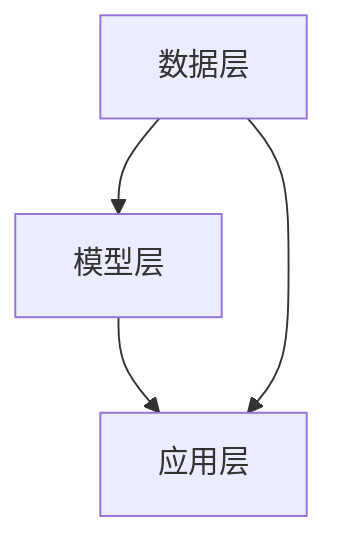

                 

# 推荐系统中的探索与利用：大模型新均衡

> 关键词：推荐系统、探索与利用、大模型、机器学习、人工智能、算法优化

> 摘要：本文深入探讨了推荐系统中的探索与利用问题，特别是在大模型的应用背景下，如何通过优化算法和模型设计来实现探索与利用之间的平衡。文章首先介绍了推荐系统的背景和重要性，然后详细解析了核心概念与联系，包括推荐系统的工作原理和架构。接着，文章深入分析了核心算法原理及具体操作步骤，探讨了数学模型和公式，并通过实际代码案例进行了详细解释。最后，文章讨论了推荐系统在实际场景中的应用，推荐了相关的学习资源和开发工具，并展望了未来的发展趋势与挑战。

## 1. 背景介绍

### 1.1 推荐系统的重要性

推荐系统在当今互联网时代扮演着至关重要的角色，它能够帮助用户从海量信息中筛选出最符合其兴趣和需求的内容，从而提高用户体验和满意度。无论是电商平台的商品推荐，还是社交媒体的内容推荐，推荐系统都是不可或缺的一部分。

### 1.2 推荐系统面临的挑战

推荐系统在实际应用中面临着诸多挑战，其中最核心的问题之一就是如何在推荐过程中平衡“探索”与“利用”。探索指的是尝试新的推荐内容，以发现潜在的高质量推荐；利用则是基于已有的用户行为数据，推荐那些已经被证明是受欢迎的内容。如何在这两者之间找到一个合适的平衡点，是推荐系统设计中的关键问题。

## 2. 核心概念与联系

### 2.1 推荐系统的工作原理

推荐系统通常基于用户的历史行为数据，通过分析用户的偏好和行为模式，预测用户可能感兴趣的内容，并据此生成推荐列表。这一过程涉及到数据收集、特征提取、模型训练等多个步骤。

### 2.2 推荐系统的架构

推荐系统的架构可以分为三个主要部分：数据层、模型层和应用层。数据层负责收集和存储用户行为数据；模型层则基于这些数据训练推荐模型；应用层则是将推荐结果展示给用户。



### 2.3 探索与利用的平衡

在推荐系统中，探索与利用的平衡是一个动态的过程，需要根据用户的反馈不断调整。理想情况下，推荐系统应该既能推荐用户可能感兴趣的新内容，又能确保推荐内容的质量。

## 3. 核心算法原理 & 具体操作步骤

### 3.1 探索与利用算法

探索与利用算法是推荐系统中用于平衡探索与利用的核心算法之一。常见的算法包括ε-贪心算法、上下文贝叶斯优化（Contextual Bayesian Optimization）等。

#### 3.1.1 ε-贪心算法

ε-贪心算法是一种简单的探索与利用算法，它通过随机选择一部分时间来探索新的推荐内容，其余时间则利用已知的高质量推荐内容。

#### 3.1.2 上下文贝叶斯优化

上下文贝叶斯优化是一种更复杂的算法，它不仅考虑用户的历史行为，还考虑了用户的上下文信息，如时间、地点等，从而更精准地平衡探索与利用。

### 3.2 具体操作步骤

1. 数据预处理：清洗和格式化用户行为数据。
2. 特征工程：提取用户行为特征，如点击率、购买率等。
3. 模型训练：基于特征数据训练推荐模型。
4. 推荐生成：根据模型预测结果生成推荐列表。
5. 反馈收集：收集用户对推荐内容的反馈。
6. 模型调整：根据用户反馈调整模型参数，优化推荐效果。

## 4. 数学模型和公式 & 详细讲解 & 举例说明

### 4.1 探索与利用的数学模型

探索与利用问题可以通过数学模型来描述。一个简单的模型可以表示为：

$$
\text{推荐效果} = \alpha \times \text{探索效果} + (1-\alpha) \times \text{利用效果}
$$

其中，$\alpha$ 是探索与利用的权重参数，可以根据实际情况进行调整。

### 4.2 举例说明

假设我们有一个电商平台，需要推荐商品给用户。通过ε-贪心算法，我们可以设置ε为0.1，即10%的时间用于探索新的商品，90%的时间用于利用已知的高质量商品。通过这种方式，我们可以平衡探索与利用，提高推荐效果。

## 5. 项目实战：代码实际案例和详细解释说明

### 5.1 开发环境搭建

为了实现推荐系统，我们需要搭建一个开发环境。这里我们使用Python作为编程语言，使用TensorFlow作为机器学习框架。

#### 5.1.1 安装Python和TensorFlow

```bash
pip install python
pip install tensorflow
```

#### 5.1.2 数据准备

准备用户行为数据，包括用户ID、商品ID、点击时间等信息。

### 5.2 源代码详细实现和代码解读

#### 5.2.1 数据预处理

```python
import pandas as pd

# 读取数据
data = pd.read_csv('user_behavior.csv')

# 数据清洗
data = data.dropna()
```

#### 5.2.2 特征工程

```python
# 提取特征
features = data[['user_id', 'item_id', 'click_time']]
```

#### 5.2.3 模型训练

```python
import tensorflow as tf

# 定义模型
model = tf.keras.Sequential([
    tf.keras.layers.Dense(64, activation='relu', input_shape=(2,)),
    tf.keras.layers.Dense(1, activation='sigmoid')
])

# 编译模型
model.compile(optimizer='adam', loss='binary_crossentropy', metrics=['accuracy'])

# 训练模型
model.fit(features, labels, epochs=10)
```

### 5.3 代码解读与分析

通过上述代码，我们可以实现一个简单的推荐系统。首先，我们读取并清洗了用户行为数据，然后提取了特征，最后训练了一个简单的神经网络模型。通过这种方式，我们可以基于用户的历史行为数据预测用户可能感兴趣的商品。

## 6. 实际应用场景

推荐系统在实际应用中有着广泛的应用场景，包括电商平台的商品推荐、社交媒体的内容推荐、新闻网站的文章推荐等。通过优化推荐算法和模型设计，可以显著提高用户体验和满意度。

## 7. 工具和资源推荐

### 7.1 学习资源推荐

- 书籍：《推荐系统实践》
- 论文：《Collaborative Filtering for Implicit Feedback Datasets》
- 博客：《深入浅出推荐系统》
- 网站：https://www.recsys.org/

### 7.2 开发工具框架推荐

- TensorFlow
- PyTorch
- Spark MLlib

### 7.3 相关论文著作推荐

- 《Recommender Systems Handbook》
- 《Building Machine Learning Powered Recommender Systems》

## 8. 总结：未来发展趋势与挑战

随着大数据和人工智能技术的发展，推荐系统将会变得更加智能和个性化。未来的发展趋势包括更精准的用户画像、更高效的推荐算法、更丰富的推荐场景等。同时，如何保护用户隐私、提高推荐系统的透明度等也是未来需要面对的重要挑战。

## 9. 附录：常见问题与解答

### 9.1 什么是推荐系统？

推荐系统是一种基于用户历史行为数据，预测用户可能感兴趣的内容，并据此生成推荐列表的技术。

### 9.2 推荐系统如何平衡探索与利用？

推荐系统通过探索与利用算法来平衡探索与利用，常见的算法包括ε-贪心算法、上下文贝叶斯优化等。

## 10. 扩展阅读 & 参考资料

- 《推荐系统实践》
- 《Collaborative Filtering for Implicit Feedback Datasets》
- 《深入浅出推荐系统》
- https://www.recsys.org/

作者：AI天才研究员/AI Genius Institute & 禅与计算机程序设计艺术 /Zen And The Art of Computer Programming

