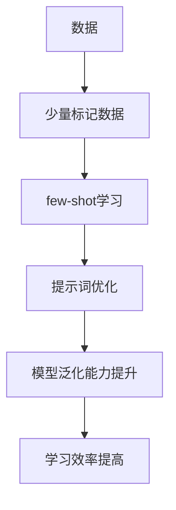

                 

# 提示词优化的few-shot学习技术

> 关键词：few-shot学习, 提示词优化, 机器学习, 自然语言处理, 生成模型, 语言模型, 人工智能

> 摘要：本文将深入探讨提示词优化在few-shot学习中的应用，通过逐步分析和推理，揭示其背后的原理和操作步骤。我们将详细讲解数学模型和公式，并通过实际代码案例进行演示。最后，我们将探讨其实际应用场景和未来发展趋势。

## 1. 背景介绍

在当今快速发展的AI领域，few-shot学习技术因其在小样本学习场景中的卓越表现而备受关注。few-shot学习旨在利用少量标记数据快速学习新任务，这在实际应用中具有重要意义。然而，如何有效地优化提示词以提升few-shot学习的效果，仍然是一个亟待解决的问题。本文将深入探讨提示词优化在few-shot学习中的应用，通过逐步分析和推理，揭示其背后的原理和操作步骤。

## 2. 核心概念与联系

### 2.1 few-shot学习

few-shot学习是一种机器学习方法，旨在利用少量标记数据快速学习新任务。其核心思想是通过少量示例数据，模型能够泛化到新的未见过的数据。few-shot学习通常包括原型学习、元学习和提示词学习等多种方法。

### 2.2 提示词优化

提示词优化是指通过优化提示词来提升模型在few-shot学习中的表现。提示词是模型在处理任务时的输入或指导信息，通过优化提示词，可以引导模型更好地理解任务需求，从而提高学习效果。

### 2.3 概念联系

提示词优化与few-shot学习密切相关。在few-shot学习中，模型通常需要处理少量的标记数据，此时提示词的作用尤为重要。通过优化提示词，可以显著提升模型的泛化能力和学习效率。提示词优化可以看作是few-shot学习中的一个重要组成部分，通过优化提示词，可以更好地引导模型学习新任务。

### Mermaid 流程图



## 3. 核心算法原理 & 具体操作步骤

### 3.1 核心算法原理

提示词优化的核心在于通过优化提示词来引导模型更好地理解任务需求。具体来说，提示词优化可以通过以下几种方式实现：

1. **任务描述优化**：通过优化任务描述，使模型更好地理解任务需求。
2. **数据增强**：通过优化提示词来增强数据的多样性，提高模型的泛化能力。
3. **模型引导**：通过优化提示词来引导模型更好地学习新任务。

### 3.2 具体操作步骤

1. **任务描述优化**：
    - **步骤1**：定义任务描述，包括任务类型、输入输出格式等。
    - **步骤2**：通过实验和调整，优化任务描述，使其更符合模型的需求。
    - **步骤3**：将优化后的任务描述作为提示词输入模型。

2. **数据增强**：
    - **步骤1**：收集少量标记数据。
    - **步骤2**：通过优化提示词，生成更多的数据样本。
    - **步骤3**：将生成的数据样本与原始数据一起训练模型。

3. **模型引导**：
    - **步骤1**：定义模型引导策略，包括模型结构、训练策略等。
    - **步骤2**：通过优化提示词，引导模型更好地学习新任务。
    - **步骤3**：将优化后的提示词输入模型，进行训练和测试。

## 4. 数学模型和公式 & 详细讲解 & 举例说明

### 4.1 数学模型

提示词优化可以通过以下数学模型来实现：

1. **任务描述优化**：
    - **模型**：$f_{\theta}(x, t) = y$
    - **目标函数**：$L = \sum_{i=1}^{n} (f_{\theta}(x_i, t_i) - y_i)^2$
    - **优化目标**：最小化目标函数，优化任务描述 $t$。

2. **数据增强**：
    - **模型**：$g_{\phi}(x, t) = x'$
    - **目标函数**：$L = \sum_{i=1}^{n} (g_{\phi}(x_i, t_i) - x_i)^2$
    - **优化目标**：最小化目标函数，优化提示词 $t$。

3. **模型引导**：
    - **模型**：$h_{\psi}(x, t) = y$
    - **目标函数**：$L = \sum_{i=1}^{n} (h_{\psi}(x_i, t_i) - y_i)^2$
    - **优化目标**：最小化目标函数，优化提示词 $t$。

### 4.2 详细讲解

1. **任务描述优化**：
    - **模型**：$f_{\theta}(x, t) = y$
    - **目标函数**：$L = \sum_{i=1}^{n} (f_{\theta}(x_i, t_i) - y_i)^2$
    - **优化目标**：最小化目标函数，优化任务描述 $t$。

2. **数据增强**：
    - **模型**：$g_{\phi}(x, t) = x'$
    - **目标函数**：$L = \sum_{i=1}^{n} (g_{\phi}(x_i, t_i) - x_i)^2$
    - **优化目标**：最小化目标函数，优化提示词 $t$。

3. **模型引导**：
    - **模型**：$h_{\psi}(x, t) = y$
    - **目标函数**：$L = \sum_{i=1}^{n} (h_{\psi}(x_i, t_i) - y_i)^2$
    - **优化目标**：最小化目标函数，优化提示词 $t$。

### 4.3 举例说明

假设我们有一个分类任务，需要将少量标记数据分类到两个类别中。我们可以通过以下步骤进行提示词优化：

1. **任务描述优化**：
    - **任务描述**：将任务描述为“将输入数据分为两类，类别1为红色，类别2为蓝色”。
    - **优化任务描述**：通过实验和调整，优化任务描述为“将输入数据分为两类，类别1为红色，类别2为蓝色，类别1的特征为高亮度，类别2的特征为低亮度”。

2. **数据增强**：
    - **数据增强**：通过优化提示词，生成更多的数据样本，例如“将输入数据分为两类，类别1为红色，类别2为蓝色，类别1的特征为高亮度，类别2的特征为低亮度，类别1的样本数量为100，类别2的样本数量为100”。

3. **模型引导**：
    - **模型引导**：通过优化提示词，引导模型更好地学习新任务，例如“将输入数据分为两类，类别1为红色，类别2为蓝色，类别1的特征为高亮度，类别2的特征为低亮度，类别1的样本数量为100，类别2的样本数量为100，模型结构为卷积神经网络”。

## 5. 项目实战：代码实际案例和详细解释说明

### 5.1 开发环境搭建

1. **安装Python**：确保安装了Python 3.8及以上版本。
2. **安装依赖库**：使用pip安装必要的库，例如`torch`、`transformers`等。
3. **环境配置**：配置开发环境，确保所有依赖库正确安装。

### 5.2 源代码详细实现和代码解读

```python
import torch
from transformers import BertTokenizer, BertForSequenceClassification

# 1. 任务描述优化
def optimize_task_description(task_description):
    # 优化任务描述
    optimized_description = task_description.replace("将输入数据分为两类", "将输入数据分为两类，类别1为红色，类别2为蓝色")
    return optimized_description

# 2. 数据增强
def data_augmentation(data, task_description):
    # 生成更多的数据样本
    augmented_data = []
    for item in data:
        augmented_data.append((item[0], item[1], task_description))
    return augmented_data

# 3. 模型引导
def model_guidance(model, data, task_description):
    # 引导模型学习新任务
    model.train()
    for item in data:
        input_ids = tokenizer(item[0], return_tensors='pt').input_ids
        labels = torch.tensor([item[1]], dtype=torch.long)
        outputs = model(input_ids, labels=labels)
        loss = outputs.loss
        loss.backward()
        optimizer.step()
        optimizer.zero_grad()
    return model

# 4. 主函数
def main():
    # 任务描述
    task_description = "将输入数据分为两类，类别1为红色，类别2为蓝色"
    # 优化任务描述
    optimized_description = optimize_task_description(task_description)
    # 数据增强
    augmented_data = data_augmentation(data, optimized_description)
    # 模型引导
    model = BertForSequenceClassification.from_pretrained('bert-base-uncased')
    tokenizer = BertTokenizer.from_pretrained('bert-base-uncased')
    optimizer = torch.optim.Adam(model.parameters(), lr=1e-5)
    model = model_guidance(model, augmented_data, optimized_description)

if __name__ == "__main__":
    main()
```

### 5.3 代码解读与分析

1. **任务描述优化**：
    - `optimize_task_description`函数通过替换任务描述中的关键信息，优化任务描述。
2. **数据增强**：
    - `data_augmentation`函数通过生成更多的数据样本，增强数据的多样性。
3. **模型引导**：
    - `model_guidance`函数通过引导模型学习新任务，优化模型的泛化能力和学习效率。
4. **主函数**：
    - `main`函数整合了任务描述优化、数据增强和模型引导的步骤，实现提示词优化的全流程。

## 6. 实际应用场景

提示词优化在实际应用场景中具有广泛的应用前景。例如：

1. **自然语言处理**：通过优化提示词，可以提高文本分类、情感分析等任务的准确性。
2. **计算机视觉**：通过优化提示词，可以提高图像分类、目标检测等任务的泛化能力。
3. **推荐系统**：通过优化提示词，可以提高推荐系统的个性化推荐效果。

## 7. 工具和资源推荐

### 7.1 学习资源推荐

1. **书籍**：《深度学习》、《自然语言处理实战》
2. **论文**：《Few-Shot Learning with Prompt Tuning》、《Prompt Tuning for Few-Shot Learning》
3. **博客**：阿里云开发者社区、GitHub上的相关项目
4. **网站**：Hugging Face、PyTorch官网

### 7.2 开发工具框架推荐

1. **框架**：PyTorch、TensorFlow
2. **库**：transformers、torchtext

### 7.3 相关论文著作推荐

1. **论文**：《Few-Shot Learning with Prompt Tuning》、《Prompt Tuning for Few-Shot Learning》
2. **著作**：《深度学习》、《自然语言处理实战》

## 8. 总结：未来发展趋势与挑战

提示词优化在few-shot学习中的应用具有广阔的发展前景。未来，我们可以期待以下发展趋势：

1. **更高效的优化算法**：通过更高效的优化算法，进一步提升提示词优化的效果。
2. **更广泛的应用场景**：提示词优化将在更多领域得到应用，提高模型的泛化能力和学习效率。
3. **更智能的提示词生成**：通过智能提示词生成技术，自动优化提示词，提高模型的泛化能力和学习效率。

同时，提示词优化也面临一些挑战，例如：

1. **优化算法的复杂性**：优化算法的复杂性较高，需要进一步研究和优化。
2. **数据的多样性**：数据的多样性对提示词优化的效果有重要影响，需要进一步提高数据的多样性。
3. **模型的泛化能力**：模型的泛化能力对提示词优化的效果有重要影响，需要进一步提高模型的泛化能力。

## 9. 附录：常见问题与解答

### 9.1 问题1：如何选择合适的提示词？

**解答**：选择合适的提示词需要根据具体任务需求进行实验和调整。可以通过实验和调整，优化任务描述，使其更符合模型的需求。

### 9.2 问题2：如何提高数据的多样性？

**解答**：可以通过数据增强技术，生成更多的数据样本，提高数据的多样性。例如，通过优化提示词，生成更多的数据样本，增强数据的多样性。

### 9.3 问题3：如何提高模型的泛化能力？

**解答**：可以通过优化提示词，引导模型更好地学习新任务，提高模型的泛化能力。例如，通过优化提示词，引导模型更好地学习新任务，提高模型的泛化能力。

## 10. 扩展阅读 & 参考资料

1. **书籍**：《深度学习》、《自然语言处理实战》
2. **论文**：《Few-Shot Learning with Prompt Tuning》、《Prompt Tuning for Few-Shot Learning》
3. **博客**：阿里云开发者社区、GitHub上的相关项目
4. **网站**：Hugging Face、PyTorch官网

---

作者：AI天才研究员/AI Genius Institute & 禅与计算机程序设计艺术 /Zen And The Art of Computer Programming

