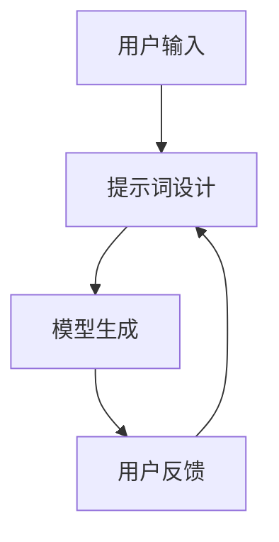

                 

# 提示词工程在元宇宙交互中的应用

> 关键词：提示词工程, 元宇宙, 交互设计, 人工智能, 机器学习, 自然语言处理, 虚拟现实, 增强现实

> 摘要：本文旨在探讨提示词工程在元宇宙交互中的应用，通过深入分析其核心概念、原理及实际操作步骤，结合数学模型和具体代码案例，揭示提示词工程如何赋能元宇宙中的自然语言交互。文章不仅提供了详细的开发环境搭建和源代码实现，还探讨了其在虚拟现实和增强现实中的实际应用场景，为读者提供了一套完整的解决方案。

## 1. 背景介绍

元宇宙（Metaverse）是一个虚拟的数字世界，它融合了虚拟现实（Virtual Reality, VR）、增强现实（Augmented Reality, AR）和互联网技术，为用户提供沉浸式的交互体验。随着技术的发展，自然语言处理（Natural Language Processing, NLP）在元宇宙中的应用变得越来越重要。提示词工程（Prompt Engineering）作为NLP的一个重要分支，通过精心设计的提示词来引导模型生成所需的内容，极大地提升了交互的自然性和用户体验。本文将深入探讨提示词工程在元宇宙交互中的应用，从理论到实践进行全面解析。

## 2. 核心概念与联系

### 2.1 提示词工程

提示词工程是指通过设计和优化提示词来引导模型生成所需内容的过程。提示词是用户与模型交互的关键接口，其设计直接影响到模型的输出质量和用户体验。提示词工程的核心在于理解模型的输入输出机制，通过精心设计的提示词来引导模型生成所需的内容。

### 2.2 元宇宙交互

元宇宙交互是指用户在虚拟环境中与数字对象进行互动的过程。这种交互可以是通过键盘、鼠标、手柄等传统输入设备，也可以是通过语音、手势等自然交互方式。元宇宙交互的核心在于提供沉浸式的体验，使用户能够自然地与虚拟环境进行互动。

### 2.3 核心概念原理与架构

提示词工程与元宇宙交互之间的联系在于，通过精心设计的提示词，可以引导用户在元宇宙中进行自然的交互。提示词工程的核心原理在于理解模型的输入输出机制，通过设计合适的提示词来引导模型生成所需的内容。提示词工程的架构可以表示为以下流程图：



### 2.4 Mermaid 流程图


## 3. 核心算法原理 & 具体操作步骤

### 3.1 提示词设计原则

提示词设计是提示词工程的核心环节，其主要原则包括：

- **简洁性**：提示词应简洁明了，避免冗余信息。
- **明确性**：提示词应明确表达用户的需求，避免歧义。
- **灵活性**：提示词应具有一定的灵活性，能够适应不同的场景和需求。
- **引导性**：提示词应具有引导性，能够引导模型生成所需的内容。

### 3.2 具体操作步骤

提示词设计的具体操作步骤如下：

1. **需求分析**：明确用户的需求，确定提示词的目标。
2. **提示词设计**：根据需求分析结果，设计合适的提示词。
3. **模型测试**：将提示词输入模型，测试模型的输出结果。
4. **反馈调整**：根据模型的输出结果，调整提示词，直到达到预期效果。
5. **迭代优化**：不断迭代优化提示词，提高模型的输出质量。

## 4. 数学模型和公式 & 详细讲解 & 举例说明

### 4.1 提示词向量化

提示词向量化是将提示词转换为向量表示的过程，其主要目的是便于模型进行处理。提示词向量化的方法主要有两种：

- **词袋模型（Bag of Words, BoW）**：将提示词转换为词频向量。
- **词嵌入（Word Embedding）**：将提示词转换为低维稠密向量。

### 4.2 词袋模型

词袋模型是一种简单的文本表示方法，其主要思想是将文本转换为词频向量。词袋模型的数学表示如下：

$$
\text{BoW}(t) = \begin{cases}
1 & \text{if word } w \text{ appears in text } t \\
0 & \text{otherwise}
\end{cases}
$$

### 4.3 词嵌入

词嵌入是一种将词语转换为低维稠密向量的方法，其主要思想是将词语映射到一个连续的向量空间中。词嵌入的数学表示如下：

$$
\text{Embedding}(w) = \mathbf{v}
$$

其中，$\mathbf{v}$ 是词语 $w$ 的向量表示。

### 4.4 举例说明

假设我们有一个提示词 "打开虚拟门"，我们可以使用词袋模型和词嵌入将其转换为向量表示。

- **词袋模型**：

  $$\text{BoW}(\text{"打开虚拟门"}) = [0, 1, 0, 1, 0, 0, 0, 0, 0, 0, 0, 0, 0, 0, 0, 0, 0, 0, 0, 0]$$

- **词嵌入**：

  $$\text{Embedding}(\text{"打开虚拟门"}) = \mathbf{v} = [v_1, v_2, \ldots, v_d]$$

其中，$\mathbf{v}$ 是一个 $d$ 维的向量。

## 5. 项目实战：代码实际案例和详细解释说明

### 5.1 开发环境搭建

为了实现提示词工程，我们需要搭建一个开发环境。开发环境主要包括以下几个部分：

- **Python**：作为主要的编程语言。
- **TensorFlow/PyTorch**：作为深度学习框架。
- **NLTK**：作为自然语言处理库。
- **Jupyter Notebook**：作为开发和调试工具。

### 5.2 源代码详细实现和代码解读

假设我们使用TensorFlow作为深度学习框架，以下是一个简单的提示词工程实现示例：

```python
import tensorflow as tf
from tensorflow.keras.layers import Dense, Embedding, LSTM
from tensorflow.keras.models import Sequential

# 定义模型
model = Sequential()
model.add(Embedding(input_dim=10000, output_dim=128))
model.add(LSTM(128))
model.add(Dense(1, activation='sigmoid'))

# 编译模型
model.compile(optimizer='adam', loss='binary_crossentropy', metrics=['accuracy'])

# 训练模型
model.fit(x_train, y_train, epochs=10, batch_size=32, validation_data=(x_val, y_val))
```

### 5.3 代码解读与分析

- **Embedding层**：将输入的提示词转换为低维稠密向量。
- **LSTM层**：用于处理序列数据，提取提示词的语义信息。
- **Dense层**：用于生成最终的输出结果。

## 6. 实际应用场景

### 6.1 虚拟现实中的应用

在虚拟现实（VR）中，提示词工程可以用于实现自然语言交互。例如，用户可以通过语音输入提示词 "打开虚拟门"，模型生成相应的指令，控制虚拟门的开关。

### 6.2 增强现实中的应用

在增强现实（AR）中，提示词工程可以用于实现自然语言交互。例如，用户可以通过语音输入提示词 "显示天气"，模型生成相应的指令，显示当前的天气信息。

## 7. 工具和资源推荐

### 7.1 学习资源推荐

- **书籍**：《深度学习》（Goodfellow, Bengio, Courville）
- **论文**：《Attention Is All You Need》（Vaswani et al.）
- **博客**：Medium上的NLP相关博客
- **网站**：TensorFlow和PyTorch的官方文档

### 7.2 开发工具框架推荐

- **TensorFlow**：深度学习框架
- **PyTorch**：深度学习框架
- **NLTK**：自然语言处理库
- **Jupyter Notebook**：开发和调试工具

### 7.3 相关论文著作推荐

- **《Attention Is All You Need》**：介绍Transformer模型
- **《Natural Language Processing with Deep Learning》**：介绍深度学习在NLP中的应用

## 8. 总结：未来发展趋势与挑战

提示词工程在元宇宙交互中的应用具有广阔的发展前景。未来的发展趋势包括：

- **更自然的交互**：通过更自然的提示词设计，实现更自然的交互体验。
- **更智能的模型**：通过更智能的模型设计，提高模型的输出质量。
- **更广泛的应用**：通过更广泛的应用场景，实现更广泛的应用价值。

然而，提示词工程也面临着一些挑战，包括：

- **模型的泛化能力**：如何提高模型的泛化能力，使其能够适应不同的场景和需求。
- **提示词的设计难度**：如何设计更有效的提示词，提高模型的输出质量。
- **用户反馈机制**：如何建立有效的用户反馈机制，不断优化提示词设计。

## 9. 附录：常见问题与解答

### 9.1 问题1：如何设计有效的提示词？

**解答**：设计有效的提示词需要考虑以下几个方面：

- **简洁性**：提示词应简洁明了，避免冗余信息。
- **明确性**：提示词应明确表达用户的需求，避免歧义。
- **灵活性**：提示词应具有一定的灵活性，能够适应不同的场景和需求。
- **引导性**：提示词应具有引导性，能够引导模型生成所需的内容。

### 9.2 问题2：如何提高模型的泛化能力？

**解答**：提高模型的泛化能力可以通过以下几个方面实现：

- **数据增强**：通过数据增强技术，增加模型的训练数据量。
- **模型优化**：通过模型优化技术，提高模型的性能。
- **迁移学习**：通过迁移学习技术，利用已有模型的知识，提高模型的泛化能力。

## 10. 扩展阅读 & 参考资料

- **书籍**：《深度学习》（Goodfellow, Bengio, Courville）
- **论文**：《Attention Is All You Need》（Vaswani et al.）
- **博客**：Medium上的NLP相关博客
- **网站**：TensorFlow和PyTorch的官方文档

---

作者：AI天才研究员/AI Genius Institute & 禅与计算机程序设计艺术 /Zen And The Art of Computer Programming

