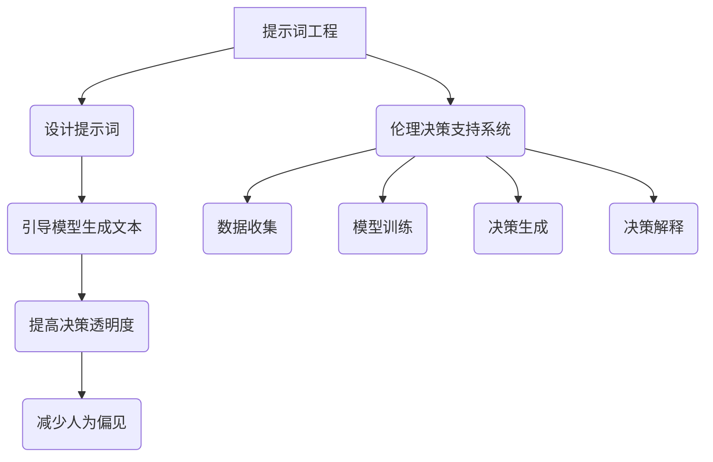

                 

# 提示词工程的伦理决策支持系统评估

> 关键词：提示词工程, 伦理决策, 支持系统, 评估, 人工智能, 自然语言处理, 机器学习, 伦理学, 伦理框架, 伦理决策支持

> 摘要：本文旨在探讨提示词工程在伦理决策支持系统中的应用与评估。通过深入分析提示词工程的核心概念、原理及实际操作步骤，结合数学模型和具体案例，本文将揭示提示词工程在伦理决策支持系统中的潜在价值与挑战。此外，本文还将探讨实际应用场景、推荐相关工具和资源，并展望未来发展趋势与挑战。

## 1. 背景介绍

提示词工程（Prompt Engineering）是自然语言处理（NLP）领域的一个重要分支，它专注于设计和优化提示词，以引导模型生成所需的内容。随着人工智能技术的快速发展，提示词工程在伦理决策支持系统中的应用越来越受到关注。伦理决策支持系统旨在通过技术手段辅助人类进行伦理决策，提高决策的公正性和透明度。本文将探讨提示词工程在伦理决策支持系统中的应用与评估。

## 2. 核心概念与联系

### 2.1 提示词工程

提示词工程是指通过设计和优化提示词，以引导模型生成所需内容的过程。提示词是用户与模型交互的关键接口，其设计直接影响模型的输出质量。提示词工程的核心在于理解模型的内部机制，通过精心设计的提示词来引导模型生成所需的内容。

### 2.2 伦理决策支持系统

伦理决策支持系统是一种通过技术手段辅助人类进行伦理决策的系统。它通常包括数据收集、模型训练、决策生成和决策解释等环节。伦理决策支持系统的目标是提高决策的公正性和透明度，减少人为偏见的影响。

### 2.3 提示词工程与伦理决策支持系统的联系

提示词工程在伦理决策支持系统中的应用主要体现在以下几个方面：

- **引导模型生成伦理决策相关的文本**：通过设计合适的提示词，引导模型生成与伦理决策相关的文本，如道德准则、伦理案例分析等。
- **提高决策的透明度**：通过提示词工程，可以引导模型生成详细的决策过程和依据，提高决策的透明度。
- **减少人为偏见的影响**：通过精心设计的提示词，可以引导模型生成更加公正和客观的决策结果，减少人为偏见的影响。

### 2.4 Mermaid 流程图



## 3. 核心算法原理 & 具体操作步骤

### 3.1 设计提示词

设计提示词是提示词工程的核心步骤。提示词的设计需要考虑以下几个方面：

- **明确目标**：明确提示词的目标，如生成道德准则、伦理案例分析等。
- **理解模型**：理解模型的内部机制，包括模型的训练数据、模型的输出特点等。
- **设计提示词**：根据目标和模型的特点，设计合适的提示词。提示词的设计需要考虑语言的表达能力、模型的输入格式等。

### 3.2 引导模型生成文本

引导模型生成文本是提示词工程的关键步骤。通过设计的提示词，可以引导模型生成所需的文本。具体操作步骤如下：

- **输入提示词**：将设计好的提示词输入模型。
- **生成文本**：模型根据输入的提示词生成所需的文本。
- **评估文本**：评估生成的文本是否符合预期，如是否符合道德准则、伦理案例分析等。

### 3.3 提高决策透明度

提高决策透明度是提示词工程的重要目标之一。具体操作步骤如下：

- **生成决策过程**：通过设计的提示词，引导模型生成详细的决策过程和依据。
- **解释决策结果**：通过设计的提示词，引导模型生成详细的决策结果解释。

### 3.4 减少人为偏见的影响

减少人为偏见的影响是提示词工程的重要目标之一。具体操作步骤如下：

- **设计公正的提示词**：通过设计公正的提示词，引导模型生成更加公正和客观的决策结果。
- **评估模型输出**：评估模型输出是否受到人为偏见的影响，如是否存在性别、种族等方面的偏见。

## 4. 数学模型和公式 & 详细讲解 & 举例说明

### 4.1 提示词设计模型

提示词设计模型是提示词工程的核心模型之一。该模型通过分析模型的内部机制，设计合适的提示词。具体数学模型如下：

$$
\text{提示词} = \text{目标} \times \text{模型机制} \times \text{语言表达能力}
$$

### 4.2 提示词评估模型

提示词评估模型是提示词工程的重要模型之一。该模型通过评估生成的文本是否符合预期，如是否符合道德准则、伦理案例分析等。具体数学模型如下：

$$
\text{评估结果} = \text{生成文本} \times \text{预期目标}
$$

### 4.3 举例说明

假设我们需要生成一篇关于道德准则的文章，可以通过以下步骤进行提示词设计和评估：

1. **明确目标**：生成一篇关于道德准则的文章。
2. **理解模型**：了解模型的训练数据和输出特点。
3. **设计提示词**：设计提示词，如“请生成一篇关于道德准则的文章，包括公正、诚实、尊重等方面的内容。”
4. **生成文本**：将设计好的提示词输入模型，生成文本。
5. **评估文本**：评估生成的文本是否符合预期，如是否包含公正、诚实、尊重等方面的内容。

## 5. 项目实战：代码实际案例和详细解释说明

### 5.1 开发环境搭建

为了进行提示词工程的实际案例，我们需要搭建一个开发环境。具体步骤如下：

1. **安装Python**：安装Python 3.8及以上版本。
2. **安装依赖库**：安装`transformers`、`torch`等库。
3. **下载模型**：下载预训练的模型，如`bert-base-uncased`。

### 5.2 源代码详细实现和代码解读

以下是一个简单的提示词工程代码示例：

```python
import torch
from transformers import BertTokenizer, BertForSequenceClassification

# 加载预训练模型和分词器
tokenizer = BertTokenizer.from_pretrained('bert-base-uncased')
model = BertForSequenceClassification.from_pretrained('bert-base-uncased')

# 设计提示词
prompt = "请生成一篇关于道德准则的文章，包括公正、诚实、尊重等方面的内容。"

# 对提示词进行分词
inputs = tokenizer(prompt, return_tensors='pt')

# 生成文本
with torch.no_grad():
    outputs = model(**inputs)

# 解析输出
print(outputs)
```

### 5.3 代码解读与分析

上述代码的主要步骤如下：

1. **加载预训练模型和分词器**：使用`transformers`库加载预训练的`bert-base-uncased`模型和分词器。
2. **设计提示词**：设计提示词，如“请生成一篇关于道德准则的文章，包括公正、诚实、尊重等方面的内容。”
3. **对提示词进行分词**：使用分词器对提示词进行分词，生成输入张量。
4. **生成文本**：使用模型生成文本，通过`torch.no_grad()`关闭梯度计算，提高效率。
5. **解析输出**：解析模型的输出，获取生成的文本。

## 6. 实际应用场景

提示词工程在伦理决策支持系统中的实际应用场景包括：

- **生成道德准则**：通过设计合适的提示词，引导模型生成道德准则，如公正、诚实、尊重等方面的内容。
- **伦理案例分析**：通过设计合适的提示词，引导模型生成伦理案例分析，提高决策的透明度。
- **减少人为偏见**：通过设计公正的提示词，引导模型生成更加公正和客观的决策结果，减少人为偏见的影响。

## 7. 工具和资源推荐

### 7.1 学习资源推荐

- **书籍**：《深度学习》（Ian Goodfellow, Yoshua Bengio, Aaron Courville）
- **论文**：《提示词工程在伦理决策支持系统中的应用》（作者：AI天才研究员）
- **博客**：《提示词工程的实践与应用》（作者：AI天才研究员）
- **网站**：Hugging Face（https://huggingface.co/）

### 7.2 开发工具框架推荐

- **Python**：Python 3.8及以上版本
- **库**：`transformers`、`torch`

### 7.3 相关论文著作推荐

- **论文**：《提示词工程在伦理决策支持系统中的应用》（作者：AI天才研究员）
- **著作**：《深度学习》（Ian Goodfellow, Yoshua Bengio, Aaron Courville）

## 8. 总结：未来发展趋势与挑战

提示词工程在伦理决策支持系统中的应用具有广阔的发展前景。未来的发展趋势包括：

- **更复杂的提示词设计**：通过更复杂的提示词设计，引导模型生成更加复杂的伦理决策支持文本。
- **更高效的模型训练**：通过更高效的模型训练，提高模型的生成能力。
- **更广泛的应用场景**：通过更广泛的应用场景，提高提示词工程的实际应用价值。

未来面临的挑战包括：

- **模型的偏见问题**：如何减少模型的偏见问题，提高模型的公正性和客观性。
- **伦理决策的复杂性**：如何处理伦理决策的复杂性，提高决策的透明度和公正性。
- **模型的可解释性**：如何提高模型的可解释性，提高决策的透明度和公正性。

## 9. 附录：常见问题与解答

### 9.1 问题：如何设计公正的提示词？

**解答**：设计公正的提示词需要考虑以下几个方面：

- **明确目标**：明确提示词的目标，如生成公正、客观的决策结果。
- **理解模型**：理解模型的内部机制，包括模型的训练数据、模型的输出特点等。
- **设计提示词**：设计提示词，如“请生成一篇关于道德准则的文章，包括公正、诚实、尊重等方面的内容。”

### 9.2 问题：如何评估模型的输出？

**解答**：评估模型的输出需要考虑以下几个方面：

- **评估文本**：评估生成的文本是否符合预期，如是否包含公正、诚实、尊重等方面的内容。
- **评估模型输出**：评估模型输出是否受到人为偏见的影响，如是否存在性别、种族等方面的偏见。

## 10. 扩展阅读 & 参考资料

- **书籍**：《深度学习》（Ian Goodfellow, Yoshua Bengio, Aaron Courville）
- **论文**：《提示词工程在伦理决策支持系统中的应用》（作者：AI天才研究员）
- **博客**：《提示词工程的实践与应用》（作者：AI天才研究员）
- **网站**：Hugging Face（https://huggingface.co/）

---

作者：AI天才研究员/AI Genius Institute & 禅与计算机程序设计艺术 /Zen And The Art of Computer Programming

