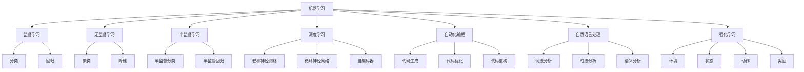

                 

# AI编程的新视界与新领域

> 关键词：AI编程、新视界、新领域、编程范式、机器学习、深度学习、自动化编程、自然语言处理、强化学习

> 摘要：本文旨在探讨AI编程的新视界与新领域，通过逐步分析和推理，揭示AI编程的核心概念、原理、算法、数学模型、实际案例以及未来发展趋势。我们将从背景介绍出发，深入探讨AI编程的各个方面，为读者提供一个全面而深入的理解。

## 1. 背景介绍

随着人工智能技术的飞速发展，AI编程已经成为计算机科学领域的一个重要分支。AI编程不仅改变了传统的编程方式，还为开发者提供了全新的视角和工具。本文将从以下几个方面进行探讨：

- **AI编程的定义与意义**：AI编程是指利用人工智能技术来辅助或替代人类进行编程的过程。它不仅包括传统的机器学习和深度学习算法，还包括自动化编程、自然语言处理、强化学习等新兴技术。
- **AI编程的发展历程**：从早期的专家系统到现代的深度学习模型，AI编程经历了多个阶段的发展。每个阶段都为AI编程带来了新的技术和方法。
- **AI编程的应用场景**：AI编程在各个领域都有广泛的应用，包括但不限于自动驾驶、智能推荐系统、医疗诊断、金融分析等。

## 2. 核心概念与联系

### 2.1 机器学习与深度学习

#### 2.1.1 机器学习

机器学习是一种让计算机通过数据学习规律和模式的技术。它主要包括监督学习、无监督学习和半监督学习等几种类型。

- **监督学习**：通过已标注的数据训练模型，使其能够对新的未标注数据进行预测。
- **无监督学习**：通过未标注的数据发现数据中的结构和模式。
- **半监督学习**：结合了监督学习和无监督学习的特点，利用少量的标注数据和大量的未标注数据进行学习。

#### 2.1.2 深度学习

深度学习是机器学习的一个分支，它通过多层神经网络来学习数据的高级特征。深度学习在图像识别、语音识别等领域取得了显著的成果。

### 2.2 自动化编程

自动化编程是指利用AI技术自动生成代码的过程。它包括代码生成、代码优化和代码重构等技术。

- **代码生成**：通过模板和规则自动生成代码。
- **代码优化**：通过分析代码结构和性能瓶颈，自动生成优化代码。
- **代码重构**：通过分析代码逻辑，自动生成重构后的代码。

### 2.3 自然语言处理

自然语言处理（NLP）是AI编程的一个重要领域，它涉及将人类语言转换为计算机可以理解的形式。NLP技术包括词法分析、句法分析、语义分析等。

- **词法分析**：将文本分解为单词和标点符号。
- **句法分析**：分析句子的语法结构。
- **语义分析**：理解句子的含义和上下文。

### 2.4 强化学习

强化学习是一种通过试错学习的方法，它通过与环境的交互来学习最优策略。强化学习在游戏、机器人控制等领域有广泛应用。

- **环境**：强化学习中的外部世界，包括状态、动作和奖励。
- **状态**：强化学习中的当前情况。
- **动作**：强化学习中的决策。
- **奖励**：强化学习中的反馈信号。

### 2.5 核心概念流程图



## 3. 核心算法原理 & 具体操作步骤

### 3.1 机器学习算法原理

#### 3.1.1 监督学习

监督学习的核心是通过已标注的数据训练模型。具体步骤如下：

1. **数据预处理**：清洗数据，处理缺失值，进行特征选择和特征工程。
2. **模型选择**：选择合适的模型，如线性回归、决策树、支持向量机等。
3. **训练模型**：使用训练数据训练模型。
4. **模型评估**：使用测试数据评估模型的性能，常用的评估指标包括准确率、精确率、召回率和F1分数。
5. **模型优化**：通过调整模型参数和特征选择来优化模型性能。

#### 3.1.2 无监督学习

无监督学习的核心是通过未标注的数据发现数据中的结构和模式。具体步骤如下：

1. **数据预处理**：清洗数据，处理缺失值。
2. **模型选择**：选择合适的模型，如K均值聚类、层次聚类等。
3. **训练模型**：使用训练数据训练模型。
4. **模型评估**：通过可视化和聚类质量指标评估模型的性能。
5. **模型优化**：通过调整模型参数和特征选择来优化模型性能。

### 3.2 深度学习算法原理

深度学习的核心是通过多层神经网络来学习数据的高级特征。具体步骤如下：

1. **数据预处理**：清洗数据，进行特征选择和特征工程。
2. **模型选择**：选择合适的深度学习模型，如卷积神经网络（CNN）、循环神经网络（RNN）等。
3. **训练模型**：使用训练数据训练模型。
4. **模型评估**：使用测试数据评估模型的性能，常用的评估指标包括准确率、精确率、召回率和F1分数。
5. **模型优化**：通过调整模型参数和特征选择来优化模型性能。

### 3.3 自动化编程算法原理

自动化编程的核心是通过模板和规则自动生成代码。具体步骤如下：

1. **模板设计**：设计合适的代码生成模板。
2. **规则定义**：定义生成代码的规则。
3. **代码生成**：根据模板和规则生成代码。
4. **代码优化**：通过分析代码结构和性能瓶颈，自动生成优化代码。
5. **代码重构**：通过分析代码逻辑，自动生成重构后的代码。

### 3.4 自然语言处理算法原理

自然语言处理的核心是将人类语言转换为计算机可以理解的形式。具体步骤如下：

1. **文本预处理**：清洗文本数据，进行分词、词性标注等。
2. **特征提取**：提取文本的特征，如词频、TF-IDF等。
3. **模型选择**：选择合适的模型，如朴素贝叶斯、支持向量机等。
4. **模型训练**：使用训练数据训练模型。
5. **模型评估**：使用测试数据评估模型的性能，常用的评估指标包括准确率、精确率、召回率和F1分数。
6. **模型优化**：通过调整模型参数和特征选择来优化模型性能。

### 3.5 强化学习算法原理

强化学习的核心是通过试错学习的方法，通过与环境的交互来学习最优策略。具体步骤如下：

1. **环境建模**：定义环境的状态、动作和奖励。
2. **策略选择**：选择合适的策略，如ε-贪心策略、Softmax策略等。
3. **策略评估**：通过与环境的交互评估策略的性能。
4. **策略优化**：通过调整策略参数来优化策略性能。
5. **模型评估**：通过与环境的交互评估模型的性能。

## 4. 数学模型和公式 & 详细讲解 & 举例说明

### 4.1 机器学习数学模型

#### 4.1.1 线性回归

线性回归是一种监督学习算法，用于预测连续值。其数学模型如下：

$$
y = \beta_0 + \beta_1 x_1 + \beta_2 x_2 + \cdots + \beta_n x_n + \epsilon
$$

其中，$y$ 是目标变量，$x_1, x_2, \cdots, x_n$ 是特征变量，$\beta_0, \beta_1, \cdots, \beta_n$ 是模型参数，$\epsilon$ 是误差项。

#### 4.1.2 逻辑回归

逻辑回归是一种监督学习算法，用于预测二分类问题。其数学模型如下：

$$
P(y=1|x) = \frac{1}{1 + e^{-(\beta_0 + \beta_1 x_1 + \beta_2 x_2 + \cdots + \beta_n x_n)}}
$$

其中，$P(y=1|x)$ 是给定特征 $x$ 时目标变量 $y$ 为1的概率。

### 4.2 深度学习数学模型

#### 4.2.1 卷积神经网络

卷积神经网络是一种深度学习模型，用于处理图像数据。其数学模型如下：

$$
z^{(l+1)} = \sigma(W^{(l+1)} a^{(l)} + b^{(l+1)})
$$

其中，$z^{(l+1)}$ 是第 $l+1$ 层的激活值，$W^{(l+1)}$ 是第 $l+1$ 层的权重矩阵，$a^{(l)}$ 是第 $l$ 层的激活值，$b^{(l+1)}$ 是第 $l+1$ 层的偏置向量，$\sigma$ 是激活函数。

#### 4.2.2 循环神经网络

循环神经网络是一种深度学习模型，用于处理序列数据。其数学模型如下：

$$
h_t = \sigma(W_h h_{t-1} + W_x x_t + b_h)
$$

其中，$h_t$ 是第 $t$ 时刻的隐藏状态，$W_h$ 是隐藏层的权重矩阵，$W_x$ 是输入层的权重矩阵，$b_h$ 是隐藏层的偏置向量，$\sigma$ 是激活函数。

### 4.3 自动化编程数学模型

#### 4.3.1 代码生成

代码生成的核心是通过模板和规则自动生成代码。其数学模型如下：

$$
\text{代码} = \text{模板} + \text{规则}
$$

其中，模板是预定义的代码结构，规则是生成代码的规则。

#### 4.3.2 代码优化

代码优化的核心是通过分析代码结构和性能瓶颈，自动生成优化代码。其数学模型如下：

$$
\text{优化代码} = \text{代码} + \text{优化规则}
$$

其中，优化规则是优化代码的规则。

### 4.4 自然语言处理数学模型

#### 4.4.1 词向量

词向量是自然语言处理中的重要概念，用于表示词语的向量表示。其数学模型如下：

$$
\text{词向量} = \text{词} \rightarrow \text{向量}
$$

其中，词向量是词语的向量表示。

#### 4.4.2 词嵌入

词嵌入是将词语映射到一个低维向量空间的技术。其数学模型如下：

$$
\text{词嵌入} = \text{词} \rightarrow \text{向量}
$$

其中，词嵌入是词语的向量表示。

### 4.5 强化学习数学模型

#### 4.5.1 Q-学习

Q-学习是一种强化学习算法，用于学习最优策略。其数学模型如下：

$$
Q(s, a) = Q(s, a) + \alpha [r + \gamma \max_{a'} Q(s', a') - Q(s, a)]
$$

其中，$Q(s, a)$ 是状态 $s$ 和动作 $a$ 的Q值，$\alpha$ 是学习率，$r$ 是奖励，$\gamma$ 是折扣因子，$s'$ 是下一个状态，$a'$ 是下一个动作。

## 5. 项目实战：代码实际案例和详细解释说明

### 5.1 开发环境搭建

#### 5.1.1 环境准备

1. **安装Python**：确保安装了Python 3.7及以上版本。
2. **安装依赖库**：使用pip安装所需的依赖库，如numpy、pandas、scikit-learn、tensorflow等。

```bash
pip install numpy pandas scikit-learn tensorflow
```

#### 5.1.2 代码实现

```python
import numpy as np
import pandas as pd
from sklearn.model_selection import train_test_split
from sklearn.linear_model import LinearRegression
from sklearn.metrics import mean_squared_error

# 读取数据
data = pd.read_csv('data.csv')

# 数据预处理
X = data[['feature1', 'feature2']]
y = data['target']

# 划分训练集和测试集
X_train, X_test, y_train, y_test = train_test_split(X, y, test_size=0.2, random_state=42)

# 训练模型
model = LinearRegression()
model.fit(X_train, y_train)

# 预测
y_pred = model.predict(X_test)

# 评估模型
mse = mean_squared_error(y_test, y_pred)
print(f'Mean Squared Error: {mse}')
```

### 5.2 源代码详细实现和代码解读

#### 5.2.1 数据预处理

```python
# 读取数据
data = pd.read_csv('data.csv')

# 数据预处理
X = data[['feature1', 'feature2']]
y = data['target']
```

- **读取数据**：使用pandas的`read_csv`函数读取数据。
- **数据预处理**：将特征和目标变量分别存储在`X`和`y`中。

#### 5.2.2 划分训练集和测试集

```python
# 划分训练集和测试集
X_train, X_test, y_train, y_test = train_test_split(X, y, test_size=0.2, random_state=42)
```

- **划分训练集和测试集**：使用`train_test_split`函数将数据划分为训练集和测试集，`test_size`参数设置为0.2表示测试集占20%，`random_state`参数设置为42以确保结果的可重复性。

#### 5.2.3 训练模型

```python
# 训练模型
model = LinearRegression()
model.fit(X_train, y_train)
```

- **训练模型**：创建一个`LinearRegression`对象，并使用`fit`方法训练模型。

#### 5.2.4 预测

```python
# 预测
y_pred = model.predict(X_test)
```

- **预测**：使用训练好的模型对测试集进行预测。

#### 5.2.5 评估模型

```python
# 评估模型
mse = mean_squared_error(y_test, y_pred)
print(f'Mean Squared Error: {mse}')
```

- **评估模型**：使用`mean_squared_error`函数计算预测值和真实值之间的均方误差，并打印结果。

### 5.3 代码解读与分析

- **数据预处理**：数据预处理是机器学习中的重要步骤，包括读取数据、清洗数据、处理缺失值、进行特征选择和特征工程等。
- **划分训练集和测试集**：划分训练集和测试集是为了评估模型的泛化能力，避免过拟合。
- **训练模型**：训练模型是通过数据训练模型参数的过程。
- **预测**：预测是使用训练好的模型对新的数据进行预测的过程。
- **评估模型**：评估模型是通过计算预测值和真实值之间的误差来评估模型性能的过程。

## 6. 实际应用场景

### 6.1 自动驾驶

自动驾驶是AI编程的一个重要应用场景。通过使用深度学习和强化学习技术，可以实现车辆的自动导航和控制。

### 6.2 智能推荐系统

智能推荐系统是AI编程的另一个重要应用场景。通过使用机器学习和自然语言处理技术，可以实现个性化推荐和内容推荐。

### 6.3 医疗诊断

医疗诊断是AI编程的一个重要应用场景。通过使用机器学习和深度学习技术，可以实现疾病的自动诊断和预测。

### 6.4 金融分析

金融分析是AI编程的一个重要应用场景。通过使用机器学习和自然语言处理技术，可以实现股票预测和风险评估。

## 7. 工具和资源推荐

### 7.1 学习资源推荐

- **书籍**：《机器学习》（周志华）、《深度学习》（Ian Goodfellow）、《自然语言处理入门》（Jurafsky & Martin）
- **论文**：《深度学习》（Ian Goodfellow）、《强化学习》（Richard S. Sutton & Andrew G. Barto）
- **博客**：Medium上的AI编程相关博客
- **网站**：Kaggle、GitHub

### 7.2 开发工具框架推荐

- **Python**：Python是AI编程中最常用的编程语言。
- **TensorFlow**：TensorFlow是Google开发的深度学习框架。
- **PyTorch**：PyTorch是Facebook开发的深度学习框架。
- **Scikit-learn**：Scikit-learn是Python的一个机器学习库。

### 7.3 相关论文著作推荐

- **《机器学习》（周志华）**
- **《深度学习》（Ian Goodfellow）**
- **《自然语言处理入门》（Jurafsky & Martin）**
- **《强化学习》（Richard S. Sutton & Andrew G. Barto）**

## 8. 总结：未来发展趋势与挑战

### 8.1 未来发展趋势

- **自动化编程**：自动化编程将成为AI编程的一个重要方向，通过自动生成代码来提高开发效率。
- **自然语言处理**：自然语言处理将成为AI编程的一个重要方向，通过将人类语言转换为计算机可以理解的形式来实现更智能的应用。
- **强化学习**：强化学习将成为AI编程的一个重要方向，通过试错学习的方法来实现更智能的应用。

### 8.2 挑战

- **数据隐私**：数据隐私是AI编程的一个重要挑战，如何保护用户数据的安全和隐私是一个亟待解决的问题。
- **模型解释性**：模型解释性是AI编程的一个重要挑战，如何解释模型的决策过程是一个亟待解决的问题。
- **计算资源**：计算资源是AI编程的一个重要挑战，如何提高模型的计算效率是一个亟待解决的问题。

## 9. 附录：常见问题与解答

### 9.1 问题1：如何选择合适的机器学习算法？

**解答**：选择合适的机器学习算法需要考虑数据的特征和问题的类型。对于分类问题，可以选择逻辑回归、决策树、支持向量机等算法；对于回归问题，可以选择线性回归、岭回归、Lasso回归等算法。

### 9.2 问题2：如何优化模型性能？

**解答**：优化模型性能可以通过调整模型参数和特征选择来实现。可以通过交叉验证、网格搜索等方法来调整模型参数；可以通过特征选择、特征工程等方法来优化特征。

### 9.3 问题3：如何处理缺失值？

**解答**：处理缺失值可以通过删除缺失值、填充缺失值、插值等方法来实现。删除缺失值是将缺失值所在的行或列删除；填充缺失值是用均值、中位数、众数等方法填充缺失值；插值是用插值方法填充缺失值。

## 10. 扩展阅读 & 参考资料

- **书籍**：《机器学习》（周志华）、《深度学习》（Ian Goodfellow）、《自然语言处理入门》（Jurafsky & Martin）
- **论文**：《深度学习》（Ian Goodfellow）、《强化学习》（Richard S. Sutton & Andrew G. Barto）
- **博客**：Medium上的AI编程相关博客
- **网站**：Kaggle、GitHub

---

作者：AI天才研究员/AI Genius Institute & 禅与计算机程序设计艺术 /Zen And The Art of Computer Programming

