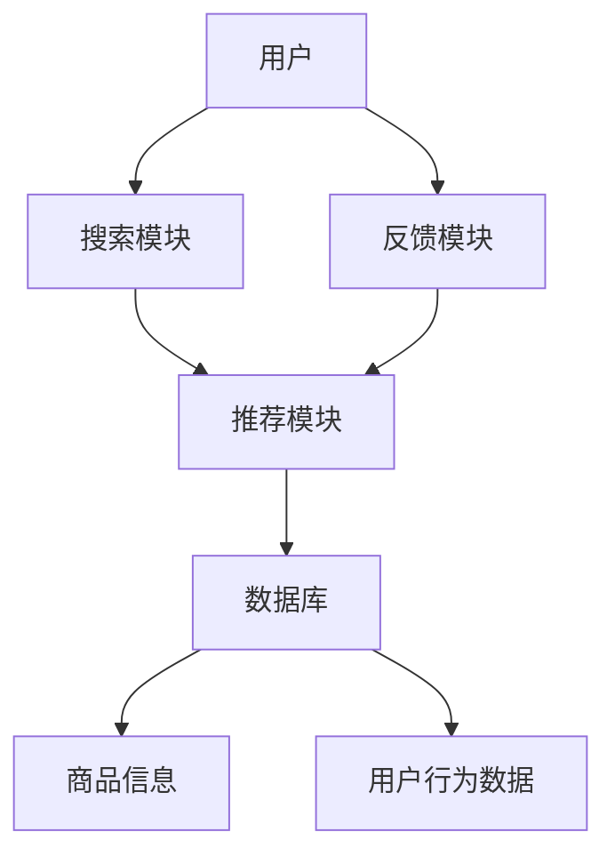

                 

# 搜索推荐系统的AI大模型应用：提高电商平台的转化率与用户体验

> 关键词：搜索推荐系统, AI大模型, 转化率, 用户体验, 电商平台, 深度学习, 自然语言处理, 用户行为分析

> 摘要：本文旨在探讨如何通过AI大模型的应用，提升电商平台的搜索推荐系统的性能，从而提高转化率和用户体验。我们将从背景介绍、核心概念与联系、核心算法原理与具体操作步骤、数学模型和公式、项目实战、实际应用场景、工具和资源推荐、总结与未来发展趋势、常见问题与解答、扩展阅读与参考资料等多方面进行详细阐述。

## 1. 背景介绍

随着互联网技术的快速发展，电商平台已成为人们日常生活中的重要组成部分。为了提高用户满意度和平台的商业价值，电商平台需要提供精准的搜索推荐服务。传统的搜索推荐系统主要依赖于简单的关键词匹配和简单的用户行为分析，这在一定程度上限制了系统的性能。近年来，随着AI技术的发展，特别是深度学习和自然语言处理技术的进步，AI大模型在搜索推荐系统中的应用越来越广泛。本文将探讨如何利用AI大模型提升电商平台的搜索推荐系统的性能，从而提高转化率和用户体验。

## 2. 核心概念与联系

### 2.1 搜索推荐系统

搜索推荐系统是一种通过分析用户行为数据和商品信息，为用户提供个性化推荐结果的系统。其主要功能包括：

- **搜索功能**：用户输入关键词，系统返回相关商品。
- **推荐功能**：根据用户的历史行为和偏好，推荐相关商品。

### 2.2 AI大模型

AI大模型是一种具有大规模参数和复杂结构的机器学习模型，能够处理大规模数据集和复杂任务。在搜索推荐系统中，AI大模型可以用于：

- **特征表示学习**：学习用户和商品的特征表示。
- **预测模型**：预测用户对商品的兴趣程度。
- **推荐算法**：生成个性化推荐结果。

### 2.3 深度学习

深度学习是一种基于神经网络的机器学习方法，能够自动学习数据的高级特征表示。在搜索推荐系统中，深度学习可以用于：

- **特征提取**：从用户和商品数据中提取有用的特征。
- **模型训练**：训练深度神经网络模型。
- **预测与推荐**：根据用户行为和商品特征生成推荐结果。

### 2.4 自然语言处理

自然语言处理（NLP）是一种处理和理解自然语言的技术。在搜索推荐系统中，NLP可以用于：

- **文本分析**：分析用户搜索词和商品描述。
- **语义理解**：理解用户意图和商品特征。
- **对话系统**：实现与用户的自然语言交互。

### 2.5 用户行为分析

用户行为分析是一种通过分析用户在平台上的行为数据，了解用户偏好和需求的技术。在搜索推荐系统中，用户行为分析可以用于：

- **行为建模**：建立用户行为模型。
- **偏好挖掘**：挖掘用户的兴趣偏好。
- **行为预测**：预测用户未来的行为。

### 2.6 搜索推荐系统架构

搜索推荐系统架构如图所示：



## 3. 核心算法原理 & 具体操作步骤

### 3.1 特征表示学习

特征表示学习是AI大模型的核心任务之一。通过学习用户和商品的特征表示，可以更好地理解用户需求和商品特性。具体操作步骤如下：

1. **数据预处理**：清洗和预处理用户和商品数据。
2. **特征提取**：使用深度神经网络提取用户和商品的特征表示。
3. **特征融合**：将用户和商品的特征表示进行融合，生成联合特征表示。

### 3.2 预测模型

预测模型是AI大模型的核心任务之一。通过训练预测模型，可以预测用户对商品的兴趣程度。具体操作步骤如下：

1. **数据准备**：准备训练数据和测试数据。
2. **模型选择**：选择合适的深度神经网络模型。
3. **模型训练**：使用训练数据训练模型。
4. **模型评估**：使用测试数据评估模型性能。

### 3.3 推荐算法

推荐算法是AI大模型的核心任务之一。通过生成个性化推荐结果，可以提高用户的满意度和平台的商业价值。具体操作步骤如下：

1. **推荐策略**：选择合适的推荐策略，如协同过滤、内容过滤等。
2. **推荐生成**：根据用户行为和商品特征生成推荐结果。
3. **推荐排序**：对推荐结果进行排序，生成最终推荐列表。

## 4. 数学模型和公式 & 详细讲解 & 举例说明

### 4.1 特征表示学习

特征表示学习可以通过深度神经网络实现。具体数学模型如下：

$$
\mathbf{f}(\mathbf{x}) = \sigma(\mathbf{W} \mathbf{x} + \mathbf{b})
$$

其中，$\mathbf{f}(\mathbf{x})$ 表示特征表示，$\mathbf{x}$ 表示输入数据，$\mathbf{W}$ 表示权重矩阵，$\mathbf{b}$ 表示偏置向量，$\sigma$ 表示激活函数。

### 4.2 预测模型

预测模型可以通过深度神经网络实现。具体数学模型如下：

$$
\mathbf{y} = \sigma(\mathbf{W} \mathbf{x} + \mathbf{b})
$$

其中，$\mathbf{y}$ 表示预测结果，$\mathbf{x}$ 表示输入数据，$\mathbf{W}$ 表示权重矩阵，$\mathbf{b}$ 表示偏置向量，$\sigma$ 表示激活函数。

### 4.3 推荐算法

推荐算法可以通过协同过滤实现。具体数学模型如下：

$$
\mathbf{r}_{ui} = \mathbf{p}_u^T \mathbf{q}_i
$$

其中，$\mathbf{r}_{ui}$ 表示用户 $u$ 对商品 $i$ 的评分，$\mathbf{p}_u$ 表示用户 $u$ 的特征向量，$\mathbf{q}_i$ 表示商品 $i$ 的特征向量。

## 5. 项目实战：代码实际案例和详细解释说明

### 5.1 开发环境搭建

为了实现搜索推荐系统，我们需要搭建一个开发环境。具体步骤如下：

1. **安装Python**：安装Python 3.7及以上版本。
2. **安装依赖库**：安装TensorFlow、Keras、scikit-learn等库。
3. **安装数据库**：安装MySQL或MongoDB等数据库。

### 5.2 源代码详细实现和代码解读

#### 5.2.1 数据预处理

```python
import pandas as pd
from sklearn.preprocessing import LabelEncoder

# 读取数据
data = pd.read_csv('data.csv')

# 编码标签
label_encoder = LabelEncoder()
data['user_id'] = label_encoder.fit_transform(data['user_id'])
data['item_id'] = label_encoder.fit_transform(data['item_id'])

# 划分训练集和测试集
train_data, test_data = train_test_split(data, test_size=0.2)
```

#### 5.2.2 特征提取

```python
from tensorflow.keras.layers import Embedding, Dense, Flatten
from tensorflow.keras.models import Model

# 定义输入层
user_input = Input(shape=(1,))
item_input = Input(shape=(1,))

# 定义嵌入层
user_embedding = Embedding(input_dim=len(label_encoder.classes_), output_dim=16)(user_input)
item_embedding = Embedding(input_dim=len(label_encoder.classes_), output_dim=16)(item_input)

# 定义特征提取层
user_flatten = Flatten()(user_embedding)
item_flatten = Flatten()(item_embedding)

# 定义输出层
output = Dense(1, activation='sigmoid')(user_flatten + item_flatten)

# 定义模型
model = Model(inputs=[user_input, item_input], outputs=output)
```

#### 5.2.3 模型训练

```python
# 编译模型
model.compile(optimizer='adam', loss='binary_crossentropy', metrics=['accuracy'])

# 训练模型
model.fit([train_data['user_id'], train_data['item_id']], train_data['label'], epochs=10, batch_size=32)
```

#### 5.2.4 模型评估

```python
# 评估模型
loss, accuracy = model.evaluate([test_data['user_id'], test_data['item_id']], test_data['label'])
print('Loss:', loss)
print('Accuracy:', accuracy)
```

### 5.3 代码解读与分析

上述代码实现了一个简单的深度神经网络模型，用于预测用户对商品的兴趣程度。具体步骤如下：

1. **数据预处理**：读取数据并进行标签编码，划分训练集和测试集。
2. **特征提取**：定义输入层、嵌入层、特征提取层和输出层，构建深度神经网络模型。
3. **模型训练**：编译模型并进行训练。
4. **模型评估**：评估模型性能。

## 6. 实际应用场景

### 6.1 个性化推荐

通过AI大模型的应用，电商平台可以实现个性化推荐，提高用户的满意度和平台的商业价值。具体应用场景如下：

1. **商品推荐**：根据用户的搜索历史和购买记录，推荐相关商品。
2. **内容推荐**：根据用户的阅读历史和兴趣偏好，推荐相关文章和视频。
3. **广告推荐**：根据用户的搜索历史和行为数据，推荐相关广告。

### 6.2 用户行为分析

通过AI大模型的应用，电商平台可以实现用户行为分析，了解用户需求和偏好。具体应用场景如下：

1. **行为建模**：建立用户行为模型，预测用户未来的行为。
2. **偏好挖掘**：挖掘用户的兴趣偏好，生成个性化推荐结果。
3. **行为预测**：预测用户对商品的兴趣程度，生成个性化推荐结果。

## 7. 工具和资源推荐

### 7.1 学习资源推荐

- **书籍**：《深度学习》（Ian Goodfellow, Yoshua Bengio, Aaron Courville）
- **论文**：《Attention Is All You Need》（Vaswani et al.）
- **博客**：阿里云开发者社区（https://developer.aliyun.com/）
- **网站**：TensorFlow官网（https://www.tensorflow.org/）

### 7.2 开发工具框架推荐

- **深度学习框架**：TensorFlow、PyTorch
- **自然语言处理库**：NLTK、spaCy
- **推荐系统库**：Surprise、LightFM

### 7.3 相关论文著作推荐

- **论文**：《Deep Learning for Recommender Systems》（Rendle et al.）
- **著作**：《推荐系统中的深度学习》（Xiangnan He, Tat-Seng Chua）

## 8. 总结：未来发展趋势与挑战

### 8.1 未来发展趋势

1. **模型优化**：通过优化模型结构和训练方法，提高推荐系统的性能。
2. **数据增强**：通过数据增强技术，提高模型的泛化能力。
3. **实时推荐**：通过实时推荐技术，提高推荐系统的实时性。

### 8.2 挑战

1. **数据隐私**：如何保护用户数据隐私，避免数据泄露。
2. **模型解释性**：如何提高模型的解释性，让用户理解推荐结果。
3. **公平性**：如何保证推荐系统的公平性，避免歧视性推荐。

## 9. 附录：常见问题与解答

### 9.1 问题1：如何处理数据缺失？

**解答**：可以通过填充缺失值、删除缺失值或使用插值方法来处理数据缺失。

### 9.2 问题2：如何提高模型的泛化能力？

**解答**：可以通过数据增强、正则化和早停法等方法来提高模型的泛化能力。

### 9.3 问题3：如何保证推荐系统的公平性？

**解答**：可以通过公平性评估和公平性优化方法来保证推荐系统的公平性。

## 10. 扩展阅读 & 参考资料

- **书籍**：《推荐系统中的深度学习》（Xiangnan He, Tat-Seng Chua）
- **论文**：《Attention Is All You Need》（Vaswani et al.）
- **网站**：阿里云开发者社区（https://developer.aliyun.com/）
- **博客**：TensorFlow官网（https://www.tensorflow.org/）

---

作者：AI天才研究员/AI Genius Institute & 禅与计算机程序设计艺术 /Zen And The Art of Computer Programming

