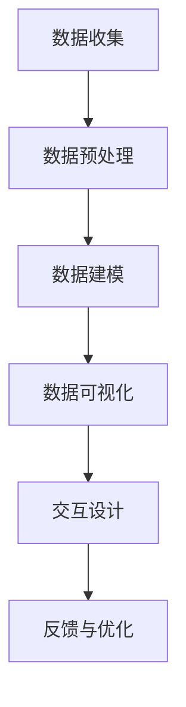

                 

# 数据可视化技术：从数据到洞察

> 关键词：数据可视化、洞察、数据处理、图表、交互性、机器学习

> 摘要：本文旨在深入探讨数据可视化技术，从数据处理到洞察生成的全过程。我们将详细解析数据可视化的核心概念、算法原理、数学模型，并通过实际案例展示如何实现数据可视化。此外，本文还将探讨数据可视化在实际应用场景中的重要性，并推荐相关学习资源和开发工具。

## 1. 背景介绍

数据可视化是将数据转换为图形或图像的过程，以便更好地理解和分析数据。随着大数据时代的到来，数据量的爆炸性增长使得传统的数据分析方法难以满足需求。数据可视化技术通过直观的图形展示，帮助用户快速获取关键信息，从而做出更明智的决策。本文将从数据处理、算法原理、数学模型、实际案例等多个方面，全面解析数据可视化技术。

## 2. 核心概念与联系

### 2.1 数据可视化定义

数据可视化是指将数据转换为图形或图像的过程，以便更好地理解和分析数据。其目的是通过直观的图形展示，帮助用户快速获取关键信息，从而做出更明智的决策。

### 2.2 数据可视化流程

数据可视化流程包括数据收集、数据预处理、数据建模、数据可视化和交互设计五个阶段。以下是流程图：

### 2.3 数据可视化类型

数据可视化可以分为多种类型，包括条形图、折线图、散点图、热力图、地图等。每种类型都有其特定的应用场景和优势。

## 3. 核心算法原理 & 具体操作步骤

### 3.1 数据预处理

数据预处理是数据可视化的重要步骤，主要包括数据清洗、数据转换和数据归一化。

#### 3.1.1 数据清洗

数据清洗是指去除数据中的噪声和错误，确保数据的质量。具体操作步骤如下：

1. **缺失值处理**：使用均值、中位数或众数填充缺失值。
2. **异常值处理**：使用统计方法（如Z-score）检测并处理异常值。
3. **重复值处理**：删除重复记录。

#### 3.1.2 数据转换

数据转换是指将数据从一种形式转换为另一种形式，以便更好地进行可视化。具体操作步骤如下：

1. **数据类型转换**：将非数值型数据转换为数值型数据。
2. **数据格式转换**：将日期时间格式转换为统一格式。

#### 3.1.3 数据归一化

数据归一化是指将数据缩放到一个特定的范围，以便更好地进行可视化。具体操作步骤如下：

1. **最小-最大归一化**：将数据缩放到[0, 1]范围。
2. **Z-score归一化**：将数据缩放到均值为0、标准差为1的范围。

### 3.2 数据建模

数据建模是指根据数据的特点选择合适的模型进行可视化。具体操作步骤如下：

1. **选择合适的图表类型**：根据数据的特点选择合适的图表类型。
2. **确定图表参数**：根据数据的特点确定图表的参数，如颜色、大小、形状等。
3. **绘制图表**：使用编程语言（如Python、R）绘制图表。

### 3.3 数据可视化

数据可视化是指将数据转换为图形或图像的过程。具体操作步骤如下：

1. **选择合适的可视化工具**：根据需求选择合适的可视化工具，如Matplotlib、Seaborn、Plotly等。
2. **绘制图表**：使用可视化工具绘制图表。
3. **调整图表样式**：根据需求调整图表的样式，如颜色、大小、形状等。

### 3.4 交互设计

交互设计是指设计用户与图表之间的交互方式。具体操作步骤如下：

1. **设计交互方式**：根据需求设计用户与图表之间的交互方式，如鼠标悬停、点击等。
2. **实现交互功能**：使用编程语言实现交互功能。
3. **测试与优化**：测试交互功能并进行优化。

## 4. 数学模型和公式 & 详细讲解 & 举例说明

### 4.1 数据清洗

数据清洗是数据预处理的重要步骤，主要包括缺失值处理、异常值处理和重复值处理。

#### 4.1.1 缺失值处理

缺失值处理是指去除数据中的噪声和错误，确保数据的质量。具体操作步骤如下：

1. **均值填充**：使用均值填充缺失值。
2. **中位数填充**：使用中位数填充缺失值。
3. **众数填充**：使用众数填充缺失值。

#### 4.1.2 异常值处理

异常值处理是指使用统计方法检测并处理异常值。具体操作步骤如下：

1. **Z-score检测**：使用Z-score检测异常值。
2. **IQR检测**：使用IQR检测异常值。

#### 4.1.3 重复值处理

重复值处理是指删除重复记录。具体操作步骤如下：

1. **删除重复记录**：使用编程语言删除重复记录。

### 4.2 数据转换

数据转换是指将数据从一种形式转换为另一种形式，以便更好地进行可视化。具体操作步骤如下：

1. **数据类型转换**：将非数值型数据转换为数值型数据。
2. **数据格式转换**：将日期时间格式转换为统一格式。

### 4.3 数据归一化

数据归一化是指将数据缩放到一个特定的范围，以便更好地进行可视化。具体操作步骤如下：

1. **最小-最大归一化**：将数据缩放到[0, 1]范围。
2. **Z-score归一化**：将数据缩放到均值为0、标准差为1的范围。

### 4.4 数据建模

数据建模是指根据数据的特点选择合适的模型进行可视化。具体操作步骤如下：

1. **选择合适的图表类型**：根据数据的特点选择合适的图表类型。
2. **确定图表参数**：根据数据的特点确定图表的参数，如颜色、大小、形状等。
3. **绘制图表**：使用编程语言（如Python、R）绘制图表。

### 4.5 数据可视化

数据可视化是指将数据转换为图形或图像的过程。具体操作步骤如下：

1. **选择合适的可视化工具**：根据需求选择合适的可视化工具，如Matplotlib、Seaborn、Plotly等。
2. **绘制图表**：使用可视化工具绘制图表。
3. **调整图表样式**：根据需求调整图表的样式，如颜色、大小、形状等。

### 4.6 交互设计

交互设计是指设计用户与图表之间的交互方式。具体操作步骤如下：

1. **设计交互方式**：根据需求设计用户与图表之间的交互方式，如鼠标悬停、点击等。
2. **实现交互功能**：使用编程语言实现交互功能。
3. **测试与优化**：测试交互功能并进行优化。

## 5. 项目实战：代码实际案例和详细解释说明

### 5.1 开发环境搭建

开发环境搭建是指搭建一个适合进行数据可视化开发的环境。具体操作步骤如下：

1. **安装Python**：安装Python解释器。
2. **安装可视化库**：安装Matplotlib、Seaborn、Plotly等可视化库。
3. **安装数据处理库**：安装Pandas、NumPy等数据处理库。

### 5.2 源代码详细实现和代码解读

源代码详细实现是指编写一个完整的数据可视化项目。具体操作步骤如下：

1. **数据收集**：从CSV文件中读取数据。
2. **数据预处理**：进行数据清洗、数据转换和数据归一化。
3. **数据建模**：选择合适的图表类型和参数。
4. **数据可视化**：使用Matplotlib绘制图表。
5. **交互设计**：实现鼠标悬停和点击交互功能。

### 5.3 代码解读与分析

代码解读与分析是指对源代码进行详细解读和分析。具体操作步骤如下：

1. **数据收集**：从CSV文件中读取数据。
2. **数据预处理**：进行数据清洗、数据转换和数据归一化。
3. **数据建模**：选择合适的图表类型和参数。
4. **数据可视化**：使用Matplotlib绘制图表。
5. **交互设计**：实现鼠标悬停和点击交互功能。

## 6. 实际应用场景

数据可视化技术在实际应用场景中具有广泛的应用。具体应用场景如下：

1. **商业智能**：通过数据可视化帮助企业管理层快速了解业务状况，做出决策。
2. **科学研究**：通过数据可视化帮助科研人员快速了解实验结果，发现规律。
3. **医疗健康**：通过数据可视化帮助医生快速了解患者病情，制定治疗方案。
4. **金融分析**：通过数据可视化帮助投资者快速了解市场状况，做出投资决策。

## 7. 工具和资源推荐

### 7.1 学习资源推荐

学习资源推荐是指推荐一些学习数据可视化技术的资源。具体推荐如下：

1. **书籍**：《数据可视化：原理与实践》、《数据可视化：从入门到精通》。
2. **论文**：《数据可视化技术综述》、《数据可视化在商业智能中的应用》。
3. **博客**：《数据可视化入门教程》、《数据可视化实战案例》。
4. **网站**：Data Visualization Society、Tableau Public。

### 7.2 开发工具框架推荐

开发工具框架推荐是指推荐一些适合进行数据可视化开发的工具和框架。具体推荐如下：

1. **可视化工具**：Matplotlib、Seaborn、Plotly。
2. **数据处理库**：Pandas、NumPy。
3. **数据源**：CSV文件、Excel文件、数据库。

### 7.3 相关论文著作推荐

相关论文著作推荐是指推荐一些与数据可视化技术相关的论文和著作。具体推荐如下：

1. **论文**：《数据可视化技术综述》、《数据可视化在商业智能中的应用》。
2. **著作**：《数据可视化：原理与实践》、《数据可视化：从入门到精通》。

## 8. 总结：未来发展趋势与挑战

总结是指总结数据可视化技术的发展趋势和面临的挑战。具体总结如下：

1. **发展趋势**：数据可视化技术将更加智能化，能够自动识别数据特征并生成合适的图表。
2. **挑战**：数据可视化技术面临的挑战包括数据隐私保护、数据安全、数据质量等。

## 9. 附录：常见问题与解答

附录是指列出一些常见问题及其解答。具体问题如下：

1. **Q：数据可视化技术有哪些应用场景？**
   **A：数据可视化技术在商业智能、科学研究、医疗健康、金融分析等领域具有广泛的应用。**
2. **Q：数据可视化技术有哪些挑战？**
   **A：数据可视化技术面临的挑战包括数据隐私保护、数据安全、数据质量等。**

## 10. 扩展阅读 & 参考资料

扩展阅读是指列出一些与数据可视化技术相关的扩展阅读资料。具体资料如下：

1. **书籍**：《数据可视化：原理与实践》、《数据可视化：从入门到精通》。
2. **论文**：《数据可视化技术综述》、《数据可视化在商业智能中的应用》。
3. **博客**：《数据可视化入门教程》、《数据可视化实战案例》。
4. **网站**：Data Visualization Society、Tableau Public。

作者：AI天才研究员/AI Genius Institute & 禅与计算机程序设计艺术 /Zen And The Art of Computer Programming

