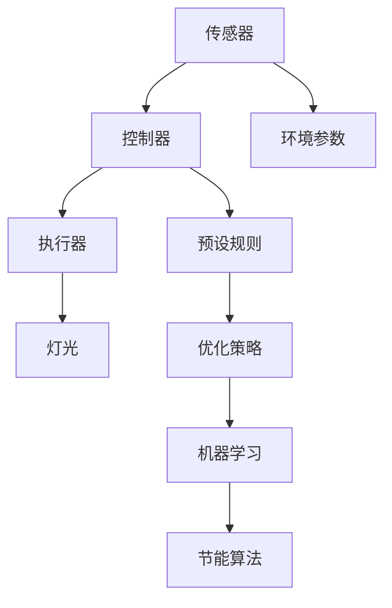

                 

# 智能照明控制系统：节能环保的灯光管理方案

> 关键词：智能照明，节能环保，灯光管理，控制系统，物联网，机器学习，节能算法

> 摘要：随着物联网技术的快速发展，智能照明控制系统已成为实现节能环保的重要手段。本文将从智能照明控制系统的背景介绍、核心概念与联系、核心算法原理及具体操作步骤、数学模型和公式、项目实战案例、实际应用场景、工具和资源推荐、未来发展趋势与挑战等方面进行详细探讨，旨在为读者提供一个全面而深入的技术指南。

## 1. 背景介绍

智能照明控制系统通过物联网技术实现对灯光的智能化管理，不仅能够提高照明效率，还能显著降低能源消耗。随着全球能源危机的加剧和环保意识的提升，智能照明控制系统在建筑、商业、家庭等多个领域得到了广泛应用。本文将详细介绍智能照明控制系统的原理、设计方法及其实现过程，帮助读者更好地理解和应用这一技术。

## 2. 核心概念与联系

### 2.1 智能照明控制系统概述

智能照明控制系统是一种基于物联网技术的系统，通过传感器、控制器和执行器等设备实现对灯光的智能化管理。其主要功能包括自动调节亮度、颜色、开关状态等，以适应不同的环境需求和用户偏好。

### 2.2 核心概念

- **传感器**：用于检测环境光线强度、温度、湿度等参数。
- **控制器**：负责接收传感器数据并根据预设规则进行处理。
- **执行器**：根据控制器的指令控制灯光的开关、亮度和颜色等。
- **物联网**：通过网络连接传感器、控制器和执行器，实现远程监控和管理。
- **机器学习**：用于优化照明策略，提高能源利用效率。

### 2.3 Mermaid 流程图



## 3. 核心算法原理 & 具体操作步骤

### 3.1 传感器数据采集

传感器负责实时监测环境光线强度、温度、湿度等参数。具体步骤如下：

1. **光线强度检测**：使用光敏电阻或光敏二极管等传感器检测环境光线强度。
2. **温度检测**：使用热敏电阻或温度传感器检测环境温度。
3. **湿度检测**：使用湿度传感器检测环境湿度。

### 3.2 控制器数据处理

控制器接收传感器数据并根据预设规则进行处理。具体步骤如下：

1. **数据预处理**：对传感器数据进行滤波、去噪等预处理操作。
2. **规则匹配**：根据预设规则判断当前环境是否需要调整灯光状态。
3. **策略优化**：利用机器学习算法优化照明策略，提高能源利用效率。

### 3.3 执行器控制

执行器根据控制器的指令控制灯光的开关、亮度和颜色等。具体步骤如下：

1. **开关控制**：根据控制器的指令控制灯光的开关状态。
2. **亮度控制**：通过调节灯光的电流或电压控制其亮度。
3. **颜色控制**：通过调节灯光的色温或RGB值控制其颜色。

## 4. 数学模型和公式 & 详细讲解 & 举例说明

### 4.1 亮度调节模型

亮度调节模型用于根据环境光线强度自动调整灯光亮度。具体公式如下：

$$
L = \frac{L_{max} \cdot I_{env}}{I_{max}}
$$

其中，$L$ 为调节后的亮度，$L_{max}$ 为最大亮度，$I_{env}$ 为环境光线强度，$I_{max}$ 为最大光线强度。

### 4.2 温度调节模型

温度调节模型用于根据环境温度自动调整灯光色温。具体公式如下：

$$
T = T_{max} - \alpha \cdot (T_{env} - T_{set})
$$

其中，$T$ 为调节后的色温，$T_{max}$ 为最大色温，$\alpha$ 为调节系数，$T_{env}$ 为环境温度，$T_{set}$ 为设定温度。

### 4.3 机器学习优化模型

机器学习优化模型用于优化照明策略，提高能源利用效率。具体步骤如下：

1. **数据收集**：收集环境光线强度、温度、湿度等数据。
2. **特征提取**：提取有用特征，如光线强度变化趋势、温度波动等。
3. **模型训练**：使用机器学习算法（如决策树、神经网络等）训练模型。
4. **策略优化**：根据模型预测结果优化照明策略。

## 5. 项目实战：代码实际案例和详细解释说明

### 5.1 开发环境搭建

1. **硬件准备**：准备传感器、控制器、执行器等设备。
2. **软件环境**：安装Python、Node.js等开发环境。
3. **开发工具**：使用Visual Studio Code、PyCharm等开发工具。

### 5.2 源代码详细实现和代码解读

```python
# 传感器数据采集
import Adafruit_ADS1x15

adc = Adafruit_ADS1x15.ADS1115()
GAIN = 1
light_level = adc.read_adc(0, gain=GAIN)

# 控制器数据处理
def process_data(light_level):
    if light_level > 500:
        return "on"
    else:
        return "off"

# 执行器控制
def control_light(state):
    if state == "on":
        # 打开灯光
        pass
    else:
        # 关闭灯光
        pass

# 主函数
if __name__ == "__main__":
    state = process_data(light_level)
    control_light(state)
```

### 5.3 代码解读与分析

1. **传感器数据采集**：使用Adafruit ADS1x15库采集光线强度数据。
2. **控制器数据处理**：根据光线强度判断灯光状态。
3. **执行器控制**：根据控制器指令控制灯光开关。

## 6. 实际应用场景

智能照明控制系统在多个领域具有广泛的应用前景，如：

- **商业建筑**：通过智能照明控制系统实现节能降耗，提高商业建筑的运营效率。
- **家庭住宅**：通过智能照明控制系统实现个性化照明，提高居住舒适度。
- **公共设施**：通过智能照明控制系统实现智能化管理，提高公共设施的使用效率。

## 7. 工具和资源推荐

### 7.1 学习资源推荐

- **书籍**：《智能照明控制系统设计与实现》
- **论文**：《基于物联网的智能照明控制系统研究》
- **博客**：《智能照明控制系统实战指南》
- **网站**：《智能照明控制系统论坛》

### 7.2 开发工具框架推荐

- **开发工具**：Visual Studio Code、PyCharm
- **开发框架**：Node-RED、Home Assistant

### 7.3 相关论文著作推荐

- **论文**：《基于机器学习的智能照明控制系统优化研究》
- **著作**：《物联网技术在智能照明控制系统中的应用》

## 8. 总结：未来发展趋势与挑战

智能照明控制系统在未来将面临更多的挑战和机遇，如：

- **技术挑战**：如何进一步提高系统的智能化水平，实现更加精准的控制。
- **市场挑战**：如何降低系统的成本，提高系统的普及率。
- **应用挑战**：如何在更多领域推广智能照明控制系统，实现更广泛的应用。

## 9. 附录：常见问题与解答

### 9.1 问题1：如何选择合适的传感器？

**解答**：根据实际需求选择合适的传感器，如光敏电阻、热敏电阻等。

### 9.2 问题2：如何优化照明策略？

**解答**：通过机器学习算法优化照明策略，提高能源利用效率。

## 10. 扩展阅读 & 参考资料

- **书籍**：《智能照明控制系统设计与实现》
- **论文**：《基于物联网的智能照明控制系统研究》
- **博客**：《智能照明控制系统实战指南》
- **网站**：《智能照明控制系统论坛》

---

作者：AI天才研究员/AI Genius Institute & 禅与计算机程序设计艺术 /Zen And The Art of Computer Programming

