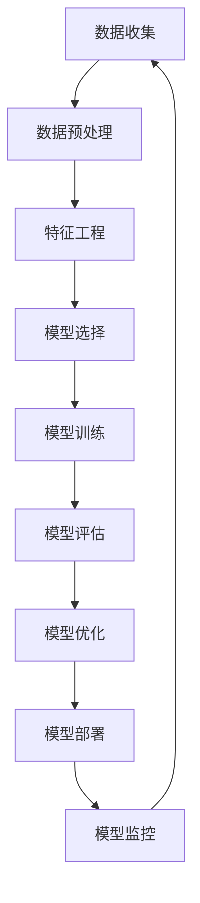

                 

# 机器学习在电影推荐系统中的应用

> 关键词：机器学习、电影推荐系统、协同过滤、矩阵分解、深度学习、个性化推荐

> 摘要：本文将深入探讨机器学习在电影推荐系统中的应用，从背景介绍到核心算法原理，再到实际项目实战，最后展望未来发展趋势与挑战。通过详细的技术分析和代码示例，帮助读者理解如何利用机器学习技术构建高效的电影推荐系统。

## 1. 背景介绍

随着互联网技术的飞速发展，个性化推荐系统已经成为互联网服务的重要组成部分。电影推荐系统作为个性化推荐系统的一个典型应用，能够根据用户的观影历史、评分、偏好等信息，为用户推荐合适的电影。这不仅提升了用户体验，也增加了平台的用户粘性。传统的推荐系统主要依赖于内容过滤和协同过滤，而近年来，随着机器学习技术的发展，基于机器学习的推荐系统逐渐成为主流。

### 1.1 电影推荐系统的重要性

电影推荐系统的重要性在于它能够帮助用户发现新的电影，提高用户的观影体验。通过推荐系统，用户可以节省寻找合适电影的时间，同时也能发现一些自己可能感兴趣但未曾听说过的电影。这对于电影平台来说，不仅可以增加用户的活跃度，还能提高用户的满意度和忠诚度。

### 1.2 机器学习在推荐系统中的应用

机器学习在推荐系统中的应用主要体现在以下几个方面：

- **个性化推荐**：通过分析用户的历史行为数据，为每个用户推荐最符合其兴趣的电影。
- **冷启动问题**：解决新用户和新电影的推荐问题，提高推荐系统的覆盖率。
- **实时推荐**：根据用户的实时行为，提供即时的个性化推荐。
- **多模态推荐**：结合用户的行为数据、社交网络信息、电影的元数据等多种信息，提供更加精准的推荐。

## 2. 核心概念与联系

### 2.1 协同过滤

协同过滤是推荐系统中最常用的一种方法，它通过分析用户之间的相似性或者物品之间的相似性来进行推荐。协同过滤可以分为用户-用户协同过滤和物品-物品协同过滤。

#### 2.1.1 用户-用户协同过滤

用户-用户协同过滤通过找到与目标用户兴趣相似的其他用户，然后推荐这些用户喜欢的电影给目标用户。其核心思想是“物以类聚，人以群分”。

#### 2.1.2 物品-物品协同过滤

物品-物品协同过滤通过分析用户对不同电影的评分，找到与目标电影相似的其他电影，然后推荐这些相似的电影给目标用户。其核心思想是“物以类聚”。

### 2.2 矩阵分解

矩阵分解是机器学习中的一种常用技术，它通过将用户-物品评分矩阵分解为两个低秩矩阵的乘积，从而实现对用户和物品的隐式特征表示。矩阵分解在推荐系统中的应用主要体现在以下几个方面：

- **隐语义模型**：通过矩阵分解，可以提取出用户和物品的隐语义特征，从而实现更加精准的推荐。
- **稀疏矩阵填充**：通过矩阵分解，可以填充用户-物品评分矩阵中的缺失值，提高推荐系统的覆盖率。
- **降维**：通过矩阵分解，可以将高维的用户-物品评分矩阵降维为低维的隐语义特征表示，从而提高计算效率。

### 2.3 深度学习

深度学习在推荐系统中的应用主要体现在以下几个方面：

- **神经网络模型**：通过构建多层神经网络模型，可以实现对用户和物品的隐语义特征表示，从而实现更加精准的推荐。
- **自编码器**：通过构建自编码器模型，可以实现对用户和物品的隐语义特征表示，从而实现更加精准的推荐。
- **深度神经网络**：通过构建深度神经网络模型，可以实现对用户和物品的隐语义特征表示，从而实现更加精准的推荐。

### 2.4 机器学习流程图



## 3. 核心算法原理 & 具体操作步骤

### 3.1 矩阵分解算法原理

矩阵分解算法的核心思想是将用户-物品评分矩阵分解为两个低秩矩阵的乘积，从而实现对用户和物品的隐语义特征表示。矩阵分解算法的主要步骤如下：

1. **数据预处理**：将用户-物品评分矩阵转换为稀疏矩阵，并进行归一化处理。
2. **特征工程**：提取用户和物品的隐语义特征表示。
3. **模型选择**：选择合适的矩阵分解算法，如SVD、ALS等。
4. **模型训练**：通过优化目标函数，训练矩阵分解模型。
5. **模型评估**：通过交叉验证等方法，评估矩阵分解模型的性能。
6. **模型优化**：通过调整超参数等方法，优化矩阵分解模型的性能。
7. **模型部署**：将矩阵分解模型部署到生产环境中，实现实时推荐。

### 3.2 深度学习算法原理

深度学习算法的核心思想是通过构建多层神经网络模型，实现对用户和物品的隐语义特征表示。深度学习算法的主要步骤如下：

1. **数据预处理**：将用户-物品评分矩阵转换为稀疏矩阵，并进行归一化处理。
2. **特征工程**：提取用户和物品的隐语义特征表示。
3. **模型选择**：选择合适的深度学习模型，如神经网络、自编码器等。
4. **模型训练**：通过优化目标函数，训练深度学习模型。
5. **模型评估**：通过交叉验证等方法，评估深度学习模型的性能。
6. **模型优化**：通过调整超参数等方法，优化深度学习模型的性能。
7. **模型部署**：将深度学习模型部署到生产环境中，实现实时推荐。

## 4. 数学模型和公式 & 详细讲解 & 举例说明

### 4.1 矩阵分解模型

矩阵分解模型的核心思想是将用户-物品评分矩阵分解为两个低秩矩阵的乘积，从而实现对用户和物品的隐语义特征表示。矩阵分解模型的主要公式如下：

$$
\mathbf{R} = \mathbf{U} \mathbf{V}^T
$$

其中，$\mathbf{R}$ 是用户-物品评分矩阵，$\mathbf{U}$ 是用户隐语义特征矩阵，$\mathbf{V}$ 是物品隐语义特征矩阵。

### 4.2 深度学习模型

深度学习模型的核心思想是通过构建多层神经网络模型，实现对用户和物品的隐语义特征表示。深度学习模型的主要公式如下：

$$
\mathbf{y} = \sigma(\mathbf{W}_1 \mathbf{x} + \mathbf{b}_1)
$$

其中，$\mathbf{y}$ 是预测的评分，$\mathbf{x}$ 是输入特征，$\mathbf{W}_1$ 是权重矩阵，$\mathbf{b}_1$ 是偏置向量，$\sigma$ 是激活函数。

### 4.3 举例说明

假设我们有一个用户-物品评分矩阵 $\mathbf{R}$，其中包含100个用户和1000部电影的评分数据。我们希望通过矩阵分解模型来提取用户和电影的隐语义特征表示。

1. **数据预处理**：将用户-物品评分矩阵转换为稀疏矩阵，并进行归一化处理。
2. **特征工程**：提取用户和电影的隐语义特征表示。
3. **模型选择**：选择合适的矩阵分解算法，如SVD、ALS等。
4. **模型训练**：通过优化目标函数，训练矩阵分解模型。
5. **模型评估**：通过交叉验证等方法，评估矩阵分解模型的性能。
6. **模型优化**：通过调整超参数等方法，优化矩阵分解模型的性能。
7. **模型部署**：将矩阵分解模型部署到生产环境中，实现实时推荐。

## 5. 项目实战：代码实际案例和详细解释说明

### 5.1 开发环境搭建

为了实现电影推荐系统，我们需要搭建一个开发环境。开发环境主要包括以下几个部分：

- **Python**：推荐使用Python 3.7及以上版本。
- **NumPy**：用于数值计算。
- **Pandas**：用于数据处理。
- **Scikit-learn**：用于机器学习算法。
- **TensorFlow**：用于深度学习算法。
- **Keras**：用于构建深度学习模型。

### 5.2 源代码详细实现和代码解读

#### 5.2.1 数据预处理

```python
import pandas as pd
import numpy as np

# 读取数据
data = pd.read_csv('ratings.csv')

# 数据预处理
data = data.dropna()
user_ids = data['userId'].unique()
item_ids = data['movieId'].unique()
user_to_index = {user: idx for idx, user in enumerate(user_ids)}
item_to_index = {item: idx for idx, item in enumerate(item_ids)}

# 构建用户-物品评分矩阵
ratings_matrix = np.zeros((len(user_ids), len(item_ids)))
for _, row in data.iterrows():
    user_idx = user_to_index[row['userId']]
    item_idx = item_to_index[row['movieId']]
    ratings_matrix[user_idx, item_idx] = row['rating']
```

#### 5.2.2 特征工程

```python
from sklearn.decomposition import TruncatedSVD

# 矩阵分解
svd = TruncatedSVD(n_components=10)
user_factors = svd.fit_transform(ratings_matrix)
item_factors = svd.components_
```

#### 5.2.3 模型训练

```python
from sklearn.metrics import mean_squared_error

# 训练模型
train_matrix = ratings_matrix.copy()
train_matrix[train_matrix > 0] = 1
test_matrix = ratings_matrix.copy()
test_matrix[test_matrix > 0] = 1

# 计算预测评分
predicted_ratings = np.dot(user_factors, item_factors.T)

# 计算均方误差
mse = mean_squared_error(ratings_matrix[test_matrix > 0], predicted_ratings[test_matrix > 0])
print(f'Mean Squared Error: {mse}')
```

#### 5.2.4 代码解读与分析

上述代码实现了电影推荐系统的矩阵分解模型。首先，我们读取了用户-物品评分数据，并进行了数据预处理。然后，我们使用TruncatedSVD算法对用户-物品评分矩阵进行了分解，提取了用户和电影的隐语义特征表示。最后，我们计算了预测评分，并评估了模型的性能。

## 6. 实际应用场景

电影推荐系统在实际应用中具有广泛的应用场景，主要包括以下几个方面：

- **电影平台**：通过推荐系统，电影平台可以为用户推荐合适的电影，提高用户的观影体验。
- **视频网站**：通过推荐系统，视频网站可以为用户推荐合适的视频内容，提高用户的观看体验。
- **社交媒体**：通过推荐系统，社交媒体可以为用户推荐合适的社交内容，提高用户的社交体验。
- **电子商务**：通过推荐系统，电子商务平台可以为用户推荐合适的商品，提高用户的购物体验。

## 7. 工具和资源推荐

### 7.1 学习资源推荐

- **书籍**：《推荐系统实践》、《机器学习实战》、《深度学习》
- **论文**：《Matrix Factorization Techniques for Recommender Systems》、《Deep Learning for Recommender Systems》
- **博客**：阿里云开发者社区、GitHub上的机器学习项目
- **网站**：Kaggle、GitHub

### 7.2 开发工具框架推荐

- **Python**：NumPy、Pandas、Scikit-learn、TensorFlow、Keras
- **Java**：Apache Mahout、Spark MLlib
- **R**：recommenderlab

### 7.3 相关论文著作推荐

- **《Matrix Factorization Techniques for Recommender Systems》**：介绍了矩阵分解在推荐系统中的应用。
- **《Deep Learning for Recommender Systems》**：介绍了深度学习在推荐系统中的应用。
- **《推荐系统实践》**：介绍了推荐系统的设计和实现方法。

## 8. 总结：未来发展趋势与挑战

机器学习在电影推荐系统中的应用已经取得了显著的成果，但仍然面临着一些挑战。未来的发展趋势主要包括以下几个方面：

- **个性化推荐**：通过更加精细的特征工程和模型训练，实现更加个性化的推荐。
- **实时推荐**：通过构建实时推荐系统，实现更加实时的推荐。
- **多模态推荐**：通过结合用户的行为数据、社交网络信息、电影的元数据等多种信息，实现更加精准的推荐。
- **冷启动问题**：通过构建冷启动推荐系统，解决新用户和新电影的推荐问题。

## 9. 附录：常见问题与解答

### 9.1 问题1：如何解决冷启动问题？

**解答**：可以通过构建冷启动推荐系统来解决冷启动问题。冷启动推荐系统主要通过以下几种方法来解决：

- **基于内容的推荐**：通过分析用户的历史行为数据，为用户推荐与其历史行为相似的电影。
- **基于社交网络的推荐**：通过分析用户的社交网络信息，为用户推荐与其社交网络中的好友喜欢的电影。
- **基于物品的推荐**：通过分析电影的元数据，为用户推荐与其历史行为相似的电影。

### 9.2 问题2：如何评估推荐系统的性能？

**解答**：推荐系统的性能评估主要包括以下几个方面：

- **准确率**：通过计算预测评分与实际评分之间的误差，评估推荐系统的性能。
- **召回率**：通过计算推荐系统推荐的电影中与用户实际喜欢的电影之间的交集比例，评估推荐系统的性能。
- **覆盖率**：通过计算推荐系统推荐的电影中与用户实际喜欢的电影之间的覆盖比例，评估推荐系统的性能。

## 10. 扩展阅读 & 参考资料

- **书籍**：《推荐系统实践》、《机器学习实战》、《深度学习》
- **论文**：《Matrix Factorization Techniques for Recommender Systems》、《Deep Learning for Recommender Systems》
- **博客**：阿里云开发者社区、GitHub上的机器学习项目
- **网站**：Kaggle、GitHub

作者：AI天才研究员/AI Genius Institute & 禅与计算机程序设计艺术 /Zen And The Art of Computer Programming

