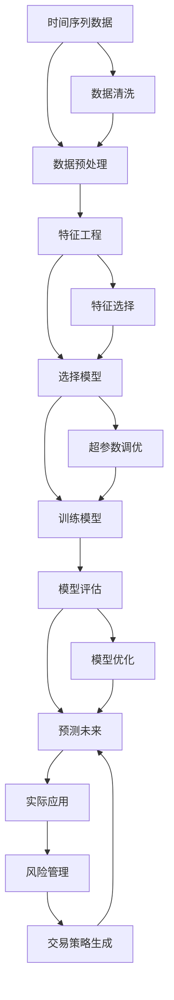

                 

# 机器学习在金融市场预测中的新方法

> 关键词：机器学习, 金融市场预测, 时间序列分析, 长短期记忆网络, 递归神经网络, 深度学习, 金融数据处理

> 摘要：本文旨在探讨机器学习在金融市场预测中的新方法，通过深入分析时间序列预测模型，特别是长短期记忆网络（LSTM）和递归神经网络（RNN），并结合实际案例进行代码实现，旨在为金融分析师和投资者提供一种新的预测工具。本文将从背景介绍、核心概念与联系、核心算法原理与具体操作步骤、数学模型和公式、项目实战、实际应用场景、工具和资源推荐、总结与未来发展趋势等方面进行详细阐述。

## 1. 背景介绍

金融市场预测一直是金融领域的重要研究方向之一。传统的预测方法如统计模型、时间序列分析等在一定程度上能够提供一定的预测能力，但随着大数据和机器学习技术的发展，基于机器学习的方法在金融市场预测中展现出巨大的潜力。特别是近年来，深度学习技术的兴起，为金融市场预测提供了新的工具和方法。本文将重点介绍如何利用机器学习技术，特别是长短期记忆网络（LSTM）和递归神经网络（RNN），来提高金融市场预测的准确性。

## 2. 核心概念与联系

### 2.1 时间序列分析

时间序列分析是金融市场预测的基础。时间序列数据是指按照时间顺序排列的数据序列，通常用于描述随时间变化的变量。在金融市场中，时间序列数据包括股票价格、汇率、利率等。时间序列分析的主要目标是通过历史数据来预测未来的趋势。

### 2.2 递归神经网络（RNN）

递归神经网络（RNN）是一种能够处理序列数据的神经网络模型。与传统的前馈神经网络不同，RNN能够利用输入序列中的上下文信息，从而更好地捕捉时间序列数据中的长期依赖关系。RNN的核心在于其循环结构，能够将前一个时间步的输出作为当前时间步的输入，从而实现信息的传递。

### 2.3 长短期记忆网络（LSTM）

长短期记忆网络（LSTM）是RNN的一种变体，专门设计用于解决RNN在处理长期依赖关系时遇到的梯度消失和梯度爆炸问题。LSTM通过引入门控机制，能够有效地控制信息的流动，从而更好地捕捉时间序列数据中的长期依赖关系。LSTM的核心在于其三个门控单元：输入门、遗忘门和输出门，这些门控单元能够控制信息的流入、流出和更新。

### 2.4 机器学习在金融市场预测中的应用

机器学习在金融市场预测中的应用主要体现在以下几个方面：

- **时间序列预测**：利用历史数据预测未来的市场趋势。
- **异常检测**：识别市场中的异常行为，如突发性事件。
- **风险评估**：评估市场风险，帮助投资者做出决策。
- **交易策略**：生成交易信号，指导投资者进行买卖操作。

### 2.5 Mermaid 流程图



## 3. 核心算法原理 & 具体操作步骤

### 3.1 递归神经网络（RNN）原理

RNN的基本结构如下：

- **输入层**：接收时间序列数据。
- **隐藏层**：包含多个隐藏单元，每个隐藏单元通过门控机制控制信息的流动。
- **输出层**：输出预测结果。

RNN的核心在于其循环结构，能够将前一个时间步的输出作为当前时间步的输入，从而实现信息的传递。RNN的前向传播过程如下：

$$
h_t = \sigma(W_{hh}h_{t-1} + W_{xh}x_t + b_h)
$$

$$
y_t = \sigma(W_{hy}h_t + b_y)
$$

其中，$h_t$ 表示当前时间步的隐藏状态，$x_t$ 表示当前时间步的输入，$y_t$ 表示当前时间步的输出，$\sigma$ 表示激活函数，$W_{hh}$、$W_{xh}$、$W_{hy}$ 分别表示隐藏层到隐藏层、输入到隐藏层、隐藏层到输出层的权重矩阵，$b_h$、$b_y$ 分别表示隐藏层和输出层的偏置项。

### 3.2 长短期记忆网络（LSTM）原理

LSTM通过引入门控机制，能够有效地控制信息的流动，从而更好地捕捉时间序列数据中的长期依赖关系。LSTM的核心在于其三个门控单元：输入门、遗忘门和输出门。LSTM的前向传播过程如下：

$$
i_t = \sigma(W_{xi}x_t + W_{hi}h_{t-1} + b_i)
$$

$$
f_t = \sigma(W_{xf}x_t + W_{hf}h_{t-1} + b_f)
$$

$$
\tilde{c}_t = \tanh(W_{xc}x_t + W_{hc}h_{t-1} + b_c)
$$

$$
c_t = f_t \odot c_{t-1} + i_t \odot \tilde{c}_t
$$

$$
o_t = \sigma(W_{xo}x_t + W_{ho}h_{t-1} + b_o)
$$

$$
h_t = o_t \odot \tanh(c_t)
$$

其中，$i_t$ 表示输入门，$f_t$ 表示遗忘门，$\tilde{c}_t$ 表示候选记忆单元，$c_t$ 表示当前时间步的记忆单元，$o_t$ 表示输出门，$\odot$ 表示逐元素乘法，$\sigma$ 表示激活函数，$\tanh$ 表示双曲正切函数，$W_{xi}$、$W_{hi}$、$W_{xf}$、$W_{hf}$、$W_{xc}$、$W_{hc}$、$W_{xo}$、$W_{ho}$ 分别表示输入门、遗忘门、候选记忆单元、输出门的权重矩阵，$b_i$、$b_f$、$b_c$、$b_o$ 分别表示输入门、遗忘门、候选记忆单元、输出门的偏置项。

### 3.3 具体操作步骤

1. **数据预处理**：对时间序列数据进行清洗、归一化等预处理操作。
2. **特征工程**：提取时间序列数据中的有用特征。
3. **选择模型**：根据问题需求选择合适的模型，如RNN或LSTM。
4. **训练模型**：使用历史数据训练模型，调整超参数以优化模型性能。
5. **模型评估**：使用验证集评估模型性能，选择最优模型。
6. **预测未来**：使用训练好的模型预测未来的时间序列数据。

## 4. 数学模型和公式 & 详细讲解 & 举例说明

### 4.1 递归神经网络（RNN）数学模型

RNN的前向传播过程如下：

$$
h_t = \sigma(W_{hh}h_{t-1} + W_{xh}x_t + b_h)
$$

$$
y_t = \sigma(W_{hy}h_t + b_y)
$$

其中，$h_t$ 表示当前时间步的隐藏状态，$x_t$ 表示当前时间步的输入，$y_t$ 表示当前时间步的输出，$\sigma$ 表示激活函数，$W_{hh}$、$W_{xh}$、$W_{hy}$ 分别表示隐藏层到隐藏层、输入到隐藏层、隐藏层到输出层的权重矩阵，$b_h$、$b_y$ 分别表示隐藏层和输出层的偏置项。

### 4.2 长短期记忆网络（LSTM）数学模型

LSTM的前向传播过程如下：

$$
i_t = \sigma(W_{xi}x_t + W_{hi}h_{t-1} + b_i)
$$

$$
f_t = \sigma(W_{xf}x_t + W_{hf}h_{t-1} + b_f)
$$

$$
\tilde{c}_t = \tanh(W_{xc}x_t + W_{hc}h_{t-1} + b_c)
$$

$$
c_t = f_t \odot c_{t-1} + i_t \odot \tilde{c}_t
$$

$$
o_t = \sigma(W_{xo}x_t + W_{ho}h_{t-1} + b_o)
$$

$$
h_t = o_t \odot \tanh(c_t)
$$

其中，$i_t$ 表示输入门，$f_t$ 表示遗忘门，$\tilde{c}_t$ 表示候选记忆单元，$c_t$ 表示当前时间步的记忆单元，$o_t$ 表示输出门，$\odot$ 表示逐元素乘法，$\sigma$ 表示激活函数，$\tanh$ 表示双曲正切函数，$W_{xi}$、$W_{hi}$、$W_{xf}$、$W_{hf}$、$W_{xc}$、$W_{hc}$、$W_{xo}$、$W_{ho}$ 分别表示输入门、遗忘门、候选记忆单元、输出门的权重矩阵，$b_i$、$b_f$、$b_c$、$b_o$ 分别表示输入门、遗忘门、候选记忆单元、输出门的偏置项。

### 4.3 举例说明

假设我们有一个时间序列数据集，包含过去10天的股票价格。我们使用RNN模型来预测第11天的股票价格。具体步骤如下：

1. **数据预处理**：对时间序列数据进行归一化处理。
2. **特征工程**：提取时间序列数据中的有用特征。
3. **选择模型**：选择RNN模型。
4. **训练模型**：使用历史数据训练RNN模型，调整超参数以优化模型性能。
5. **模型评估**：使用验证集评估RNN模型性能，选择最优模型。
6. **预测未来**：使用训练好的RNN模型预测第11天的股票价格。

## 5. 项目实战：代码实际案例和详细解释说明

### 5.1 开发环境搭建

为了进行机器学习项目，我们需要搭建一个合适的开发环境。具体步骤如下：

1. **安装Python**：确保安装了最新版本的Python。
2. **安装依赖库**：安装TensorFlow、Keras、pandas、numpy等依赖库。
3. **安装数据集**：下载并安装所需的数据集。

### 5.2 源代码详细实现和代码解读

以下是一个使用LSTM模型进行时间序列预测的Python代码示例：

```python
import numpy as np
import pandas as pd
from keras.models import Sequential
from keras.layers import LSTM, Dense
from sklearn.preprocessing import MinMaxScaler
from sklearn.metrics import mean_squared_error

# 读取数据
data = pd.read_csv('stock_prices.csv')

# 数据预处理
scaler = MinMaxScaler(feature_range=(0, 1))
scaled_data = scaler.fit_transform(data['Close'].values.reshape(-1, 1))

# 划分训练集和测试集
train_size = int(len(scaled_data) * 0.8)
train_data = scaled_data[:train_size]
test_data = scaled_data[train_size:]

# 创建数据集
def create_dataset(dataset, time_step=1):
    X, Y = [], []
    for i in range(len(dataset) - time_step - 1):
        a = dataset[i:(i + time_step), 0]
        X.append(a)
        Y.append(dataset[i + time_step, 0])
    return np.array(X), np.array(Y)

time_step = 10
X_train, y_train = create_dataset(train_data, time_step)
X_test, y_test = create_dataset(test_data, time_step)

# 重塑输入数据以适应LSTM模型
X_train = X_train.reshape(X_train.shape[0], X_train.shape[1], 1)
X_test = X_test.reshape(X_test.shape[0], X_test.shape[1], 1)

# 构建LSTM模型
model = Sequential()
model.add(LSTM(50, return_sequences=True, input_shape=(time_step, 1)))
model.add(LSTM(50, return_sequences=False))
model.add(Dense(25))
model.add(Dense(1))

# 编译模型
model.compile(optimizer='adam', loss='mean_squared_error')

# 训练模型
model.fit(X_train, y_train, batch_size=1, epochs=100)

# 预测
train_predict = model.predict(X_train)
test_predict = model.predict(X_test)

# 反归一化
train_predict = scaler.inverse_transform(train_predict)
test_predict = scaler.inverse_transform(test_predict)
y_train = scaler.inverse_transform([y_train])
y_test = scaler.inverse_transform([y_test])

# 计算均方误差
train_rmse = np.sqrt(mean_squared_error(y_train[0], train_predict[:, 0]))
test_rmse = np.sqrt(mean_squared_error(y_test[0], test_predict[:, 0]))

print(f'Train RMSE: {train_rmse}')
print(f'Test RMSE: {test_rmse}')
```

### 5.3 代码解读与分析

1. **数据预处理**：使用MinMaxScaler对数据进行归一化处理。
2. **创建数据集**：将时间序列数据划分为训练集和测试集，并创建输入数据集。
3. **重塑输入数据**：将输入数据重塑为LSTM模型所需的格式。
4. **构建LSTM模型**：使用Keras库构建LSTM模型。
5. **编译模型**：使用Adam优化器和均方误差损失函数编译模型。
6. **训练模型**：使用训练数据训练模型。
7. **预测**：使用训练好的模型进行预测。
8. **反归一化**：将预测结果反归一化，以便与实际数据进行比较。
9. **计算均方误差**：计算训练集和测试集的均方误差，评估模型性能。

## 6. 实际应用场景

机器学习在金融市场预测中的实际应用场景非常广泛，包括但不限于：

- **股票价格预测**：预测股票价格走势，为投资者提供决策支持。
- **汇率预测**：预测汇率变动，帮助跨国企业进行风险管理。
- **利率预测**：预测利率变动，为金融机构提供决策支持。
- **风险管理**：识别市场中的异常行为，帮助投资者进行风险管理。
- **交易策略生成**：生成交易信号，指导投资者进行买卖操作。

## 7. 工具和资源推荐

### 7.1 学习资源推荐

- **书籍**：《深度学习》（Goodfellow, Bengio, Courville）
- **论文**：《Long Short-Term Memory》（Hochreiter, Schmidhuber）
- **博客**：Medium上的机器学习和深度学习相关博客
- **网站**：Kaggle、GitHub上的机器学习项目

### 7.2 开发工具框架推荐

- **Python**：Python是机器学习领域最常用的编程语言之一。
- **TensorFlow**：TensorFlow是Google开发的深度学习框架。
- **Keras**：Keras是一个高级神经网络API，可以运行在TensorFlow之上。
- **pandas**：pandas是一个强大的数据处理库。
- **numpy**：numpy是一个用于科学计算的基础库。

### 7.3 相关论文著作推荐

- **《Long Short-Term Memory》（Hochreiter, Schmidhuber）**
- **《深度学习》（Goodfellow, Bengio, Courville）**
- **《时间序列分析》（Shumway, Stoffer）**

## 8. 总结：未来发展趋势与挑战

机器学习在金融市场预测中的应用前景广阔，但也面临着一些挑战。未来的发展趋势主要包括：

- **模型复杂度**：随着模型复杂度的增加，模型的预测能力将得到提升，但同时也需要更多的计算资源和数据支持。
- **数据质量**：高质量的数据是机器学习模型成功的关键，因此数据质量的提升将是未来的一个重要方向。
- **解释性**：提高模型的解释性，使投资者能够更好地理解模型的预测结果，从而做出更合理的决策。
- **实时性**：提高模型的实时性，使模型能够更快地响应市场变化，为投资者提供实时的决策支持。

## 9. 附录：常见问题与解答

### 9.1 问题1：如何选择合适的模型？

**解答**：选择合适的模型需要根据具体问题的需求和数据的特点来决定。对于时间序列预测问题，LSTM和RNN是常用的选择。在实际应用中，可以通过实验比较不同模型的性能，选择最优模型。

### 9.2 问题2：如何处理数据缺失值？

**解答**：数据缺失值可以通过插值、删除等方式进行处理。在实际应用中，可以使用pandas库中的fillna方法进行插值处理。

### 9.3 问题3：如何提高模型的预测精度？

**解答**：提高模型的预测精度可以通过以下方法实现：

- **增加数据量**：更多的数据可以帮助模型更好地学习数据的特征。
- **特征工程**：提取更多的有用特征，提高模型的预测能力。
- **超参数调优**：通过网格搜索等方法调整模型的超参数，提高模型的性能。
- **集成学习**：使用集成学习方法，如Bagging、Boosting等，提高模型的预测精度。

## 10. 扩展阅读 & 参考资料

- **书籍**：《深度学习》（Goodfellow, Bengio, Courville）
- **论文**：《Long Short-Term Memory》（Hochreiter, Schmidhuber）
- **网站**：Kaggle、GitHub上的机器学习项目

---

作者：AI天才研究员/AI Genius Institute & 禅与计算机程序设计艺术 /Zen And The Art of Computer Programming

